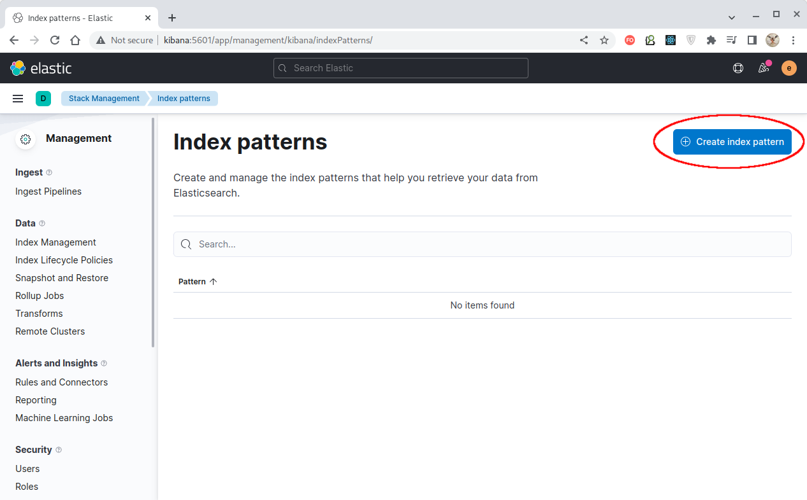
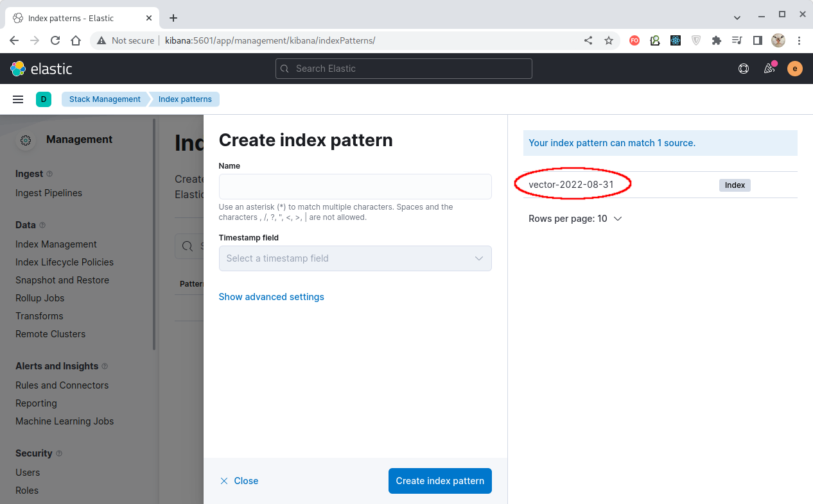

# Домашнее задание к занятию "11.03 Микросервисы: подходы"

Вы работаете в крупной компанию, которая строит систему на основе микросервисной архитектуры.
Вам как DevOps специалисту необходимо выдвинуть предложение по организации инфраструктуры, для разработки и эксплуатации.


## Задача 1: Обеспечить разработку

Предложите решение для обеспечения процесса разработки: хранение исходного кода, непрерывная интеграция и непрерывная поставка. 
Решение может состоять из одного или нескольких программных продуктов и должно описывать способы и принципы их взаимодействия.

Решение должно соответствовать следующим требованиям:
- Облачная система;
- Система контроля версий Git;
- Репозиторий на каждый сервис;
- Запуск сборки по событию из системы контроля версий;
- Запуск сборки по кнопке с указанием параметров;
- Возможность привязать настройки к каждой сборке;
- Возможность создания шаблонов для различных конфигураций сборок;
- Возможность безопасного хранения секретных данных: пароли, ключи доступа;
- Несколько конфигураций для сборки из одного репозитория;
- Кастомные шаги при сборке;
- Собственные докер образы для сборки проектов;
- Возможность развернуть агентов сборки на собственных серверах;
- Возможность параллельного запуска нескольких сборок;
- Возможность параллельного запуска тестов;

Обоснуйте свой выбор.


---
### Ответ:

Если избегать экзотических или устаревших вариантов, то самые популярные на рынке решения CI/CD/CD
сводятся к использованию либо GitLab, либо связки Git и Jenkins. В таблице приведены их возможности:

| Требование                                                               |        GitLab         |      Git+Jenkins      |
|:-------------------------------------------------------------------------|:---------------------:|:---------------------:|
| Облачная система                                                         | Собственная/Публичная | Собственная/Публичная |
| Система контроля версий Git                                              |      Встроенная       |      Git-сервер       |
| Репозиторий на каждый сервис                                             |          Да           |          Да           |
| Запуск сборки по событию из системы контроля версий                      |          Да           |          Да           |
| Запуск сборки по кнопке с указанием параметров                           |          Да           |          Да           |
| Возможность привязать настройки к каждой сборке                          |          Да           |          Да           |
| Возможность создания шаблонов для различных конфигураций сборок          |          Да           |          Да           |
| Возможность безопасного хранения секретных данных: пароли, ключи доступа |          Да           |          Да           |
| Несколько конфигураций для сборки из одного репозитория                  |          Да           |          Да           |
| Кастомные шаги при сборке                                                |     Maven, Gradle     |     Maven, Gradle     |
| Собственные докер образы для сборки проектов                             |        Docker         |        Docker         |
| Возможность развернуть агентов сборки на собственных серверах            |          Да           |          Да           |
| Возможность параллельного запуска нескольких сборок                      |          Да           |          Да           |
| Возможность параллельного запуска тестов                                 |          Да           |          Да           |

Как видим, принципиальной разницы между ними нет.

Процесс непрерывная интеграции и непрерывная поставки обеспечиваются самими продуктами - и GitLab и Jenkins это умеют в полной мере.
Процесс сборки детально определяется через конфигурационные файлов Maven или Gradle, как правило хранимых вместе с кодом. 

В качестве решения предлагается выбрать следующий стек:
- **GitLab**: всё в одном - и сборка, поставка, развертывание, документация и пр.;
- **Docker**: нужен для применения решений с контейнеризацией;
- **ОС Linux**: нативная поддержка Docker за счет механизма пространств имен, изначально встроенного в ядро.

Если есть желание сэкономить, связка **Git+Jenkins** является более предпочтительным вариантом:
- **Git**: можно использовать приватные репозитории на публичном сервисе. До определенных пределов это
абсолютно бесплатно;
- **Jenkins**: за счет огромного количества плагинов и возможности создавать свои, является чрезвычайно
гибким инструментом, настраиваемым на любой процесс. Бесплатен;

> Во всех случаях можно дополнительно установить связку сервисов для управления проектами и ведения
> документации. **Jira+Confluence** является наиболее популярной, но для бесплатного использования
> придется обновлять trial-тикет каждый месяц.
> 
> Впрочем, существуют широкий выбор и относительно бесплатных решений. 

Связка всех этих продуктов сводится к настройке соединений между сервисами по HTTPS и является тривиальной. 

---


## Задача 2: Логи

Предложите решение для обеспечения сбора и анализа логов сервисов в микросервисной архитектуре.
Решение может состоять из одного или нескольких программных продуктов и должно описывать способы и принципы их взаимодействия.

Решение должно соответствовать следующим требованиям:
- Сбор логов в центральное хранилище со всех хостов обслуживающих систему;
- Минимальные требования к приложениям, сбор логов из stdout;
- Гарантированная доставка логов до центрального хранилища;
- Обеспечение поиска и фильтрации по записям логов;
- Обеспечение пользовательского интерфейса с возможностью предоставления доступа разработчикам для поиска по записям логов;
- Возможность дать ссылку на сохраненный поиск по записям логов;

Обоснуйте свой выбор.


---
### Ответ:

Одной из самых популярных систем сбора логов является связка
**ElasticSearch+Logstash+Kibana (ELK)**, где:
- "ElasticSearch" - NoSql-база данных, отвечающая за хранение собранных данных;
- "Logstash" - отвечает за агрегацию логов и сохранение их в удобном виде в "ElasticSearch";
- "Kibana" - производит визуализацию данных из ElastiSearch, предоставляя широкие возможности
навигации и поиска.

"Logstash" может принимать данные от различных агентов сбора данных (например, Filebeat,
FluentBit и пр.), что придает ему достаточную гибкость для обработки логов практически любого
происхождения.
При этом фильтрация логов возможна как на уровне агента, так и на уровне Logstash, что позволяет
настраивать систему на сбор логов определенного вида, существенно экономя ресурсы.

Соответственно, требования задачи выполняются следующими компонентами системы:

| Требование                                                                                                               | Компонент          |
|:-------------------------------------------------------------------------------------------------------------------------|:-------------------|
| Сбор логов в центральное хранилище со всех хостов обслуживающих систему                                                  | "ElasticSearch" (ES) |
| Минимальные требования к приложениям, сбор логов из stdout                                                               | Агенты "Logstash"    |
| Гарантированная доставка логов до центрального хранилища                                                                 | TCP-протокол       |
| Обеспечение поиска и фильтрации по записям логов                                                                         | Kibana, ES         |
| Обеспечение пользовательского интерфейса с возможностью предоставления доступа разработчикам для поиска по записям логов | "Kibana"             |
| Возможность дать ссылку на сохраненный поиск по записям логов                                                            | "Kibana"             |

Т.о выбранный стек нам вполне подходит.

> Существует набирающее популярность решение на основе стека **Grafana Loki+Grafana Agent**,
> существенно менее требовательное к ресурсам и не уступающее по своим возможностям ELK-стеку.
> Но на данный момент ELK по сути является отраслевым стандартом.

---


## Задача 3: Мониторинг

Предложите решение для обеспечения сбора и анализа состояния хостов и сервисов в микросервисной архитектуре.
Решение может состоять из одного или нескольких программных продуктов и должно описывать способы и принципы их взаимодействия.

Решение должно соответствовать следующим требованиям:
- Сбор метрик со всех хостов, обслуживающих систему;
- Сбор метрик состояния ресурсов хостов: CPU, RAM, HDD, Network;
- Сбор метрик потребляемых ресурсов для каждого сервиса: CPU, RAM, HDD, Network;
- Сбор метрик, специфичных для каждого сервиса;
- Пользовательский интерфейс с возможностью делать запросы и агрегировать информацию;
- Пользовательский интерфейс с возможность настраивать различные панели для отслеживания состояния системы;

Обоснуйте свой выбор.


---
### Ответ:

Наиболее популярным решением для мониторинга многокомпонентных систем на данный момент является
связка **Prometheus+Grafana**, в полной мере реализующая предъявляемые требования.

Решение для предъявляемых требований выглядит следующим образом:

| Требование                                                                                               | Компонент             |
|:---------------------------------------------------------------------------------------------------------|:----------------------|
| Сбор метрик со всех хостов, обслуживающих систему                                                        | Экспортеры Prometheus |
| Сбор метрик состояния ресурсов хостов: CPU, RAM, HDD, Network                                            | Агенты Prometheus     |
| Сбор метрик потребляемых ресурсов для каждого сервиса: CPU, RAM, HDD, Network                            | Агенты Prometheus     |
| Сбор метрик, специфичных для каждого сервиса                                                             | Агенты Prometheus     |
| Агрегация собираемых метрик                                                                              | Prometheus            |
| Пользовательский интерфейс с возможностью делать запросы и агрегировать информацию                       | Grafana               |
| Пользовательский интерфейс с возможность настраивать различные панели для отслеживания состояния системы | Grafana               |

Задача по своей сути сводится к запуску на всех отслеживаемых системах специальных программ-агентов
(например, Node Exporter), связываясь с которыми Prometheus будет собирать данные для из
последующей агрегации. Grafana же, в свою, очередь, предоставляет весьма развитый интерфейс для
отображения и фильтрации данных.

Так, например, выглядит контрольная панель, созданная нами в одном из
[предыдущих заданий](https://github.com/olezhuravlev/mnt-homeworks/tree/MNT-13/10-monitoring-03-grafana):
 


Предоставляемая связкой **Prometheus+Grafana** функциональность является более чем достаточной
для выполнения любых задач мониторинга. 

---


## Задача 4: Логи * (необязательная)

Продолжить работу по задаче API Gateway: сервисы используемые в задаче пишут логи в stdout. 

Добавить в систему сервисы для сбора логов Vector + "ElasticSearch" + "Kibana" со всех сервисов обеспечивающих работу API.

### Результат выполнения: 

docker compose файл запустив который можно перейти по адресу http://localhost:8081 по которому доступна Kibana.
Логин в "Kibana" должен быть admin пароль qwerty123456


---
### Решение:

Воспользуемся конфигурацией из
[предыдущего задания](./../11-microservices-02-principles/11-microservices-02-principles.md),
но добавим к нему компоненты, необходимые для сбора логов:
- [Vector](https://vector.dev/) - сборщик логов;
- [ElasticSearch](https://www.elastic.co/) - NoSQL-база данных, используемая для хранения логов;
- [Kibana](https://www.elastic.co/kibana/) - визуализатор содержимого "ElasticSearch".


[Конфигурация](./vector/vector.toml) для Vector, задающая **источник** данных (sources),
выглядит следующим образом:
````toml
[sources.my_docker_logs_source]
type = "docker_logs"
docker_host = "unix:///var/run/docker.sock"
include_containers = ["storage", "uploader", "security", "gateway"]
exclude_containers = ["vector"]
host_key = "Vector_Container_ID"
````

**где:**
- **my_docker_logs_source** - произвольный идентификатор нашего источника данных;
- **type** - тип сборщика, собирающий логи Docker-контейнеров;
- **docker_host** - хост docker-демона или его сокет;
- **include_containers** - имена контейнеров, логи которых нужно собирать;
- **exclude_containers** - имена контейнеров, логи которых НЕ нужно собирать;
- **host_key** - имя поля, содержащего идентификатор контейнера, в котором работает Vector. Будет добавлен к каждой записи лога. 


[Конфигурация](./vector/vector.toml) для Vector, задающая **преобразование** поступивших данных
(transforms), выглядит следующим образом:
````toml
[transforms.transform_json]
type = "remove_fields"
inputs = ["my_docker_logs_source"]
fields = ["container_created_at", "container_id", "image", "label"]
````

> В данном случае используется преобразователь типа remove_fields", удаляющий указанные поля из
JSON-источника.

**где:**
- **transform_json** - произвольный идентификатор нашего преобразователя данных;
- **type** - тип преобразователя;
- **inputs** - идентификатор источника данных для данного преобразователя;
- **fields** - имена полей, которые следует удалить;


[Конфигурация](./vector/vector.toml) для Vector, задающая **получателя** данных (sinks),
выглядит следующим образом:
````toml
[sinks.elasticsearch]
type = "elasticsearch"
inputs = ["transform_json"]
endpoint = "http://elastic:9200"
compression = "none"
bulk.index = "vector-%Y-%m-%d"

[sinks.elasticsearch.auth]
strategy = "basic"
user = "elastic"
password = "elastic"
````

**где:**
- **elasticsearch** - произвольные идентификатор нашего получателя данных;
- **type = "elasticsearch"** - тип получателя - ElasticSearch;
- **inputs** - идентификатор источника данных (в данном случае это преобразователь данных);
- **endpoint** - URL, прослушиваемый "ElasticSearch" на предмет получения данных;
- **compression** - тип сжатия данных перед их передачей в "ElasticSearch";
- **bulk.index** - идентификатор индекса ES, в котором следует размещать данные;
- **compression** - имя конвеера;
- **strategy** - стратегия индентификации (здесь - Basic HTTP);
- **user** - имя пользователя ES;
- **password** - пароль пользователя ES;

В [конфигурации](./elasticsearch/config.yml) для "ElasticSearch" мы указываем параметры безопасности,
а часть настроек задаётся при запуске контейнера.

В [конфигурации](./kibana/config.yml) для "Kibana" мы указываем параметры соединения
с "ElasticSearch".

После исполнения [инструкций docker-compose](docker-compose.yaml) мы получим набор работающих контейнеров:


Графический интерфейс "Kibana" доступен (логин/пароль: [elastic/elastic](./kibana/config.yml)):


В меню **"Management => Stack Management => Index patterns "** по нажатию кнопки
**"Create index pattern"** можно создать шаблон для отбора индексов для наблюдения:



На открывшейся панели жмём кнопку **"Create an index pattern agains hidden or system indices"**:


Откроется панель создания шаблона индексов:


Список в правой части панели на данный момент пуст потому что мы еще не создали ни одного
наблюдаемого события и индекс в "ElasticSearch" еще не инициализирован,
но если такое событие сгенерировать, например, вызовом команды получения статуса
какого-либо сервиса:
````bash
$ curl http://security:3000/status
{"status":"OK"}
````

То индекс будет создан и, обновив панель, мы его увидим под именем "vector-*":



Зададим маску для создаваемого шаблона и укажем поле, используемое в качестве метки времени:


> Шаблон предоставляет возможность совместно просматривать произвольный набор индексов,
> идентификаторы которых этому шаблону удовлетворяют.

Теперь, перейдя на панель "Discover" и выбрав созданный нами шаблон индексов в выпадающем меню,
мы сможем увидеть его содержимое:


По мере поступления новых событий мы можем их увидеть в интерфейсе Kibana:


Kibana предоставляет широкие возможности отображения и фильтрации поступающих
в "ElasticSearch" данных.

#### Создадим нового пользователя

В условиях задачи указано, что вход в "Kibana" должен производится по определенному имени и
паролю. Для этого создадим нового пользователя.

Переходим в панель **"Management => Stack Management => Users"**:


Нажатием кнопки "Create user" создаём требуемого пользователя с именем `admin`, паролем `qwerty123456` и ролью `superuser`:


Новый пользователь `admin` создан и отображается в списке:


После этого в "Kibana" можно заходить под этой учётной записью:


И использовать её функционал:


> Существует возможность создавать пользователей и через API "ElasticSearch".

---

#### ПРИМЕЧАНИЕ

Т.к. мы затронули аспект создания в "Kibana" нового пользователя, то следует рассмотреть и то,
как "ElasticSearch" взаимодействует с другими службами, используя служебных пользователей.

Изначально "ElasticSearch" имеет набор предустановленных пользователей:
- **elastic** - встроенный суперпользователь, обладающий всеми правами. Пароль м.б. задан при
запуске системы с помощью параметра "**ELASTIC_PASSWORD=<ПАРОЛЬ>**;
- **kibana** и **kibana_system** - пользователи, используюемые "Kibana" для связи с Elasticsearch;
- **logstash_system** - пользователь используется для связи "Logstash" с Elasticsearch;
- **beats_system** - пользователь используется Beats-агентами для сохранения метрик в Elasticsearch;
- **apm_system** - пользователь используется сервером APM сохранения информации мониторинга в Elasticsearch;
- **remote_monitoring_user** -пользователь используется Metricbeat для сбора и сохранения информации
в Elasticsearch. Обладает встроенными ролями `remote_monitoring_agent` и `remote_monitoring_collector`.

Все эти пользователи хотя и обладают необходимыми предустановленными полномочиями (ролями)
для взаимодействия соответствующх систем с "ElasticSearch", но не обладают заранее известными
паролями, поэтому использовать эти учетные записи не получится. 

Т.о. при запуске "ElasticSearch" мы можем установить некий пароль для суперпользователя "elastic".
Соответственно, если мы хотим запускать "Kibana" одновременно с "ElasticSearch" из одного и того-же
файла [docker-compose](./docker-compose.yaml), то для связи "Kibana" с "ElasticSearch" приходится
использовать этого же суперпользователя и этот же пароль.

**Однако**, для связи "Kibana" с "ElasticSearch" рекомендуется всё же использовать специального пользователя
`kibana_system`, от имени которого выполняется ряд служебных задач. Поэтому приходится следовать
[специальной процедуре](https://www.elastic.co/guide/en/elasticsearch/reference/7.17/security-minimal-setup.html):
1. Остановить Kibana;
2. Вызвать специальную утилиту "ElasticSearch" `elasticsearch-setup-passwords` для установки паролей.
Эта утилита м.б. вызвана либо с параметром `auto` для генерации случайных паролей, либо с параметром
`interactive` для установки пользователям желаемых паролей.

Пример результата работы утилиты с параметром `auto`:
````bash
$ docker exec -it elastic /bin/bash /usr/share/elasticsearch/bin/elasticsearch-setup-passwords auto
Initiating the setup of passwords for reserved users elastic,apm_system,kibana,kibana_system,logstash_system,beats_system,remote_monitoring_user.
The passwords will be randomly generated and printed to the console.
Please confirm that you would like to continue [y/N] y

Changed password for user apm_system
PASSWORD apm_system = UdTGjH7PsY9qLX4S7oF0

Changed password for user kibana_system
PASSWORD kibana_system = N3uqH1ghd6EL9SpGRKCo

Changed password for user kibana
PASSWORD "Kibana" = N3uqH1ghd6EL9SpGRKCo

Changed password for user logstash_system
PASSWORD logstash_system = JgE1FLi1G9FGY4uGMKcS

Changed password for user beats_system
PASSWORD beats_system = UFBS7Da053sQYPWR5db9

Changed password for user remote_monitoring_user
PASSWORD remote_monitoring_user = ZNw2y6ucrN2qO6Hc4q8P

Changed password for user elastic
PASSWORD elastic = NvimqdXLATyNKD61SI3c
````
Как видим, всем встроенным служебным пользователям были установлены случайные пароли.

> **Внимание!** После того, как для суперпользователя `elastic` был установлен новый пароль,
> вызвать утилиту `elasticsearch-setup-passwords` повторно уже нельзя!

3. После генерации паролей нужно установить этот же пароль и в самом Kibana.

Создаем в "Kibana" хранилище ключей:
````bash
$ docker exec -it "Kibana" /bin/bash /usr/share/kibana/bin/kibana-keystore create
Created "Kibana" keystore in /usr/share/kibana/config/kibana.keystore
````

Добавляем новый ключ в хранилище, указав сгенерированный пароль `N3uqH1ghd6EL9SpGRKCo`:
````bash
$ docker exec -it "Kibana" /bin/bash /usr/share/kibana/bin/kibana-keystore add elasticsearch.password
Enter value for elasticsearch.password: ********************
````

4. Перезапустить Kibana.

> **Внимание!** Пользователь `kibana_system` является служебным, не предназначен для использования
> живыми пользователями и не даёт прав заходить в "Kibana" из браузера!
> 
> Для этого нужно по-прежнему использовать суперпользователя `elastic` (с новым паролем).

Следует заметить, что т.к. изменялся пароль для суперпользователя `elastic`, то в нашем случае
этот пароль придется указать еще и в [конфигурации для Vector](./vector/vector.toml),
после чего перезапустить и этот сервис.

---


## Задача 5: Мониторинг * (необязательная)

Продолжить работу по задаче API Gateway: сервисы используемые в задаче предоставляют набор метрик в формате prometheus:

- Сервис security по адресу /metrics
- Сервис uploader по адресу /metrics
- Сервис storage (minio) по адресу /minio/v2/metrics/cluster

Добавить в систему сервисы для сбора метрик (Prometheus и Grafana) со всех сервисов обеспечивающих работу API.
Построить в Graphana dashboard показывающий распределение запросов по сервисам.

### Результат выполнения: 

docker compose файл запустив который можно перейти по адресу http://localhost:8081 по которому доступна Grafana с настроенным Dashboard.
Логин в Grafana должен быть admin пароль qwerty123456

---
### Решение:

Добавим в наш [docker-compose](./docker-compose.yaml) конфигурации для "Prometheus" и "Grafana"
и запустим эти сервисы. Они будут доступны по соответствующим адресам:

|            Prometheus            |            Grafana            |
|:--------------------------------:|:-----------------------------:|
|      http://prometheus:9090      |      http://grafana:3000      |
|  |  |

Пойдём по цепочке передачи данных и проверим, что метрики действительно генерируются нашими
сервисами:

````bash
$ curl http://security:3000/metrics
python_gc_objects_collected_total{generation="0"} 399.0
python_gc_objects_collected_total{generation="1"} 71.0
python_gc_objects_collected_total{generation="2"} 0.0
...
$ curl http://uploader:3000/metrics
process_cpu_user_seconds_total 18.364817
process_cpu_system_seconds_total 8.957178
process_cpu_seconds_total 27.321995
...
$ curl http://storage:9000/minio/v2/metrics/cluster
minio_bucket_objects_size_distribution{bucket="data",range="BETWEEN_1024_B_AND_1_MB",server="127.0.0.1:9000"} 0
minio_bucket_objects_size_distribution{bucket="data",range="BETWEEN_10_MB_AND_64_MB",server="127.0.0.1:9000"} 0 
minio_bucket_objects_size_distribution{bucket="data",range="BETWEEN_128_MB_AND_512_MB",server="127.0.0.1:9000"} 0
...
````

Поток данных присутствует, теперь настроим его получение Prometheus пользуясь интерфейсом Grafana.
Для этого в Grafana заходим в меню "Data Sources" и жмем кнопку "Add data source":


В открывшемся меню выбираем Prometheus в качестве источника данных:


И выбираем путь к нему:


После нажатия кнопки "Save & Test" (в самом низу) источник данных Prometheus будет протестирован 
и добавлен в систему:


Добавленный источник данных теперь отображается на панели конфигурации на закладке "Data sources":


Таким образом мы настроили "Grafana" на отображение данных, ретранслируемых через "Prometheus".

Нажатием кнопки "New Dashboard" создаем новую панель мониторинга:


Добавляем новую панель:


И на созданной панели настраиваем метрику, данные которой будут использоваться для отображения,
внешний вид панели, подписи и прочее:


Аналогично создаются панели и для остальных наших сервисов.

Созданная панель мониторинга наших сервисов выглядит следующим образом:


Настройки графического интерфейса Grafana позволяют легко менять временные интервалы, масштабы осей
диаграмм, подписи и пр.

---
