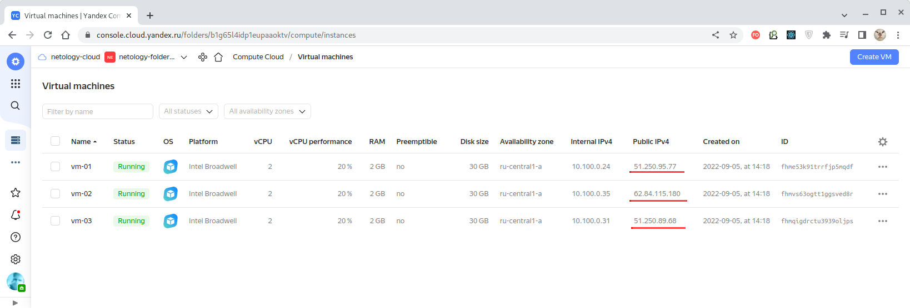

# Домашнее задание к занятию "11.04 Микросервисы: масштабирование"

Вы работаете в крупной компанию, которая строит систему на основе микросервисной архитектуры.
Вам как DevOps специалисту необходимо выдвинуть предложение по организации инфраструктуры, для разработки и эксплуатации.

## Задача 1: Кластеризация

Предложите решение для обеспечения развертывания, запуска и управления приложениями.
Решение может состоять из одного или нескольких программных продуктов и должно описывать способы и принципы их взаимодействия.

Решение должно соответствовать следующим требованиям:
- Поддержка контейнеров;
- Обеспечивать обнаружение сервисов и маршрутизацию запросов;
- Обеспечивать возможность горизонтального масштабирования;
- Обеспечивать возможность автоматического масштабирования;
- Обеспечивать явное разделение ресурсов доступных извне и внутри системы;
- Обеспечивать возможность конфигурировать приложения с помощью переменных среды, в том числе с возможностью безопасного хранения чувствительных данных таких как пароли, ключи доступа, ключи шифрования и т.п.

Обоснуйте свой выбор.

---
### Ответ

Для решения этих задач вполне подходит отечественное решение - **Yandex Cloud**:

| Функционал                                                                             | Решение                                       |    
|:---------------------------------------------------------------------------------------|:----------------------------------------------|
| Поддержка контейнеров                                                                  | Yandex Container Registry                     |
| Обнаружение сервисов и маршрутизацию запросов                                          | YC DNS                                        |
| Горизонтальное масштабирование                                                         | YC Cluster-Autoscaler                         |
| Автоматическое масштабирование                                                         | YC Cluster-Autoscaler                         |
| Разделение ресурсов на внешние и внутренние                                            | Yandex Resource Manager, метки ресурсов и пр. |
| Конфигурирование с помощью переменных среды, безопасное хранения чувствительных данных | Yandex Object Storage, Yandex Lockbox         |

Помимо функционала, непосредственно реализованного в Yandex Cloud, мы можем использовать
и комбинации контейнеризированных решений - Zookeeper, Kubernetes, Istio, Redis и т.д.

Для связки приложений между собой Yandex Cloud предлагает полный набор инфраструктурных
решений - сети, балансировщики, кэши, брокеры сообщений и многое другое.


---


## Задача 2: Распределенный кэш * (необязательная)

Разработчикам вашей компании понадобился распределенный кэш для организации хранения временной информации по сессиям пользователей.
Вам необходимо построить Redis Cluster состоящий из трех шард с тремя репликами.

### Схема:


---

### Решение

Будем создавать виртуальные машины в облачной инфраструктуре Yandex Cloud (YC), но несмотря на то,
что YC предоставляет возможности создать Redis Cluster с помощью специального решения
["Yandex Managed Service for Redis"](https://cloud.yandex.ru/docs/managed-redis/)
(ресурс ["yandex_mdb_redis_cluster"](https://registry.tfpla.net/providers/yandex-cloud/yandex/latest/docs/resources/mdb_redis_cluster)),
мы им пользоваться не будем и создадим Redis Cluster полностью самостоятельно.

**Но, для начала, немного теории.**

**Redis (Remote Directory Server)** представляет собой in-memory-базу данных. Эта БД умеет сохранять
своё состояние на диске и содержит данные в виде словаря "ключ-значение", где значением являются
данные определенных типов и структуры из них.

**Кластер** — это топология, представляющая собой один или несколько хостов базы данных,
между которыми можно настроить репликацию. Репликация работает по умолчанию в любом кластере
из более чем 1 хоста: хост-мастер принимает запросы на запись, асинхронно дублируя изменения
в репликах.
- кластер из 3 и более хостов автоматически отказоустойчив — хосты могут заменять друг друга в качестве основной реплики кластера.
- кластер из одного или двух хостов обойдется дешевле, но отказоустойчивости не обеспечит.

Т.о. в Redis Cluster все узлы Redis взаимосвязаны между собой (механизм PING-PONG) и для обмена данными между ними
используется бинарный протокол, позволяющий оптимизировать скорость передачи данных.

**Слот**  - это хэш, рассчитываемый от значения ключа сохраняемой пары "ключ=значение".
Слот является единицей группировки сохраняемых в Redis Cluster пар, т.к. каждая пара будет отнесена
к тому или иному слоту, в зависимости от того, какой хэш был получен из значения её ключа.
Всего Redis Cluster оперирует 16384 слотами при этом каждая нода кластера отвечает за определенный
диапазон слотов. При изменении состава кластера слоты между нодами перераспределяются автоматически,
хотя могут быть перераспределены и вручную. Такая процедура называется "**решардингом**".

**Шард** - это коллекция узлов, обслуживающих один диапазон слотов и реплицирующих друг-друга.
Шард в один момент времени может иметь только одного мастера, но при этом иметь несколько реплик
или не иметь реплик вообще. Даже имея реплики шард может не обслуживать ни одной реплики.

**Шардирование** — это стратегия горизонтального масштабирования кластера, при которой части одной
БД размещаются на разных шардах.

#### Модель сохранения данных в Redis Cluster

Чтобы избежать ситуации, когда нода, отвечающая за диапазон слотов, недоступна, Redis Cluster
использует модель "мастер-реплика", когда каждый слот имеет от одного (сам мастер) до N-реплик.

Когда кластер создан, то для каждой мастер-ноды создаётся нода реплики и если мастер-нода
выходит из строя, то её реплика становится новой мастер-нодой, замещая, таким образом, вышедшую
из строя. Но если одновременно выйдут из строя обе ноды - и мастер и реплика - то кластер потеряет
работоспособность.

Процесс обмена данными организован следующим образом:
1. Клиент записывает данные в мастер;
2. Мастер отвечает клиенту "ОК";
3. Мастер реплицирует данные в свои реплики.

Соответственно, возможна ситуация, когда мастер выйдет из строя, не успев реплицировать полученные
данные в ту реплику, которая окажется следующим мастером, и тогда данные будут утеряны.
Т.о. Redis Cluster **не гарантирует строгой согласованности**.

> Возможны и другие сценарии потери данных.


**Теперь приступим к практике и создадим Redis Cluster на основе виртуальных машин Yandex Cloud**

> Для работы Yandex Cloud сначала следует произвести [настройку соединения с провайдером Terraform](https://cloud.yandex.ru/docs/tutorials/infrastructure-management/terraform-quickstart#configure-provider).
> Для этого создадим файл `~/.terraformrc` и добавим в него следующий блок:
> ````bash
> provider_installation {
>   network_mirror {
>     url = "https://terraform-mirror.yandexcloud.net/"
>     include = ["registry.terraform.io/*/*"]
>   }
>   direct {
>     exclude = ["registry.terraform.io/*/*"]
>   }
> }
> ````
>
> В [конфигурационном файле Terraform](./terraform/main.tf) провайдер следует указывать следующим образом:
> ````bash
> terraform {
>   required_providers {
>     yandex = {
>       source = "yandex-cloud/yandex"
>     }
>   }
>   required_version = ">= 0.13"
> }
>
> provider "yandex" {
>   token     = "<OAuth>"
>   cloud_id  = "<идентификатор облака>"
>   folder_id = "<идентификатор каталога>"
>   zone      = "<зона доступности по умолчанию>"
> }
> ````
> **token** можно задать в переменной окружения **YC_TOKEN** без необходимости раскрывать
> его в конфигурационных файлах. 


Создадим [конфигурацию Terrorm](./terraform/main.tf) для создания требуемой облачной
инфраструктуры и применим её:
````bash
$ terraform apply -auto-approve

Terraform used the selected providers to generate the following execution plan. Resource actions are indicated with the following symbols:
  + create

Terraform will perform the following actions:
...
Plan: 6 to add, 0 to change, 0 to destroy.
yandex_resourcemanager_folder.netology-folder: Creation complete after 2s [id=b1g65l4idp1eupaaoktv]
yandex_vpc_network.netology-network: Creation complete after 1s [id=enpj715kbfeufptqt72p]
yandex_vpc_subnet.netology-subnet: Creation complete after 1s [id=e9b3irtbatm2o5dk1e2o]
module.vm-for-each["vm-01"].yandex_compute_instance.instance: Creating...
module.vm-for-each["vm-02"].yandex_compute_instance.instance: Creating...
module.vm-for-each["vm-03"].yandex_compute_instance.instance: Creating...
module.vm-for-each["vm-01"].yandex_compute_instance.instance: Creation complete after 59s [id=fhme53k91trrfjp5mqdf]
module.vm-for-each["vm-02"].yandex_compute_instance.instance: Creation complete after 52s [id=fhmvs63ogtt1ggsved8r]
module.vm-for-each["vm-03"].yandex_compute_instance.instance: Creation complete after 33s [id=fhmqigdrctu3939oljps]

Apply complete! Resources: 6 added, 0 changed, 0 destroyed.
````

После того, как Terraform отработал, мы имеем три запущенные виртуальные машины:



Далее создадим два файла конфигурации Redis - [redis-master.conf](./infrastructure/templates/redis-master.conf.j2)
для мастер-ноды и [redis-replica.conf](./infrastructure/templates/redis-replica.conf.j2) - для её реплики.

> Два файла нам понадобились потому, что в нашей топологии на одной виртуальной машине работают
> два docker-контейнера - по одному для мастер-ноды и для реплицирующей ноды, и нам приходится
> назначать им разные порты во избежание конфликта.

В [файле конфигурации](./infrastructure/templates/redis-master.conf.j2) Redis заслуживают внимания
следующие параметры:
````bash
bind * -::*
protected-mode no
port 6379
cluster-enabled yes
cluster-port 16379
````
**где:**
- bind - шаблон ограничения доступа к нодам;
- protected-mode - ограничение доступа только с локальных нод;
- port - клиентский порт;
- cluster-port - порт обмена данными в кластере;
- cluster-enabled - режим кластера.

> Каждая нода Redis Cluster требует два открытых порта - один порт для обслуживания клиентов
> и обмена ключами между нодами (по умолчанию это порт 6379), и второй порт - для обмена данными между
> нодами в кластере, который производится по бинарному протоколу.
>
> По умолчанию порт для обмена данными в кластере назначается как +10000 как номеру порта клиентов.
> Переопределяются порты в параметрах `port` и `cluster-port` [конфигурации кластера](./infrastructure/templates/redis-replica.conf.j2).

Прочие параметры оставим без изменения.

Далее создадим требуемую нам [конфигурацию Ansible](./infrastructure/site.yml) и укажем в
[файле объявления переменных](./infrastructure/inventory/group_vars/all.yml) Ansible назначенные
нам внешние IP-адреса:
````yaml
vm01_ip: 51.250.95.77
vm02_ip: 62.84.115.180
vm03_ip: 51.250.89.68
````

Применим созданную конфигурацию Ansible для установки программного обеспечения:
````bash
$ ansible-playbook site.yml -i inventory/hosts.yml

PLAY [Setup Redis Cluster] *************************************************************************

TASK [Gathering Facts] *****************************************************************************
...
TASK [Updating repositories cache and install "Pip" (Python3) package] *****************************
...
TASK [Installing module "Docker" (for Ansible to work with Docker)] ********************************
...
TASK [Copying Redis config for master] *************************************************************
...
TASK [Copying Redis config for replica] ************************************************************
...
TASK [Restarting Redis master container] ***********************************************************
...
TASK [Restarting Redis replica container] **********************************************************
...
PLAY RECAP *****************************************************************************************
vm-01        : ok=7    changed=4    unreachable=0    failed=0    skipped=0    rescued=0    ignored=0
vm-02        : ok=7    changed=4    unreachable=0    failed=0    skipped=0    rescued=0    ignored=0
vm-03        : ok=7    changed=4    unreachable=0    failed=0    skipped=0    rescued=0    ignored=0
````

Теперь на каждой из машин запущено по два экземпляра docker-контейнеров - один из них -`redis-master`,
который мы инициализируем как мастер-ноду и `redis-replica`, которую назначим репликой для мастера
(физически находящегося на другой виртуальной машине).

На первой виртуальной машине `vm-01` в итоге имеем следующий набор контейнеров:
````bash
ubuntu@vm-01:~$ docker ps -a
CONTAINER ID   IMAGE         COMMAND                  CREATED         STATUS         PORTS     NAMES
137ee60905c7   redis:7.0.4   "docker-entrypoint.s…"   5 minutes ago   Up 5 minutes             redis-replica
d7606eb3f858   redis:7.0.4   "docker-entrypoint.s…"   5 minutes ago   Up 5 minutes             redis-master
````

На второй виртуальной машине `vm-02`:
````bash
ubuntu@vm-02:~$ docker ps -a
CONTAINER ID   IMAGE         COMMAND                  CREATED         STATUS         PORTS     NAMES
871d1b4fa339   redis:7.0.4   "docker-entrypoint.s…"   5 minutes ago   Up 5 minutes             redis-replica
c1f188c39c3e   redis:7.0.4   "docker-entrypoint.s…"   5 minutes ago   Up 5 minutes             redis-master
````

На третьей виртуальной машине `vm-03`:
````bash
ubuntu@vm-03:~$ docker ps -a
CONTAINER ID   IMAGE         COMMAND                  CREATED         STATUS         PORTS     NAMES
f9052171f945   redis:7.0.4   "docker-entrypoint.s…"   5 minutes ago   Up 5 minutes             redis-replica
fabed596e8b8   redis:7.0.4   "docker-entrypoint.s…"   5 minutes ago   Up 5 minutes             redis-master
````

Когда инфраструктура подготовлена, то на ней можно создать Redis Cluster с помощью команды
`redis-cli --cluster create`:
````bash
ubuntu@vm-01:~$ docker exec -it redis-master redis-cli --cluster create \
> 51.250.95.77:6379 51.250.95.77:6380 \
> 62.84.115.180:6379 62.84.115.180:6380 \
> 51.250.89.68:6379 51.250.89.68:6380 --cluster-replicas 1
>>> Performing hash slots allocation on 6 nodes...
Master[0] -> Slots 0 - 5460
Master[1] -> Slots 5461 - 10922
Master[2] -> Slots 10923 - 16383
Adding replica 62.84.115.180:6380 to 51.250.95.77:6379
Adding replica 51.250.89.68:6380 to 62.84.115.180:6379
Adding replica 51.250.95.77:6380 to 51.250.89.68:6379
M: d740d6b0be615e65a53a511b6f0252247e1b4214 51.250.95.77:6379
   slots:[0-5460] (5461 slots) master
S: d5e4ff59fe7d90b15807b655e2c8aa52061344a0 51.250.95.77:6380
   replicates e946d6ed96997f2354387bfea7a8a4ac92f9ef88
M: f1f0a366168a9c2153a1636420b0b3f27e728f7e 62.84.115.180:6379
   slots:[5461-10922] (5462 slots) master
S: 651ccae159cab24a137cd4efa30e21ff731989e6 62.84.115.180:6380
   replicates d740d6b0be615e65a53a511b6f0252247e1b4214
M: e946d6ed96997f2354387bfea7a8a4ac92f9ef88 51.250.89.68:6379
   slots:[10923-16383] (5461 slots) master
S: fa87f3346cbe960569e10d512a9f39d4eb2e4de0 51.250.89.68:6380
   replicates f1f0a366168a9c2153a1636420b0b3f27e728f7e
Can I set the above configuration? (type 'yes' to accept): yes
>>> Nodes configuration updated
>>> Assign a different config epoch to each node
>>> Sending CLUSTER MEET messages to join the cluster
Waiting for the cluster to join
...
>>> Performing Cluster Check (using node 51.250.95.77:6379)
M: d740d6b0be615e65a53a511b6f0252247e1b4214 51.250.95.77:6379
   slots:[0-5460] (5461 slots) master
   1 additional replica(s)
M: e946d6ed96997f2354387bfea7a8a4ac92f9ef88 51.250.89.68:6379
   slots:[10923-16383] (5461 slots) master
   1 additional replica(s)
S: d5e4ff59fe7d90b15807b655e2c8aa52061344a0 51.250.95.77:6380
   slots: (0 slots) slave
   replicates e946d6ed96997f2354387bfea7a8a4ac92f9ef88
M: f1f0a366168a9c2153a1636420b0b3f27e728f7e 62.84.115.180:6379
   slots:[5461-10922] (5462 slots) master
   1 additional replica(s)
S: fa87f3346cbe960569e10d512a9f39d4eb2e4de0 51.250.89.68:6380
   slots: (0 slots) slave
   replicates f1f0a366168a9c2153a1636420b0b3f27e728f7e
S: 651ccae159cab24a137cd4efa30e21ff731989e6 62.84.115.180:6380
   slots: (0 slots) slave
   replicates d740d6b0be615e65a53a511b6f0252247e1b4214
[OK] All nodes agree about slots configuration.
>>> Check for open slots...
>>> Check slots coverage...
[OK] All 16384 slots covered.
````
> Весь процесс создания Redis Claster описан в
> [официальной документации по Redis](https://redis.io/docs/manual/scaling/).

Данная команда и её вывод достойны отдельного рассмотрения.

Разберём его по всем частям.

1. Вызывая команду мы задаём, какие ноды следует включить в инициализированный кластер. Указываются клиентские
порты:
````bash
ubuntu@vm-01:~$ docker exec -it redis-master redis-cli --cluster create \
> 51.250.95.77:6379 51.250.95.77:6380 \
> 62.84.115.180:6379 62.84.115.180:6380 \
> 51.250.89.68:6379 51.250.89.68:6380 --cluster-replicas 1
````

2. Вывод команды указывает предлагаемое распределение слотов по шардам:
````bash
>>> Performing hash slots allocation on 6 nodes...
Master[0] -> Slots 0 - 5460
Master[1] -> Slots 5461 - 10922
Master[2] -> Slots 10923 - 16383
````

3. Предлагаемое распределение "мастер -> реплика" по нодам. Обращаем внимание, что мастер и его реплика
всегда располагаются на разных хостах:
````bash
Adding replica 62.84.115.180:6380 to 51.250.95.77:6379
Adding replica 51.250.89.68:6380 to 62.84.115.180:6379
Adding replica 51.250.95.77:6380 to 51.250.89.68:6379
````

4. Предлагаемое распределение диапазонов слотов по создаваемым мастер-нодам и соответствующие
ноды-реплики:
````bash
M: d740d6b0be615e65a53a511b6f0252247e1b4214 51.250.95.77:6379
   slots:[0-5460] (5461 slots) master
S: d5e4ff59fe7d90b15807b655e2c8aa52061344a0 51.250.95.77:6380
   replicates e946d6ed96997f2354387bfea7a8a4ac92f9ef88
M: f1f0a366168a9c2153a1636420b0b3f27e728f7e 62.84.115.180:6379
   slots:[5461-10922] (5462 slots) master
S: 651ccae159cab24a137cd4efa30e21ff731989e6 62.84.115.180:6380
   replicates d740d6b0be615e65a53a511b6f0252247e1b4214
M: e946d6ed96997f2354387bfea7a8a4ac92f9ef88 51.250.89.68:6379
   slots:[10923-16383] (5461 slots) master
S: fa87f3346cbe960569e10d512a9f39d4eb2e4de0 51.250.89.68:6380
   replicates f1f0a366168a9c2153a1636420b0b3f27e728f7e
````

5. После того, как мы согласились с предлагаемой топологией Redis Cluster-а нам выводится список
идентификаторов и IP-адресов создаваемых мастер-нод и нод-реплик в привязке к диапазонам
распределяемых слотов:
````bash
>>> Performing Cluster Check (using node 51.250.95.77:6379)
M: d740d6b0be615e65a53a511b6f0252247e1b4214 51.250.95.77:6379
   slots:[0-5460] (5461 slots) master
   1 additional replica(s)
M: e946d6ed96997f2354387bfea7a8a4ac92f9ef88 51.250.89.68:6379
   slots:[10923-16383] (5461 slots) master
   1 additional replica(s)
S: d5e4ff59fe7d90b15807b655e2c8aa52061344a0 51.250.95.77:6380
   slots: (0 slots) slave
   replicates e946d6ed96997f2354387bfea7a8a4ac92f9ef88
M: f1f0a366168a9c2153a1636420b0b3f27e728f7e 62.84.115.180:6379
   slots:[5461-10922] (5462 slots) master
   1 additional replica(s)
S: fa87f3346cbe960569e10d512a9f39d4eb2e4de0 51.250.89.68:6380
   slots: (0 slots) slave
   replicates f1f0a366168a9c2153a1636420b0b3f27e728f7e
S: 651ccae159cab24a137cd4efa30e21ff731989e6 62.84.115.180:6380
   slots: (0 slots) slave
   replicates d740d6b0be615e65a53a511b6f0252247e1b4214
[OK] All nodes agree about slots configuration.
````

6. Проверка итогового распределения всех 16384 слотов по нодам:
````bash
>>> Check for open slots...
>>> Check slots coverage...
[OK] All 16384 slots covered.
````

Все слоты успешно распределены.

Теперь проверим состав нод созданного Redis Cluster. Для этого запустим интерфейс командной строки
Redis Cluster (`redis-cli`) и выполним команду `CLUSTER NODES`:
````bash
ubuntu@vm-01:~$ docker exec -it redis-master redis-cli
127.0.0.1:6379> CLUSTER NODES
d740d6b0be615e65a53a511b6f0252247e1b4214 10.100.0.24:6379@16379 myself,master - 0 1662384946000 1 connected 0-5460
e946d6ed96997f2354387bfea7a8a4ac92f9ef88 51.250.89.68:6379@16379 master - 0 1662384944000 5 connected 10923-16383
d5e4ff59fe7d90b15807b655e2c8aa52061344a0 51.250.95.77:6380@16389 slave e946d6ed96997f2354387bfea7a8a4ac92f9ef88 0 1662384946819 5 connected
f1f0a366168a9c2153a1636420b0b3f27e728f7e 62.84.115.180:6379@16379 master - 0 1662384944000 3 connected 5461-10922
fa87f3346cbe960569e10d512a9f39d4eb2e4de0 51.250.89.68:6380@16389 slave f1f0a366168a9c2153a1636420b0b3f27e728f7e 0 1662384945000 3 connected
651ccae159cab24a137cd4efa30e21ff731989e6 62.84.115.180:6380@16389 slave d740d6b0be615e65a53a511b6f0252247e1b4214 0 1662384945813 1 connected
````
Здесь выведен список всех нод Redis Cluster.

Идентификатор текущей ноды можно получить командой `CLUSTER MYID`:
````bash
127.0.0.1:6379> CLUSTER MYID
"d740d6b0be615e65a53a511b6f0252247e1b4214"
````

Наиболее полную информацию о составе кластера можно получить командой `CLUSTER SHARDS`:
````bash
127.0.0.1:6379> CLUSTER SHARDS
1) 1) "slots"
   2) 1) (integer) 0
      2) (integer) 5460
   3) "nodes"
   4) 1)  1) "id"
          2) "d740d6b0be615e65a53a511b6f0252247e1b4214"
          3) "port"
          4) (integer) 6379
          5) "ip"
          6) "10.100.0.24"
          7) "endpoint"
          8) "10.100.0.24"
          9) "hostname"
         10) ""
         11) "role"
         12) "master"
         13) "replication-offset"
         14) (integer) 2842
         15) "health"
         16) "online"
      2)  1) "id"
          2) "651ccae159cab24a137cd4efa30e21ff731989e6"
          3) "port"
          4) (integer) 6380
          5) "ip"
          6) "62.84.115.180"
          7) "endpoint"
          8) "62.84.115.180"
          9) "hostname"
         10) ""
         11) "role"
         12) "replica"
         13) "replication-offset"
         14) (integer) 2842
         15) "health"
         16) "online"
2) 1) "slots"
   2) 1) (integer) 10923
      2) (integer) 16383
   3) "nodes"
   4) 1)  1) "id"
          2) "e946d6ed96997f2354387bfea7a8a4ac92f9ef88"
          3) "port"
          4) (integer) 6379
          5) "ip"
          6) "51.250.89.68"
          7) "endpoint"
          8) "51.250.89.68"
          9) "hostname"
         10) ""
         11) "role"
         12) "master"
         13) "replication-offset"
         14) (integer) 2842
         15) "health"
         16) "online"
      2)  1) "id"
          2) "d5e4ff59fe7d90b15807b655e2c8aa52061344a0"
          3) "port"
          4) (integer) 6380
          5) "ip"
          6) "51.250.95.77"
          7) "endpoint"
          8) "51.250.95.77"
          9) "hostname"
         10) ""
         11) "role"
         12) "replica"
         13) "replication-offset"
         14) (integer) 2842
         15) "health"
         16) "online"
3) 1) "slots"
   2) 1) (integer) 5461
      2) (integer) 10922
   3) "nodes"
   4) 1)  1) "id"
          2) "f1f0a366168a9c2153a1636420b0b3f27e728f7e"
          3) "port"
          4) (integer) 6379
          5) "ip"
          6) "62.84.115.180"
          7) "endpoint"
          8) "62.84.115.180"
          9) "hostname"
         10) ""
         11) "role"
         12) "master"
         13) "replication-offset"
         14) (integer) 3116
         15) "health"
         16) "online"
      2)  1) "id"
          2) "fa87f3346cbe960569e10d512a9f39d4eb2e4de0"
          3) "port"
          4) (integer) 6380
          5) "ip"
          6) "51.250.89.68"
          7) "endpoint"
          8) "51.250.89.68"
          9) "hostname"
         10) ""
         11) "role"
         12) "replica"
         13) "replication-offset"
         14) (integer) 3116
         15) "health"
         16) "online"
````

По итогу видим, что у нас создано 3 шарда с распределенными по ним слотами и каждый из шардов
состоит из двух нод с ролями "master" и "replica".


В заключение, проверим работоспособность сервиса в целом. Для добавления ключей в кластеризованную
базу данных Redis используется команда `SET`, а для получения - команда `GET`:

> Обращаем внимание, что для работы в кластере утилиту `redis-cli` нужно запускать с ключом `-c`!

````bash
ubuntu@vm-01:~$ docker exec -it redis-master redis-cli -c

127.0.0.1:6379> SET my_key my_value
-> Redirected to slot [13711] located at 51.250.89.68:6379
OK
51.250.89.68:6379> SET zz_key zz_value
-> Redirected to slot [2456] located at 51.250.95.77:6379
OK
51.250.95.77:6379> GET my_key
-> Redirected to slot [13711] located at 51.250.89.68:6379
"my_value"
51.250.89.68:6379> GET zz_key
-> Redirected to slot [2456] located at 51.250.95.77:6379
"zz_value" 
````

Здесь мы видим, что в зависимости от значения ключа в парах "ключ=значение" эти **пары добавлялась
в разные слоты**, а при получении данных по этим ключам эти **данные излекались
из соответствующих нод**.  


Таким образом, мы создали Redis Cluster, состоящий из трех шард, каждая из которых имеет в своём
составе одну мастер-ноду и одну дублирующую её ноду-реплику. При этом физически мастер-нода
и её реплика расположены на разных виртуальных машинах.

---
