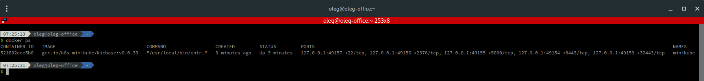
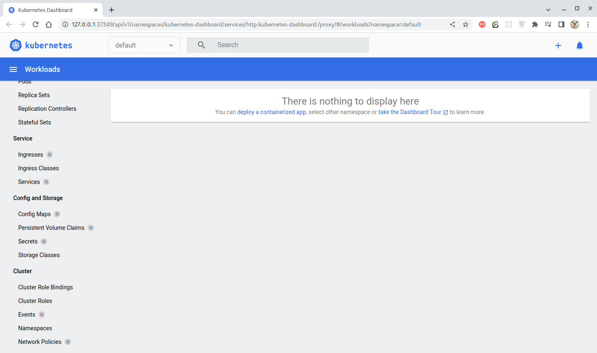
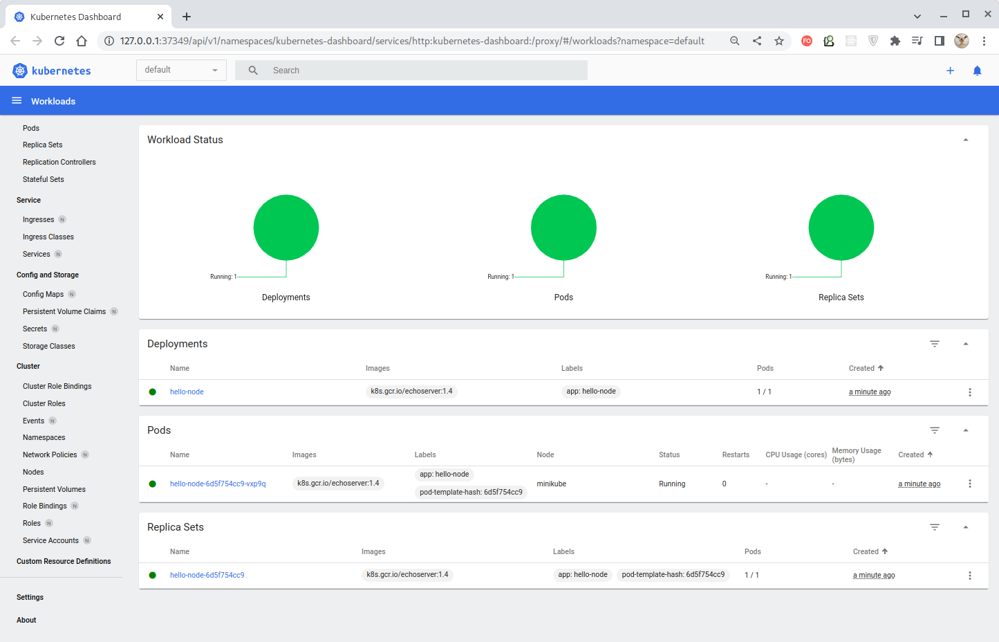
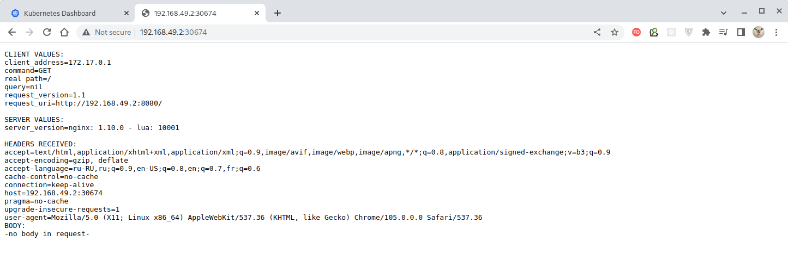
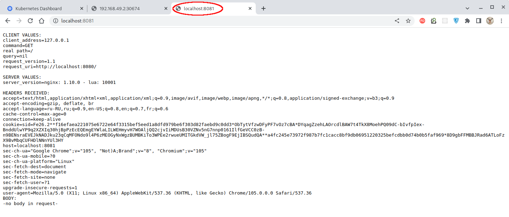
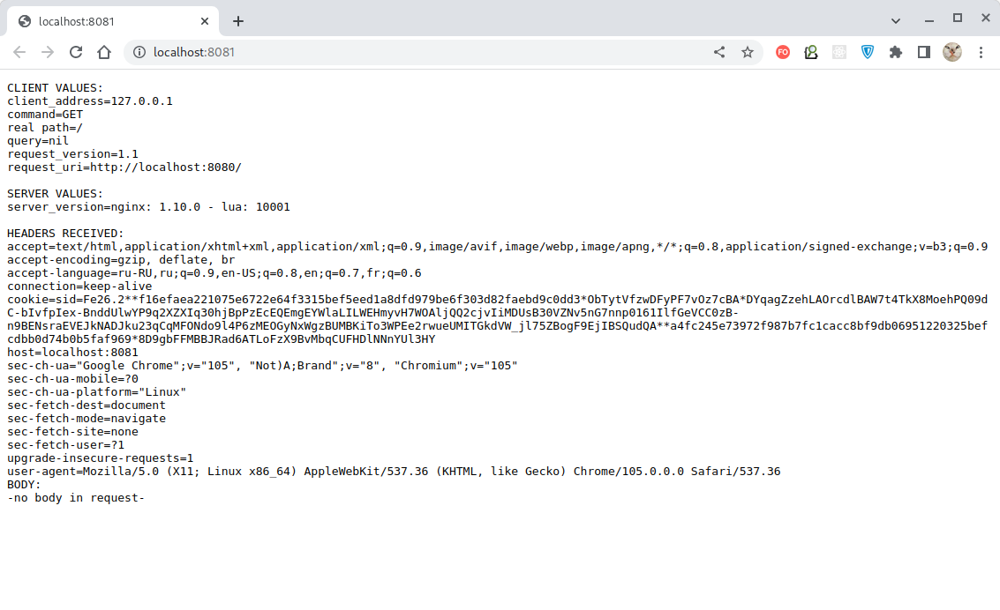

# Домашнее задание к занятию "12.1 Компоненты Kubernetes"

Вы DevOps инженер в крупной компании с большим парком сервисов. Ваша задача — разворачивать эти продукты в корпоративном кластере. 

## Задача 1: Установить Minikube

Для экспериментов и валидации ваших решений вам нужно подготовить тестовую среду для работы с Kubernetes. Оптимальное решение — развернуть на рабочей машине Minikube.

### Как поставить на AWS:
- создать EC2 виртуальную машину (Ubuntu Server 20.04 LTS (HVM), SSD Volume Type) с типом **t3.small**. Для работы потребуется настроить Security Group для доступа по ssh. Не забудьте указать keypair, он потребуется для подключения.
- подключитесь к серверу по ssh (ssh ubuntu@<ipv4_public_ip> -i <keypair>.pem)
- установите миникуб и докер следующими командами:
  - curl -LO https://storage.googleapis.com/kubernetes-release/release/`curl -s https://storage.googleapis.com/kubernetes-release/release/stable.txt`/bin/linux/amd64/kubectl
  - chmod +x ./kubectl
  - sudo mv ./kubectl /usr/local/bin/kubectl
  - sudo apt-get update && sudo apt-get install docker.io conntrack -y
  - curl -Lo minikube https://storage.googleapis.com/minikube/releases/latest/minikube-linux-amd64 && chmod +x minikube && sudo mv minikube /usr/local/bin/
- проверить версию можно командой minikube version
- переключаемся на root и запускаем миникуб: minikube start --vm-driver=none
- после запуска стоит проверить статус: minikube status
- запущенные служебные компоненты можно увидеть командой: kubectl get pods --namespace=kube-system

### Для сброса кластера стоит удалить кластер и создать заново:
- minikube delete
- minikube start --vm-driver=none

Возможно, для повторного запуска потребуется выполнить команду: sudo sysctl fs.protected_regular=0

Инструкция по установке Minikube - [ссылка](https://kubernetes.io/ru/docs/tasks/tools/install-minikube/)

**Важно**: t3.small не входит во free tier, следите за бюджетом аккаунта и удаляйте виртуалку.

---

### Решение

Легковесный эмулятор Kubernetes с одной нодой, одним сервером. Control Plane и Worker на одной машине.
Лучше установить Minikube локально
kubectl поставить локально

Если minikube попросит драйвер виртуализации - то hyberkit  (только для Mac?)
````bash
minikube start

````


### Установка [kubectl](https://kubernetes.io/docs/reference/kubectl/kubectl/) - инструмента командной строки Kubernetes

Скачаем `kubectl` в директорию "Downloads" командой:
````bash
$ curl -LO https://storage.googleapis.com/kubernetes-release/release/v1.25.0/bin/linux/amd64/kubectl --output-dir ~/Downloads
  % Total    % Received % Xferd  Average Speed   Time    Time     Time  Current
                                 Dload  Upload   Total   Spent    Left  Speed
100 42.9M  100 42.9M    0     0  9214k      0  0:00:04  0:00:04 --:--:-- 9215k
````

Маркируем файл как исполняемый и перемещаем в директорию `/usr/local/bin`:
````bash
$ sudo chmod +x ~/Downloads/kubectl
$ sudo mv kubectl /usr/local/bin
````

Получим информацию об установленной версии `kubectl`:
````bash
$ kubectl version --client --output=yaml
clientVersion:
  buildDate: "2022-08-23T17:44:59Z"
  compiler: gc
  gitCommit: a866cbe2e5bbaa01cfd5e969aa3e033f3282a8a2
  gitTreeState: clean
  gitVersion: v1.25.0
  goVersion: go1.19
  major: "1"
  minor: "25"
  platform: linux/amd64
  kustomizeVersion: v4.5.7
````

Скачаем "Minikube" в директорию `Downloads` командой:
````bash
curl -Lo minikube https://storage.googleapis.com/minikube/releases/latest/minikube-linux-amd64 --output-dir ~/Downloads
````

Маркируем файл как исполняемый и перемещаем в директорию `/usr/local/bin`:
````bash
$ sudo chmod +x ~/Downloads/minikube
$ sudo mv minikube /usr/local/bin
````

Проверим версию "Minikube":
````bash
$ minikube version
minikube version: v1.26.1
commit: 62e108c3dfdec8029a890ad6d8ef96b6461426dc
````

Для проверки установки "Minikube" запустим локальный кластер "Kubernetes" с использованием драйвера
`docker`:

> Полный список возможных к использованию драйверов приведен [здесь](https://kubernetes.io/ru/docs/setup/learning-environment/minikube/#%D1%83%D0%BA%D0%B0%D0%B7%D0%B0%D0%BD%D0%B8%D0%B5-%D0%B4%D1%80%D0%B0%D0%B9%D0%B2%D0%B5%D1%80%D0%B0-%D0%B2%D0%B8%D1%80%D1%82%D1%83%D0%B0%D0%BB%D1%8C%D0%BD%D0%BE%D0%B9-%D0%BC%D0%B0%D1%88%D0%B8%D0%BD%D1%8B).

````bash
$ minikube start --driver=docker
😄  minikube v1.26.1 on Arch 21.3.7
✨  Using the docker driver based on user configuration
📌  Using Docker driver with root privileges
👍  Starting control plane node minikube in cluster minikube
🚜  Pulling base image ...
    > gcr.io/k8s-minikube/kicbase:  386.61 MiB / 386.61 MiB  100.00% 6.30 MiB p
    > gcr.io/k8s-minikube/kicbase:  0 B [________________________] ?% ? p/s 50s
🔥  Creating docker container (CPUs=2, Memory=16000MB) ...
🐳  Preparing Kubernetes v1.24.3 on Docker 20.10.17 ...
    ▪ Generating certificates and keys ...
    ▪ Booting up control plane ...
    ▪ Configuring RBAC rules ...
🔎  Verifying Kubernetes components...
    ▪ Using image gcr.io/k8s-minikube/storage-provisioner:v5
🌟  Enabled addons: default-storageclass, storage-provisioner
🏄  Done! kubectl is now configured to use "minikube" cluster and "default" namespace by default
````

После чего проверим статус нашего кластера:
````bash
$ minikube status                  
minikube
type: Control Plane
host: Running
kubelet: Running
apiserver: Running
kubeconfig: Configured
````

Видим, что "Minikube" использует один контейнер:




Т.о., "Minikube" был установлен на локальной машине.

---

## Задача 2: Запуск Hello World
После установки Minikube требуется его проверить. Для этого подойдет стандартное приложение hello world. А для доступа к нему потребуется ingress.

- развернуть через Minikube тестовое приложение по [туториалу](https://kubernetes.io/ru/docs/tutorials/hello-minikube/#%D1%81%D0%BE%D0%B7%D0%B4%D0%B0%D0%BD%D0%B8%D0%B5-%D0%BA%D0%BB%D0%B0%D1%81%D1%82%D0%B5%D1%80%D0%B0-minikube)
- установить аддоны ingress и dashboard

---

### Решение

Запустим панель управления:
````bash
````

Веб-интерфейс откроется в браузере:



Создадим деплоймент для управления кодом (под запустит контейнер на основе указанного образа):
````bash
$ kubectl create deployment hello-node --image=k8s.gcr.io/echoserver:1.4
deployment.apps/hello-node created
````

Статус кластера отобразится на панели управления:



Всю необходимую информацию можно получить и из командной строки.
Так, например, информация о деплойменте:
````bash
$ kubectl get deployments
NAME         READY   UP-TO-DATE   AVAILABLE   AGE
hello-node   1/1     1            1           2m33s
````

Информация о поде:
````bash
$ kubectl get pods
NAME                          READY   STATUS    RESTARTS   AGE
hello-node-6d5f754cc9-vxp9q   1/1     Running   0          3m25s
````

Список нод:
````bash
$ kubectl get nodes
NAME       STATUS   ROLES           AGE   VERSION
minikube   Ready    control-plane   16m   v1.24.3
````

События кластера:
````bash
$ kubectl get events
LAST SEEN   TYPE     REASON                    OBJECT                             MESSAGE
4m6s        Normal   Scheduled                 pod/hello-node-6d5f754cc9-vxp9q    Successfully assigned default/hello-node-6d5f754cc9-vxp9q to minikube
4m5s        Normal   Pulling                   pod/hello-node-6d5f754cc9-vxp9q    Pulling image "k8s.gcr.io/echoserver:1.4"
3m55s       Normal   Pulled                    pod/hello-node-6d5f754cc9-vxp9q    Successfully pulled image "k8s.gcr.io/echoserver:1.4" in 10.220522568s
3m55s       Normal   Created                   pod/hello-node-6d5f754cc9-vxp9q    Created container echoserver
3m55s       Normal   Started                   pod/hello-node-6d5f754cc9-vxp9q    Started container echoserver
4m6s        Normal   SuccessfulCreate          replicaset/hello-node-6d5f754cc9   Created pod: hello-node-6d5f754cc9-vxp9q
4m6s        Normal   ScalingReplicaSet         deployment/hello-node              Scaled up replica set hello-node-6d5f754cc9 to 1
12m         Normal   Starting                  node/minikube                      Starting kubelet.
12m         Normal   NodeAllocatableEnforced   node/minikube                      Updated Node Allocatable limit across pods
12m         Normal   NodeHasSufficientMemory   node/minikube                      Node minikube status is now: NodeHasSufficientMemory
12m         Normal   NodeHasNoDiskPressure     node/minikube                      Node minikube status is now: NodeHasNoDiskPressure
12m         Normal   NodeHasSufficientPID      node/minikube                      Node minikube status is now: NodeHasSufficientPID
12m         Normal   NodeReady                 node/minikube                      Node minikube status is now: NodeReady
12m         Normal   RegisteredNode            node/minikube                      Node minikube event: Registered Node minikube in Controller
12m         Normal   Starting                  node/minikube                      
````

По умолчанию под доступен только по внутреннему IP-адресу внутри Kubernetes-кластера.
Сервисы же Kubernetes доступны и вне виртуальной сети Kubernetes.
Соответственно, чтобы сделать под доступным извне, его нужно представить как такой сервис командой
`expose deployment`:
````bash
$ kubectl expose deployment hello-node --type=LoadBalancer --port=8080
service/hello-node exposed
````

Выводим список сервисов:
````bash
$ kubectl get services
NAME         TYPE           CLUSTER-IP       EXTERNAL-IP   PORT(S)          AGE
hello-node   LoadBalancer   10.102.194.174   <pending>     8080:30674/TCP   35s
kubernetes   ClusterIP      10.96.0.1        <none>        443/TCP          23m
````

Т.к. мы используем не облачную инфраструктуру, а "Minikube", то тип "LoadBalancer" делает сервис
доступным при обращении с помощью команды `minikube service`:

````bash
$ minikube service hello-node      
|-----------|------------|-------------|---------------------------|
| NAMESPACE |    NAME    | TARGET PORT |            URL            |
|-----------|------------|-------------|---------------------------|
| default   | hello-node |        8080 | http://192.168.49.2:30674 |
|-----------|------------|-------------|---------------------------|
🎉  Opening service default/hello-node in default browser...

$ Opening in existing browser session.
MESA-INTEL: warning: Performance support disabled, consider sysctl dev.i915.perf_stream_paranoid=0
````

В открывшемся окне браузера мы увидим ответ сервиса:



В Minikube есть набор дополнений, которые м.б. подключены. Выведем из список:
````bash
$ minikube addons list
|-----------------------------|----------|--------------|--------------------------------|
|         ADDON NAME          | PROFILE  |    STATUS    |           MAINTAINER           |
|-----------------------------|----------|--------------|--------------------------------|
| ambassador                  | minikube | disabled     | 3rd party (Ambassador)         |
| auto-pause                  | minikube | disabled     | Google                         |
| csi-hostpath-driver         | minikube | disabled     | Kubernetes                     |
| dashboard                   | minikube | enabled      | Kubernetes                     |
| default-storageclass        | minikube | enabled      | Kubernetes                     |
| efk                         | minikube | disabled     | 3rd party (Elastic)            |
| freshpod                    | minikube | disabled     | Google                         |
| gcp-auth                    | minikube | disabled     | Google                         |
| gvisor                      | minikube | disabled     | Google                         |
| headlamp                    | minikube | disabled     | 3rd party (kinvolk.io)         |
| helm-tiller                 | minikube | disabled     | 3rd party (Helm)               |
| inaccel                     | minikube | disabled     | 3rd party (InAccel             |
|                             |          |              | [info@inaccel.com])            |
| ingress                     | minikube | disabled     | Kubernetes                     |
| ingress-dns                 | minikube | disabled     | Google                         |
| istio                       | minikube | disabled     | 3rd party (Istio)              |
| istio-provisioner           | minikube | disabled     | 3rd party (Istio)              |
| kong                        | minikube | disabled     | 3rd party (Kong HQ)            |
| kubevirt                    | minikube | disabled     | 3rd party (KubeVirt)           |
| logviewer                   | minikube | disabled     | 3rd party (unknown)            |
| metallb                     | minikube | disabled     | 3rd party (MetalLB)            |
| metrics-server              | minikube | disabled     | Kubernetes                     |
| nvidia-driver-installer     | minikube | disabled     | Google                         |
| nvidia-gpu-device-plugin    | minikube | disabled     | 3rd party (Nvidia)             |
| olm                         | minikube | disabled     | 3rd party (Operator Framework) |
| pod-security-policy         | minikube | disabled     | 3rd party (unknown)            |
| portainer                   | minikube | disabled     | 3rd party (Portainer.io)       |
| registry                    | minikube | disabled     | Google                         |
| registry-aliases            | minikube | disabled     | 3rd party (unknown)            |
| registry-creds              | minikube | disabled     | 3rd party (UPMC Enterprises)   |
| storage-provisioner         | minikube | enabled      | Google                         |
| storage-provisioner-gluster | minikube | disabled     | 3rd party (Gluster)            |
| volumesnapshots             | minikube | disabled     | Kubernetes                     |
|-----------------------------|----------|--------------|--------------------------------|
````

Нас интересуют дополнения "ingress" и "dashboard". "Dashboard", как мы видим, уже подключен,
теперь подключим "ingress":
````bash
$ minikube addons enable ingress
💡  ingress is an addon maintained by Kubernetes. For any concerns contact minikube on GitHub.
You can view the list of minikube maintainers at: https://github.com/kubernetes/minikube/blob/master/OWNERS
    ▪ Using image k8s.gcr.io/ingress-nginx/kube-webhook-certgen:v1.1.1
    ▪ Using image k8s.gcr.io/ingress-nginx/kube-webhook-certgen:v1.1.1
    ▪ Using image k8s.gcr.io/ingress-nginx/controller:v1.2.1
🔎  Verifying ingress addon...
🌟  The 'ingress' addon is enabled
````

Если повторно выполнить команду `minikube addons list`, то мы увидим, что требуемые дополнения
подключены.

Посмотрим созданные под и сервис:
````bash
$ kubectl get pod,svc -n kube-system
NAME                                   READY   STATUS    RESTARTS      AGE
pod/coredns-6d4b75cb6d-hhx4v           1/1     Running   0             45m
pod/etcd-minikube                      1/1     Running   0             45m
pod/kube-apiserver-minikube            1/1     Running   0             45m
pod/kube-controller-manager-minikube   1/1     Running   0             45m
pod/kube-proxy-qnhtr                   1/1     Running   0             45m
pod/kube-scheduler-minikube            1/1     Running   0             45m
pod/storage-provisioner                1/1     Running   1 (44m ago)   45m

NAME               TYPE        CLUSTER-IP   EXTERNAL-IP   PORT(S)                  AGE
service/kube-dns   ClusterIP   10.96.0.10   <none>        53/UDP,53/TCP,9153/TCP   45m
````

Произведем сопоставление (форвардинг, маппинг, "проброску") портов между хостом и подом с помощью команды
`port-forward`. Здесь возможны следующий варианты сопоставления портов:
- через имя сервиса:
````bash
$ kubectl get services                                      
NAME         TYPE           CLUSTER-IP       EXTERNAL-IP   PORT(S)          AGE
hello-node   LoadBalancer   10.102.194.174   <pending>     8080:30674/TCP   66m
kubernetes   ClusterIP      10.96.0.1        <none>        443/TCP          88m

# С префиксом "services":
$ kubectl port-forward services/hello-node 8081:8080 
Forwarding from 127.0.0.1:8081 -> 8080
Forwarding from [::1]:8081 -> 8080
Handling connection for 8081
````

- через имя пода:
````bash
$ kubectl get pods
NAME                          READY   STATUS    RESTARTS   AGE
hello-node-6d5f754cc9-vxp9q   1/1     Running   0          71m

# С префиксом "pods":
$ kubectl port-forward pods/hello-node-6d5f754cc9-vxp9q 8081:8080
Forwarding from 127.0.0.1:8081 -> 8080
Forwarding from [::1]:8081 -> 8080
Handling connection for 8081

# Без указания префикса "pods":
$ kubectl port-forward hello-node-6d5f754cc9-vxp9q 8081:8080
Forwarding from 127.0.0.1:8081 -> 8080
Forwarding from [::1]:8081 -> 8080
Handling connection for 8081
````

- через имя деплоймента:
````bash
$ kubectl get deployments                                   
NAME         READY   UP-TO-DATE   AVAILABLE   AGE
hello-node   1/1     1            1           87m

# С префиксом "deployments":
$ kubectl port-forward deployments/hello-node 8081:8080 
Forwarding from 127.0.0.1:8081 -> 8080
Forwarding from [::1]:8081 -> 8080
Handling connection for 8081
````

- через имя набора реплик:
````bash
$ kubectl get replicasets
NAME                    DESIRED   CURRENT   READY   AGE
hello-node-6d5f754cc9   1         1         1       75m

# С префиксом "replicasets":
$ kubectl port-forward replicasets/hello-node-6d5f754cc9 8081:8080 
Forwarding from 127.0.0.1:8081 -> 8080
Forwarding from [::1]:8081 -> 8080
Handling connection for 8081
````

> Использование множественного или единственного числа при обращении к компонентам кластера
> работает одинаково. Т.е. можно использовать "pods" или "pod", "services" или "service" и т.д.

После сопоставления портов к сервису можно обращаться по указанному порту:



> В нашем случае ответы от "hello-node" приходят хоть и успешно, но без тела.
> Впрочем исследование такого поведения контейнеризированного веб-приложения выходит за рамки
> текущего задания.

---

## Задача 3: Установить kubectl

Подготовить рабочую машину для управления корпоративным кластером. Установить клиентское приложение kubectl.
- подключиться к minikube 
- проверить работу приложения из задания 2, запустив port-forward до кластера

---

### Решение

**Выполнено в задании №2.**

---

## Задача 4 (*): собрать через ansible (необязательное)

Профессионалы не делают одну и ту же задачу два раза. Давайте закрепим полученные навыки, автоматизировав выполнение заданий  ansible-скриптами. При выполнении задания обратите внимание на доступные модули для k8s под ansible.
 - собрать роль для установки minikube на aws сервисе (с установкой ingress)
 - собрать роль для запуска в кластере hello world
  
---

### Решение

Конфигурация Ansible находится [здесь](./infrastructure/site.yml).

После её исполнения будет выполнено скачивание, запуск и настройка всей вышеописанной инфрастуры
(на этапе копирования файлов понадобятся `root`-права, поэтому мы затребуем пароль пользователя,
указав при запуске ключ `-K`):
````bash
$ ansible-playbook site.yml -i inventory/hosts.yml -K
BECOME password: 

PLAY [Setup Minikube infrastructure] **********************************************************************************

TASK [Gathering Facts] ************************************************************************************************
ok: [vm-01]

TASK [Downloading "kubectl"] ******************************************************************************************
ok: [vm-01]

TASK [Downloading "minikube"] *****************************************************************************************
ok: [vm-01]

TASK [Copying file "kubectl"] *****************************************************************************************
ok: [vm-01]

TASK [Copying file "minikube"] ****************************************************************************************
ok: [vm-01]

TASK [Run minikube (--driver=docker)] *********************************************************************************
changed: [vm-01]

TASK [debug] **********************************************************************************************************
ok: [vm-01] => {
    "msg": [
        "* minikube v1.26.1 on Arch 21.3.7",
        "* Using the docker driver based on user configuration",
        "* Using Docker driver with root privileges",
        "* Starting control plane node minikube in cluster minikube",
        "* Pulling base image ...",
        "* Creating docker container (CPUs=2, Memory=16000MB) ...",
        "* Preparing Kubernetes v1.24.3 on Docker 20.10.17 ...",
        "  - Generating certificates and keys ...",
        "  - Booting up control plane ...",
        "  - Configuring RBAC rules ...",
        "* Verifying Kubernetes components...",
        "  - Using image gcr.io/k8s-minikube/storage-provisioner:v5",
        "* Enabled addons: default-storageclass, storage-provisioner",
        "* Done! kubectl is now configured to use \"minikube\" cluster and \"default\" namespace by default"
    ]
}

TASK [Get minikube status] ********************************************************************************************
changed: [vm-01]

TASK [debug] **********************************************************************************************************
ok: [vm-01] => {
    "msg": [
        "minikube",
        "type: Control Plane",
        "host: Running",
        "kubelet: Running",
        "apiserver: Running",
        "kubeconfig: Configured"
    ]
}

TASK [Creating 'hello-node' deployment] *******************************************************************************
changed: [vm-01]

TASK [debug] **********************************************************************************************************
ok: [vm-01] => {
    "msg": [
        "deployment.apps/hello-node created"
    ]
}

TASK [Exposing 'hello-node' deployment] *******************************************************************************
changed: [vm-01]

TASK [debug] **********************************************************************************************************
ok: [vm-01] => {
    "msg": [
        "service/hello-node exposed"
    ]
}

TASK [Enabling addon 'dashboard'] *************************************************************************************
changed: [vm-01]

TASK [debug] **********************************************************************************************************
ok: [vm-01] => {
    "msg": [
        "* dashboard is an addon maintained by Kubernetes. For any concerns contact minikube on GitHub.",
        "You can view the list of minikube maintainers at: https://github.com/kubernetes/minikube/blob/master/OWNERS",
        "  - Using image kubernetesui/dashboard:v2.6.0",
        "  - Using image kubernetesui/metrics-scraper:v1.0.8",
        "* Some dashboard features require the metrics-server addon. To enable all features please run:",
        "",
        "\tminikube addons enable metrics-server\t",
        "",
        "",
        "* The 'dashboard' addon is enabled"
    ]
}

TASK [Enabling addon 'ingress'] ***************************************************************************************
changed: [vm-01]

TASK [debug] **********************************************************************************************************
ok: [vm-01] => {
    "msg": [
        "* ingress is an addon maintained by Kubernetes. For any concerns contact minikube on GitHub.",
        "You can view the list of minikube maintainers at: https://github.com/kubernetes/minikube/blob/master/OWNERS",
        "  - Using image k8s.gcr.io/ingress-nginx/kube-webhook-certgen:v1.1.1",
        "  - Using image k8s.gcr.io/ingress-nginx/controller:v1.2.1",
        "  - Using image k8s.gcr.io/ingress-nginx/kube-webhook-certgen:v1.1.1",
        "* Verifying ingress addon...",
        "* The 'ingress' addon is enabled"
    ]
}

TASK [Forwarding to port 8081] ****************************************************************************************
changed: [vm-01]

TASK [Checking port accessibility - http://localhost:8081] ************************************************************
ok: [vm-01]

PLAY RECAP ************************************************************************************************************
vm-01                      : ok=19   changed=7    unreachable=0    failed=0    skipped=0    rescued=0    ignored=0   
````

Открыв страницу по сопоставленному порту получаем результат аналогичный тому, что ранее был
достигнут ручной установкой и настройкой:



---