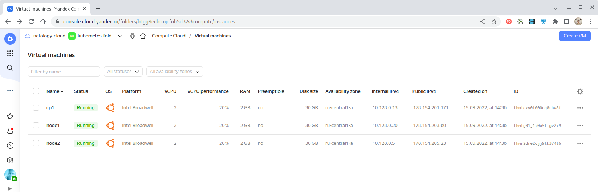
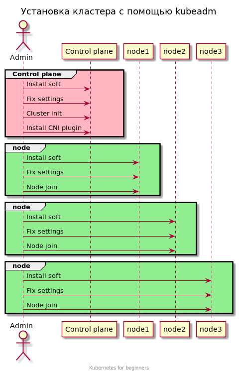

# Домашнее задание к занятию "12.3 Развертывание кластера на собственных серверах, лекция 1"

Поработав с персональным кластером, можно заняться проектами. Вам пришла задача подготовить кластер под новый проект.

## Задание 1: Описать требования к кластеру

Сначала проекту необходимо определить требуемые ресурсы. Известно, что проекту нужны база данных, система кеширования, а
само приложение состоит из бекенда и фронтенда. Опишите, какие ресурсы нужны, если известно:

* База данных должна быть отказоустойчивой. Потребляет 4 ГБ ОЗУ в работе, 1 ядро. 3 копии.
* Кэш должен быть отказоустойчивый. Потребляет 4 ГБ ОЗУ в работе, 1 ядро. 3 копии.
* Фронтенд обрабатывает внешние запросы быстро, отдавая статику. Потребляет не более 50 МБ ОЗУ на каждый экземпляр, 0.2
  ядра. 5 копий.
* Бекенд потребляет 600 МБ ОЗУ и по 1 ядру на копию. 10 копий.

План расчета

1. Сначала сделайте расчет всех необходимых ресурсов.
2. Затем прикиньте количество рабочих нод, которые справятся с такой нагрузкой.
3. Добавьте к полученным цифрам запас, который учитывает выход из строя как минимум одной ноды.
4. Добавьте служебные ресурсы к нодам. Помните, что для разных типов нод требования к ресурсам разные.
5. Рассчитайте итоговые цифры.
6. В результате должно быть указано количество нод и их параметры.

---

### Ответ

1. Приведем в таблице расчет общего количества необходимых ресурсов:

| Компонент   | Экземпляров | RAM/экз., Gb. | RAM всего, Gb | CPU/экз., шт. | CPU всего, шт |
|:------------|:-----------:|:-------------:|:-------------:|:-------------:|:-------------:|
| База данных |      3      |       4       |      12       |       1       |       3       |
| Кэш         |      3      |       4       |      12       |       1       |       3       |
| Фронтэнд    |      5      |     0.05      |     0.25      |      0.2      |       1       |
| Бэкэнд      |     10      |      0.6      |       6       |       1       |      10       |
| **ИТОГО:**  |      -      |       -       |   **30.25**   |       -       |    **17**     |

2. С учетом того, что в целях обеспечения отказоустойчивости всей системы экземпляры работающий
   приложений должны располагаться на разных нодах (виртуальных или реальных машинах), то минимально
   необходимое количество рабочих нод составит 10:

| Компонент   |  Экз.  | Н1  | Н2  | Н3  | Н4  | Н5  | Н6  | Н7  | Н8  | Н9  | Н10 |
|:------------|:------:|:---:|:---:|:---:|:---:|:---:|:---:|:---:|:---:|:---:|:---:|
| База данных | **3**  |  1  |  1  |  1  |  -  |  -  |  -  |  -  |  -  |  -  |  -  |
| Кэш         | **3**  |  1  |  1  |  1  |  -  |  -  |  -  |  -  |  -  |  -  |  -  |
| Фронтэнд    | **5**  |  1  |  1  |  1  |  1  |  1  |  -  |  -  |  -  |  -  |  -  |
| Бэкэнд      | **10** |  1  |  1  |  1  |  1  |  1  |  1  |  1  |  1  |  1  |  1  |

3. Добавим еще одну ноду на случай отказа, итого 11 нод.

4. Для служебных целей и с учётом уже имеющихся ресурсов добавим еще 1 ноду, итого 12 нод.

5. С учетом того, что "Kubernetes" волен перераспределять поды между нодами, минимальные требования
   к каждой ноде должны обеспечивать одновременную работу на ноде минимум по одному поду каждого
   компонента системы:

| Компонент               | RAM/экз., Gb.  | CPU/экз., шт. |
|:------------------------|:--------------:|:-------------:|
| База данных             |       4        |       1       |
| Кэш                     |       4        |       1       |
| Фронтэнд                |      0.05      |      0.2      |
| Бэкэнд                  |      0.6       |       1       |
| **ИТОГО (округленно):** |     **10**     |     **4**     |

6. Итого, для организации отказоустойчивого кластера нам понадобится **минимум 12 виртуальных машин,
   каждая из которых имеет минимум по 10Gb RAM и 4 CPU**.

---

### Замечание преподавателя:

Выбирать количество нод по количеству компонентов не стоит. В данном случае вы получите
существенный перерасход ресурсов. Ничего страшного если одинаковые компоненты будут распределены
на одни и те же ноды.

Для такой нагрузки хватило бы 3-4 рабочих нод. На каждую из которых выделить больше ресурсов.
Такую конфигурацию и обслуживать будет проще.

### Ответ с учетом замечания:

При количестве рабочих нод равное четырем, равномерное распределение нагрузки по нодам выглядит
примерно следующим образом:

| Компонент   |  Экз.   |  Н1   |  Н2   |  Н3   |  Н4   | Максимум экз. на ноду |
|:------------|:-------:|:-----:|:-----:|:-----:|:-----:|:---------------------:|
| База данных |  **3**  |   1   |   1   |   1   |   -   |         **1**         |
| Кэш         |  **3**  |   1   |   1   |   1   |   -   |         **1**         |
| Фронтэнд    |  **5**  |   -   |   -   |   -   | 0.2*5 |         **5**         |
| Бэкэнд      | **10**  |   3   |   3   |   2   |   2   |         **3**         |
| **ИТОГО:**  |    -    | **5** | **5** | **4** | **3** |                       |

Соответственно, с учетом максимальной нагрузки повышаются требования к мощности отдельной ноды:

| Компонент               | RAM/экз., Gb. * макс. | CPU/экз., шт. * макс. |
|:------------------------|:---------------------:|:---------------------:|
| База данных             |          4*1          |          1*1          |
| Кэш                     |          4*1          |          1*1          |
| Фронтэнд                |        0.05*5         |         0.2*5         |
| Бэкэнд                  |         0.6*3         |          1*3          |
| **ИТОГО (округленно):** |        **12**         |         **6**         |


Итого, для организации отказоустойчивого кластера с учетом одной запасной рабочей ноды на случай отказа
и одной мастер-ноды для обслуживания кластера нам
понадобится **около 6 виртуальных машин, каждая из которых имеет минимум по 12Gb RAM и 6 CPU**.

---

### Приложение - создание кластера Kubernetes в конфигурации Yandex.Cloud

С помощью [конфигурации Terraform](./terraform/main.tf) создадим структуру,
состоящую (в целях упрощения) из трех нод - одной контрольной панели ("cp1" - "Controller Plane 1")
и двух рабочих нод ("node1" и "node2"):



Программное обеспечение установим с помощью созданной нами
[конфигурации Ansible](./infrastructure/site.yaml), которая реализует последовательность действий,
продемонстрированную на следующей диаграмме:



Созданная [конфигурация Ansible](./infrastructure/site.yaml) выполняет следующую последовательность
установки применительно к следующим хостам:

| Операция                                                 | cp1 | node1, node2 | localhost |
|:---------------------------------------------------------|:---:|:------------:|:---------:|
| Установка инструментов общего назначения                 |  +  |      +       |           |
| Добавление репозитория Kubernetes                        |  +  |      +       |           |
| Установка 'kubeadm', 'kubectl', 'kubelet' и 'containerd' |  +  |      +       |           |
| Настройка параметров сети (модуль 'br_netfilter')        |  +  |      +       |           |
| Инициализация 'kubeadm'                                  |  +  |              |           |
| Предоставление доступа к кластеру не-`root`-пользователю |  +  |              |           |
| Установка CNI 'Flannel'                                  |  +  |              |           |
| Предоставление доступа к кластеру не-`root`-пользователю |     |              |     +     |
| Генерация нового токена на подключение к кластеру        |  +  |              |           |

> Диаграмма и последовательность установки ПО получены из материалов
> ["Установка Kubernetes"](https://github.com/olezhuravlev/kubernetes-for-beginners/tree/master/15-install/10-kubeadm),
> являющихся форком материалов ["Kubernetes for beginners"](https://github.com/aak74/kubernetes-for-beginners).

По окончании своей работы наша [конфигурация Ansible](./infrastructure/site.yaml) выведет
токен для подключения ноды к кластеру:

````bash
TASK [Cluster join command] *************************************************************************************************************************************************************************************************************
ok: [cp1] => {
    "msg": [
        "kubeadm join 10.128.0.13:6443 --token 22q157.v8qndjaktf1bn92i --discovery-token-ca-cert-hash sha256:78cc7b5a32c587996e6414338547b1bf7f2b543220453be569978413efa39fec "
    ]
}
````

> Обратим внимание, что по результату выполнения у нас фактически оказалось два токена - один был
> получен при инициализации "kubeadm" командой `kubeadm init`, а второй - сгенерирован командой
> `kubeadm token create --print-join-command` в конце процедуры для удобства просмотра.
>
> Увидеть список токенов можно выполнив команду `kubeadm token list`:
> ````bash
> $ kubeadm token list
> TOKEN                    TTL  EXPIRES               USAGES                  DESCRIPTION                                               EXTRA GROUPS
> njreet.l34wsnlqrozz79ph  23h  2022-09-15T11:17:42Z  authentication,signing  The default bootstrap token generated by 'kubeadm init'.  system:bootstrappers:kubeadm:default-node-token
> 22q157.v8qndjaktf1bn92i  23h  2022-09-15T11:18:08Z  authentication,signing  <none>                                                    system:bootstrappers:kubeadm:default-node-token
> ````
> Для подключения ноды к кластеру можно использовать любой токен с неистекщим сроком хранения (TTL).

Для подключения ноды к кластеру следует **на каждой** ноде выполнить эту команду под
`root`-пользователем:

````bash
ubuntu@node1:~$ sudo kubeadm join 10.128.0.13:6443 --token 22q157.v8qndjaktf1bn92i --discovery-token-ca-cert-hash sha256:78cc7b5a32c587996e6414338547b1bf7f2b543220453be569978413efa39fec
[preflight] Running pre-flight checks
[preflight] Reading configuration from the cluster...
[preflight] FYI: You can look at this config file with 'kubectl -n kube-system get cm kubeadm-config -o yaml'
[kubelet-start] Writing kubelet configuration to file "/var/lib/kubelet/config.yaml"
[kubelet-start] Writing kubelet environment file with flags to file "/var/lib/kubelet/kubeadm-flags.env"
[kubelet-start] Starting the kubelet
[kubelet-start] Waiting for the kubelet to perform the TLS Bootstrap...

This node has joined the cluster:
* Certificate signing request was sent to apiserver and a response was received.
* The Kubelet was informed of the new secure connection details.

Run 'kubectl get nodes' on the control-plane to see this node join the cluster.
````

Состав кластера теперь можно получить, выполнив локально команду:

````bash
$ kubectl get nodes                               
NAME    STATUS   ROLES           AGE    VERSION
cp1     Ready    control-plane   156m   v1.24.0
node1   Ready    <none>          153m   v1.24.0
node2   Ready    <none>          153m   v1.24.0
````

Как видим, все ноды присутствуют и находятся в активном состоянии.

В целях демонстрации можно развернуть деплоймент nginx-сервера на основе конфигурации
(пространство имен и количество реплик `=2` заданы в самой конфигурации):

````bash
$ kubectl apply -f /home/oleg/devkub-homeworks/12-kubernetes-03-install-part-1/deployments/21-deployment-resizer.yaml
deployment.apps/resizer created
````

После чего обратившись по IP-адресу:

````bash
ubuntu@node1:~$ curl http://10.129.1.2
````

мы получаем страницу приглашения nginx-сервера:

````html
<!DOCTYPE html>
<html>
<head>
    <title>Welcome to nginx!</title>
    <style>
            html { color-scheme: light dark; }
            body { width: 35em; margin: 0 auto;
            font-family: Tahoma, Verdana, Arial, sans-serif; }
        
    </style>
</head>
<body>
<h1>Welcome to nginx!</h1>
<p>If you see this page, the nginx web server is successfully installed and
    working. Further configuration is required.</p>
<p>For online documentation and support please refer to
    <a href="http://nginx.org/">nginx.org</a>.<br/>
    Commercial support is available at
    <a href="http://nginx.com/">nginx.com</a>.</p>
<p><em>Thank you for using nginx.</em></p>
</body>
</html>
````

Приложения можно развёртывать в разных пространствах имён. Например, развернем сервер
"resizer" в пространстве имен под именем `netology` (пространство имен `netology` задано в
конфигурации и нам придётся сначала создать его в кластере):

````bash
$ kubectl create ns netology                                                                                      
namespace/netology created

$ kubectl apply -f /home/oleg/devkub-homeworks/12-kubernetes-03-install-part-1/deployments/21-deployment-resizer.yaml
deployment.apps/resizer created
````

Получим список подов (для удобства вывод сгруппирован по нодам):

````bash
kube-system    etcd-cp1                      1/1     Running   0          33m   10.128.0.13   cp1     <none>           <none>
Every 2,0s: kubectl get pods -A -o wide                                                             oleg-office: Thu Sep 15 15:19:18 2022

NAMESPACE      NAME                          READY   STATUS    RESTARTS   AGE   IP            NODE    NOMINATED NODE   READINESS GATES
kube-system    kube-apiserver-cp1            1/1     Running   0          33m   10.128.0.13   cp1     <none>           <none>
kube-system    kube-controller-manager-cp1   1/1     Running   0          33m   10.128.0.13   cp1     <none>           <none>
kube-system    etcd-cp1                      1/1     Running   0          33m   10.128.0.13   cp1     <none>           <none>
kube-system    kube-scheduler-cp1            1/1     Running   0          33m   10.128.0.13   cp1     <none>           <none>
kube-system    coredns-6d4b75cb6d-t42q2      1/1     Running   0          33m   10.129.0.2    cp1     <none>           <none>
kube-system    coredns-6d4b75cb6d-wff4g      1/1     Running   0          33m   10.129.0.3    cp1     <none>           <none>
kube-flannel   kube-flannel-ds-r9wx6         1/1     Running   0          33m   10.128.0.13   cp1     <none>           <none>
kube-system    kube-proxy-br5jq              1/1     Running   0          33m   10.128.0.13   cp1     <none>           <none>

default        main-cdf75f8b4-8j66x          1/1     Running   0          26m   10.129.1.2    node1   <none>           <none>
kube-flannel   kube-flannel-ds-7lbm9         1/1     Running   0          30m   10.128.0.20   node1   <none>           <none>
kube-system    kube-proxy-64phx              1/1     Running   0          30m   10.128.0.20   node1   <none>           <none>

default        main-cdf75f8b4-6hkrv          1/1     Running   0          26m   10.129.2.2    node2   <none>           <none>
netology       resizer-549ffbccb8-hc98l      1/1     Running   0          17m   10.129.2.3    node2   <none>           <none>
kube-flannel   kube-flannel-ds-djj52         1/1     Running   0          30m   10.128.0.5    node2   <none>           <none>
kube-system    kube-proxy-xzxqb              1/1     Running   0          30m   10.128.0.5    node2   <none>           <none>
````

В данной таблице мы наглядно видим, как распределилась наша программная инфраструктура на созданных
нодах:

- **нода cp1** ("Controller Plane 1") содержит только служебные компоненты Kubernetes:
    - экземпляр Api-server (kube-apiserver);
    - экземпляр Controller Manager (kube-controller-manager);
    - экземпляр базы данных (etcd);
    - экземпляр планировщика (kube-scheduler);
    - два экземпляра DNS-серверов (coredns);
    - экземпляр сетевого плагина "Flannel" (kube-flannel);
    - экземпляр прокси-сервер для реализации архитектуры Service Mesh (kube-proxy);
- **нода node1**:
    - экземпляр nginx-сервера (main);
    - экземпляр сетевого плагина "Flannel" (kube-flannel);
    - экземпляр прокси-сервер для реализации архитектуры Service Mesh (kube-proxy);
- **нода node2**:
    - экземпляр nginx-сервера (main);
    - экземпляр сервера "Resizer" (resizer);
    - экземпляр сетевого плагина "Flannel" (kube-flannel);
    - экземпляр прокси-сервер для реализации архитектуры Service Mesh (kube-proxy);

Как следует из таблицы, вся служебная инфраструктура работает на той ноде, на которой
инициализировался кластер (командой `kubeadm init`), а на нодах, присоединенных к кластеру позже
командой `kubeadm join`, оказались развёрнуты требуемые приложения.

---

### Прочие полезные команды:

<details>
  <summary>Список контекстов: <b>kubectl config get-contexts</b></summary>

````bash
$ kubectl config get-contexts
CURRENT   NAME                          CLUSTER      AUTHINFO           NAMESPACE
*         kubernetes-admin@kubernetes   kubernetes   kubernetes-admin
````

</details>

<details>
  <summary>Логи контейнера из пода: <b>kubectl logs <ИмяПода></b></summary>

````bash
$ kubectl logs main-cdf75f8b4-6hkrv                                      
/docker-entrypoint.sh: /docker-entrypoint.d/ is not empty, will attempt to perform configuration
/docker-entrypoint.sh: Looking for shell scripts in /docker-entrypoint.d/
/docker-entrypoint.sh: Launching /docker-entrypoint.d/10-listen-on-ipv6-by-default.sh
10-listen-on-ipv6-by-default.sh: info: Getting the checksum of /etc/nginx/conf.d/default.conf
10-listen-on-ipv6-by-default.sh: info: Enabled listen on IPv6 in /etc/nginx/conf.d/default.conf
/docker-entrypoint.sh: Launching /docker-entrypoint.d/20-envsubst-on-templates.sh
/docker-entrypoint.sh: Launching /docker-entrypoint.d/30-tune-worker-processes.sh
/docker-entrypoint.sh: Configuration complete; ready for start up
2022/09/15 12:53:14 [notice] 1#1: using the "epoll" event method
2022/09/15 12:53:14 [notice] 1#1: nginx/1.23.1
2022/09/15 12:53:14 [notice] 1#1: built by gcc 10.2.1 20210110 (Debian 10.2.1-6) 
2022/09/15 12:53:14 [notice] 1#1: OS: Linux 5.4.0-124-generic
2022/09/15 12:53:14 [notice] 1#1: getrlimit(RLIMIT_NOFILE): 1048576:1048576
2022/09/15 12:53:14 [notice] 1#1: start worker processes
2022/09/15 12:53:14 [notice] 1#1: start worker process 31
2022/09/15 12:53:14 [notice] 1#1: start worker process 32
10.129.1.0 - - [15/Sep/2022:13:12:42 +0000] "GET / HTTP/1.1" 200 615 "-" "curl/7.68.0" "-"
10.129.1.0 - - [15/Sep/2022:13:13:53 +0000] "GET / HTTP/1.1" 200 615 "-" "curl/7.68.0" "-"
````

</details>

<details>
  <summary>Описание ресурса (здесь - пода): <b>kubectl describe pod <ИмяПода></ИмяПода></b></summary>

````bash
$ kubectl describe pod main-cdf75f8b4-6hkrv
Name:             main-cdf75f8b4-6hkrv
Namespace:        default
Priority:         0
Service Account:  default
Node:             node2/10.128.0.5
Start Time:       Thu, 15 Sep 2022 14:52:49 +0200
Labels:           app=main
                  pod-template-hash=cdf75f8b4
Annotations:      <none>
Status:           Running
IP:               10.129.2.2
IPs:
  IP:           10.129.2.2
Controlled By:  ReplicaSet/main-cdf75f8b4
Containers:
  main:
    Container ID:   containerd://d5e42eae2a0751915947ff0f5c4eedc1054168a1af02070f68e2bc3865a41f09
    Image:          nginx:latest
    Image ID:       docker.io/library/nginx@sha256:0b970013351304af46f322da1263516b188318682b2ab1091862497591189ff1
    Port:           80/TCP
    Host Port:      0/TCP
    State:          Running
      Started:      Thu, 15 Sep 2022 14:53:14 +0200
    Ready:          True
    Restart Count:  0
    Environment:    <none>
    Mounts:
      /var/run/secrets/kubernetes.io/serviceaccount from kube-api-access-jj56g (ro)
Conditions:
  Type              Status
  Initialized       True 
  Ready             True 
  ContainersReady   True 
  PodScheduled      True 
Volumes:
  kube-api-access-jj56g:
    Type:                    Projected (a volume that contains injected data from multiple sources)
    TokenExpirationSeconds:  3607
    ConfigMapName:           kube-root-ca.crt
    ConfigMapOptional:       <nil>
    DownwardAPI:             true
QoS Class:                   BestEffort
Node-Selectors:              <none>
Tolerations:                 node.kubernetes.io/not-ready:NoExecute op=Exists for 300s
                             node.kubernetes.io/unreachable:NoExecute op=Exists for 300s
Events:                      <none>
````

</details>

<details>
  <summary>Подробная информация о ресурсе (здесь - о поде): <b>kubectl get pod <ИмяПода></ИмяПода> <Формат></b></summary>

````bash
$ kubectl get pod main-cdf75f8b4-6hkrv -o yaml

apiVersion: v1
kind: Pod
metadata:
  creationTimestamp: "2022-09-15T12:52:49Z"
  generateName: main-cdf75f8b4-
  labels:
    app: main
    pod-template-hash: cdf75f8b4
  name: main-cdf75f8b4-6hkrv
  namespace: default
  ownerReferences:
    - apiVersion: apps/v1
      blockOwnerDeletion: true
      controller: true
      kind: ReplicaSet
      name: main-cdf75f8b4
      uid: 066ee3d0-24ab-45ed-a209-1832533f0b4c
  resourceVersion: "1175"
  uid: 2da278a4-7743-4052-bfb9-f9819fffd000
spec:
  containers:
    - image: nginx:latest
      imagePullPolicy: IfNotPresent
      name: main
      ports:
        - containerPort: 80
          name: web
          protocol: TCP
      resources: {}
      terminationMessagePath: /dev/termination-log
      terminationMessagePolicy: File
      volumeMounts:
        - mountPath: /var/run/secrets/kubernetes.io/serviceaccount
          name: kube-api-access-jj56g
          readOnly: true
  dnsPolicy: ClusterFirst
  enableServiceLinks: true
  nodeName: node2
  preemptionPolicy: PreemptLowerPriority
  priority: 0
  restartPolicy: Always
  schedulerName: default-scheduler
  securityContext: {}
  serviceAccount: default
  serviceAccountName: default
  terminationGracePeriodSeconds: 30
  tolerations:
    - effect: NoExecute
      key: node.kubernetes.io/not-ready
      operator: Exists
      tolerationSeconds: 300
    - effect: NoExecute
      key: node.kubernetes.io/unreachable
      operator: Exists
      tolerationSeconds: 300
  volumes:
    - name: kube-api-access-jj56g
      projected:
        defaultMode: 420
        sources:
          - serviceAccountToken:
              expirationSeconds: 3607
              path: token
          - configMap:
              items:
                - key: ca.crt
                  path: ca.crt
              name: kube-root-ca.crt
          - downwardAPI:
              items:
                - fieldRef:
                    apiVersion: v1
                    fieldPath: metadata.namespace
                  path: namespace
status:
  conditions:
    - lastProbeTime: null
      lastTransitionTime: "2022-09-15T12:52:49Z"
      status: "True"
      type: Initialized
    - lastProbeTime: null
      lastTransitionTime: "2022-09-15T12:53:15Z"
      status: "True"
      type: Ready
    - lastProbeTime: null
      lastTransitionTime: "2022-09-15T12:53:15Z"
      status: "True"
      type: ContainersReady
    - lastProbeTime: null
      lastTransitionTime: "2022-09-15T12:52:49Z"
      status: "True"
      type: PodScheduled
  containerStatuses:
    - containerID: containerd://d5e42eae2a0751915947ff0f5c4eedc1054168a1af02070f68e2bc3865a41f09
      image: docker.io/library/nginx:latest
      imageID: docker.io/library/nginx@sha256:0b970013351304af46f322da1263516b188318682b2ab1091862497591189ff1
      lastState: {}
      name: main
      ready: true
      restartCount: 0
      started: true
      state:
        running:
          startedAt: "2022-09-15T12:53:14Z"
  hostIP: 10.128.0.5
  phase: Running
  podIP: 10.129.2.2
  podIPs:
    - ip: 10.129.2.2
  qosClass: BestEffort
  startTime: "2022-09-15T12:52:49Z"
````

</details>

---
