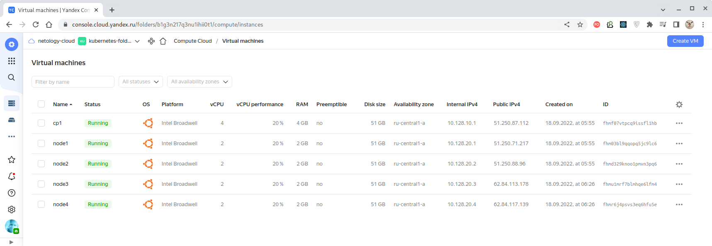

# Домашнее задание к занятию "12.4 Развертывание кластера на собственных серверах, лекция 2"
Новые проекты пошли стабильным потоком. Каждый проект требует себе несколько кластеров: под тесты и продуктив. Делать все руками — не вариант, поэтому стоит автоматизировать подготовку новых кластеров.

## Задание 1: Подготовить инвентарь kubespray
Новые тестовые кластеры требуют типичных простых настроек. Нужно подготовить инвентарь и проверить
его работу. Требования к инвентарю:
* подготовка работы кластера из 5 нод: 1 мастер и 4 рабочие ноды;
* в качестве CRI — containerd;
* запуск etcd производить на мастере.

---

## Задание 2 (*): подготовить и проверить инвентарь для кластера в AWS
Часть новых проектов хотят запускать на мощностях AWS. Требования похожи:
* разворачивать 5 нод: 1 мастер и 4 рабочие ноды;
* работать должны на минимально допустимых EC2 — t3.small.

---

## Задание 3 (*): подключение kubectl с внешним адресом

Должна существовать возможность подключаться к мастер-ноде и выполнять команды с локального хоста.

---

### Решение

Используем не AWS, а Yandex.Cloud.

Конфигурация Terraform для создания облачной инфраструктуры, состоящей из одной мастер-ноды и
четырех рабочих нод, находится [здесь](./terraform/main.tf).

Результат её применения:



Или из командной строки:
````bash
$ yc compute instance list
+----------------------+-------+---------------+---------+---------------+-------------+
|          ID          | NAME  |    ZONE ID    | STATUS  |  EXTERNAL IP  | INTERNAL IP |
+----------------------+-------+---------------+---------+---------------+-------------+
| fhmf07vtpcq9issfl1hb | cp1   | ru-central1-a | RUNNING | 51.250.87.112 | 10.128.10.1 |
| fhm03bl9qqopq5jc9lc6 | node1 | ru-central1-a | RUNNING | 51.250.71.217 | 10.128.20.1 |
| fhmd329knoo1pmvn3pq6 | node2 | ru-central1-a | RUNNING | 51.250.88.96  | 10.128.20.2 |
| fhmu1mrf7blmhqe6lfm4 | node3 | ru-central1-a | RUNNING | 62.84.113.178 | 10.128.20.3 |
| fhmr6j4psvs3eq6hfu5e | node4 | ru-central1-a | RUNNING | 62.84.117.139 | 10.128.20.4 |
+----------------------+-------+---------------+---------+---------------+-------------+
````

> Данная конфигурация не полностью удовлетворяет минимальным требованиям к контрольной
> и рабочим нодам по причине физических ограничений, накладываемых Yandex.Cloud на
> [размер дискового пространства](https://cloud.yandex.ru/docs/compute/concepts/limits).
>
> В решении используется минимально допустимая платформа
> ["standard-v1"](https://cloud.yandex.ru/docs/compute/concepts/vm-platforms).

Вся программная инфраструктура создаётся с помощью
[конфигурации Ansible](./infrastructure/site.yaml).

Для создания кластера используем ["Kubespray"](https://github.com/kubernetes-sigs/kubespray),
конфигурация которого находится [здесь](./infrastructure/playbooks/k8s_cluster/k8s-cluster.yml).
Состав нод определен с помощью соответствующего
[шаблона](./infrastructure/playbooks/templates/hosts.ansible.yaml.j2).

В результате имеем следующий набор нод кластера:
````bash
$ kubectl get nodes -A -o wide
NAME    STATUS   ROLES           AGE   VERSION   INTERNAL-IP   EXTERNAL-IP   OS-IMAGE             KERNEL-VERSION      CONTAINER-RUNTIME
cp1     Ready    control-plane   51m   v1.24.4   10.128.10.1   <none>        Ubuntu 20.04.4 LTS   5.4.0-124-generic   containerd://1.6.8
node1   Ready    <none>          49m   v1.24.4   10.128.20.1   <none>        Ubuntu 20.04.4 LTS   5.4.0-124-generic   containerd://1.6.8
node2   Ready    <none>          49m   v1.24.4   10.128.20.2   <none>        Ubuntu 20.04.4 LTS   5.4.0-124-generic   containerd://1.6.8
node3   Ready    <none>          16m   v1.24.4   10.128.20.3   <none>        Ubuntu 20.04.4 LTS   5.4.0-124-generic   containerd://1.6.8
node4   Ready    <none>          16m   v1.24.4   10.128.20.4   <none>        Ubuntu 20.04.4 LTS   5.4.0-124-generic   containerd://1.6.8
````

Поды созданного кластера:
````bash
$ kubectl get pods -A -o wide 
NAMESPACE     NAME                              READY   STATUS    RESTARTS   AGE   IP               NODE    NOMINATED NODE   READINESS GATES
kube-system   kube-apiserver-cp1                1/1     Running   1          53m   10.128.10.1      cp1     <none>           <none>
kube-system   kube-controller-manager-cp1       1/1     Running   1          53m   10.128.10.1      cp1     <none>           <none>
kube-system   kube-scheduler-cp1                1/1     Running   1          53m   10.128.10.1      cp1     <none>           <none>
kube-system   kube-proxy-ff2bv                  1/1     Running   0          18m   10.128.10.1      cp1     <none>           <none>
kube-system   dns-autoscaler-59b8867c86-2jn2d   1/1     Running   0          50m   10.129.176.2     cp1     <none>           <none>
kube-system   calico-node-sm6mr                 1/1     Running   0          51m   10.128.10.1      cp1     <none>           <none>
kube-system   nodelocaldns-b8mpk                1/1     Running   0          50m   10.128.10.1      cp1     <none>           <none>
kube-system   coredns-74d6c5659f-h5xc5          1/1     Running   0          50m   10.129.176.1     cp1     <none>           <none>

kube-system   nginx-proxy-node1                 1/1     Running   0          50m   10.128.20.1      node1   <none>           <none>
kube-system   kube-proxy-x7rdp                  1/1     Running   0          18m   10.128.20.1      node1   <none>           <none>
kube-system   calico-node-w49pw                 1/1     Running   0          51m   10.128.20.1      node1   <none>           <none>
kube-system   nodelocaldns-fwlwm                1/1     Running   0          50m   10.128.20.1      node1   <none>           <none>
kube-system   coredns-74d6c5659f-mcjl5          1/1     Running   0          50m   10.129.166.129   node1   <none>           <none>

kube-system   nginx-proxy-node2                 1/1     Running   0          51m   10.128.20.2      node2   <none>           <none>
kube-system   kube-proxy-d9pjh                  1/1     Running   0          18m   10.128.20.2      node2   <none>           <none>
kube-system   calico-node-s45h9                 1/1     Running   0          51m   10.128.20.2      node2   <none>           <none>
kube-system   nodelocaldns-shtxr                1/1     Running   0          50m   10.128.20.2      node2   <none>           <none>

kube-system   nginx-proxy-node3                 1/1     Running   0          17m   10.128.20.3      node3   <none>           <none>
kube-system   kube-proxy-kckpr                  1/1     Running   0          18m   10.128.20.3      node3   <none>           <none>
kube-system   calico-node-xjcqh                 1/1     Running   0          18m   10.128.20.3      node3   <none>           <none>
kube-system   nodelocaldns-mbt2j                1/1     Running   0          18m   10.128.20.3      node3   <none>           <none>

kube-system   nginx-proxy-node4                 1/1     Running   0          17m   10.128.20.4      node4   <none>           <none>
kube-system   kube-proxy-flxr6                  1/1     Running   0          18m   10.128.20.4      node4   <none>           <none>
kube-system   calico-node-ctxbr                 1/1     Running   0          18m   10.128.20.4      node4   <none>           <none>
kube-system   nodelocaldns-q2l9s                1/1     Running   0          18m   10.128.20.4      node4   <none>           <none>
````

Все команды можно выполнять на локальном хосте, которому разрешен удаленный доступ
к мастер-ноде за счет указания её IP-адреса в параметре `supplementary_addresses_in_ssl_keys` в
[настройках кластера](./infrastructure/playbooks/k8s_cluster/k8s-cluster.yml).

В результате с помощью "Kubespray" в облачной инфраструктуре Yandex.Cloud мы создали кластер,
состоящий из одной мастер-ноды и четырех рабочих нод.

---
