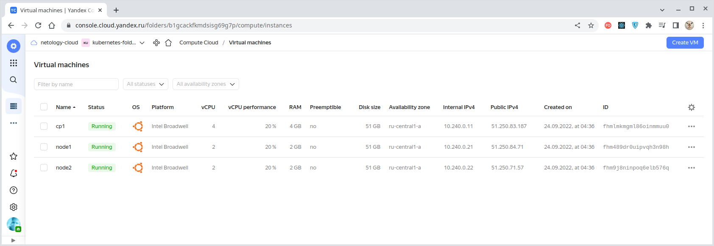
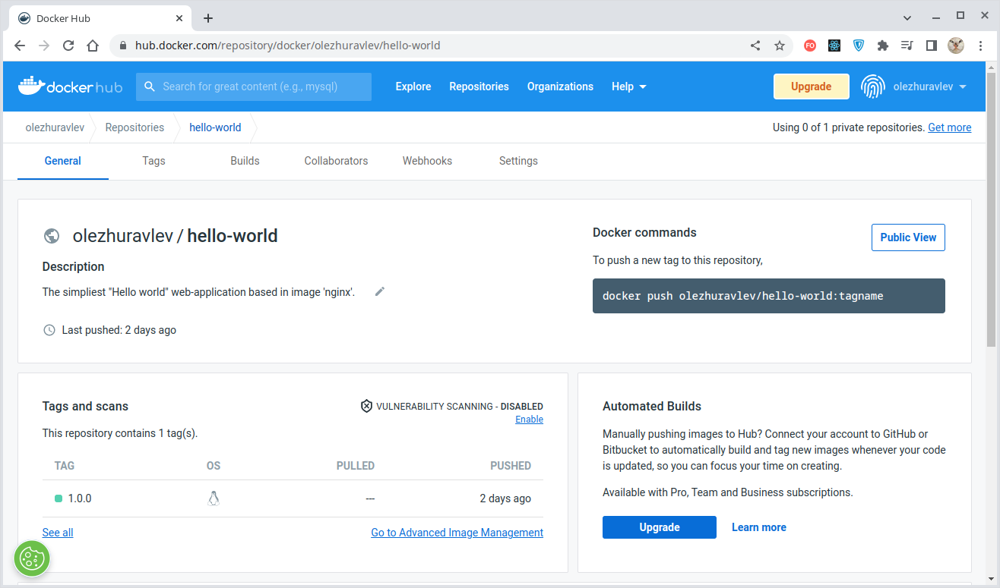
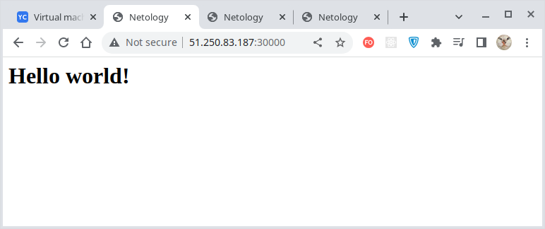
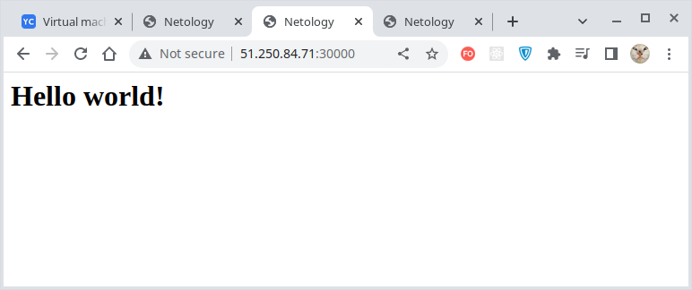
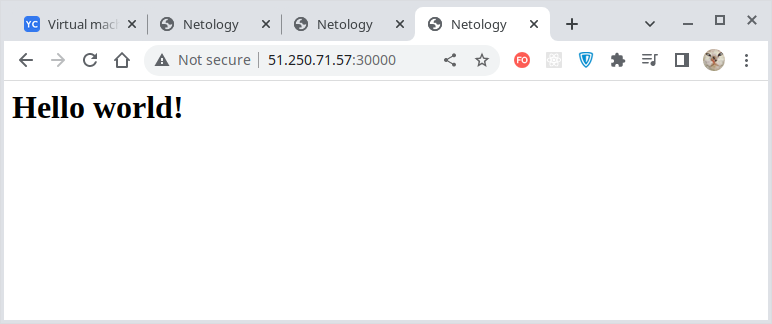
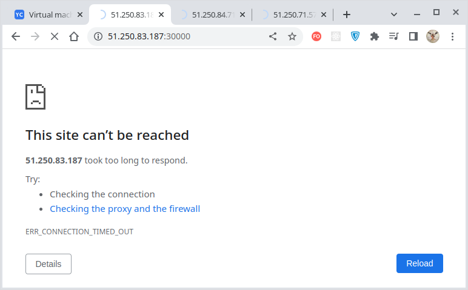
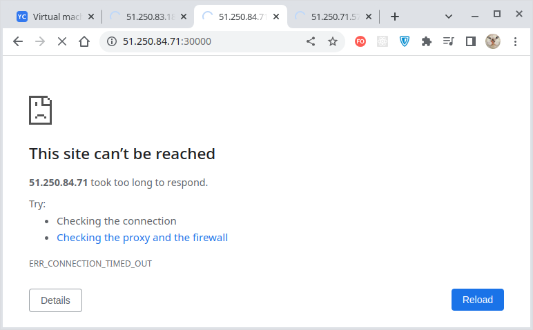
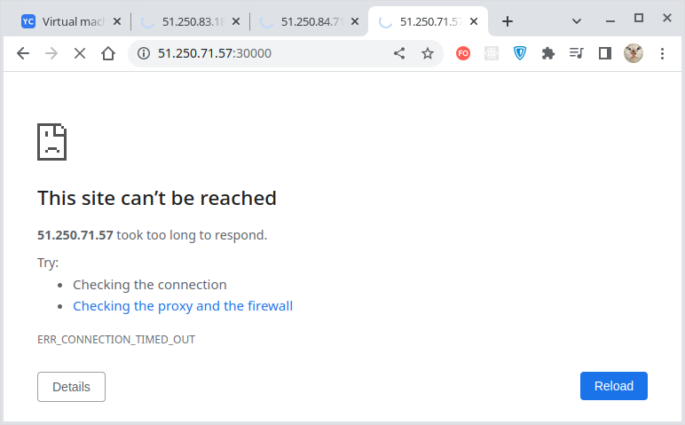

# Домашнее задание к занятию "12.5 Сетевые решения CNI"
После работы с Flannel появилась необходимость обеспечить безопасность для приложения. Для этого лучше всего подойдет Calico.

---

## Задание 1: установить в кластер CNI плагин Calico
Для проверки других сетевых решений стоит поставить отличный от Flannel плагин — например, Calico. Требования: 
* установка производится через ansible/kubespray;
* после применения следует настроить политику доступа к hello-world извне. Инструкции [kubernetes.io](https://kubernetes.io/docs/concepts/services-networking/network-policies/), [Calico](https://docs.projectcalico.org/about/about-network-policy)

### Решение:

Подготовим виртуальную инфраструктуру с помощью конфигурации [Terraform](./terraform/main.tf):



Программную инфраструктуру установим с помощью [Ansible](./infrastructure/site.yaml),
разворачивающего кластер Kubernetes посредством
[Kubespray](./infrastructure/playbooks/setup.ansible.yaml).

Использование CNI-плагина [Calico](https://projectcalico.docs.tigera.io/about/about-calico) задано
в конфигурационном файле [Kubernetes](./infrastructure/playbooks/k8s_cluster/k8s-cluster.yml)
в параметре `kube_network_plugin`:
````bash
kube_network_plugin: calico
````

Приложение "hello-world", выводящее [простую веб-страницу](./site/index.html),
мы для разнообразия создали самостоятельно на основе [Docker-образа nginx](./site/Dockerfile) и разместили в нашем
публичном [репозитории](https://hub.docker.com/r/olezhuravlev/hello-world):



Для разворачивания нашего приложения в кластере будем использовать
[манифест](infrastructure/playbooks/templates/deployment.yaml), где опишем создаваемый деплоймент и сервис типа
`NodePort` для предоставления внешнего доступа к нему.

<details>
  <summary>Посмотреть манифест развёртывания приложения "hello-world"</summary>

````yaml
apiVersion: apps/v1
kind: Deployment
metadata:
  labels:
    app: hello-world
  name: hello-world
  namespace: default
spec:
  replicas: 2
  selector:
    matchLabels:
      app: hello-world
  template:
    metadata:
      labels:
        app: hello-world
    spec:
      containers:
        - name: hello-world
          image: olezhuravlev/hello-world:1.0.0
          ports:
            - containerPort: 80
              name: http-web-app
              protocol: TCP

---
# NodePort: Exposes the Service on each Node's IP at a static port.
apiVersion: v1
kind: Service
metadata:
  name: hw-node-port
  namespace: default
spec:
  type: NodePort
  selector:
    app: hello-world
  ports:
    - name: node-port
      protocol: TCP
      nodePort: 30000 # Visible outside cluster.
      port: 30001 # Visible within cluster.
      targetPort: http-web-app
````
</details>

Манифест развёртывания может быть применен командой `kubectl apply`:
````bash
$ kubectl apply -f /home/ubuntu/deployment.yaml
deployment.apps/hello-world created
````

> Можно создавать деплоймент и просто из командной строки через вызов `kubectl create deployment`:
> ````bash
> $ kubectl create deployment hello-world --image=olezhuravlev/hello-world:1.0.0 --replicas=2
> deployment.apps/hello-world created
> ````
> Результат будет аналогичным за исключением того, что сервис придется создать отдельной командой.

Теперь наше приложение "hello-world" развернуто и активно:
````bash
$ kubectl get deployments -A -o wide
NAMESPACE     NAME             READY   UP-TO-DATE   AVAILABLE   AGE   CONTAINERS    IMAGES                                                            SELECTOR
default       hello-world      2/2     2            2           32m   hello-world   olezhuravlev/hello-world:1.0.0                                    app=hello-world
kube-system   coredns          2/2     2            2           34m   coredns       registry.k8s.io/coredns/coredns:v1.8.6                            k8s-app=kube-dns
kube-system   dns-autoscaler   1/1     1            1           34m   autoscaler    registry.k8s.io/cpa/cluster-proportional-autoscaler-amd64:1.8.5   k8s-app=dns-autoscaler
````

И представлено соответствующие сервисом "hw-node-port" типа `NodePort`:
````bash
$ kubectl get services -o wide --show-labels
NAME           TYPE        CLUSTER-IP     EXTERNAL-IP   PORT(S)           AGE     SELECTOR          LABELS
hw-node-port   NodePort    10.32.166.98   <none>        30001:30000/TCP   2m23s   app=hello-world   <none>
kubernetes     ClusterIP   10.32.0.1      <none>        443/TCP           37m     <none>            component=apiserver,provider=kubernetes
````

> Т.к. в Kubernetes поды и их IP-адреса являются непостоянными сущностями, то сервис призван обеспечивать
> сопоставление совокупности подов с запросами к ней.

В списке подов мы видим, что приложение развёрнуто на рабочих нодах в пространстве имен `default`:
````bash
$ kubectl get pods -A -o wide --sort-by .spec.nodeName
NAMESPACE     NAME                              READY   STATUS    RESTARTS      AGE   IP               NODE    NOMINATED NODE   READINESS GATES
kube-system   kube-controller-manager-cp1       1/1     Running   2 (33m ago)   37m   10.240.0.11      cp1     <none>           <none>
kube-system   kube-apiserver-cp1                1/1     Running   1             37m   10.240.0.11      cp1     <none>           <none>
kube-system   kube-scheduler-cp1                1/1     Running   2 (33m ago)   37m   10.240.0.11      cp1     <none>           <none>
kube-system   dns-autoscaler-59b8867c86-8bz2k   1/1     Running   0             34m   10.200.176.2     cp1     <none>           <none>
kube-system   calico-node-tmd5v                 1/1     Running   0             35m   10.240.0.11      cp1     <none>           <none>
kube-system   kube-proxy-fbh2d                  1/1     Running   0             36m   10.240.0.11      cp1     <none>           <none>
kube-system   nodelocaldns-k8kj4                1/1     Running   0             34m   10.240.0.11      cp1     <none>           <none>
kube-system   coredns-74d6c5659f-qsxr7          1/1     Running   0             34m   10.200.176.1     cp1     <none>           <none>

default       hello-world-5d77fdbcdd-jgzh2      1/1     Running   0             32m   10.200.166.130   node1   <none>           <none>
kube-system   calico-node-74jv2                 1/1     Running   0             35m   10.240.0.21      node1   <none>           <none>
kube-system   kube-proxy-mx2ff                  1/1     Running   0             36m   10.240.0.21      node1   <none>           <none>
kube-system   nginx-proxy-node1                 1/1     Running   0             35m   10.240.0.21      node1   <none>           <none>
kube-system   nodelocaldns-txp4m                1/1     Running   0             34m   10.240.0.21      node1   <none>           <none>
kube-system   coredns-74d6c5659f-8svk5          1/1     Running   0             34m   10.200.166.129   node1   <none>           <none>

default       hello-world-5d77fdbcdd-zwkrq      1/1     Running   0             32m   10.200.104.1     node2   <none>           <none>
kube-system   calico-node-dk6ps                 1/1     Running   0             35m   10.240.0.22      node2   <none>           <none>
kube-system   kube-proxy-ltqqq                  1/1     Running   0             36m   10.240.0.22      node2   <none>           <none>
kube-system   nginx-proxy-node2                 1/1     Running   0             35m   10.240.0.22      node2   <none>           <none>
kube-system   nodelocaldns-rvjqq                1/1     Running   0             34m   10.240.0.22      node2   <none>           <none>
````

Приложение имеет набор реплик:
````bash
$ kubectl get replicaset -A -o wide --show-labels
NAMESPACE     NAME                        DESIRED   CURRENT   READY   AGE   CONTAINERS    IMAGES                                                            SELECTOR                                              LABELS
default       hello-world-5d77fdbcdd      2         2         2       34m   hello-world   olezhuravlev/hello-world:1.0.0                                    app=hello-world,pod-template-hash=5d77fdbcdd          app=hello-world,pod-template-hash=5d77fdbcdd
kube-system   coredns-74d6c5659f          2         2         2       36m   coredns       registry.k8s.io/coredns/coredns:v1.8.6                            k8s-app=kube-dns,pod-template-hash=74d6c5659f         k8s-app=kube-dns,pod-template-hash=74d6c5659f
kube-system   dns-autoscaler-59b8867c86   1         1         1       36m   autoscaler    registry.k8s.io/cpa/cluster-proportional-autoscaler-amd64:1.8.5   k8s-app=dns-autoscaler,pod-template-hash=59b8867c86   k8s-app=dns-autoscaler,pod-template-hash=59b8867c86
````

Посмотрим еще раз на локальные IP-адреса подов:
````bash
$ kubectl get pods -o wide
NAME                           READY   STATUS    RESTARTS   AGE   IP               NODE    NOMINATED NODE   READINESS GATES
hello-world-5d77fdbcdd-jgzh2   1/1     Running   0          34m   10.200.166.130   node1   <none>           <none>
hello-world-5d77fdbcdd-zwkrq   1/1     Running   0          34m   10.200.104.1     node2   <none>           <none>
````

А теперь проверим доступность нашего приложения, воспользовавшись локальными адресами. Для этого подключимся через
SSH-терминал **к любой ноде** и выполним запросы ко всем нашим нодам.

К `node1`:
````bash
ubuntu@cp1:~$ curl http://10.200.166.130
<html>
<head>
  <meta http-equiv="Content-Type" content="text/html;charset=UTF-8">
  <title>Netology</title>
</head>
<body>
<h1>Hello world!</h1>
</body>
</html>
````

И к `node2`:
````bash
ubuntu@cp1:~$ curl http://10.200.104.1
<html>
<head>
  <meta http-equiv="Content-Type" content="text/html;charset=UTF-8">
  <title>Netology</title>
</head>
<body>
<h1>Hello world!</h1>
</body>
</html>
````

> Здесь стоит обратить внимание, что IPv4-адреса рабочих нод Kubernetes назначил в пределах подсети,
> CIDR которой задан параметром `kube_pods_subnet` в конфигурационном файле
> [k8s-cluser.yml](./infrastructure/playbooks/k8s_cluster/k8s-cluster.yml):
> ````yaml
> kube_pods_subnet: 10.200.0.0/16
> `````
> **Маска подсети д.б. не менее двух октетов, так, например, `/24` использовать нельзя!** 

С помощью [сервиса `NodePort`](./infrastructure/playbooks/templates/deployment.yaml) мы назначили доступность
нашего приложения по внутренней сети через порт `30001`. Проверим это:
````bash
$ kubectl exec hello-world-5d77fdbcdd-jgzh2 -- curl -s -m 1 hw-node-port:30001
<html>
<head>
  <meta http-equiv="Content-Type" content="text/html;charset=UTF-8">
  <title>Netology</title>
</head>
<body>
<h1>Hello world!</h1>
</body>
</html>

$ kubectl exec hello-world-5d77fdbcdd-zwkrq -- curl -s -m 1 hw-node-port:30001
<html>
<head>
  <meta http-equiv="Content-Type" content="text/html;charset=UTF-8">
  <title>Netology</title>
</head>
<body>
<h1>Hello world!</h1>
</body>
</html>
````

Этим же [сервисом `NodePort`](./infrastructure/playbooks/templates/deployment.yaml) мы назначили доступность
нашего приложения извне через порт `30000`. Проверим это через обычный браузер:

| Нода                                   |          Внешний доступ           |
|:---------------------------------------|:---------------------------------:|
| Control Plane 1:<br/>IP: 51.250.83.187 |    |
| Node 1:<br/>IP: 51.250.84.71           |  |
| Node 2:<br/>IP: 51.250.71.57           |  |

Таким образом вы выяснили, что наше приложение "hello-world" работает и доступно из внутренней
и внешней сети - возвращает `html`-страницу с надписью "Hello world!".

Применим [политику, запрещающую любые входящие соединения](./infrastructure/playbooks/network-policy/deny-all.yaml):
````bash
$ kubectl apply -f deny-all.yaml
networkpolicy.networking.k8s.io/default-deny-ingress created
````

После этого наше веб-приложение станет недоступным:
````bash
$ kubectl exec hello-world-5d77fdbcdd-jgzh2 -- curl -s -m 1 hw-node-port:30001
command terminated with exit code 28

$ kubectl exec hello-world-5d77fdbcdd-zwkrq -- curl -s -m 1 hw-node-port:30001
command terminated with exit code 28
````

| Нода                                   |              Внешний доступ              |
|:---------------------------------------|:----------------------------------------:|
| Control Plane 1:<br/>IP: 51.250.83.187 |    |
| Node 1:<br/>IP: 51.250.84.71           |  |
| Node 2:<br/>IP: 51.250.71.57           |  |

Теперь применим
[политику, разрешающую входящие TCP-соединения для портов 80 и 443](./infrastructure/playbooks/network-policy/allow-ingress-tcp-80-443.yaml):
````bash
$ kubectl apply -f allow-ingress-tcp-80-443.yaml
networkpolicy.networking.k8s.io/hello-world created
````

Веб-приложение снова доступно, как изнутри:
````bash
$ kubectl exec hello-world-5d77fdbcdd-jgzh2 -- curl -s -m 1 hw-node-port:30001
<html>
<head>
  <meta http-equiv="Content-Type" content="text/html;charset=UTF-8">
  <title>Netology</title>
</head>
<body>
<h1>Hello world!</h1>
</body>
</html>

$ kubectl exec hello-world-5d77fdbcdd-zwkrq -- curl -s -m 1 hw-node-port:30001
<html>
<head>
  <meta http-equiv="Content-Type" content="text/html;charset=UTF-8">
  <title>Netology</title>
</head>
<body>
<h1>Hello world!</h1>
</body>
</html>
````

Так и снаружи:

| Нода                                   |          Внешний доступ           |
|:---------------------------------------|:---------------------------------:|
| Control Plane 1:<br/>IP: 51.250.83.187 |    |
| Node 1:<br/>IP: 51.250.84.71           |  |
| Node 2:<br/>IP: 51.250.71.57           |  |


> Политики не конфликтуют, а дополняют друг-друга. Список действующих политик можно получить командой `kubectl get networkpolicies`:
> ````bash
> $ kubectl get networkpolicies
> NAME                   POD-SELECTOR      AGE
> default-deny-ingress   <none>            11m
> hello-world            app=hello-world   4m39s
> ````

Таким образом, используя "Terraform", "Ansible" и "Kubespray" мы развернули в кластере Kubernetes произвольное
приложение, определили **внешний и внутренний доступ** к нему, а также продемонстрировали
простейшее **применение сетевых политик CNI "Calico"** - запретили любой входящий траффик к нашему кластеру,
за исключением TCP-соединения по `80` и `443` портам. 

---

## Задание 2: изучить, что запущено по умолчанию
Самый простой способ — проверить командой calicoctl get <type>. Для проверки стоит получить список нод, ipPool и profile.
Требования:
* установить утилиту calicoctl;
* получить 3 вышеописанных типа в консоли.

### Решение:

Утилита "calicoCtl" работает со следующими типами ресурсов:
- node;
- ipPool;
- profile;
- bgpConfiguration;
- bgpPeer;
- felixConfiguration;
- globalNetworkPolicy;
- globalNetworkSet;
- hostEndpoint;
- ipReservation;
- kubeControllersConfiguration;
- networkPolicy;
- networkSet;
- workloadEndpoint.

Получим некоторые из них.

Список нод:
````bash
ubuntu@cp1:~$ calicoctl get nodes -o wide
NAME    ASN       IPV4             IPV6   
cp1     (64512)   10.240.0.11/16          
node1   (64512)   10.240.0.21/16          
node2   (64512)   10.240.0.22/16          
````

Список ip-диапазонов:
````bash
ubuntu@cp1:~$ calicoctl get ipPool -o wide
NAME           CIDR            NAT    IPIPMODE   VXLANMODE   DISABLED   DISABLEBGPEXPORT   SELECTOR   
default-pool   10.200.0.0/16   true   Never      Always      false      false              all()      
````

Список профилей:
````bash
ubuntu@cp1:~$ calicoctl get profile -o wide
NAME                                                 LABELS                                                                                         
projectcalico-default-allow                                                                                                                         
kns.default                                          pcns.kubernetes.io/metadata.name=default,pcns.projectcalico.org/name=default                   
kns.kube-node-lease                                  pcns.kubernetes.io/metadata.name=kube-node-lease,pcns.projectcalico.org/name=kube-node-lease   
kns.kube-public                                      pcns.kubernetes.io/metadata.name=kube-public,pcns.projectcalico.org/name=kube-public           
kns.kube-system                                      pcns.kubernetes.io/metadata.name=kube-system,pcns.projectcalico.org/name=kube-system           
ksa.default.default                                  pcsa.projectcalico.org/name=default                                                            
ksa.kube-node-lease.default                          pcsa.projectcalico.org/name=default                                                            
ksa.kube-public.default                              pcsa.projectcalico.org/name=default                                                            
ksa.kube-system.attachdetach-controller              pcsa.projectcalico.org/name=attachdetach-controller                                            
ksa.kube-system.bootstrap-signer                     pcsa.projectcalico.org/name=bootstrap-signer                                                   
ksa.kube-system.calico-node                          pcsa.projectcalico.org/name=calico-node                                                        
ksa.kube-system.certificate-controller               pcsa.projectcalico.org/name=certificate-controller                                             
ksa.kube-system.clusterrole-aggregation-controller   pcsa.projectcalico.org/name=clusterrole-aggregation-controller                                 
ksa.kube-system.coredns                              pcsa.addonmanager.kubernetes.io/mode=Reconcile,pcsa.projectcalico.org/name=coredns             
ksa.kube-system.cronjob-controller                   pcsa.projectcalico.org/name=cronjob-controller                                                 
ksa.kube-system.daemon-set-controller                pcsa.projectcalico.org/name=daemon-set-controller                                              
ksa.kube-system.default                              pcsa.projectcalico.org/name=default                                                            
ksa.kube-system.deployment-controller                pcsa.projectcalico.org/name=deployment-controller                                              
ksa.kube-system.disruption-controller                pcsa.projectcalico.org/name=disruption-controller                                              
ksa.kube-system.dns-autoscaler                       pcsa.addonmanager.kubernetes.io/mode=Reconcile,pcsa.projectcalico.org/name=dns-autoscaler      
ksa.kube-system.endpoint-controller                  pcsa.projectcalico.org/name=endpoint-controller                                                
ksa.kube-system.endpointslice-controller             pcsa.projectcalico.org/name=endpointslice-controller                                           
ksa.kube-system.endpointslicemirroring-controller    pcsa.projectcalico.org/name=endpointslicemirroring-controller                                  
ksa.kube-system.ephemeral-volume-controller          pcsa.projectcalico.org/name=ephemeral-volume-controller                                        
ksa.kube-system.expand-controller                    pcsa.projectcalico.org/name=expand-controller                                                  
ksa.kube-system.generic-garbage-collector            pcsa.projectcalico.org/name=generic-garbage-collector                                          
ksa.kube-system.horizontal-pod-autoscaler            pcsa.projectcalico.org/name=horizontal-pod-autoscaler                                          
ksa.kube-system.job-controller                       pcsa.projectcalico.org/name=job-controller                                                     
ksa.kube-system.kube-proxy                           pcsa.projectcalico.org/name=kube-proxy                                                         
ksa.kube-system.namespace-controller                 pcsa.projectcalico.org/name=namespace-controller                                               
ksa.kube-system.node-controller                      pcsa.projectcalico.org/name=node-controller                                                    
ksa.kube-system.nodelocaldns                         pcsa.addonmanager.kubernetes.io/mode=Reconcile,pcsa.projectcalico.org/name=nodelocaldns        
ksa.kube-system.persistent-volume-binder             pcsa.projectcalico.org/name=persistent-volume-binder                                           
ksa.kube-system.pod-garbage-collector                pcsa.projectcalico.org/name=pod-garbage-collector                                              
ksa.kube-system.pv-protection-controller             pcsa.projectcalico.org/name=pv-protection-controller                                           
ksa.kube-system.pvc-protection-controller            pcsa.projectcalico.org/name=pvc-protection-controller                                          
ksa.kube-system.replicaset-controller                pcsa.projectcalico.org/name=replicaset-controller                                              
ksa.kube-system.replication-controller               pcsa.projectcalico.org/name=replication-controller                                             
ksa.kube-system.resourcequota-controller             pcsa.projectcalico.org/name=resourcequota-controller                                           
ksa.kube-system.root-ca-cert-publisher               pcsa.projectcalico.org/name=root-ca-cert-publisher                                             
ksa.kube-system.service-account-controller           pcsa.projectcalico.org/name=service-account-controller                                         
ksa.kube-system.service-controller                   pcsa.projectcalico.org/name=service-controller                                                 
ksa.kube-system.statefulset-controller               pcsa.projectcalico.org/name=statefulset-controller                                             
ksa.kube-system.token-cleaner                        pcsa.projectcalico.org/name=token-cleaner                                                      
ksa.kube-system.ttl-after-finished-controller        pcsa.projectcalico.org/name=ttl-after-finished-controller                                      
ksa.kube-system.ttl-controller                       pcsa.projectcalico.org/name=ttl-controller                                                     
````

---

## Задание 3(*): продемонстрировать применение сетевых политик
Применить политику и продемонстрировать её эффект.

### Решение:

Выполнено в Задании №1 с использованием CNI "Calico".

---

## ПРИЛОЖЕНИЕ - Селекторы

Всем компонентам кластера можно назначить ярлыки (labels) вида "ключ=значение", которые можно использовать
для обращения к этим компонентам. Увидеть назначенные ярлыки можно, указав ключ `--show-labels`:
````bash
$ kubectl get pods --sort-by .spec.nodeName --show-labels 
NAME                           READY   STATUS    RESTARTS   AGE   LABELS
hello-world-5d77fdbcdd-jgzh2   1/1     Running   0          77m   app=hello-world,pod-template-hash=5d77fdbcdd
hello-world-5d77fdbcdd-zwkrq   1/1     Running   0          77m   app=hello-world,pod-template-hash=5d77fdbcdd
````

Можно произвольно добавлять ярлыки. Например, добавим ярлык `myKey=myValue` к рабочим подам, обслуживающим наше приложение "hello-world":
````bash
$ kubectl label pods hello-world-5d77fdbcdd-jgzh2 myKey=myValue
pod/hello-world-5d77fdbcdd-jgzh2 labeled

$ kubectl label pods hello-world-5d77fdbcdd-zwkrq myKey=myValue
pod/hello-world-5d77fdbcdd-zwkrq labeled
````

Теперь можно использовать назначенный ярлык для обращения к этим подам, используя ключ `--selector`.
Например, запросим поды всех пространств имен, но с отбором по нашему ярлыку `myKey=myValue`:
````bash
$ kubectl get pods -A --sort-by .spec.nodeName --show-labels --selector myKey=myValue
NAMESPACE   NAME                           READY   STATUS    RESTARTS   AGE   LABELS
default     hello-world-5d77fdbcdd-jgzh2   1/1     Running   0          82m   app=hello-world,myKey=myValue,pod-template-hash=5d77fdbcdd
default     hello-world-5d77fdbcdd-zwkrq   1/1     Running   0          82m   app=hello-world,myKey=myValue,pod-template-hash=5d77fdbcdd
````
Видим, что были выведены только поды, обладающие искомым ярлыком `myKey=myValue`.

> Обратим внимание, что рабочие поды с нашим приложением "hello-world" уже имеют ярлык `app=hello-world`,
> заданный нами в [манифесте](./infrastructure/playbooks/templates/deployment.yaml).

Удаляются ярлыки аналогично тому, как они назначались, но с добавлением знака `-` после ключа ярлыка:
````bash
$ kubectl label pods hello-world-5d77fdbcdd-jgzh2 myKey-        
pod/hello-world-5d77fdbcdd-jgzh2 unlabeled

$ kubectl label pods hello-world-5d77fdbcdd-zwkrq myKey-
pod/hello-world-5d77fdbcdd-zwkrq unlabeled
````

Соответственно, поиск по нашему ярлыку `myKey=myValue` уже ничего не выводит:
````bash
$ kubectl get pods -A --sort-by .spec.nodeName --selector myKey=myValue --show-labels
No resources found
````

---