# Домашнее задание к занятию "13.1 контейнеры, поды, deployment, statefulset, services, endpoints"
Настроив кластер, подготовьте приложение к запуску в нём. Приложение стандартное: бекенд, фронтенд, база данных. Его можно найти в папке 13-kubernetes-config.

## Задание 1: подготовить тестовый конфиг для запуска приложения
Для начала следует подготовить запуск приложения в stage окружении с простыми настройками. Требования:
* под содержит в себе 2 контейнера — фронтенд, бекенд;
* регулируется с помощью deployment фронтенд и бекенд;
* база данных — через statefulset.

---

### Решение:

С помощью [конфигурации Terraform](./terraform/main.tf) подготовим виртуальную инфраструктуру:

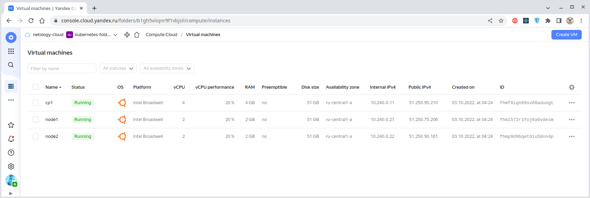

Разворачивание программной инфраструктуры произведем с помощью [конфигурации Ansible](./infrastructure/site.yaml),
но т.к. создание такой инфраструктуры подразумевает и развертывание в ней контейнеризированных приложений для бэкэнда
и фронтенда, то произведем сборку и публикацию этих компонент в репозиторий.

> [Бэкэнд-компонента](../13-kubernetes-config/backend/Dockerfile) нашего приложения использует переменную окружения
> [DATABASE_URL](../13-kubernetes-config/backend/.env), хранящую строку подключения к базе данных.
> ````bash
> DATABASE_URL=postgres://postgres:postgres@db:5432/news
> ````
> Имеющую следующий формат:
> ````
> postgres://<USER>:<PASSWORD>@<HOST>:<PORT>/<DB_NAME>
> ````
> 
> Изменять строку подключения мы не будем, а вместо этого сконфигурируем
> [Kubernetes-сервис NodePort](./infrastructure/playbooks/templates/deploy-pg.yaml) нашей базы данных
> таким образом, чтобы его имя совпадало с используемым именем базы данных в этой строке подключения - `"db"`:
> ````bash
> kind: Service
> metadata:
>   name: db
> ````
> В свою очередь, во [фронтэнд-компоненте](../13-kubernetes-config/frontend/Dockerfile)
> приложения из раздела [13-kubernetes-config](../13-kubernetes-config/frontend) используется переменная окружения
> [BASE_URL](../13-kubernetes-config/frontend/.env), хранящая адрес, по которому следует обращаться к нашей
> [бэкэнд-компоненте](../13-kubernetes-config/backend/Dockerfile):
> ````bash
> BASE_URL=http://51.250.95.210:30001
> ````
> В данном случае в качестве IPv4-адреса мы используем адрес кластера Kubernetes (точнее, внешний адрес любой
> из его нод). Понятно, что такое контейнеризированное приложение будет работать только
> с данным конкретным IPv4-адресом и при изменение адреса контейнер придётся пересобирать.
>
> Конечно же переменные окружения нужно сконфигурировать до контейнеризации этих компонент нашего приложения.

Cобираем [бэкэнд-компоненту](../13-kubernetes-config/backend/Dockerfile) приложения из раздела
[13-kubernetes-config](../13-kubernetes-config/backend) и размещаем его в нашем Dockerhub-репозитории:
````bash
$ docker build -t olezhuravlev/backend:1.0.0 .
Sending build context to Docker daemon  19.46kB
Step 1/8 : FROM python:3.9-buster
...
Successfully built eef394d2d216
Successfully tagged olezhuravlev/backend:1.0.0

$ docker push olezhuravlev/backend:1.0.0      
The push refers to repository [docker.io/olezhuravlev/backend]
...
1.0.0: digest: sha256:aacf6b01c9639370928af5f1d9539159b9c59d6240e028e8982b6a0ab136c7bf size: 3264
````

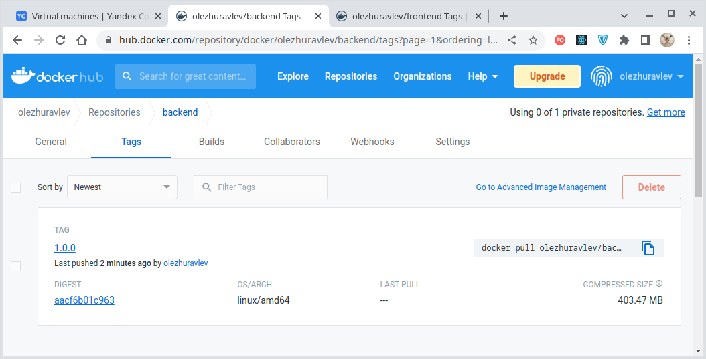

Аналогичным образом собираем [фронтэнд-компоненту](../13-kubernetes-config/frontend/Dockerfile)
и размещаем его в нашем Dockerhub-репозитории:
````bash
$ docker build -t olezhuravlev/frontend:1.0.0 .
Sending build context to Docker daemon  429.6kB
Step 1/14 : FROM node:lts-buster as builder
...
Successfully built 159607020ef9
Successfully tagged olezhuravlev/frontend:1.0.0

$ docker push olezhuravlev/frontend:1.0.0  
The push refers to repository [docker.io/olezhuravlev/frontend]
... 
1.0.0: digest: sha256:4abc578cb5ba4e7881e1cb973b63eac8057b7d83735cfe290a02046939b296c6 size: 2400
````

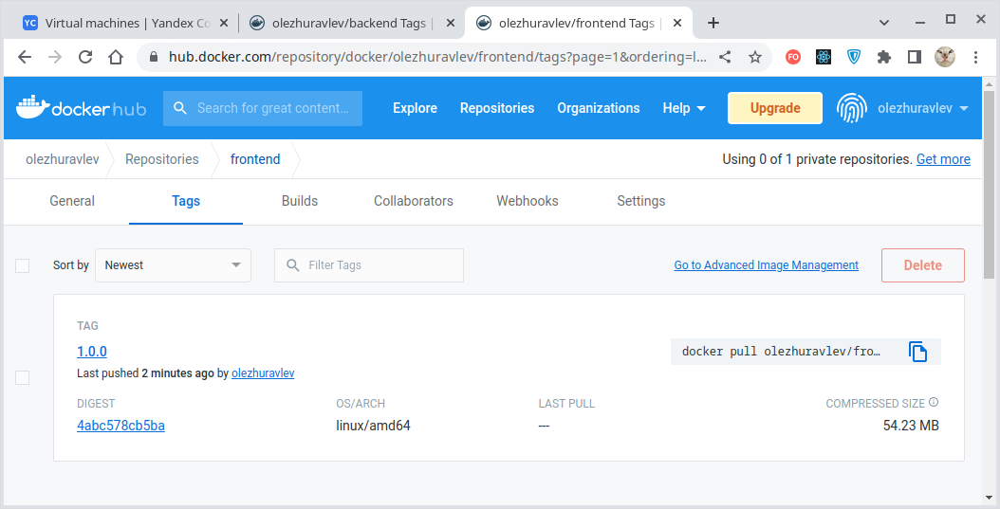

Когда образы бэкенд- и фронтенд-компонент нашего приложения подготовлены (для БД используется стандартный публичный
образ, не нуждающийся в какой-либо подготовке), наполним нашу виртуальную инфраструктуру программным содержимым
с помощью [конфигурации Ansible](./infrastructure/site.yaml).
Для разворачивания кластера Kubernetes [используем Kubespray](./infrastructure/playbooks/mount-cluster.ansible.yaml).

После развертывания приложения оно сразу доступно к использованию через веб-интерфейс:

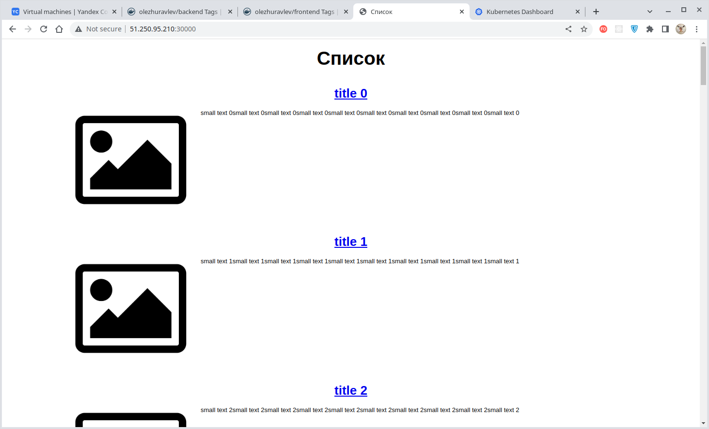

Помимо самого приложения мы [развернули](./infrastructure/playbooks/deploy-dashboard.ansible.yaml) и [панель приборов Kubernetes](https://kubernetes.io/docs/tasks/access-application-cluster/web-ui-dashboard/).

> Для получения доступа к панели Kubernetes следует на том хосте, с которого предполагает доступ, выполнить следующую
> команду:
> ````bash
> kubectl proxy
> ````
> Доступ к панели будет возможен только с того хоста, на котором запущена эта команда!
>
> Далее нужно проследовать по ссылке `http://localhost:8001/api/v1/namespaces/kubernetes-dashboard/services/https:kubernetes-dashboard:/proxy/`, где
> в предложенное поле следует ввести полученный шагом ранее токен:
>
> 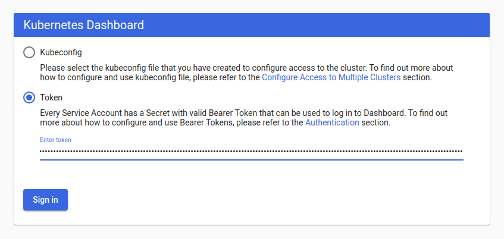
>
> После этого панель управления откроется и станет доступна для использования:
>
> 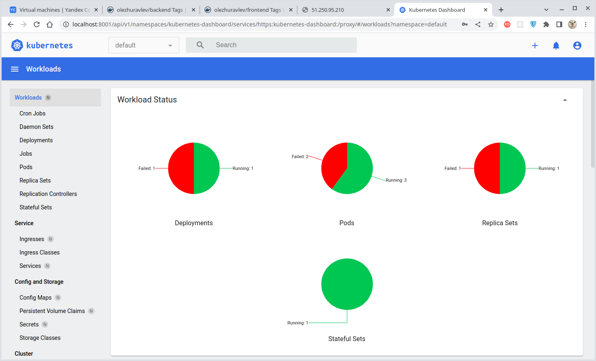

#### Рассмотрим созданную инфраструктуру.

**[PersistentVolume](./infrastructure/playbooks/templates/pg-pv.yaml):**
````bash
$ kubectl get pv -o wide
NAME                    CAPACITY   ACCESS MODES   RECLAIM POLICY   STATUS   CLAIM                                    STORAGECLASS   REASON   AGE    VOLUMEMODE
persistent-volume-1gb   1Gi        RWO            Retain           Bound    default/postgres-volume-postgres-sts-0                           3m6s   Filesystem
````

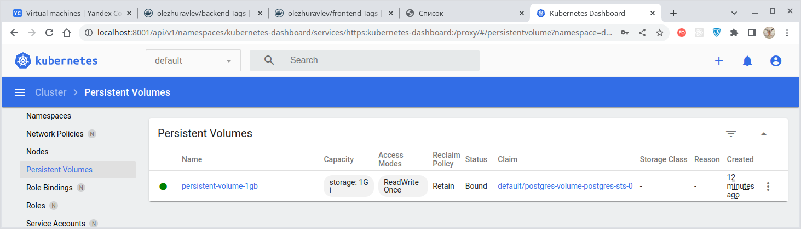

**[PersistentVolumeClaim](./infrastructure/playbooks/templates/deploy-pg.yaml)** (задан в составе StatefulSet через секцию `volumeClaimTemplates`):
````bash
$ kubectl get pvc -o wide
NAME                             STATUS   VOLUME                  CAPACITY   ACCESS MODES   STORAGECLASS   AGE     VOLUMEMODE
postgres-volume-postgres-sts-0   Bound    persistent-volume-1gb   1Gi        RWO                           3m20s   Filesystem
````

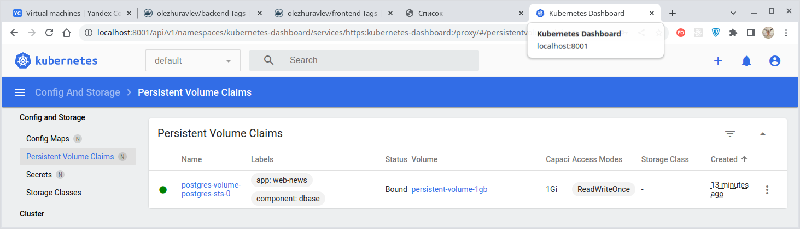

**[StatefulSet](./infrastructure/playbooks/templates/deploy-pg.yaml):**
````bash
$ kubectl get sts -o wide --show-labels
NAME           READY   AGE    CONTAINERS   IMAGES               LABELS
postgres-sts   1/1     4m5s   postgres     postgres:13-alpine   app=web-news,component=dbase
````

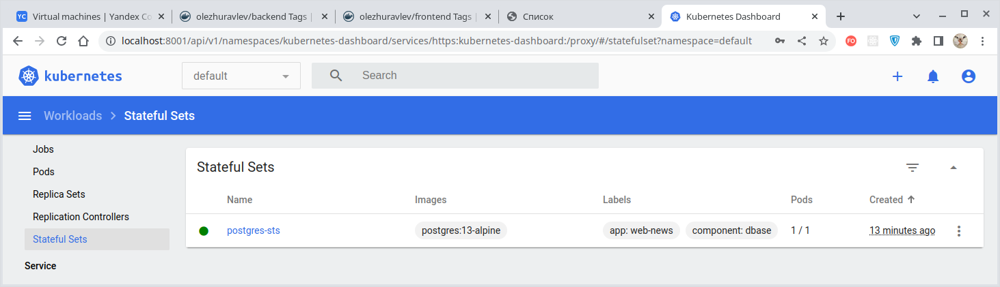

> Работоспособность баз данных обеспечиваеся в Kubernetes объектом StatefulSet, предоставляющим API для управления
> приложениями, сохранящими своё состояние. StatefulSet управляет развертыванием и масштабированием подов,
> предоставляя гарантии упорядочивания и уникальности этих подов. StatefulSet использует в своей работе совокупность
> следующих сущностей:
> - **StorageClass**: класс, определяющий параметры подключаемого тома;
> - **PersistentVolume Provisioner**: предоставляет PersistentVolumes, основываясь на параметрах, заданных через StorageClass;
> - **PersistentVolume**: интерфейс внешнего хранилища, через который оно подключается к контейнерам и сохраняет данные. Существуют различные типы PersistentVolume (local, NFS, CephFS, облачные решения и др.);
> - **VolumeClaimTemplate**: предоставляет хранилище, используя PersistentVolume, предоставленный PersistentVolume Provisioner;
> - **PersistentVolumeClaim**: заявка на создание PersistentVolume, описывающая требования к хранилищу и описание действий после отключения;
> - **Headless Service**: сервис со значением `none` в поле IP кластера (`.spec.clusterIP`), благодаря чему такой сервис не используют отдельный IP-адрес для маршрутизации запросов и под DNS-именем сервиса видны IP всех под, которые в этот сервис входят. Headless-сервисы полезны, когда приложение само должно управлять тем, к какому поду подключаться. Служит для идентификации StatefulSets в сети. Headless-сервис д.б. создан явно.
>
> Удаление StatefulSet не приводит к удалению ассоциированных с ним томов и не удаляет соответствующие поды. Для удаления
> подов следует произвести их масштабирование до нуля.

**ReplicaSets ([backend](./infrastructure/playbooks/templates/deploy-backend.yaml) и [frontend](./infrastructure/playbooks/templates/deploy-frontend.yaml)):**
````bash
$ kubectl get rs -o wide
NAME                  DESIRED   CURRENT   READY   AGE     CONTAINERS   IMAGES                        SELECTOR
backend-76b5c84476    2         2         2       4m33s   backend      olezhuravlev/backend:1.0.0    app=web-news,component=backend,pod-template-hash=76b5c84476
frontend-757fc9f598   2         2         0       4m27s   frontend     olezhuravlev/frontend:1.0.1   app=web-news,component=frontend,pod-template-hash=757fc9f598
````

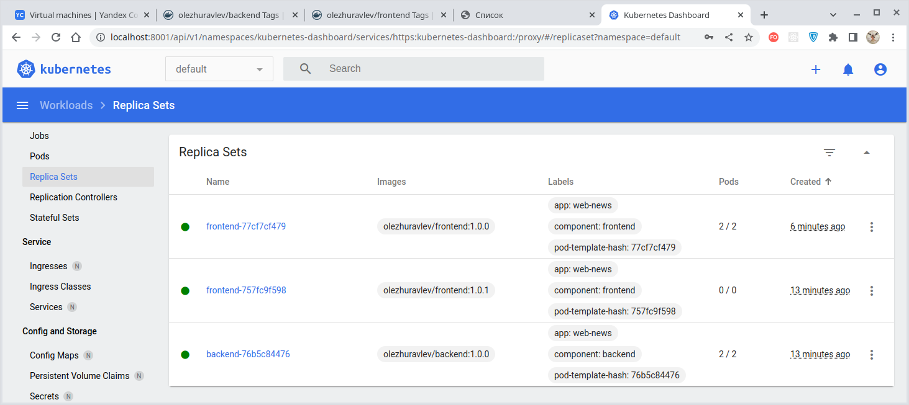

**Deployments ([backend](./infrastructure/playbooks/templates/deploy-backend.yaml) и [frontend](./infrastructure/playbooks/templates/deploy-frontend.yaml)):**
````bash
$ kubectl get deploy -o wide
NAME       READY   UP-TO-DATE   AVAILABLE   AGE     CONTAINERS   IMAGES                        SELECTOR
backend    2/2     2            2           4m57s   backend      olezhuravlev/backend:1.0.0    app=web-news,component=backend
frontend   0/2     2            0           4m51s   frontend     olezhuravlev/frontend:1.0.1   app=web-news,component=frontend
````

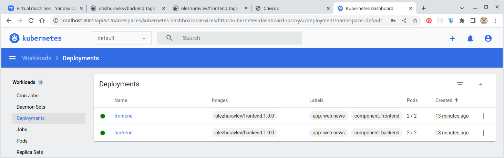

**Services ([backend](./infrastructure/playbooks/templates/deploy-backend.yaml) и [frontend](./infrastructure/playbooks/templates/deploy-frontend.yaml)):**
````bash
$ kubectl get svc -o wide
NAME                    TYPE        CLUSTER-IP     EXTERNAL-IP   PORT(S)          AGE     SELECTOR
frontend-nodeport-svc   NodePort    10.32.90.224   <none>        80:30000/TCP     5m17s   app=web-news,component=frontend
backend-nodeport-svc    NodePort    10.32.222.86   <none>        9000:30001/TCP   5m23s   app=web-news,component=backend
db                      NodePort    10.32.74.95    <none>        5432:30002/TCP   5m29s   app=web-news,component=dbase
kubernetes              ClusterIP   10.32.0.1      <none>        443/TCP          11m     <none>
````

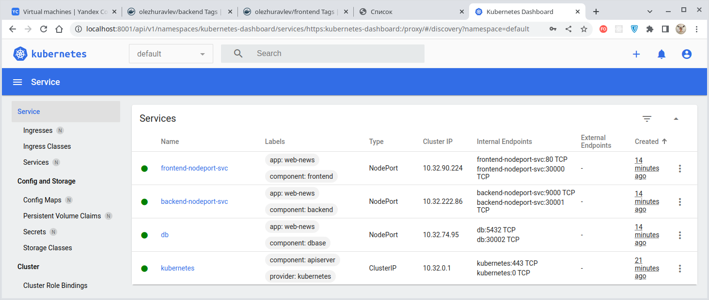

**Pods ([backend](./infrastructure/playbooks/templates/deploy-backend.yaml) и [frontend](./infrastructure/playbooks/templates/deploy-frontend.yaml)):**
````bash
$ kubectl get po -o wide
NAME                        READY   STATUS    RESTARTS   AGE     IP               NODE    NOMINATED NODE   READINESS GATES
frontend-77cf7cf479-28flz   1/1     Running   0          19s     10.200.104.5     node2   <none>           <none>
frontend-77cf7cf479-lmf9h   1/1     Running   0          29s     10.200.166.133   node1   <none>           <none>
backend-76b5c84476-rtzfq    1/1     Running   0          7m46s   10.200.104.3     node2   <none>           <none>
backend-76b5c84476-vjj2m    1/1     Running   0          7m46s   10.200.166.131   node1   <none>           <none>
postgres-sts-0              1/1     Running   0          7m51s   10.200.104.2     node2   <none>           <none>
````

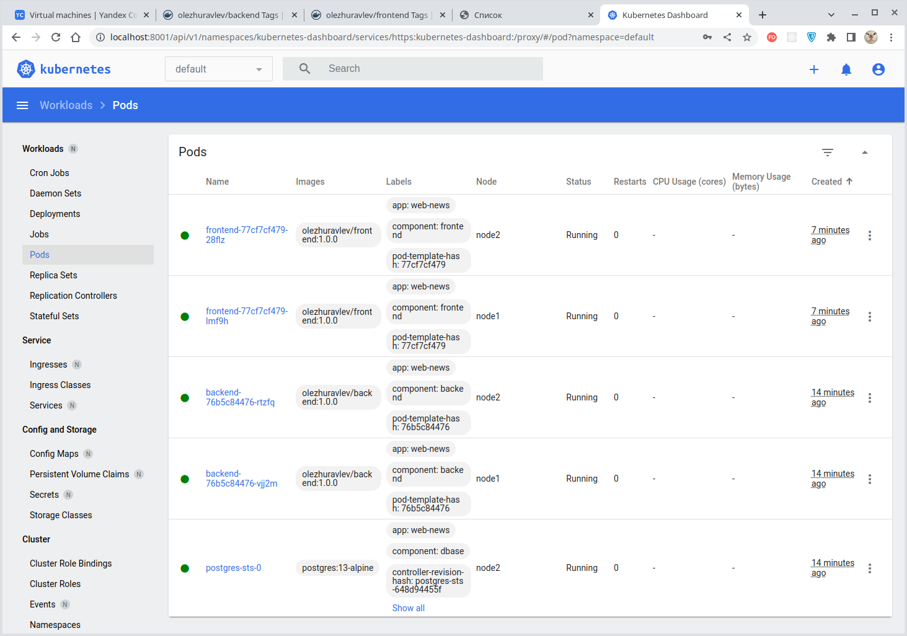


В приложении задействованы следующие порты:

| Номер порта | Номер целевого порта | Компонента  |                                Где задан маппинг                                | Где используется маппинг                          |
|:-----------:|:--------------------:|:------------|:-------------------------------------------------------------------------------:|:--------------------------------------------------|
|    30000    |          80          | Фронтенд    | [NodePort фронтенда](./infrastructure/playbooks/templates/deploy-frontend.yaml) | URL браузера                                      |
|    30001    |         9000         | Бэкенд      |  [NodePort бэкенда](./infrastructure/playbooks/templates/deploy-backend.yaml)   | [BASE_URL](../13-kubernetes-config/frontend/.env) |
|    30002    |         5432         | База данных |       [NodePort БД](./infrastructure/playbooks/templates/deploy-pg.yaml)        | Внешнее подключение к БД*                         |


> *Внешнее подключение к БД, полезное при диагностике и отладке, м.б. выполнено с помощью любого SQL-клиента, например, DBeaver:
> 
> 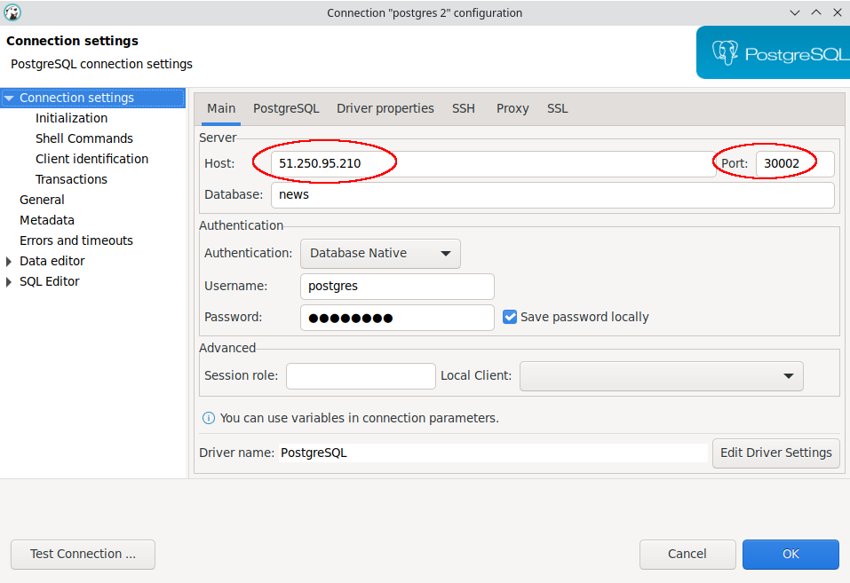
> 
> После установки подключения SQL-клиент позволяет просматривать и изменять содержимое БД.
> Например, содержимое таблицы "news" нашего приложения:
> 
> 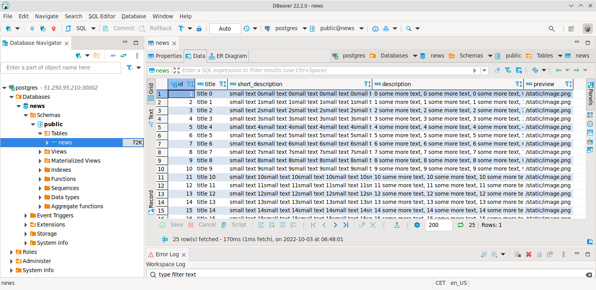

Таким образом мы запустили наше приложение в облачной среде под управлением Kubernetes.

---

## Задание 2: подготовить конфиг для production окружения

Следующим шагом будет запуск приложения в production окружении. Требования сложнее:
* каждый компонент (база, бекенд, фронтенд) запускаются в своем поде, регулируются отдельными deployment’ами;
* для связи используются service (у каждого компонента свой);
* в окружении фронта прописан адрес сервиса бекенда;
* в окружении бекенда прописан адрес сервиса базы данных.

---

### Решение:

Мы всё уже сделали в Задании №1, убедимся еще раз.

У каждого компонента существует свой отдельный деплоймент, к нему же прилагается соответствующий сервис:
- [база данных](./infrastructure/playbooks/templates/deploy-pg.yaml);
- [бекенд](./infrastructure/playbooks/templates/deploy-backend.yaml);
- [фронтенд](./infrastructure/playbooks/templates/deploy-frontend.yaml).

Адрес сервиса бэкенда задан в переменной окружения фронта [BASE_URL](../13-kubernetes-config/frontend/.env): 
````bash
BASE_URL=http://51.250.95.210:30001
````
Адрес сервиса базы данных задан в переменной окружения бэкенда [DATABASE_URL](../13-kubernetes-config/backend/.env):
````bash
DATABASE_URL=postgres://postgres:postgres@db:5432/news
````

Таким образом, как уже отмечалось, приложение запущено и работает:


Имея следующий набор работающих компонентов Kubernetes-кластера:
````bash
Every 2,0s: kubectl get all,pvc,pv -o wide --show-labels

NAME                            READY   STATUS    RESTARTS   AGE    IP               NODE    NOMINATED NODE   READINESS GATES   LABELS
pod/frontend-77cf7cf479-28flz   1/1     Running   0          93m    10.200.104.5     node2   <none>           <none>            app=web-news,component=frontend,pod-template-hash=77cf7cf479
pod/frontend-77cf7cf479-lmf9h   1/1     Running   0          93m    10.200.166.133   node1   <none>           <none>            app=web-news,component=frontend,pod-template-hash=77cf7cf479
pod/backend-76b5c84476-rtzfq    1/1     Running   0          100m   10.200.104.3     node2   <none>           <none>            app=web-news,component=backend,pod-template-hash=76b5c84476
pod/backend-76b5c84476-vjj2m    1/1     Running   0          100m   10.200.166.131   node1   <none>           <none>            app=web-news,component=backend,pod-template-hash=76b5c84476
pod/postgres-sts-0              1/1     Running   0          100m   10.200.104.2     node2   <none>           <none>            app=web-news,component=dbase,controller-revision-hash=postgres-sts-648d94455f,statefulset.kubernetes.io/pod-name=postgres-sts-0

NAME                            TYPE        CLUSTER-IP     EXTERNAL-IP   PORT(S)          AGE    SELECTOR                          LABELS
service/frontend-nodeport-svc   NodePort    10.32.90.224   <none>        80:30000/TCP     100m   app=web-news,component=frontend   app=web-news,component=frontend
service/backend-nodeport-svc    NodePort    10.32.222.86   <none>        9000:30001/TCP   100m   app=web-news,component=backend    app=web-news,component=backend
service/db                      NodePort    10.32.74.95    <none>        5432:30002/TCP   100m   app=web-news,component=dbase      app=web-news,component=dbase
service/kubernetes              ClusterIP   10.32.0.1      <none>        443/TCP          107m   <none>                            component=apiserver,provider=kubernetes

NAME                       READY   UP-TO-DATE   AVAILABLE   AGE    CONTAINERS   IMAGES                        SELECTOR                          LABELS
deployment.apps/frontend   2/2     2            2           100m   frontend     olezhuravlev/frontend:1.0.0   app=web-news,component=frontend   app=web-news,component=frontend
deployment.apps/backend    2/2     2            2           100m   backend      olezhuravlev/backend:1.0.0    app=web-news,component=backend    app=web-news,component=backend

NAME                                  DESIRED   CURRENT   READY   AGE    CONTAINERS   IMAGES                        SELECTOR                                                       LABELS
replicaset.apps/frontend-757fc9f598   0         0         0       100m   frontend     olezhuravlev/frontend:1.0.1   app=web-news,component=frontend,pod-template-hash=757fc9f598   app=web-news,component=frontend,pod-template-hash=757fc9f598
replicaset.apps/frontend-77cf7cf479   2         2         2       93m    frontend     olezhuravlev/frontend:1.0.0   app=web-news,component=frontend,pod-template-hash=77cf7cf479   app=web-news,component=frontend,pod-template-hash=77cf7cf479
replicaset.apps/backend-76b5c84476    2         2         2       100m   backend      olezhuravlev/backend:1.0.0    app=web-news,component=backend,pod-template-hash=76b5c84476    app=web-news,component=backend,pod-template-hash=76b5c84476

NAME                            READY   AGE    CONTAINERS   IMAGES               LABELS
statefulset.apps/postgres-sts   1/1     100m   postgres     postgres:13-alpine   app=web-news,component=dbase

NAME                                                   STATUS   VOLUME                  CAPACITY   ACCESS MODES   STORAGECLASS   AGE    VOLUMEMODE   LABELS
persistentvolumeclaim/postgres-volume-postgres-sts-0   Bound    persistent-volume-1gb   1Gi        RWO                           100m   Filesystem   app=web-news,component=dbase

NAME                                     CAPACITY   ACCESS MODES   RECLAIM POLICY   STATUS   CLAIM                                    STORAGECLASS   REASON   AGE    VOLUMEMODE   LABELS
persistentvolume/persistent-volume-1gb   1Gi        RWO            Retain           Bound    default/postgres-volume-postgres-sts-0                           100m   Filesystem   app=web-news,component=dbase
````

---

## Задание 3 (*): добавить endpoint на внешний ресурс api
Приложению потребовалось внешнее api, и для его использования лучше добавить endpoint в кластер, направленный
на это api. Требования:
* добавлен endpoint до внешнего api (например, геокодер).

---

### Решение:

Для обращения к внешним API можно использовать как их доменные имена, так и IP-адреса.

#### Обращение сервиса к внешнему API по его доменному имени

Для обращение через доменное имя достаточно создать [сервис типа ExternalName](./infrastructure/playbooks/templates/ep-domain-name.ansible.yaml), указав требуемое доменное имя:
````yaml
apiVersion: v1
kind: Service
metadata:
  name: my-external
spec:
  type: ExternalName
  externalName: ipwho.is
````

Будет создан сервис типа "ExternalName" со значением `EXTERNAL-IP` равным `ipwho.is`: 
````bash
ubuntu@cp1:~$ kubectl get svc -o wide
NAME                    TYPE           CLUSTER-IP     EXTERNAL-IP   PORT(S)          AGE   SELECTOR
my-external             ExternalName   <none>         ipwho.is      <none>           10m   <none>
...
````

После этого можно **из подов** обращаться к внешнему сервису используя имя Kubenetes-сервиса.

> Для проверки работоспособности будем обращаться к внешнему для нас сервису "ipwho.is", возвращающему информацию о
> домене по его IP-адресу, переданному в составе GET-запроса.

Залогинимся в один из подов и запросим через наш Kubernetes-сервис с именем "my-external" данные, например, о домене
с малоизвестным IP-адресом `8.8.8.8`:
````bash
ubuntu@cp1:~$ kubectl exec --stdin --tty pod/frontend-77cf7cf479-lmf9h -- bash
root@frontend-77cf7cf479-lmf9h:/app# curl -H "Host: ipwho.is" "http://my-external/8.8.8.8"
{
    "ip":"8.8.8.8",
    "success":true,
    "type":"IPv4",
    "continent":"North America",
    "continent_code":"NA",
    "country":"United States",
    "country_code":"US",
    "region":"California",
    "region_code":"CA",
    "city":"Mountain View",
    "latitude":37.3860517,
    "longitude":-122.0838511,
    "is_eu":false,
    "postal":"94039",
    "calling_code":"1",
    "capital":"Washington D.C.",
    "borders":"CA,MX",
    "flag":{
      "img":"https:\/\/cdn.ipwhois.io\/flags\/us.svg",
      "emoji":"\ud83c\uddfa\ud83c\uddf8",
      "emoji_unicode":"U+1F1FA U+1F1F8"
    },
    "connection":{
      "asn":15169,
      "org":"Google LLC",
      "isp":"Google LLC",
      "domain":"google.com"
    },
    "timezone":{
      "id":"America\/Los_Angeles",
      "abbr":"PDT",
      "is_dst":true,
      "offset":-25200,
      "utc":"-07:00",
      "current_time":"2022-10-03T23:21:43-07:00"
    }
} 
````

> **Передавать заголовок "Host: ipwho.is" в запросе необходимо**, потому что в противном случае сервис не возвращает
> результат. По-видимому, это связано с внутренней
> [организацией сервиса на виртуальном хостинге](https://en.wikipedia.org/wiki/List_of_HTTP_header_fields).


#### Обращение к внешнему API по его IP-адресу

Для обращения на внешний IP-адрес стороннего сервиса нужно создать
[headless-сервис и Endpoint](./infrastructure/playbooks/templates/ep-ip.ansible.yaml) к нему:

````yaml
apiVersion: v1
kind: Service
metadata:
  name: my-external-ip
spec:
  type: ClusterIP
  clusterIP: None
  ports:
  - port: 8111
---
apiVersion: v1
kind: Endpoints
metadata:
  name: my-external-ip
subsets:
  - addresses:
    - ip: 45.35.72.106 # IP of ipwho.is
````

Будет создан сервис типа "ClusterIP" с пустым значением `CLUSTER-IP`,
а также Endpoint со значением `ENDPOINTS` равным указанному внешнему IP-адресу (`45.35.72.106`):
````bash
ubuntu@cp1:~$ kubectl get svc -o wide
NAME                    TYPE           CLUSTER-IP     EXTERNAL-IP   PORT(S)          AGE   SELECTOR
my-external-ip          ClusterIP      None           <none>        8111/TCP         13m   <none>
...

ubuntu@cp1:~$ kubectl get ep -o wide
NAME                    ENDPOINTS                               AGE
my-external-ip          45.35.72.106                            13m
...
````

После этого можно **из подов** обращаться к внешнему сервису используя имя Kubenetes-сервиса.

Залогинимся в один из подов и запросим через наш Kubernetes-сервис с именем "my-external-ip" данные, например, о домене
с IP-адресом `9.9.9.9`:
````bash
ubuntu@cp1:~$ kubectl exec --stdin --tty service/frontend-nodeport-svc -- bash
root@frontend-77cf7cf479-lmf9h:/app# curl -H "Host: ipwho.is" "http://my-external-ip/9.9.9.9"
{
  "ip":"9.9.9.9",
  "success":true,
  "type":"IPv4",
  "continent":"Europe",
  "continent_code":"EU",
  "country":"Switzerland",
  "country_code":"CH",
  "region":"Zurich",
  "region_code":"ZH",
  "city":"Z\u00fcrich",
  "latitude":47.3768866,
  "longitude":8.541694,
  "is_eu":false,
  "postal":"8001",
  "calling_code":"41",
  "capital":"Bern",
  "borders":"AT,DE,FR,IT,LI",
  "flag":{
    "img":"https:\/\/cdn.ipwhois.io\/flags\/ch.svg","emoji":"\ud83c\udde8\ud83c\udded",
    "emoji_unicode":"U+1F1E8 U+1F1ED"
  },
  "connection":{
    "asn":19281,
    "org":"Quad9",
    "isp":"Quad9",
    "domain":"beaconfed.org"
  },
  "timezone":{
    "id":"Europe\/Zurich",
    "abbr":"CEST",
    "is_dst":true,
    "offset":7200,
    "utc":"+02:00",
    "current_time":"2022-10-04T09:00:44+02:00"
  }
} 
````

Таким образом, самостоятельно создаваемые Endpoints позволяют нам конфигурировать доступ к внешним ресурсам не
изменяя внутренней связности компонентов Kubernetes-кластера.

---

<details>
  <summary>Приложение 1 - Лекция</summary>

### Pods (сокращенно - pod, po)

````bash
$ kubectl apply -f /run/media/oleg/Second/Netology/devkub-homeworks/13-kubernetes-config-01-objects/manifests/10-pod/10-pod.yaml
pod/nginx created
````

````bash
$ kubectl get pods --sort-by .spec.nodeName --show-labels
NAME    READY   STATUS    RESTARTS   AGE   LABELS
nginx   1/1     Running   0          97s   app=nginx
````

````bash
$ kubectl get pods nginx -o yaml
apiVersion: v1
kind: Pod
metadata:
  annotations:
    cni.projectcalico.org/containerID: ded7136c3a60c78c45379fcd545fc4257861e8610c7557b1216041fcdaeb910a
    cni.projectcalico.org/podIP: 10.200.166.130/32
    cni.projectcalico.org/podIPs: 10.200.166.130/32
    kubectl.kubernetes.io/last-applied-configuration: |
      {"apiVersion":"v1","kind":"Pod","metadata":{"annotations":{},"labels":{"app":"nginx"},"name":"nginx","namespace":"default"},"spec":{"containers":[{"image":"nginx:1.20","imagePullPolicy":"IfNotPresent","name":"nginx"}]}}
  creationTimestamp: "2022-09-25T14:26:48Z"
  labels:
    app: nginx
  name: nginx
  namespace: default
  resourceVersion: "2791"
  uid: e77050a5-2775-42dc-9fd5-dbae2a704344
spec:
  containers:
  - image: nginx:1.20
    imagePullPolicy: IfNotPresent
    name: nginx
    resources: {}
    terminationMessagePath: /dev/termination-log
    terminationMessagePolicy: File
    volumeMounts:
    - mountPath: /var/run/secrets/kubernetes.io/serviceaccount
      name: kube-api-access-h7lxg
      readOnly: true
  dnsPolicy: ClusterFirst
  enableServiceLinks: true
  nodeName: node1
  preemptionPolicy: PreemptLowerPriority
  priority: 0
  restartPolicy: Always
  schedulerName: default-scheduler
  securityContext: {}
  serviceAccount: default
  serviceAccountName: default
  terminationGracePeriodSeconds: 30
  tolerations:
  - effect: NoExecute
    key: node.kubernetes.io/not-ready
    operator: Exists
    tolerationSeconds: 300
  - effect: NoExecute
    key: node.kubernetes.io/unreachable
    operator: Exists
    tolerationSeconds: 300
  volumes:
  - name: kube-api-access-h7lxg
    projected:
      defaultMode: 420
      sources:
      - serviceAccountToken:
          expirationSeconds: 3607
          path: token
      - configMap:
          items:
          - key: ca.crt
            path: ca.crt
          name: kube-root-ca.crt
      - downwardAPI:
          items:
          - fieldRef:
              apiVersion: v1
              fieldPath: metadata.namespace
            path: namespace
status:
  conditions:
  - lastProbeTime: null
    lastTransitionTime: "2022-09-25T14:26:48Z"
    status: "True"
    type: Initialized
  - lastProbeTime: null
    lastTransitionTime: "2022-09-25T14:26:58Z"
    status: "True"
    type: Ready
  - lastProbeTime: null
    lastTransitionTime: "2022-09-25T14:26:58Z"
    status: "True"
    type: ContainersReady
  - lastProbeTime: null
    lastTransitionTime: "2022-09-25T14:26:48Z"
    status: "True"
    type: PodScheduled
  containerStatuses:
  - containerID: containerd://32b2b5b872d939b94d01545d2751eec35866cbfc9de8cab6533662d3cdb7eaf0
    image: docker.io/library/nginx:1.20
    imageID: docker.io/library/nginx@sha256:38f8c1d9613f3f42e7969c3b1dd5c3277e635d4576713e6453c6193e66270a6d
    lastState: {}
    name: nginx
    ready: true
    restartCount: 0
    started: true
    state:
      running:
        startedAt: "2022-09-25T14:26:57Z"
  hostIP: 10.240.0.21
  phase: Running
  podIP: 10.200.166.130
  podIPs:
  - ip: 10.200.166.130
  qosClass: BestEffort
  startTime: "2022-09-25T14:26:48Z"
````

````bash
$ kubectl describe pods nginx
Name:         nginx
Namespace:    default
Priority:     0
Node:         node1/10.240.0.21
Start Time:   Sun, 25 Sep 2022 16:26:48 +0200
Labels:       app=nginx
Annotations:  cni.projectcalico.org/containerID: ded7136c3a60c78c45379fcd545fc4257861e8610c7557b1216041fcdaeb910a
              cni.projectcalico.org/podIP: 10.200.166.130/32
              cni.projectcalico.org/podIPs: 10.200.166.130/32
Status:       Running
IP:           10.200.166.130
IPs:
  IP:  10.200.166.130
Containers:
  nginx:
    Container ID:   containerd://32b2b5b872d939b94d01545d2751eec35866cbfc9de8cab6533662d3cdb7eaf0
    Image:          nginx:1.20
    Image ID:       docker.io/library/nginx@sha256:38f8c1d9613f3f42e7969c3b1dd5c3277e635d4576713e6453c6193e66270a6d
    Port:           <none>
    Host Port:      <none>
    State:          Running
      Started:      Sun, 25 Sep 2022 16:26:57 +0200
    Ready:          True
    Restart Count:  0
    Environment:    <none>
    Mounts:
      /var/run/secrets/kubernetes.io/serviceaccount from kube-api-access-h7lxg (ro)
Conditions:
  Type              Status
  Initialized       True 
  Ready             True 
  ContainersReady   True 
  PodScheduled      True 
Volumes:
  kube-api-access-h7lxg:
    Type:                    Projected (a volume that contains injected data from multiple sources)
    TokenExpirationSeconds:  3607
    ConfigMapName:           kube-root-ca.crt
    ConfigMapOptional:       <nil>
    DownwardAPI:             true
QoS Class:                   BestEffort
Node-Selectors:              <none>
Tolerations:                 node.kubernetes.io/not-ready:NoExecute op=Exists for 300s
                             node.kubernetes.io/unreachable:NoExecute op=Exists for 300s
Events:
  Type    Reason     Age    From               Message
  ----    ------     ----   ----               -------
  Normal  Scheduled  2m16s  default-scheduler  Successfully assigned default/nginx to node1
  Normal  Pulling    2m15s  kubelet            Pulling image "nginx:1.20"
  Normal  Pulled     2m7s   kubelet            Successfully pulled image "nginx:1.20" in 8.198030843s
  Normal  Created    2m7s   kubelet            Created container nginx
  Normal  Started    2m7s   kubelet            Started container nginx
````

````bash
$ kubectl describe pods nginx | grep "^IP:"
IP:           10.200.166.130
````

````bash
$ kubectl get svc                           
NAME         TYPE        CLUSTER-IP   EXTERNAL-IP   PORT(S)   AGE
kubernetes   ClusterIP   10.32.0.1    <none>        443/TCP   21m
````

````bash
$ kubectl apply -f /run/media/oleg/Second/Netology/devkub-homeworks/13-kubernetes-config-01-objects/manifests/10-pod/30-pod-with-error.yaml
pod/pod-with-error created
````

````bash
$ kubectl describe pod pod-with-error
Name:         pod-with-error
Namespace:    default
Priority:     0
Node:         node2/10.240.0.22
Start Time:   Sun, 25 Sep 2022 16:34:20 +0200
Labels:       app=pod-with-error
Annotations:  cni.projectcalico.org/containerID: 1ee01e627d15a06fa458fc209d598b648d162c86c9c4d11690baaf61366a6bed
              cni.projectcalico.org/podIP: 10.200.104.3/32
              cni.projectcalico.org/podIPs: 10.200.104.3/32
Status:       Running
IP:           10.200.104.3
IPs:
  IP:  10.200.104.3
Containers:
  nginx:
    Container ID:   containerd://1e9a98eb08eecc886ccaf83366b621b5b0e95e02081d7b3e62d49ae28b327239
    Image:          nginx:1.20
    Image ID:       docker.io/library/nginx@sha256:38f8c1d9613f3f42e7969c3b1dd5c3277e635d4576713e6453c6193e66270a6d
    Port:           <none>
    Host Port:      <none>
    State:          Running
      Started:      Sun, 25 Sep 2022 16:34:30 +0200
    Ready:          True
    Restart Count:  0
    Environment:    <none>
    Mounts:
      /var/run/secrets/kubernetes.io/serviceaccount from kube-api-access-2zjsg (ro)
  multitool:
    Container ID:   containerd://9cd73d9f77f61422a5efc5a661d90f82fddf428ffce72d87355eab1e9d6b25cd
    Image:          praqma/network-multitool:alpine-extra
    Image ID:       docker.io/praqma/network-multitool@sha256:5662f8284f0dc5f5e5c966e054d094cbb6d0774e422ad9031690826bc43753e5
    Port:           <none>
    Host Port:      <none>
    State:          Waiting
      Reason:       CrashLoopBackOff
    Last State:     Terminated
      Reason:       Error
      Exit Code:    1
      Started:      Sun, 25 Sep 2022 16:45:51 +0200
      Finished:     Sun, 25 Sep 2022 16:45:53 +0200
    Ready:          False
    Restart Count:  7
    Environment:    <none>
    Mounts:
      /var/run/secrets/kubernetes.io/serviceaccount from kube-api-access-2zjsg (ro)
Conditions:
  Type              Status
  Initialized       True 
  Ready             False 
  ContainersReady   False 
  PodScheduled      True 
Volumes:
  kube-api-access-2zjsg:
    Type:                    Projected (a volume that contains injected data from multiple sources)
    TokenExpirationSeconds:  3607
    ConfigMapName:           kube-root-ca.crt
    ConfigMapOptional:       <nil>
    DownwardAPI:             true
QoS Class:                   BestEffort
Node-Selectors:              <none>
Tolerations:                 node.kubernetes.io/not-ready:NoExecute op=Exists for 300s
                             node.kubernetes.io/unreachable:NoExecute op=Exists for 300s
Events:
  Type     Reason     Age                   From               Message
  ----     ------     ----                  ----               -------
  Normal   Scheduled  13m                   default-scheduler  Successfully assigned default/pod-with-error to node2
  Normal   Pulling    13m                   kubelet            Pulling image "nginx:1.20"
  Normal   Pulled     13m                   kubelet            Successfully pulled image "nginx:1.20" in 8.608466407s
  Normal   Created    13m                   kubelet            Created container nginx
  Normal   Started    13m                   kubelet            Started container nginx
  Normal   Pulling    13m                   kubelet            Pulling image "praqma/network-multitool:alpine-extra"
  Normal   Pulled     13m                   kubelet            Successfully pulled image "praqma/network-multitool:alpine-extra" in 11.182904968s
  Normal   Created    12m (x4 over 13m)     kubelet            Created container multitool
  Normal   Started    12m (x4 over 13m)     kubelet            Started container multitool
  Normal   Pulled     11m (x4 over 13m)     kubelet            Container image "praqma/network-multitool:alpine-extra" already present on machine
  Warning  BackOff    3m49s (x45 over 13m)  kubelet            Back-off restarting failed container
````

````bash
$ kubectl get pod pod-with-error -o yaml
apiVersion: v1
kind: Pod
metadata:
  annotations:
    cni.projectcalico.org/containerID: 1ee01e627d15a06fa458fc209d598b648d162c86c9c4d11690baaf61366a6bed
    cni.projectcalico.org/podIP: 10.200.104.3/32
    cni.projectcalico.org/podIPs: 10.200.104.3/32
    kubectl.kubernetes.io/last-applied-configuration: |
      {"apiVersion":"v1","kind":"Pod","metadata":{"annotations":{},"labels":{"app":"pod-with-error"},"name":"pod-with-error","namespace":"default"},"spec":{"containers":[{"image":"nginx:1.20","imagePullPolicy":"IfNotPresent","name":"nginx"},{"image":"praqma/network-multitool:alpine-extra","imagePullPolicy":"IfNotPresent","name":"multitool"}]}}
  creationTimestamp: "2022-09-25T14:34:20Z"
  labels:
    app: pod-with-error
  name: pod-with-error
  namespace: default
  resourceVersion: "5818"
  uid: b7b89c64-57ee-47bd-aed6-3408bd2715b2
spec:
  containers:
  - image: nginx:1.20
    imagePullPolicy: IfNotPresent
    name: nginx
    resources: {}
    terminationMessagePath: /dev/termination-log
    terminationMessagePolicy: File
    volumeMounts:
    - mountPath: /var/run/secrets/kubernetes.io/serviceaccount
      name: kube-api-access-2zjsg
      readOnly: true
  - image: praqma/network-multitool:alpine-extra
    imagePullPolicy: IfNotPresent
    name: multitool
    resources: {}
    terminationMessagePath: /dev/termination-log
    terminationMessagePolicy: File
    volumeMounts:
    - mountPath: /var/run/secrets/kubernetes.io/serviceaccount
      name: kube-api-access-2zjsg
      readOnly: true
  dnsPolicy: ClusterFirst
  enableServiceLinks: true
  nodeName: node2
  preemptionPolicy: PreemptLowerPriority
  priority: 0
  restartPolicy: Always
  schedulerName: default-scheduler
  securityContext: {}
  serviceAccount: default
  serviceAccountName: default
  terminationGracePeriodSeconds: 30
  tolerations:
  - effect: NoExecute
    key: node.kubernetes.io/not-ready
    operator: Exists
    tolerationSeconds: 300
  - effect: NoExecute
    key: node.kubernetes.io/unreachable
    operator: Exists
    tolerationSeconds: 300
  volumes:
  - name: kube-api-access-2zjsg
    projected:
      defaultMode: 420
      sources:
      - serviceAccountToken:
          expirationSeconds: 3607
          path: token
      - configMap:
          items:
          - key: ca.crt
            path: ca.crt
          name: kube-root-ca.crt
      - downwardAPI:
          items:
          - fieldRef:
              apiVersion: v1
              fieldPath: metadata.namespace
            path: namespace
status:
  conditions:
  - lastProbeTime: null
    lastTransitionTime: "2022-09-25T14:34:20Z"
    status: "True"
    type: Initialized
  - lastProbeTime: null
    lastTransitionTime: "2022-09-25T14:56:07Z"
    message: 'containers with unready status: [multitool]'
    reason: ContainersNotReady
    status: "False"
    type: Ready
  - lastProbeTime: null
    lastTransitionTime: "2022-09-25T14:56:07Z"
    message: 'containers with unready status: [multitool]'
    reason: ContainersNotReady
    status: "False"
    type: ContainersReady
  - lastProbeTime: null
    lastTransitionTime: "2022-09-25T14:34:20Z"
    status: "True"
    type: PodScheduled
  containerStatuses:
  - containerID: containerd://5267540f34c8ee56c9e8b361be934063b98a710c8cd480cc442bbd3e620fb6f3
    image: docker.io/praqma/network-multitool:alpine-extra
    imageID: docker.io/praqma/network-multitool@sha256:5662f8284f0dc5f5e5c966e054d094cbb6d0774e422ad9031690826bc43753e5
    lastState:
      terminated:
        containerID: containerd://5267540f34c8ee56c9e8b361be934063b98a710c8cd480cc442bbd3e620fb6f3
        exitCode: 1
        finishedAt: "2022-09-25T14:56:06Z"
        reason: Error
        startedAt: "2022-09-25T14:56:04Z"
    name: multitool
    ready: false
    restartCount: 9
    started: false
    state:
      waiting:
        message: back-off 5m0s restarting failed container=multitool pod=pod-with-error_default(b7b89c64-57ee-47bd-aed6-3408bd2715b2)
        reason: CrashLoopBackOff
  - containerID: containerd://1e9a98eb08eecc886ccaf83366b621b5b0e95e02081d7b3e62d49ae28b327239
    image: docker.io/library/nginx:1.20
    imageID: docker.io/library/nginx@sha256:38f8c1d9613f3f42e7969c3b1dd5c3277e635d4576713e6453c6193e66270a6d
    lastState: {}
    name: nginx
    ready: true
    restartCount: 0
    started: true
    state:
      running:
        startedAt: "2022-09-25T14:34:30Z"
  hostIP: 10.240.0.22
  phase: Running
  podIP: 10.200.104.3
  podIPs:
  - ip: 10.200.104.3
  qosClass: BestEffort
  startTime: "2022-09-25T14:34:20Z"
````

Логи всего пода:
````bash
$ kubectl logs -f pod-with-error
Defaulted container "nginx" out of: nginx, multitool
/docker-entrypoint.sh: /docker-entrypoint.d/ is not empty, will attempt to perform configuration
/docker-entrypoint.sh: Looking for shell scripts in /docker-entrypoint.d/
/docker-entrypoint.sh: Launching /docker-entrypoint.d/10-listen-on-ipv6-by-default.sh
10-listen-on-ipv6-by-default.sh: info: Getting the checksum of /etc/nginx/conf.d/default.conf
10-listen-on-ipv6-by-default.sh: info: Enabled listen on IPv6 in /etc/nginx/conf.d/default.conf
/docker-entrypoint.sh: Launching /docker-entrypoint.d/20-envsubst-on-templates.sh
/docker-entrypoint.sh: Launching /docker-entrypoint.d/30-tune-worker-processes.sh
/docker-entrypoint.sh: Configuration complete; ready for start up
2022/09/25 14:34:30 [notice] 1#1: using the "epoll" event method
2022/09/25 14:34:30 [notice] 1#1: nginx/1.20.2
2022/09/25 14:34:30 [notice] 1#1: built by gcc 10.2.1 20210110 (Debian 10.2.1-6) 
2022/09/25 14:34:30 [notice] 1#1: OS: Linux 5.4.0-124-generic
2022/09/25 14:34:30 [notice] 1#1: getrlimit(RLIMIT_NOFILE): 1048576:1048576
2022/09/25 14:34:30 [notice] 1#1: start worker processes
2022/09/25 14:34:30 [notice] 1#1: start worker process 31
2022/09/25 14:34:30 [notice] 1#1: start worker process 32
````

Логи контейнера "nginx" в поде:
````bash
$ kubectl logs -f pod-with-error -c nginx
/docker-entrypoint.sh: /docker-entrypoint.d/ is not empty, will attempt to perform configuration
/docker-entrypoint.sh: Looking for shell scripts in /docker-entrypoint.d/
/docker-entrypoint.sh: Launching /docker-entrypoint.d/10-listen-on-ipv6-by-default.sh
10-listen-on-ipv6-by-default.sh: info: Getting the checksum of /etc/nginx/conf.d/default.conf
10-listen-on-ipv6-by-default.sh: info: Enabled listen on IPv6 in /etc/nginx/conf.d/default.conf
/docker-entrypoint.sh: Launching /docker-entrypoint.d/20-envsubst-on-templates.sh
/docker-entrypoint.sh: Launching /docker-entrypoint.d/30-tune-worker-processes.sh
/docker-entrypoint.sh: Configuration complete; ready for start up
2022/09/25 14:34:30 [notice] 1#1: using the "epoll" event method
2022/09/25 14:34:30 [notice] 1#1: nginx/1.20.2
2022/09/25 14:34:30 [notice] 1#1: built by gcc 10.2.1 20210110 (Debian 10.2.1-6) 
2022/09/25 14:34:30 [notice] 1#1: OS: Linux 5.4.0-124-generic
2022/09/25 14:34:30 [notice] 1#1: getrlimit(RLIMIT_NOFILE): 1048576:1048576
2022/09/25 14:34:30 [notice] 1#1: start worker processes
2022/09/25 14:34:30 [notice] 1#1: start worker process 31
2022/09/25 14:34:30 [notice] 1#1: start worker process 32
````

Логи контейнера "multitool" в поде:
````bash
$ kubectl logs -f pod-with-error -c multitool 
The directory /usr/share/nginx/html is not mounted.
Over-writing the default index.html file with some useful information.
2022/09/25 15:06:24 [emerg] 1#1: bind() to 0.0.0.0:80 failed (98: Address in use)
nginx: [emerg] bind() to 0.0.0.0:80 failed (98: Address in use)
2022/09/25 15:06:24 [emerg] 1#1: bind() to 0.0.0.0:80 failed (98: Address in use)
nginx: [emerg] bind() to 0.0.0.0:80 failed (98: Address in use)
2022/09/25 15:06:24 [emerg] 1#1: bind() to 0.0.0.0:80 failed (98: Address in use)
nginx: [emerg] bind() to 0.0.0.0:80 failed (98: Address in use)
2022/09/25 15:06:24 [emerg] 1#1: bind() to 0.0.0.0:80 failed (98: Address in use)
nginx: [emerg] bind() to 0.0.0.0:80 failed (98: Address in use)
2022/09/25 15:06:24 [emerg] 1#1: bind() to 0.0.0.0:80 failed (98: Address in use)
nginx: [emerg] bind() to 0.0.0.0:80 failed (98: Address in use)
2022/09/25 15:06:24 [emerg] 1#1: still could not bind()
nginx: [emerg] still could not bind()
````

Т.к. контейнеры внутри пода делять один и тот-же адрес, то привязка к 80 порту не удалась - он уже занят
работающим экземпляром "nginx".

Применяем деплоймент с назначенным незанятым портом `8080`:
````bash
$ kubectl apply -f /run/media/oleg/Second/Netology/devkub-homeworks/13-kubernetes-config-01-objects/manifests/10-pod/40-pod-wo-errors.yaml
pod/pod-wo-errors created
````

А конфликтующие поды удаляем:
````bash
$ kubectl delete pod nginx pod-with-error                                                                                                         
pod "nginx" deleted
pod "pod-with-error" deleted
````

Обращение из контейнера multitool к контейнеру nginx внутри одного пода
(в контейнере "multitool" запускаем `curl -s` и обращаемся к `localhost`):
````html
$ kubectl exec -c multitool pod-wo-errors -- curl -s localhost     
<!DOCTYPE html>
<html>
<head>
<title>Welcome to nginx!</title>
<style>
    body {
        width: 35em;
        margin: 0 auto;
        font-family: Tahoma, Verdana, Arial, sans-serif;
    }
</style>
</head>
<body>
<h1>Welcome to nginx!</h1>
<p>If you see this page, the nginx web server is successfully installed and
working. Further configuration is required.</p>

<p>For online documentation and support please refer to
<a href="http://nginx.org/">nginx.org</a>.<br/>
Commercial support is available at
<a href="http://nginx.com/">nginx.com</a>.</p>

<p><em>Thank you for using nginx.</em></p>
</body>
</html>
````

Обращение из контейнера multitool к самому себе внутри одного пода
````bash
$ kubectl exec -c multitool pod-wo-errors -- curl -s localhost:8080
Praqma Network MultiTool (with NGINX) - pod-wo-errors - 10.200.166.131
````

---

### Deployments (сокращенно - deployment, deploy), Replicasets (сокращенно - replicaset, rs)

````bash
$ kubectl get deploy -A -o wide 
NAMESPACE     NAME             READY   UP-TO-DATE   AVAILABLE   AGE   CONTAINERS   IMAGES                                                            SELECTOR
kube-system   coredns          2/2     2            2           90m   coredns      registry.k8s.io/coredns/coredns:v1.8.6                            k8s-app=kube-dns
kube-system   dns-autoscaler   1/1     1            1           90m   autoscaler   registry.k8s.io/cpa/cluster-proportional-autoscaler-amd64:1.8.5   k8s-app=dns-autoscaler
````

````bash
$ kubectl get rs -A -o wide --show-labels
NAMESPACE     NAME                        DESIRED   CURRENT   READY   AGE   CONTAINERS   IMAGES                                                            SELECTOR                                              LABELS
kube-system   coredns-74d6c5659f          2         2         2       90m   coredns      registry.k8s.io/coredns/coredns:v1.8.6                            k8s-app=kube-dns,pod-template-hash=74d6c5659f         k8s-app=kube-dns,pod-template-hash=74d6c5659f
kube-system   dns-autoscaler-59b8867c86   1         1         1       90m   autoscaler   registry.k8s.io/cpa/cluster-proportional-autoscaler-amd64:1.8.5   k8s-app=dns-autoscaler,pod-template-hash=59b8867c86   k8s-app=dns-autoscaler,pod-template-hash=59b8867c86
````

````bash
$ kubectl apply -f /run/media/oleg/Second/Netology/devkub-homeworks/13-kubernetes-config-01-objects/manifests/20-deployment/10-multitool.yaml
deployment.apps/multitool created
````

````bash
$ kubectl get pods
NAME                         READY   STATUS    RESTARTS   AGE
multitool-646475c984-xfk4z   1/1     Running   0          2m15s
pod-wo-errors                2/2     Running   0          31m
````

````bash
$ kubectl get deployments -o wide --show-labels
NAME        READY   UP-TO-DATE   AVAILABLE   AGE     CONTAINERS          IMAGES                                  SELECTOR        LABELS
multitool   1/1     1            1           3m31s   network-multitool   praqma/network-multitool:alpine-extra   app=multitool   app=multitool
````

````bash
$ kubectl get rs -o wide
NAMESPACE   NAME                   DESIRED   CURRENT   READY   AGE     CONTAINERS          IMAGES                                  SELECTOR
default     multitool-646475c984   1         1         1       4m39s   network-multitool   praqma/network-multitool:alpine-extra   app=multitool,pod-template-hash=646475c984
````

````bash
$ kubectl apply -f /run/media/oleg/Second/Netology/devkub-homeworks/13-kubernetes-config-01-objects/manifests/20-deployment/20-multitool-nginx.yaml
deployment.apps/multitool configured
````
(т.к. имена совпадают, то существующий деплоймент заместится новым).


````bash
$ kubectl get rs -o wide
NAME                   DESIRED   CURRENT   READY   AGE     CONTAINERS          IMAGES                                             SELECTOR
multitool-646475c984   0         0         0       9m26s   network-multitool   praqma/network-multitool:alpine-extra              app=multitool,pod-template-hash=646475c984
multitool-86dd874c4c   3         3         3       2m34s   nginx,multitool     nginx:1.20,praqma/network-multitool:alpine-extra   app=multitool,pod-template-hash=86dd874c4c
````

Созданы 2 новых пода:
````bash
$ kubectl get pods -o wide
NAME                         READY   STATUS    RESTARTS   AGE    IP               NODE    NOMINATED NODE   READINESS GATES
multitool-86dd874c4c-dxr9t   2/2     Running   0          7m8s   10.200.166.134   node1   <none>           <none>
multitool-86dd874c4c-fvhkb   2/2     Running   0          7m6s   10.200.104.6     node2   <none>           <none>
multitool-86dd874c4c-qsdlp   2/2     Running   0          44s    10.200.166.135   node1   <none>           <none>
pod-wo-errors                2/2     Running   0          43m    10.200.166.131   node1   <none>           <none>
````

Удалим под:
````bash
$ kubectl delete pod multitool-86dd874c4c-dxr9t
pod "multitool-86dd874c4c-dxr9t" deleted
````

Был создан новый под с другим идентификатором и IP-адресом (и даже на другой ноде):
````bash
$ kubectl get pods -o wide
NAME                         READY   STATUS    RESTARTS   AGE     IP               NODE    NOMINATED NODE   READINESS GATES
multitool-86dd874c4c-7jks5   2/2     Running   0          26s     10.200.104.7     node2   <none>           <none>
multitool-86dd874c4c-fvhkb   2/2     Running   0          8m25s   10.200.104.6     node2   <none>           <none>
multitool-86dd874c4c-qsdlp   2/2     Running   0          2m3s    10.200.166.135   node1   <none>           <none>
pod-wo-errors                2/2     Running   0          44m     10.200.166.131   node1   <none>           <none>
````

---

### StatefulSets (сокращение  - statefulSet, sts)

У deployment и StatefulSet отличаются именования созданных подов.

Для StatefulSet название пода заканчивается числом после дефиса, например `prometheus-0`.
У пода, который создан с помощью deployment (ReplicaSet), имя будет заканчиваться 5 символьным hash,
например `grafana-5c8fb4c656-69qb2`.

Манифест StatefulSet отличается от Deployment наличием секции `volumeClaimTemplates`.

````bash
$ kubectl create namespace monitoring
namespace/monitoring created
````

````bash
$ kubectl apply -f /run/media/oleg/Second/Netology/devkub-homeworks/13-kubernetes-config-01-objects/infrastructure/manifests/40-statefulset/10-prometheus-statefulset.yaml
Warning: spec.template.metadata.annotations[scheduler.alpha.kubernetes.io/critical-pod]: non-functional in v1.16+; use the "priorityClassName" field instead
statefulset.apps/prometheus created
````

### DaemonSet (сокращение  - ds)

````bash
$ kubectl get ds -A -o wide --show-labels
NAMESPACE     NAME           DESIRED   CURRENT   READY   UP-TO-DATE   AVAILABLE   NODE SELECTOR            AGE   CONTAINERS    IMAGES                                          SELECTOR               LABELS
kube-system   calico-node    3         3         3       3            3           kubernetes.io/os=linux   21h   calico-node   quay.io/calico/node:v3.23.3                     k8s-app=calico-node    k8s-app=calico-node
kube-system   kube-proxy     3         3         3       3            3           kubernetes.io/os=linux   21h   kube-proxy    registry.k8s.io/kube-proxy:v1.24.4              k8s-app=kube-proxy     k8s-app=kube-proxy
kube-system   nodelocaldns   3         3         3       3            3           kubernetes.io/os=linux   21h   node-cache    registry.k8s.io/dns/k8s-dns-node-cache:1.21.1   k8s-app=nodelocaldns   addonmanager.kubernetes.io/mode=Reconcile,k8s-app=kube-dns
````

### Services (сокращение  - service, svc)

````bash
$ kubectl get svc -A -o wide --show-labels 
NAMESPACE     NAME         TYPE        CLUSTER-IP   EXTERNAL-IP   PORT(S)                  AGE   SELECTOR           LABELS
default       kubernetes   ClusterIP   10.32.0.1    <none>        443/TCP                  22h   <none>             component=apiserver,provider=kubernetes
kube-system   coredns      ClusterIP   10.32.0.3    <none>        53/UDP,53/TCP,9153/TCP   22h   k8s-app=kube-dns   addonmanager.kubernetes.io/mode=Reconcile,k8s-app=kube-dns,kubernetes.io/name=coredns
````

````bash
$ kubectl get svc,ep -A -o wide --show-labels
NAMESPACE     NAME                 TYPE        CLUSTER-IP   EXTERNAL-IP   PORT(S)                  AGE   SELECTOR           LABELS
default       service/kubernetes   ClusterIP   10.32.0.1    <none>        443/TCP                  22h   <none>             component=apiserver,provider=kubernetes
kube-system   service/coredns      ClusterIP   10.32.0.3    <none>        53/UDP,53/TCP,9153/TCP   22h   k8s-app=kube-dns   addonmanager.kubernetes.io/mode=Reconcile,k8s-app=kube-dns,kubernetes.io/name=coredns

NAMESPACE     NAME                   ENDPOINTS                                                     AGE   LABELS
default       endpoints/kubernetes   10.240.0.11:6443                                              22h   endpointslice.kubernetes.io/skip-mirror=true
kube-system   endpoints/coredns      10.200.104.9:53,10.200.176.4:53,10.200.104.9:53 + 3 more...   22h   addonmanager.kubernetes.io/mode=Reconcile,k8s-app=kube-dns,kubernetes.io/name=coredns
````

### Типы стратегий

Делаем `replicas: 4` и применяем манифест:
````bash
$ kubectl apply -f /run/media/oleg/Second/Netology/devkub-homeworks/13-kubernetes-config-01-objects/manifests/20-deployment/20-multitool-nginx-4.yaml
deployment.apps/multitool configured
````

Реплик стало 4:
````bash
$ kubectl get pods -o wide

NAME                         READY   STATUS    RESTARTS       AGE   IP               NODE    NOMINATED NODE   READINESS GATES
multitool-86dd874c4c-7jks5   2/2     Running   2 (153m ago)   21h   10.200.104.8     node2   <none>           <none>
multitool-86dd874c4c-bd74j   2/2     Running   0              16s   10.200.166.138   node1   <none>           <none>
multitool-86dd874c4c-fvhkb   2/2     Running   2 (153m ago)   21h   10.200.104.10    node2   <none>           <none>
multitool-86dd874c4c-qsdlp   2/2     Running   2 (153m ago)   21h   10.200.166.136   node1   <none>           <none>
pod-wo-errors                2/2     Running   2 (153m ago)   22h   10.200.166.137   node1   <none>           <none>
````

Удаляем под:
````bash
$ kubectl delete po pod-wo-errors                                                                                                    
pod "pod-wo-errors" deleted
````

Под исчез:
````bash
$ kubectl get pods -o wide

NAME                         READY   STATUS    RESTARTS       AGE    IP               NODE    NOMINATED NODE   READINESS GATES
multitool-86dd874c4c-7jks5   2/2     Running   2 (155m ago)   21h    10.200.104.8     node2   <none>           <none>
multitool-86dd874c4c-bd74j   2/2     Running   0              2m2s   10.200.166.138   node1   <none>           <none>
multitool-86dd874c4c-fvhkb   2/2     Running   2 (155m ago)   21h    10.200.104.10    node2   <none>           <none>
multitool-86dd874c4c-qsdlp   2/2     Running   2 (155m ago)   21h    10.200.166.136   node1   <none>           <none>
````

Меняем версию контейнера nginx c `1.20` на `1.19` и задаем стратегию обновления:
````yaml
strategy:
  type: RollingUpdate
  rollingUpdate:
    maxSurge: 25%
    maxUnavailable: 25%
````

Применяем манифест:
````bash
$ kubectl apply -f /run/media/oleg/Second/Netology/devkub-homeworks/13-kubernetes-config-01-objects/manifests/20-deployment/20-multitool-nginx-4-25.yaml
deployment.apps/multitool configured
````

Контейнеры постепенно обновились, при этом количество одновременно неработающих контейнеров не превышало 25%, как и
задано в параметре `maxUnavailable: 25%`, т.о. одновременно работают н.м. трех контейнеров:
````bash
$ kubectl get pods -o wide
NAME                         READY   STATUS              RESTARTS   AGE   IP               NODE    NOMINATED NODE   READINESS GATES
multitool-564b76ffdc-dnttj   2/2     Running             0          81s   10.200.104.16    node2   <none>           <none>
multitool-86dd874c4c-55nnf   2/2     Running             0          4s    10.200.104.17    node2   <none>           <none>
multitool-86dd874c4c-ckhxp   2/2     Running             0          4s    10.200.166.145   node1   <none>           <none>
multitool-564b76ffdc-mrvt4   2/2     Terminating         0          83s   10.200.104.15    node2   <none>           <none>
multitool-564b76ffdc-msjwv   2/2     Terminating         0          83s   10.200.166.143   node1   <none>           <none>
multitool-86dd874c4c-5x6qv   0/2     ContainerCreating   0          2s    <none>           node1   <none>           <none>
multitool-86dd874c4c-mmcqv   0/2     ContainerCreating   0          1s    <none>           node2   <none>           <none>
````

Снова меняем версию nginx, но устанавливаем параметр `maxUnavailable: 50%`, и при обновлении количество одновременно
работающих контейнеров будет не менее двух:
````bash
$ kubectl get pods -o wide
NAME                         READY   STATUS              RESTARTS   AGE     IP               NODE    NOMINATED NODE   READINESS GATES
multitool-564b76ffdc-656bb   2/2     Running             0          2s      10.200.104.19    node2   <none>           <none>
multitool-86dd874c4c-mmcqv   2/2     Running             0          4m40s   10.200.104.18    node2   <none>           <none>
multitool-86dd874c4c-55nnf   2/2     Terminating         0          4m43s   10.200.104.17    node2   <none>           <none>
multitool-86dd874c4c-5x6qv   2/2     Terminating         0          4m41s   10.200.166.146   node1   <none>           <none>
multitool-86dd874c4c-ckhxp   2/2     Terminating         0          4m43s   10.200.166.145   node1   <none>           <none>
multitool-564b76ffdc-hdg9k   0/2     ContainerCreating   0          1s      <none>           node2   <none>           <none>
multitool-564b76ffdc-v86ps   0/2     ContainerCreating   0          2s      <none>           node1   <none>           <none>
multitool-564b76ffdc-w69tg   0/2     ContainerCreating   0          3s      <none>           node1   <none>           <none>
````

Снова меняем версию nginx, но устанавливаем параметр `maxSurge: 100%` и `maxUnavailable: 0%`, и при применении манифеста
одновременно будут обновляться все четыре пода:
````bash
$ kubectl get pods -o wide
NAME                         READY   STATUS        RESTARTS   AGE   IP               NODE    NOMINATED NODE   READINESS GATES
multitool-564b76ffdc-j5qzw   2/2     Terminating   0          20s   10.200.166.152   node1   <none>           <none>
multitool-564b76ffdc-kf588   2/2     Terminating   0          20s   10.200.166.151   node1   <none>           <none>
multitool-564b76ffdc-rmv8k   0/2     Terminating   0          20s   10.200.104.23    node2   <none>           <none>
multitool-564b76ffdc-5m6jd   2/2     Terminating   0          20s   10.200.104.24    node2   <none>           <none>
multitool-86dd874c4c-fxpk6   2/2     Running       0          5s    10.200.166.154   node1   <none>           <none>
multitool-86dd874c4c-xh7xg   2/2     Running       0          5s    10.200.166.153   node1   <none>           <none>
multitool-86dd874c4c-6cmsp   2/2     Running       0          5s    10.200.104.25    node2   <none>           <none>
multitool-86dd874c4c-bj2gl   2/2     Running       0          4s    10.200.104.26    node2   <none>           <none>
````

</details>

--- 

<details>
  <summary>Приложение 2 - Запуск нескольких контейнеров в одном поде и подключение к ним</summary>
<br/>

Создадим Configmap под именем `nginx-conf` на основе имеющегося [конфигурационного файла](./infrastructure/playbooks/templates/default-nginx2.conf) для nginx:
````bash
kubectl create configmap nginx-conf --from-file default-nginx2.conf
````

Развернём под с 2-мя экземплярами nginx:
````bash
$ kubectl apply -f /run/media/oleg/Second/Netology/devkub-homeworks/13-kubernetes-config-01-objects/infrastructure/playbooks/templates/shell-demo.yaml
pod/two-containers created
````
Получить список контейнеров в поде:
````bash
# kubectl describe <POD_NAME>
$ kubectl describe pod/two-containers
````

Получим логи определенного контейнера в поде:
````bash
# kubectl logs -c <CONTAINER_NAME> pod/<POD_NAME> -f
$ ubuntu@cp1:~$ kubectl logs -c first-container pod/two-containers -f
...
$ ubuntu@cp1:~$ kubectl logs -c second-container pod/two-containers -f
...
````

Запустим bash в поде:
````bash
# kubectl exec -i --tty <POD_NAME> -- sh
# kubectl exec --stdin --tty <POD_NAME> -- sh
$ kubectl exec -i --tty two-containers -c first-container -- bash
...

Запустим bash в поде в первом контейнере:
````bash
# kubectl exec -i --tty <POD_NAME> -с <CONTAINER_NAME> -- sh
# kubectl exec --stdin --tty <POD_NAME> -с <CONTAINER_NAME> -- sh
$ kubectl exec -i --tty two-containers -c first-container -- bash
...
````

И во втором контейнере:
````bash
$ kubectl exec -i --tty two-containers -c second-container -- bash
...
````

</details>

---
