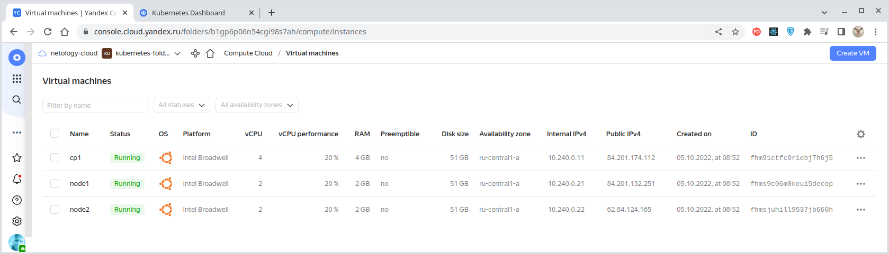
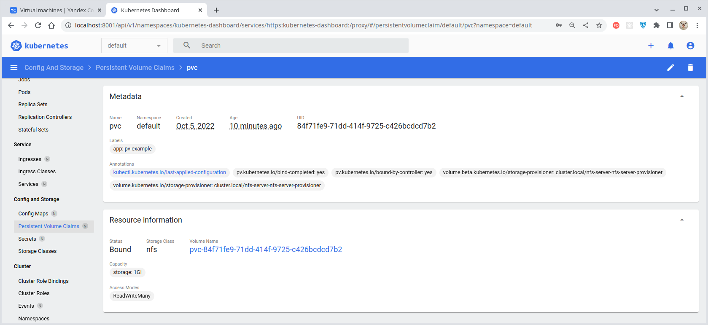
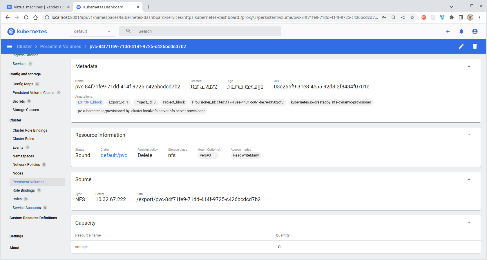

# Домашнее задание к занятию "13.2 разделы и монтирование"
Приложение запущено и работает, но время от времени появляется необходимость передавать между бекендами данные. А сам бекенд генерирует статику для фронта. Нужно оптимизировать это.
Для настройки NFS сервера можно воспользоваться следующей инструкцией (производить под пользователем на сервере, у которого есть доступ до kubectl):
* установить helm: curl https://raw.githubusercontent.com/helm/helm/master/scripts/get-helm-3 | bash
* добавить репозиторий чартов: helm repo add stable https://charts.helm.sh/stable && helm repo update
* установить nfs-server через helm: helm install nfs-server stable/nfs-server-provisioner

В конце установки будет выдан пример создания PVC для этого сервера.

---

## Задание 1: подключить для тестового конфига общую папку
В stage окружении часто возникает необходимость отдавать статику бекенда сразу фронтом. Проще всего сделать это через общую папку. Требования:
* в поде подключена общая папка между контейнерами (например, /static);
* после записи чего-либо в контейнере с беком файлы можно получить из контейнера с фронтом.

---

### Решение

С помощью [конфигурации Terraform](./terraform/main.tf) подготовим виртуальную инфраструктуру:



Разворачивание программной инфраструктуры произведем с помощью
[конфигурации Ansible](./infrastructure/site.yaml). Для разворачивания кластера Kubernetes
[используем Kubespray](./infrastructure/playbooks/mount-cluster.ansible.yaml).

Для целей этой задачи нам вполне хватит обычной
[emptyDir](https://kubernetes.io/docs/concepts/storage/volumes/#emptydir), с общим доступом в неё
из разных контейнеров одного пода.

> **emptyDir** - это изначально пустой том, создаваемый первым после назначения пода некоторой ноде и существующий, пока под работает на этой ноде.
>
> Все контейнеры этого пода могу читать и записывать файлы в такой том, хотя он м.б. смонтирован в эти контейнеры
> под разными путями.
>
> Когда под удаляется из ноды, то содержимое тома вида `emptyDir` удаляется навсегда.
>
> **Внимание!** Выход контейнера из строя не удаляет под из ноды, поэтому данные тома `emptyDir` сохраняются при авариях
> контейнеров.
>
> Том вида `emptyDir` м.б. полезен в случаях:
> - как общее пространство, например, для сортировки слиянием непосредственно на диске;
> - контрольная точка контейнера на случай восстановления после сбоев;
> - хранение файлов, создаваемых одними контейнерами и отображаемых другими;
> - и т.д.
>
> Данные тома вида `emptyDir` обычно хранятся на диске, но если установить параметр `emptyDir.medium: Memory`,
> то Kubernetes вместо диска смонтирует `tmpfs`, который гораздо быстрее жесткого диска. Однако, в этом случае следует
> иметь ввиду, что `tmpfs` очищается при перезагрузке ноды и, кроме того, объём RAM ограничен.

Для демонстрации создадим [под с двумя контейнерами - "nginx" и "busybox"](./infrastructure/playbooks/templates/empty-dir.ansible.yaml),
имитирующими фронтенд и бекенд (суть компонентов здесь неважна) и разделяющими доступ к общей папке.

````bash
$ kubectl apply -f ./infrastructure/playbooks/templates/empty-dir.ansible.yaml
pod/empty-dir-example created

$ kubectl get po -o wide --show-labels
NAME                READY   STATUS    RESTARTS   AGE     IP             NODE    NOMINATED NODE   READINESS GATES   LABELS
empty-dir-example   2/2     Running   0          2m16s   10.200.104.4   node2   <none>           <none>            app=empty-dir-example
...
````

Проверим содержимое созданного пода "empty-dir-example":
````bash
$ kubectl describe pod/empty-dir-example 
Name:         empty-dir-example
Namespace:    default
Priority:     0
Node:         node2/10.240.0.22
Start Time:   Tue, 04 Oct 2022 15:17:09 +0200
Labels:       app=empty-dir-example
Annotations:  cni.projectcalico.org/containerID: a04ce12d24289049d232c4def9cacc14389440e8ea104c31233bf4fab1fc4534
              cni.projectcalico.org/podIP: 10.200.104.4/32
              cni.projectcalico.org/podIPs: 10.200.104.4/32
Status:       Running
IP:           10.200.104.4
IPs:
  IP:  10.200.104.4
Containers:
  nginx:
    Container ID:   containerd://a0cbe11c0b8c2c2d72d75a5601aaf8fd2e8fa4b4340c0a0bef656a53566dc1e4
    Image:          nginx
    Image ID:       docker.io/library/nginx@sha256:0b970013351304af46f322da1263516b188318682b2ab1091862497591189ff1
    Port:           <none>
    Host Port:      <none>
    State:          Running
      Started:      Tue, 04 Oct 2022 15:17:18 +0200
    Ready:          True
    Restart Count:  0
    Environment:    <none>
    Mounts:
      /static from my-empty-volume (rw)
      /var/run/secrets/kubernetes.io/serviceaccount from kube-api-access-7dz8m (ro)
  busybox:
    Container ID:  containerd://22fb5b2bda1d3c85e6f68b7a732f01251247e05e7f038110c65facc4ddbaa623
    Image:         busybox
    Image ID:      docker.io/library/busybox@sha256:ad9bd57a3a57cc95515c537b89aaa69d83a6df54c4050fcf2b41ad367bec0cd5
    Port:          <none>
    Host Port:     <none>
    Command:
      sleep
      3600
    State:          Running
      Started:      Tue, 04 Oct 2022 15:17:23 +0200
    Ready:          True
    Restart Count:  0
    Environment:    <none>
    Mounts:
      /static from my-empty-volume (rw)
      /var/run/secrets/kubernetes.io/serviceaccount from kube-api-access-7dz8m (ro)
Conditions:
  Type              Status
  Initialized       True 
  Ready             True 
  ContainersReady   True 
  PodScheduled      True 
Volumes:
  my-empty-volume:
    Type:       EmptyDir (a temporary directory that shares a pod's lifetime)
    Medium:     
    SizeLimit:  <unset>
  kube-api-access-7dz8m:
    Type:                    Projected (a volume that contains injected data from multiple sources)
    TokenExpirationSeconds:  3607
    ConfigMapName:           kube-root-ca.crt
    ConfigMapOptional:       <nil>
    DownwardAPI:             true
QoS Class:                   BestEffort
Node-Selectors:              <none>
Tolerations:                 node.kubernetes.io/not-ready:NoExecute op=Exists for 300s
                             node.kubernetes.io/unreachable:NoExecute op=Exists for 300s
Events:
  Type    Reason     Age    From               Message
  ----    ------     ----   ----               -------
  Normal  Scheduled  4m37s  default-scheduler  Successfully assigned default/empty-dir-example to node2
  Normal  Pulling    4m36s  kubelet            Pulling image "nginx"
  Normal  Pulled     4m28s  kubelet            Successfully pulled image "nginx" in 8.696469649s
  Normal  Created    4m28s  kubelet            Created container nginx
  Normal  Started    4m28s  kubelet            Started container nginx
  Normal  Pulling    4m28s  kubelet            Pulling image "busybox"
  Normal  Pulled     4m23s  kubelet            Successfully pulled image "busybox" in 4.283312751s
  Normal  Created    4m23s  kubelet            Created container busybox
  Normal  Started    4m22s  kubelet            Started container busybox
````

Как видим, оба контейнера успешно запущены, а также смонтирован том "my-empty-volume" типа "EmptyDir".

Теперь подключимся к обеим контейнерам и проверим, действительно ли папка является общей для них.

Подключаемся к контейнеру "nginx":
````bash
$ kubectl exec -i --tty empty-dir-example -c nginx -- bash 
root@empty-dir-example:/# ls -l
total 84
drwxrwxrwx   2 root root 4096 Oct  4 13:17 static 
...
````

Видим, что папка `/static` присутствует в корневой директории файловой системы контейнера "nginx".

Теперь проверим контейнер "busybox":
````bash
$ kubectl exec -i --tty empty-dir-example -c busybox -- sh 
/ # ls -l
total 40
drwxrwxrwx    2 root     root          4096 Oct  4 13:17 static
...
````

Здесь также присутствует папка `/static`. Создадим в этой папке любой файл и проверим, виден ли он из всех контейнеров.

Через подключение к контейнеру "busybox" создадим, например, текстовый файл с именем "1.txt" и любым содержимым,
например, "Empty dir test": 
````bash
/ # cd static
/static # echo "Empty dir test" > 1.txt
/static # cat 1.txt
Empty dir test
````

Заодно узнаем `inode` созданного файла:
````bash
/static # ls -li
total 4
778137 -rw-r--r--    1 root     root            15 Oct  4 13:36 1.txt
````

А теперь через подключение к контейнеру "nginx" проверим содержимое папки `/static`:
````bash
root@empty-dir-example:/# cd static
root@empty-dir-example:/static# ls -li
total 4
778137 -rw-r--r-- 1 root root 15 Oct  4 13:36 1.txt
````

Файл с именем "1.txt" присутствует и `inode` его точно такой же, какой мы наблюдали из контейнера "busybox".
Значит, это физически один и тот же файл (а не копия, например).

Теперь удалим созданный файл из контейнера "nginx":
````bash
root@empty-dir-example:/static# rm 1.txt
root@empty-dir-example:/static# ls -li
total 0
````

И проверим содержимое директории `/static` в контейнере "busybox":
````bash
/static # ls -li
total 0
````

Директория пуста, файл и здесь не наблюдается.

Т.о. мы создали общую папку для нескольких контейнеров, все из которых имеют права и на чтение
и на запись файлов в этой папке.

---

## Задание 2: подключить общую папку для прода
Поработав на stage, доработки нужно отправить на прод. В продуктиве у нас контейнеры крутятся в разных подах, поэтому
потребуется PV и связь через PVC. Сам PV должен быть связан с NFS сервером. Требования:
* все бекенды подключаются к одному PV в режиме ReadWriteMany;
* фронтенды тоже подключаются к этому же PV с таким же режимом;
* файлы, созданные бекендом, должны быть доступны фронту.

---

### Решение

Здесь мы создадим папку, которая была бы доступна из разных подов, расположенных на разных нодах.
Для этого подходит PersistentVolume в режиме ReadWriteMany.

> **Используемая терминология:**
> - **StorageClass**: класс, определяющий параметры подключаемого тома;
> - **PersistentVolume Provisioner**: предоставляет PersistentVolumes, основываясь на параметрах, заданных через StorageClass;
> - **PersistentVolumeClaim**: заявка на создание PersistentVolume, описывающая требования к хранилищу и описание действий после отключения;
> - **PersistentVolume**: интерфейс внешнего хранилища, через который оно подключается к контейнерам и сохраняет данные. Существуют различные типы PersistentVolume (local, NFS, CephFS, облачные решения и др.);
> - **StatefulSet**: API-объект, используемый для управления приложениями, сохраняющими своё состояние (пример - базы данных). Удаление StatefulSet не приводит к удалению ассоциированных с ним томов и не удаляет соответствующие поды (для удаления подов следует произвести их масштабирование до нуля).

Следует обратить внимание, что в процессе установки программной инфраструктуры мы установили
[PersistentVolume Provisioner для NFS](./infrastructure/playbooks/nfs-provisioner-install.yaml) (Network File System).
Компоненты, обеспечивающие его работу, можно с самого начала наблюдать в составе нашего кластера:
````bash
$ kubectl get all,pvc,pv,ep,sc -o wide                                                                                                                                                                                          oleg-office: Wed Oct  5 09:12:51 2022

NAME                                      READY   STATUS    RESTARTS   AGE   IP               NODE    NOMINATED NODE   READINESS GATES
pod/nfs-server-nfs-server-provisioner-0   1/1     Running   0          28s   10.200.166.130   node1   <none>           <none>

NAME                                        TYPE        CLUSTER-IP     EXTERNAL-IP   PORT(S)                                                                                                     AGE    SELECTOR
service/kubernetes                          ClusterIP   10.32.0.1      <none>        443/TCP                                                                                                     5m1s   <none>
service/nfs-server-nfs-server-provisioner   ClusterIP   10.32.67.222   <none>        2049/TCP,2049/UDP,32803/TCP,32803/UDP,20048/TCP,20048/UDP,875/TCP,875/UDP,111/TCP,111/UDP,662/TCP,662/UDP   28s    app=nfs-server-provisioner,release=nfs-server

NAME                                                 READY   AGE   CONTAINERS               IMAGES
statefulset.apps/nfs-server-nfs-server-provisioner   1/1     29s   nfs-server-provisioner   quay.io/kubernetes_incubator/nfs-provisioner:v2.3.0

NAME                                                        ENDPOINTS                                                                AGE
endpoints/nfs-server-nfs-server-provisioner                 10.200.166.130:20048,10.200.166.130:662,10.200.166.130:111 + 9 more...   29s
endpoints/cluster.local-nfs-server-nfs-server-provisioner   <none>                                                                   9s
endpoints/kubernetes                                        10.240.0.11:6443                                                         5m2s

NAME                              PROVISIONER                                       RECLAIMPOLICY   VOLUMEBINDINGMODE   ALLOWVOLUMEEXPANSION   AGE
storageclass.storage.k8s.io/nfs   cluster.local/nfs-server-nfs-server-provisioner   Delete          Immediate           true                   29s
````

Сам NFS-поставщик имеет следующие параметры:
````bash
$ kubectl describe sc/nfs
Name:                  nfs
IsDefaultClass:        No
Annotations:           meta.helm.sh/release-name=nfs-server,meta.helm.sh/release-namespace=default
Provisioner:           cluster.local/nfs-server-nfs-server-provisioner
Parameters:            <none>
AllowVolumeExpansion:  True
MountOptions:
  vers=3
ReclaimPolicy:      Delete
VolumeBindingMode:  Immediate
Events:             <none>
````

Для демонстрации создадим
[деплоймент с двумя контейнерами](./infrastructure/playbooks/templates/deployment.ansible.yaml) - "nginx" и "busybox",
имитирующими фронтенд и бекенд (суть компонентов здесь неважна), существующих в двух
экземплярах, и с общим томом, определенным как `PersistenceVolumeClaim` (т.е. в виде заявки на том).

> Т.к. рабочих нод у нас создано две, то поды деплоймента распределятся по ним равномерно. Т.о. мы смоделируем условия,
> когда директория является общей **для разных подов на разных нодах**.

Итак, разворачиваем приложение:
````bash
$ kubectl apply -f ./infrastructure/playbooks/templates/deployment.ansible.yaml
deployment.apps/pv-example created
service/pv-example created
````

Сразу после создания наши поды переходят в состоянии `Pending`, потому что их работа подразумевает использование томов,
созданных по заявке с именем "pvc" (`claimName: pvc`), но и заявки такой ещё нет, и томов еще не создано:
````bash
$ kubectl get po -o wide
NAME                                  READY   STATUS    RESTARTS   AGE    IP               NODE     NOMINATED NODE   READINESS GATES
pv-example-b594c67d4-6qbxn            0/2     Pending   0          12s    <none>           <none>   <none>           <none>
pv-example-b594c67d4-lb7d4            0/2     Pending   0          12s    <none>           <none>   <none>           <none>
nfs-server-nfs-server-provisioner-0   1/1     Running   0          106s   10.200.166.130   node1    <none>           <none>
````

Причина, почему поды находятся в состоянии `Pending`, может быть выяснена из их описания:
````bash
$ kubectl describe pod/pv-example-b594c67d4-6qbxn 
Name:           pv-example-b594c67d4-6qbxn
...
Events:
  Type     Reason            Age   From               Message
  ----     ------            ----  ----               -------
  Warning  FailedScheduling  39s   default-scheduler  0/3 nodes are available: 3 persistentvolumeclaim "pvc" not found. preemption: 0/3 nodes are available: 3 Preemption is not helpful for scheduling.

$ kubectl describe pod/pv-example-b594c67d4-lb7d4 
Name:           pv-example-b594c67d4-lb7d4
...
Events:
  Type     Reason            Age   From               Message
  ----     ------            ----  ----               -------
  Warning  FailedScheduling  43s   default-scheduler  0/3 nodes are available: 3 persistentvolumeclaim "pvc" not found. preemption: 0/3 nodes are available: 3 Preemption is not helpful for scheduling.
````

Создадим ожидаемый [подами](./infrastructure/playbooks/templates/deployment.ansible.yaml) PersistenceVolumeClaim с
[заявкой на хранилище размером 1Гб](./infrastructure/playbooks/templates/pvc-1gb.yaml):
````bash
$ kubectl apply -f ./infrastructure/playbooks/templates/pvc-1gb.yaml
persistentvolumeclaim/pvc created
````

Таким образом мы заявляем, что требуется хранилище класса Network File System (`storageClassName: nfs`)
размером в 1Гб (`storage: 1Gi`), находящееся в режиме ReadWriteMany (`accessModes: - ReadWriteMany`). 

> Режим хранилища **ReadWriteMany (RWS)** подразумевает доступность хранилища из разных нод.

Заявка создана и благодаря использованию NFS-провайдера она сразу же автоматически удовлетворяется без необходимости
отдельного создания PersistenceVolume:
````bash
$ kubectl get pvc/pvc
NAME   STATUS   VOLUME                                     CAPACITY   ACCESS MODES   STORAGECLASS   AGE
pvc    Bound    pvc-84f71fe9-71dd-414f-9725-c426bcdcd7b2   1Gi        RWX            nfs            63s
````

Автоматически выделенное  хранилище:
````bash
$ kubectl get pv/pvc-84f71fe9-71dd-414f-9725-c426bcdcd7b2 
NAME                                       CAPACITY   ACCESS MODES   RECLAIM POLICY   STATUS   CLAIM         STORAGECLASS   REASON   AGE
pvc-84f71fe9-71dd-414f-9725-c426bcdcd7b2   1Gi        RWX            Delete           Bound    default/pvc   nfs                     6m33s
````

> Если бы установленный плагин не удовлетворял заявку автоматически, то пришлось бы специально определять
> хранилище, подходящее под заявку по параметрам тип доступа (`accessModes`) и размер (`storage`):
> ````yaml
> apiVersion: v1
> kind: PersistentVolume
> metadata:
>   name: pv
>   namespace: default
>   labels:
>     app: pv-example
> spec:
>   storageClassName: nfs
>   accessModes:
>     - ReadWriteMany
>   capacity:
>     storage: 1Gi
>   hostPath:
>     path: /data/pv
> ````

Теперь наши поды распределены по нодам и перешли в активное состояние:
````bash
$ kubectl get po -o wide
NAME                                  READY   STATUS    RESTARTS   AGE   IP               NODE    NOMINATED NODE   READINESS GATES
nfs-server-nfs-server-provisioner-0   1/1     Running   0          12m   10.200.166.130   node1   <none>           <none>
pv-example-b594c67d4-6qbxn            2/2     Running   0          11m   10.200.166.131   node1   <none>           <none>
pv-example-b594c67d4-lb7d4            2/2     Running   0          11m   10.200.104.3     node2   <none>           <none>
````

PersistentVolumeClaim и соответствующий ему PersistentVolume можно наблюдать через панель управления Kubernetes:

|  PersistentVolumeClaim  |    PersistentVolume    |
|:-----------------------:|:----------------------:|
|  |  |

Таким образом мы предоставили четырем контейнерам, распределенным по двум разным подам (причем каждый на своей ноде),
единое NFS-хранилище. Для проверки его работоспособности применим простой подход - зайдя через терминал на каждый
из контейнеров, создадим оттуда по одному файлу с уникальными именами. Пусть имена файлов будут следующими:

|       Под и нода \ Контейнер       |    nginx    |    busybox    |
|:----------------------------------:|:-----------:|:-------------:|
| pv-example-b594c67d4-6qbxn (node1) | nginx_1.txt | busybox_1.txt |
| pv-example-b594c67d4-lb7d4 (node2) | nginx_2.txt | busybox_2.txt |

И после создания очередного файла будем сразу же проверять содержимое папки `/static`.

Зайдем в контейнер "nginx" на **первом поде** (нода "node1") и создадим в папке `/static` файл с именем "nginx_1.txt":
````bash
$ kubectl exec -i --tty pod/pv-example-b594c67d4-6qbxn -c nginx -- sh   
# cd /static
# touch nginx_1.txt
# ls -la
total 8
drwxrwsrwx 2 root root 4096 Oct  5 07:29 .
drwxr-xr-x 1 root root 4096 Oct  5 07:15 ..
-rw-r--r-- 1 root root    0 Oct  5 07:29 nginx_1.txt
````

Зайдем в контейнер "busybox" на **первом поде** (нода "node1") и создадим в папке `/static` файл с именем "busybox_1.txt":
````bash
$ kubectl exec -i --tty pod/pv-example-b594c67d4-6qbxn -c busybox -- sh
/ # cd /static
/static # touch busybox_1.txt
/static # ls -la
total 8
drwxrwsrwx    2 root     root          4096 Oct  5 07:29 .
drwxr-xr-x    1 root     root          4096 Oct  5 07:15 ..
-rw-r--r--    1 root     root             0 Oct  5 07:29 busybox_1.txt
-rw-r--r--    1 root     root             0 Oct  5 07:29 nginx_1.txt
````

Зайдем в контейнер "nginx" на **втором поде** (нода "node2") и создадим в папке `/static` файл с именем "nginx_2.txt":
````bash
$ kubectl exec -i --tty pv-example-b594c67d4-lb7d4 -c nginx -- sh
# cd /static
# touch nginx_2.txt
# ls -la
total 8
drwxrwsrwx 2 root root 4096 Oct  5 07:29 .
drwxr-xr-x 1 root root 4096 Oct  5 07:15 ..
-rw-r--r-- 1 root root    0 Oct  5 07:29 busybox_1.txt
-rw-r--r-- 1 root root    0 Oct  5 07:29 nginx_1.txt
-rw-r--r-- 1 root root    0 Oct  5 07:29 nginx_2.txt
````

Зайдем в контейнер "busybox" на **втором поде** (нода "node2") и создадим в папке `/static` файл с именем "busybox_2.txt":
````bash
$ kubectl exec -i --tty pv-example-b594c67d4-lb7d4 -c busybox -- sh
/ # cd /static
/static # touch busybox_2.txt
/static # ls -la
total 8
drwxrwsrwx    2 root     root          4096 Oct  5 07:29 .
drwxr-xr-x    1 root     root          4096 Oct  5 07:16 ..
-rw-r--r--    1 root     root             0 Oct  5 07:29 busybox_1.txt
-rw-r--r--    1 root     root             0 Oct  5 07:29 busybox_2.txt
-rw-r--r--    1 root     root             0 Oct  5 07:29 nginx_1.txt
-rw-r--r--    1 root     root             0 Oct  5 07:29 nginx_2.txt
````

Т.о. мы видим, что в режиме ReadWriteMany каждый очередной файл сразу же после создания становится виден во всех
контейнерах, независимо того, в каком поде и на какой ноде этот контейнер запущен.

---

<details>
  <summary>Приложение 1 - Лекция</summary>

### Volume

````bash
$ kubectl get pods --sort-by .spec.nodeName --show-labels
NAME                         READY   STATUS    RESTARTS       AGE   LABELS
multitool-564b76ffdc-c8gfs   2/2     Running   4 (158m ago)   15h   app=multitool,pod-template-hash=564b76ffdc
multitool-564b76ffdc-h246z   2/2     Running   4 (158m ago)   15h   app=multitool,pod-template-hash=564b76ffdc
multitool-564b76ffdc-c7wr8   2/2     Running   4 (159m ago)   15h   app=multitool,pod-template-hash=564b76ffdc
multitool-564b76ffdc-kwb5v   2/2     Running   4 (159m ago)   15h   app=multitool,pod-template-hash=564b76ffdc
````

````bash
$ kubectl get deploy           
NAME        READY   UP-TO-DATE   AVAILABLE   AGE
multitool   4/4     4            4           37h
````

````bash
$ kubectl delete deploy multitool        
deployment.apps "multitool" deleted
````

> **EmptyVolume:**
> - применяется для создания общей папки в поде;
> - у каждого пода своя папка;
> - при перезапуске создается заново.

Создадим EmptyVolume:
````bash
$ kubectl apply -f ./manifests_for_lecture/10-volume/10-pod-int-volumes.yaml
pod/pod-int-volumes created
````

Образы запущены:
````bash
$ kubectl get po -o wide                         
NAME              READY   STATUS    RESTARTS   AGE   IP               NODE    NOMINATED NODE   READINESS GATES
pod-int-volumes   2/2     Running   0          27m   10.200.166.161   node1   <none>           <none>
````

Получим список файлов в папке `static` контейнера "nginx":
````bash
$ kubectl exec pod-int-volumes -c nginx -- ls -la /static
total 8
drwxrwxrwx 2 root root 4096 Sep 27 05:47 .
drwxr-xr-x 1 root root 4096 Sep 27 05:47 ..
````

Список файлов в папке `/tmp/cache` контейнера "busybox":
````bash
$ kubectl exec pod-int-volumes -c busybox -- ls -la /tmp/cache
total 8
drwxrwxrwx    2 root     root          4096 Sep 27 05:47 .
drwxrwxrwt    1 root     root          4096 Sep 27 05:47 ..
````

Для демонстрации создадим файл txt-файл в директории `/static`: 
````bash
$ kubectl exec pod-int-volumes -c nginx -- sh -c "echo '42' > /static/42.txt"

$ kubectl exec pod-int-volumes -c nginx -- ls -la /static                  
total 12
drwxrwxrwx 2 root root 4096 Sep 27 06:00 .
drwxr-xr-x 1 root root 4096 Sep 27 05:47 ..
-rw-r--r-- 1 root root    3 Sep 27 06:00 42.txt
````

Этот же файл присутствует и в `/tmp/cache` потому что эта директория использует тот же том, что и директория `/static`:
````bash
$ kubectl exec pod-int-volumes -c busybox -- ls -la /tmp/cache
total 12
drwxrwxrwx    2 root     root          4096 Sep 27 06:00 .
drwxrwxrwt    1 root     root          4096 Sep 27 05:47 ..
-rw-r--r--    1 root     root             3 Sep 27 06:00 42.txt
````

Наш под `pod-int-volumes` размещен на ноде `node1`: 
````bash
$ kubectl get po -o wide
NAME              READY   STATUS    RESTARTS   AGE   IP               NODE    NOMINATED NODE   READINESS GATES
pod-int-volumes   2/2     Running   0          38m   10.200.166.161   node1   <none>           <none>
````

Определим идентификатор пода:
````bash
$ kubectl get po pod-int-volumes -o yaml | grep uid
  uid: 0bdfba44-e231-4c09-b414-dc755663aefd
````

Если зайти через ssh-консоль на ноду `node1`, то созданный файл обнаружится в папке пода, имеющей имя,
совпадающее с идентификатором пода:
````bash
ubuntu@node1:~$ sudo su
root@node1:/home/ubuntu# find / -name "42.txt" -type f
/var/lib/kubelet/pods/0bdfba44-e231-4c09-b414-dc755663aefd/volumes/kubernetes.io~empty-dir/my-volume/42.txt
````

Получим сведения о монтировании найденной папки пода: 
````bash
root@node1:/home/ubuntu# df -h | grep 0bdfba44-e231-4c09-b414-dc755663aefd
tmpfs           1.6G   12K  1.6G   1% /var/lib/kubelet/pods/0bdfba44-e231-4c09-b414-dc755663aefd/volumes/kubernetes.io~projected/kube-api-access-kg5ck
````

Т.о. тома подов смонтированы в подпапках директории `/var/lib/kubelet/pods`.

Удалим под:
````bash
$ kubectl delete po pod-int-volumes            
pod "pod-int-volumes" deleted

$ kubectl get po -o wide           
No resources found in default namespace.
````

Смонтированные сущности удалённого пода тоже исчезнут (как и сами папки):
````bash
root@node1:/var/lib/kubelet/pods# df -h | grep 0bdfba44-e231-4c09-b414-dc755663aefd
````

---

### PersistentVolume

Запрашиваем PersistentVolume:
````bash
$ kubectl apply -f ./manifests_for_lecture/20-persistent-volume/10-pod.yaml
pod/pod created
````

Том находится в состоянии `pending`, потому что отсутствуют и "PersistentVolume" и "PersistentVolumeClaim":
````bash
$ kubectl get po -o wide
NAME   READY   STATUS    RESTARTS   AGE   IP       NODE     NOMINATED NODE   READINESS GATES
pod    0/1     Pending   0          89s   <none>   <none>   <none>           <none>
````

В этот момент в описании пода в списке событий указано, что "PersistentVolumeClaim" не найден
(потому что он и не создавался):
````bash
Events:
  Type     Reason            Age                  From               Message
  ----     ------            ----                 ----               -------
  Warning  FailedScheduling  34s (x2 over 5m39s)  default-scheduler  0/3 nodes are available: 3 persistentvolumeclaim "pvc" not found. preemption: 0/
````

Создадим "PersistentVolumeClaim":
````bash
$ kubectl apply -f ./manifests_for_lecture/20-persistent-volume/20-pvc.yaml
persistentvolumeclaim/pvc created
````

И "PersistentVolume" и "PersistentVolumeClaim" находятся в состоянии `pending`:
````bash
$ kubectl get po,pvc

NAME      READY   STATUS    RESTARTS   AGE
pod/pod   0/1     Pending   0          12m

NAME                        STATUS    VOLUME   CAPACITY   ACCESS MODES   STORAGECLASS   AGE
persistentvolumeclaim/pvc   Pending                                                     2m6s
````

В описании пода в списке событий:
````bash
$ kubectl describe po pod
...
Events:
  Type     Reason            Age                  From               Message
  ----     ------            ----                 ----               -------
  Warning  FailedScheduling  8m42s (x2 over 13m)  default-scheduler  0/3 nodes are available: 3 persistentvolumeclaim "pvc" not found. preemption: 0/3 nodes are available: 3 Preemption is not helpful for scheduling.
  Warning  FailedScheduling  3m49s                default-scheduler  running PreFilter plugin "VolumeBinding": %!!(MISSING)w(<nil>)
````

В описании "PersistentVolumeClaim" в списке событий:
````bash
$ kubectl describe pvc pvc
...
Events:
  Type    Reason         Age                 From                         Message
  ----    ------         ----                ----                         -------
  Normal  FailedBinding  5s (x18 over 4m9s)  persistentvolume-controller  no persistent volumes available for this claim and no storage class is set
````

Создадим "PersistentVolume":
````bash
$ kubectl apply -f ./manifests_for_lecture/20-persistent-volume/30-pv.yaml
persistentvolume/pv created
````

И теперь "PersistentVolumeClaim" оказался в связке с "PersistentVolume", заявка на создание тома оказалась исполнена: 
````bash
$ kubectl get po,pv,pvc
NAME      READY   STATUS    RESTARTS   AGE
pod/pod   1/1     Running   0          34m

NAME                  CAPACITY   ACCESS MODES   RECLAIM POLICY   STATUS   CLAIM         STORAGECLASS   REASON   AGE
persistentvolume/pv   2Gi        RWO            Retain           Bound    default/pvc                           4m43s

NAME                        STATUS   VOLUME   CAPACITY   ACCESS MODES   STORAGECLASS   AGE
persistentvolumeclaim/pvc   Bound    pv       2Gi        RWO                           24m
````

`persistentvolume` - объект всего кластера.

Наш под `pod` размещен на ноде `node1`:
````bash
$ kubectl get po -o wide
NAME   READY   STATUS    RESTARTS   AGE     IP               NODE    NOMINATED NODE   READINESS GATES
pod    1/1     Running   0          5h12m   10.200.166.162   node1   <none>           <none>
````

Для демонстрации создадим файл txt-файл в директории `/static`:
````bash
$ kubectl exec pod -c nginx -- sh -c "echo '42' > /static/42.txt"

$ kubectl exec pod -c nginx -- ls -la /static
total 12
drwxr-xr-x 2 root root 4096 Sep 27 12:57 .
drwxr-xr-x 1 root root 4096 Sep 27 08:12 ..
-rw-r--r-- 1 root root    3 Sep 27 12:57 42.txt
````

Если зайти через ssh-консоль на ноду `node1`, то созданный файл обнаружится в папке `/data/pv`:
````bash
root@node1:/# find / -name "42.txt" -type f
/data/pv/42.txt
````

Находясь на ноде `node1` запишем новый файл `43.txt`:
````bash
ubuntu@node1:~$ echo 43 | sudo tee /data/pv/43.txt
43
````

Проверим наличие файлов в поде и их содержимое:
````bash
$ kubectl exec pod -c nginx -- ls -la /static
total 16
drwxr-xr-x 2 root root 4096 Sep 27 13:02 .
drwxr-xr-x 1 root root 4096 Sep 27 08:12 ..
-rw-r--r-- 1 root root    3 Sep 27 12:57 42.txt
-rw-r--r-- 1 root root    3 Sep 27 13:02 43.txt

$ kubectl exec pod -c nginx -- cat /static/43.txt
43
````
Как видим, файл `43.txt` присутствует и его содержимое именно то, которое мы записали из ssh-консоли на ноде `node1`.
Т.о. файлы доступны и на ноде и в поде.

Удалим под:
````bash
$ kubectl delete po pod            
pod "pod" deleted
````

При этом и "PersistentVolume" и "PersistentVolumeClaim" сохранились:
````bash
$ kubectl get po,pv,pvc
NAME                  CAPACITY   ACCESS MODES   RECLAIM POLICY   STATUS   CLAIM         STORAGECLASS   REASON   AGE
persistentvolume/pv   2Gi        RWO            Retain           Bound    default/pvc                           5h1m

NAME                        STATUS   VOLUME   CAPACITY   ACCESS MODES   STORAGECLASS   AGE
persistentvolumeclaim/pvc   Bound    pv       2Gi        RWO                           5h20m
````

Но все файлы с данными по-прежнему находятся на ноде:
````bash
ubuntu@node1:~$ ls -la /data/pv
total 16
drwxr-xr-x 2 root root 4096 Sep 27 13:02 .
drwxr-xr-x 3 root root 4096 Sep 27 08:12 ..
-rw-r--r-- 1 root root    3 Sep 27 12:57 42.txt
-rw-r--r-- 1 root root    3 Sep 27 13:02 43.txt
````

Создадим под заново:
````bash
$ kubectl apply -f ./manifests_for_lecture/20-persistent-volume/10-pod.yaml   
pod/pod created

$ kubectl get po -o wide                                                                                                                      
NAME   READY   STATUS    RESTARTS   AGE   IP               NODE    NOMINATED NODE   READINESS GATES
pod    1/1     Running   0          10s   10.200.166.163   node1   <none>           <none>
````

И попробуем снова получить имеющиеся данные:
````bash
$ kubectl exec pod -- ls -la /static        
total 16
drwxr-xr-x 2 root root 4096 Sep 27 13:02 .
drwxr-xr-x 1 root root 4096 Sep 27 13:16 ..
-rw-r--r-- 1 root root    3 Sep 27 12:57 42.txt
-rw-r--r-- 1 root root    3 Sep 27 13:02 43.txt
````

Как видим, все ранее созданные файлы остались на своих местах.

---

### Удаление PersistentVolume

Попытаемся удалить наш PersistentVolume:
````bash
$ kubectl delete pv pv
persistentvolume "pv" deleted
````

Видим, что PersistentVolume зависает в состоянии `Terminating`:
````bash
$ kubectl get po,pv,pvc

NAME      READY   STATUS    RESTARTS   AGE
pod/pod   1/1     Running   0          11m

NAME                  CAPACITY   ACCESS MODES   RECLAIM POLICY   STATUS        CLAIM         STORAGECLASS   REASON   AGE
persistentvolume/pv   2Gi        RWO            Retain           Terminating   default/pvc                           5h15m

NAME                        STATUS   VOLUME   CAPACITY   ACCESS MODES   STORAGECLASS   AGE
persistentvolumeclaim/pvc   Bound    pv       2Gi        RWO                           5h35m
````

Если прервать действие `kubectl delete pv pv` через `Ctrl+C`, то это никак не повлияет на статус PersistentVolume.

Посмотрим более детальную информацию о PersistentVolume:
````bash
$ kubectl describe pv pv  
Name:            pv
Labels:          <none>
Annotations:     pv.kubernetes.io/bound-by-controller: yes
Finalizers:      [kubernetes.io/pv-protection]
StorageClass:    
Status:          Terminating (lasts 81m)
Claim:           default/pvc
Reclaim Policy:  Retain
Access Modes:    RWO
VolumeMode:      Filesystem
Capacity:        2Gi
Node Affinity:   <none>
Message:         
Source:
    Type:          HostPath (bare host directory volume)
    Path:          /data/pv
    HostPathType:  
Events:            <none>
````

Видим, что `Status: Terminating`. Здесь работает предохранительный механизм "Finalizers" - это специальные объекты,
которые должны успешно выполниться для удаления родительского объекта (в описании мы видим их
как `Finalizers: [kubernetes.io/pv-protection]`).

В нашеме случае для выполнения финализатора мы должны удалить PersistentVolumeClaim, который в данный момент находится
в состоянии `Bound`:
````bash
$ kubectl get pvc           
NAME   STATUS   VOLUME   CAPACITY   ACCESS MODES   STORAGECLASS   AGE
pvc    Bound    pv       2Gi        RWO                           7h1m
````

Предпримем попытку удалить PersistentVolumeClaim:
````bash
$ kubectl delete pvc pvc
persistentvolumeclaim "pvc" deleted
````

Наш  PersistentVolumeClaim переходит в состояние `Terminating` и дальше ничего не происходит:
````bash
NAME                        STATUS        VOLUME   CAPACITY   ACCESS MODES   STORAGECLASS   AGE
persistentvolumeclaim/pvc   Terminating   pv       2Gi        RWO                           7h2m
````

Если прервать действие `kubectl delete pv pv` через `Ctrl+C`, то это никак не повлияет на статус PersistentVolume.

Посмотрим более детальную информацию о PersistentVolumeClaim:
````bash
$ kubectl describe pvc pvc
Name:          pvc
Namespace:     default
StorageClass:  
Status:        Terminating (lasts 3m9s)
Volume:        pv
Labels:        <none>
Annotations:   pv.kubernetes.io/bind-completed: yes
               pv.kubernetes.io/bound-by-controller: yes
Finalizers:    [kubernetes.io/pvc-protection]
Capacity:      2Gi
Access Modes:  RWO
VolumeMode:    Filesystem
Used By:       pod
Events:        <none>
````

Видим, что и здесь `Status: Terminating`. Здесь тоже работает предохранительный механизм "Finalizers", который
мы опять видим как `Finalizers: [kubernetes.io/pvc-protection]`.

Здесь, в свою очередь, для выполнения финализатора мы должы удалить использующий его под, который в данный момент
находится в состоянии `Running`:
````bash
$ kubectl get po          
NAME   READY   STATUS    RESTARTS   AGE
pod    1/1     Running   0          103m
````

Удалим этот под:
````bash
$ kubectl delete po pod   
pod "pod" deleted
````

Сразу после удаления пода будет удалён PersistentVolumeClaim и вслед за ним и PersistentVolume.

---

### Динамическое выделение томов

Установка NFS-поставщика:
````bash
# Установка helm
curl https://raw.githubusercontent.com/helm/helm/master/scripts/get-helm-3 | bash

# Добавление репозитория чартов
helm repo add stable https://charts.helm.sh/stable && helm repo update

# Установка nfs-server через helm
helm install nfs-server stable/nfs-server-provisioner

# В дальнейшем при создании PVC, на подах может возникнуть следующая проблема (поды зависнут в статусе ContainerCreating):
Output: mount: /var/lib/kubelet/pods/f760c19e-6ec0-46e8-9a3a-d6187fd927e8/volumes/kubernetes.io~nfs/pvc-d3134d79-c2ce-41a2-af72-0f2d45c5c19e:
bad option; for several filesystems (e.g. nfs, cifs) you might need a /sbin/mount.<type> helper program.

# Решение проблемы (необходимо установить на всех нодах !!!):
sudo apt install nfs-common # для debian/ubuntu
````

После установки поставщика (Provisioner) он наблюдается в списке подов:
````bash
$ kubectl get pod --sort-by .spec.nodeName --show-labels 
NAME                                  READY   STATUS    RESTARTS   AGE   LABELS
nfs-server-nfs-server-provisioner-0   1/1     Running   0          10m   app=nfs-server-provisioner,chart=nfs-server-provisioner-1.1.3,controller-revision-hash=nfs-server-nfs-server-provisioner-64bd6d7f65,heritage=Helm,release=nfs-server,statefulset.kubernetes.io/pod-name=nfs-server-nfs-server-provisioner-0
````

Присутствует Provisioner, значит присутствует и StorageClass:
````bash
$ kubectl get storageclasses.storage.k8s.io
NAME   PROVISIONER                                       RECLAIMPOLICY   VOLUMEBINDINGMODE   ALLOWVOLUMEEXPANSION   AGE
nfs    cluster.local/nfs-server-nfs-server-provisioner   Delete          Immediate           true                   18m
````

Посмотреть список StorageClass:
````bash
$ kubectl get sc
NAME   PROVISIONER                                       RECLAIMPOLICY   VOLUMEBINDINGMODE   ALLOWVOLUMEEXPANSION   AGE
nfs    cluster.local/nfs-server-nfs-server-provisioner   Delete          Immediate           true                   20m
````

Список нод, к которым м.б. примонтированы тома:
````bash
$ kubectl get csinodes
NAME    DRIVERS   AGE
cp1     0         2d13h
node1   0         2d13h
node2   0         2d13h
````

Установленные CSI-драйверы:
````bash
$ kubectl get csidrivers
No resources found
````

Создадим под с именем `pod`:
````bash
$ kubectl apply -f ./manifests_for_lecture/20-persistent-volume/40-dynamic-provisioning/10-pod.yaml
pod/pod created
````

Созданный под находится в состоянии `pending`, потому что еще нет требуемого тома:
````bash
$ kubectl get po,pvc,pv
NAME                                      READY   STATUS    RESTARTS      AGE
pod/nfs-server-nfs-server-provisioner-0   1/1     Running   1 (37m ago)   61m
pod/pod                                   0/1     Pending   0             14s
````

Создадим PersistentVolumeClaim, имеющий StorageClass, соответствующий поставщику, т.е. `nfs` :
````bash
$ kubectl apply -f ./manifests_for_lecture/20-persistent-volume/40-dynamic-provisioning/20-pvc-nfs.yaml   
persistentvolumeclaim/pvc created
````

Сразу автоматически будет создан том с параметрами, запрошенными через PersistentVolumeClaim,
после чего под его получит и перейдет в активное (`Running`) состояние:
````bash
$ kubectl get po,pvc,pv
NAME                                      READY   STATUS    RESTARTS   AGE
pod/nfs-server-nfs-server-provisioner-0   1/1     Running   0          42m
pod/pod                                   1/1     Running   0          26m

NAME                        STATUS   VOLUME                                     CAPACITY   ACCESS MODES   STORAGECLASS   AGE
persistentvolumeclaim/pvc   Bound    pvc-4027b0d0-fb9e-4a84-a62a-d3440449cc93   2Gi        RWO            nfs            4m49s

NAME                                                        CAPACITY   ACCESS MODES   RECLAIM POLICY   STATUS   CLAIM         STORAGECLASS   REASON   AGE
persistentvolume/pvc-4027b0d0-fb9e-4a84-a62a-d3440449cc93   2Gi        RWO            Delete           Bound    default/pvc   nfs                     4m49s
````

Проверим работу динамически созданного тома. Для этого создадим в томе какой-нибудь файл:
````bash
$ kubectl exec pod -- ls -la /static
total 8
drwxrwsrwx 2 root root 4096 Sep 28 06:26 .
drwxr-xr-x 1 root root 4096 Sep 28 06:27 ..

$ kubectl exec pod -- sh -c "echo 'dynamic' > /static/dynamic.txt"

$ kubectl exec pod -- ls -la /static
total 12
drwxrwsrwx 2 root root 4096 Sep 28 06:39 .
drwxr-xr-x 1 root root 4096 Sep 28 06:27 ..
-rw-r--r-- 1 root root    8 Sep 28 06:39 dynamic.txt
````

Файл `dynamic.txt` создан в каталоге тома. Определим в какой папке у нас хранятся данные
````bash
$ kubectl get pv -o yaml | grep '^\s*path:'
      path: /export/pvc-4027b0d0-fb9e-4a84-a62a-d3440449cc93
````

Зайдём по ssh на ноду `node1`, найдём там эту папку и посмотрим её содержимое:
````bash
ubuntu@node1:~$  sudo find / -name "pvc-4027b0d0-fb9e-4a84-a62a-d3440449cc93" -type d
/var/lib/kubelet/pods/be1fe765-2753-429d-a52a-3376138aa8dc/volumes/kubernetes.io~empty-dir/data/pvc-4027b0d0-fb9e-4a84-a62a-d3440449cc93

ubuntu@node1:~$ sudo ls -la /var/lib/kubelet/pods/be1fe765-2753-429d-a52a-3376138aa8dc/volumes/kubernetes.io~empty-dir/data/pvc-4027b0d0-fb9e-4a84-a62a-d3440449cc93
total 12
drwxrwsrwx 2 root root 4096 Sep 28 06:39 .
drwxrwxrwx 5 root root 4096 Sep 28 06:26 ..
-rw-r--r-- 1 root root    8 Sep 28 06:39 dynamic.txt
````

И на ноде `node2`:
````bash
ubuntu@node2:~$  sudo find / -name "pvc-4027b0d0-fb9e-4a84-a62a-d3440449cc93" -type d
/var/lib/kubelet/pods/d6212167-3d51-4cc5-b800-c0a546522f32/volumes/kubernetes.io~nfs/pvc-4027b0d0-fb9e-4a84-a62a-d3440449cc93

ubuntu@node2:~$ sudo ls -la /var/lib/kubelet/pods/d6212167-3d51-4cc5-b800-c0a546522f32/volumes/kubernetes.io~nfs/pvc-4027b0d0-fb9e-4a84-a62a-d3440449cc93
total 12
drwxrwsrwx 2 root root 4096 Sep 28 06:39 .
drwxr-x--- 3 root root 4096 Sep 28 06:26 ..
-rw-r--r-- 1 root root    8 Sep 28 06:39 dynamic.txt
````

Как видим, созданный файл присутствует.

> Можно найти папку тома и по идентификатору ноды. Для этого сначала выясним, на какой ноде располагается наш под:
> ````bash
> $ kubectl get po -o wide
> NAME                                  READY   STATUS    RESTARTS   AGE   IP               NODE    NOMINATED NODE   READINESS GATES
> nfs-server-nfs-server-provisioner-0   1/1     Running   0          62m   10.200.166.130   node1   <none>           <none>
> pod                                   1/1     Running   0          46m   10.200.104.2     node2   <none>           <none>
> ````
>
> Наш под с именем `pod` расположен на ноде с именем `node2`. Теперь узнаем идентификатор нашего пода:
> ````bash
> $ kubectl get po pod -o yaml | grep uid
> uid: d6212167-3d51-4cc5-b800-c0a546522f32
> ````
>
> Зная идентификатор пода заходим на ноду `node2` и производим поиск папки с идентификатором пода:
> ````bash
> ubuntu@node2:~$ sudo find / -name "d6212167-3d51-4cc5-b800-c0a546522f32"
> /var/lib/kubelet/pods/d6212167-3d51-4cc5-b800-c0a546522f32
> ````
>
> Эта папка содержит все тома искомого пода:
> ````bash
> root@node2:/# ls -la /var/lib/kubelet/pods/d6212167-3d51-4cc5-b800-c0a546522f32
> total 24
> drwxr-x--- 5 root root 4096 Sep 28 06:27 .
> drwxr-x--- 8 root root 4096 Sep 28 06:26 ..
> drwxr-x--- 3 root root 4096 Sep 28 06:27 containers
> -rw-r--r-- 1 root root  200 Sep 28 06:27 etc-hosts
> drwxr-x--- 3 root root 4096 Sep 28 06:26 plugins
> drwxr-x--- 4 root root 4096 Sep 28 06:26 volumes
> ````

Удалим под и проверим, что произошло с папками, где содержался созданный файл "dynamic.txt".

Удаляем под:
````bash
$ kubectl delete po pod
pod "pod" deleted
````

Под с именем `pod` исчез, но PersistentVolumeClaim и PersistentVolume остались:
````bash
$ kubectl get po,pvc,pv
NAME                                      READY   STATUS    RESTARTS   AGE
pod/nfs-server-nfs-server-provisioner-0   1/1     Running   0          84m

NAME                        STATUS   VOLUME                                     CAPACITY   ACCESS MODES   STORAGECLASS   AGE
persistentvolumeclaim/pvc   Bound    pvc-4027b0d0-fb9e-4a84-a62a-d3440449cc93   2Gi        RWO            nfs            46m

NAME                                                        CAPACITY   ACCESS MODES   RECLAIM POLICY   STATUS   CLAIM         STORAGECLASS   REASON   AGE
persistentvolume/pvc-4027b0d0-fb9e-4a84-a62a-d3440449cc93   2Gi        RWO            Delete           Bound    default/pvc   nfs                     46m
````

Зайдем на ноды и проверим содержимое ранее найденных папок. На первой ноде `node1` всё осталось без изменений:
````bash
ubuntu@node1:~$ sudo ls -la /var/lib/kubelet/pods/be1fe765-2753-429d-a52a-3376138aa8dc/volumes/kubernetes.io~empty-dir/data/pvc-4027b0d0-fb9e-4a84-a62a-d3440449cc93
total 12
drwxrwsrwx 2 root root 4096 Sep 28 06:39 .
drwxrwxrwx 5 root root 4096 Sep 28 06:26 ..
-rw-r--r-- 1 root root    8 Sep 28 06:39 dynamic.txt
````

Но на второй ноде 'node2`, где и содержался под, папка исчезла:
````bash
ubuntu@node2:~$ sudo ls -la /var/lib/kubelet/pods/be1fe765-2753-429d-a52a-3376138aa8dc/volumes/kubernetes.io~empty-dir/data/pvc-4027b0d0-fb9e-4a84-a62a-d3440449cc93
ls: cannot access '/var/lib/kubelet/pods/be1fe765-2753-429d-a52a-3376138aa8dc/volumes/kubernetes.io~empty-dir/data/pvc-4027b0d0-fb9e-4a84-a62a-d3440449cc93': No such file or directory
````

Папка исчезла по причине размонтирования пода. Смонтируем его вновь:

````bash
$ kubectl apply -f ./manifests_for_lecture/20-persistent-volume/40-dynamic-provisioning/10-pod.yaml
pod/pod created
````

Под снова появился и он сразу же находится в оказывается в активном (`Running`) состоянии:
````bash
$ kubectl get po,pvc,pv
NAME                                      READY   STATUS    RESTARTS   AGE
pod/nfs-server-nfs-server-provisioner-0   1/1     Running   0          96m
pod/pod                                   1/1     Running   0          7s

NAME                        STATUS   VOLUME                                     CAPACITY   ACCESS MODES   STORAGECLASS   AGE
persistentvolumeclaim/pvc   Bound    pvc-4027b0d0-fb9e-4a84-a62a-d3440449cc93   2Gi        RWO            nfs            58m

NAME                                                        CAPACITY   ACCESS MODES   RECLAIM POLICY   STATUS   CLAIM         STORAGECLASS   REASON   AGE
persistentvolume/pvc-4027b0d0-fb9e-4a84-a62a-d3440449cc93   2Gi        RWO            Delete           Bound    default/pvc   nfs                     58m
````

Проверим наличие файла:
````bash
$ kubectl exec pod -- ls -la /static
total 12
drwxrwsrwx 2 root root 4096 Sep 28 06:39 .
drwxr-xr-x 1 root root 4096 Sep 28 07:18 ..
-rw-r--r-- 1 root root    8 Sep 28 07:23 dynamic.txt
````

Файл присутствует. Выясним, на какой ноде был создан под:
````bash
$ kubectl get po -o wide
NAME                                  READY   STATUS    RESTARTS   AGE   IP               NODE    NOMINATED NODE   READINESS GATES
nfs-server-nfs-server-provisioner-0   1/1     Running   0          97m   10.200.166.130   node1   <none>           <none>
pod                                   1/1     Running   0          43s   10.200.104.4     node2   <none>           <none>
````

Под создан на ноде `node2`. Зайдем на неё через ssh-консоль и выясним местонахождение файла:
````bash
ubuntu@node2:~$ sudo find / -name "dynamic.txt" -type f
/var/lib/kubelet/pods/a3d70f4f-af9c-449b-bcb2-a23ad6856782/volumes/kubernetes.io~nfs/pvc-4027b0d0-fb9e-4a84-a62a-d3440449cc93/dynamic.txt
````

Но до того, как мы удалили ноду, путь к этому файлу был следущим:
````bash
/var/lib/kubelet/pods/d6212167-3d51-4cc5-b800-c0a546522f32/volumes/kubernetes.io~nfs/pvc-4027b0d0-fb9e-4a84-a62a-d3440449cc93
````

Легко заметить, что разница здесь только в новом идентификаторе пода, тогда как идентификатор тома остался прежним.

Удалим и под `pod` и PersistentVolumeClaim:
````bash
$ kubectl delete po pod
pod "pod" deleted

$ kubectl delete pvc pvc
persistentvolumeclaim "pvc" deleted
````

Данные со всех нод удалены (включая управляющую) и утеряны:
````bash
ubuntu@cp1:~$ sudo find / -name "dynamic.txt" -type f
ubuntu@node1:~$ sudo find / -name "dynamic.txt" -type f
ubuntu@node2:~$ sudo find / -name "dynamic.txt" -type f
````

Для выяснения того, почему это произошло, вглянем на наш StorageClass:
````bash
$ kubectl get sc
NAME   PROVISIONER                                       RECLAIMPOLICY   VOLUMEBINDINGMODE   ALLOWVOLUMEEXPANSION   AGE
nfs    cluster.local/nfs-server-nfs-server-provisioner   Delete          Immediate           true                   118m
````

У использованного нами для создания тома StorageClass с именем `nfs` параметр `ReclaimPolicy` установлен
в значение `Delete`. Это означает удаление тома после удаления PersistentVolumeClaim. При другой стратегии, например
`Retain`, том не был бы удалён.

</details>

---
