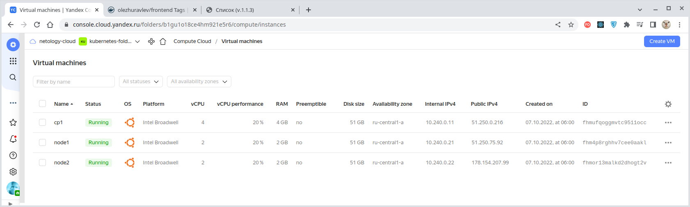
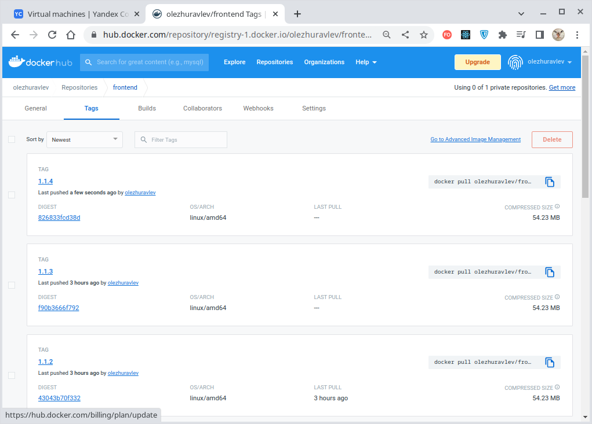
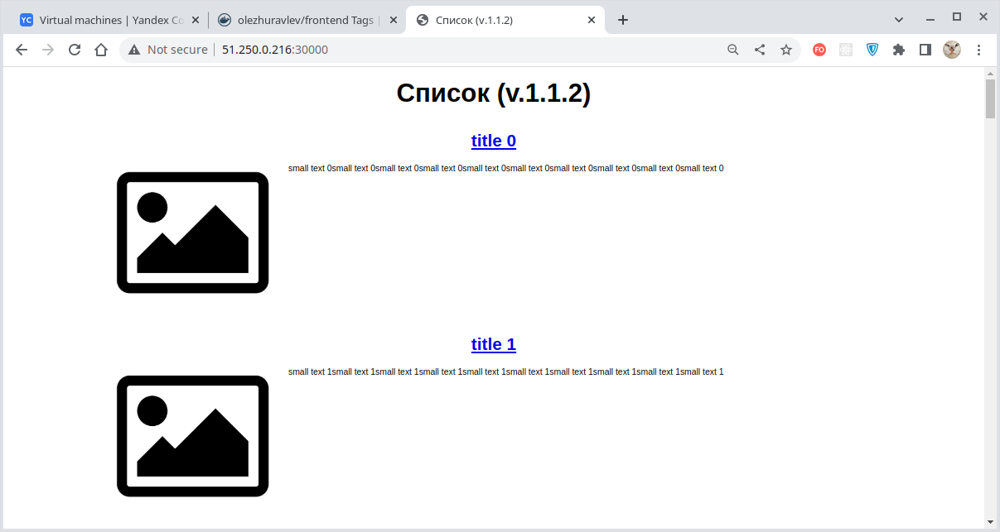
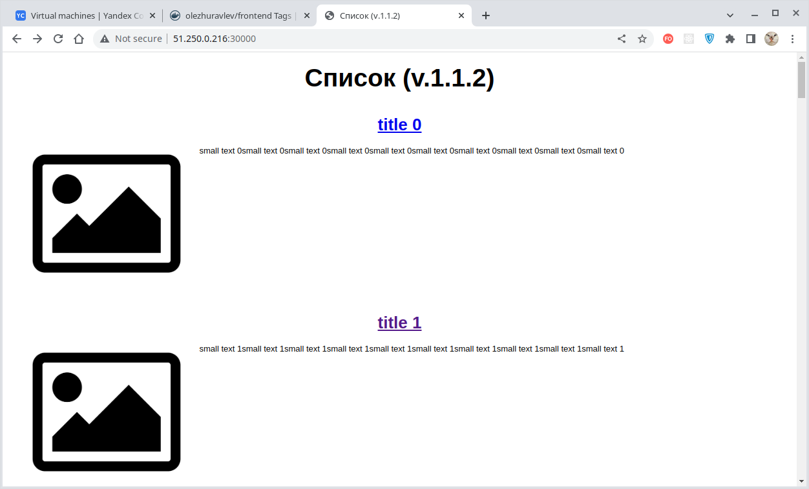
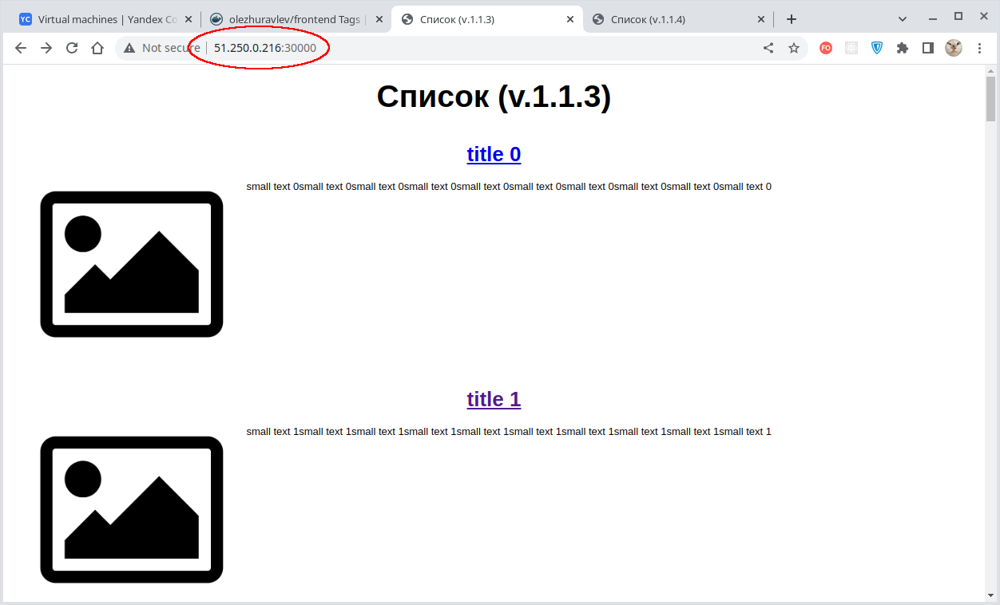
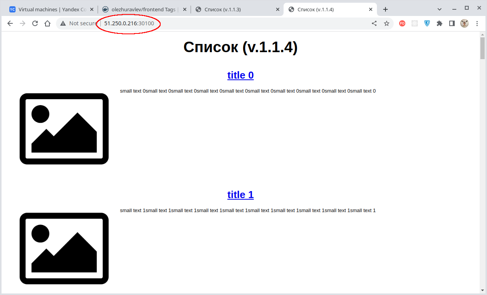
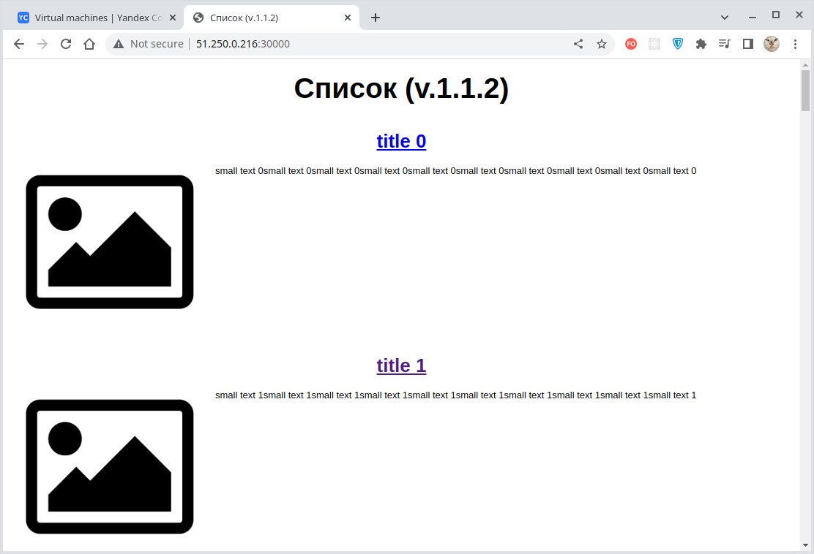
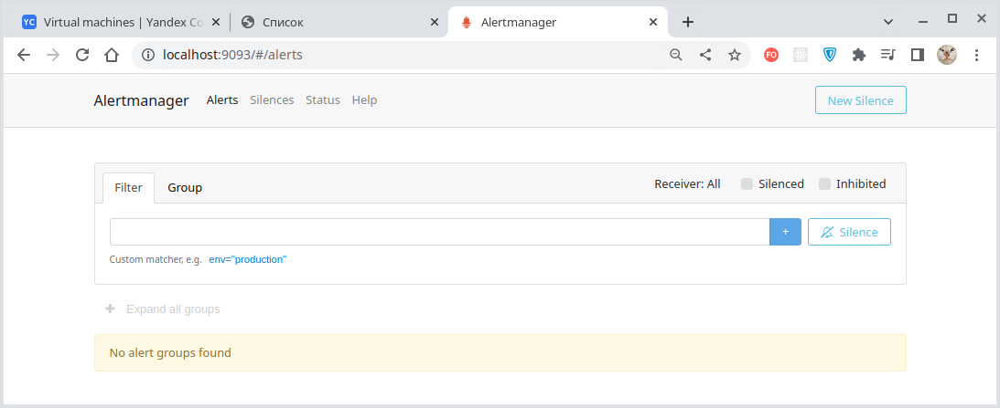

# Домашнее задание к занятию "13.4 инструменты для упрощения написания конфигурационных файлов. Helm и Jsonnet"
В работе часто приходится применять системы автоматической генерации конфигураций. Для изучения нюансов использования разных инструментов нужно попробовать упаковать приложение каждым из них.

## Задание 1: подготовить helm чарт для приложения
Необходимо упаковать приложение в чарт для деплоя в разные окружения. Требования:
* каждый компонент приложения деплоится отдельным deployment’ом/statefulset’ом;
* в переменных чарта измените образ приложения для изменения версии.

---

### Решение


### Развернем приложение в кластере Kubernetes

С помощью [конфигурации Terraform](./terraform/main.tf) подготовим виртуальную инфраструктуру:



Наполним нашу виртуальную инфраструктуру программным содержимым с помощью [конфигурации Ansible](./infrastructure/site.yaml).
Для разворачивания кластера Kubernetes [используем Kubespray](./infrastructure/playbooks/mount-cluster.ansible.yaml).

В репозитории имеем разные версии веб-приложения:



Веб-приложение состоит из
[фронтенд-](./infrastructure/playbooks/templates/back-and-front/deploy-frontend.yaml),
[бекенд-](./infrastructure/playbooks/templates/back-and-front/deploy-backend.yaml)компонента,
деплоймент каждого из которых описан в отдельном файле. Кроме того, используется база данных, разворачиваемая
[через StatefulSet](./infrastructure/playbooks/templates/deploy-pg.yaml). 

Мы хотим иметь возможность удобного и безошибочного развёртывания разных версий нашего приложения в различных
пространствах имен кластера Kubernetes и для этого упакуем наше приложение в Helm-чарт.

---
<details>
  <summary>Краткое описание принципа работы Helm с манифестами</summary>

Если выполнить команду:
````bash
$ helm template <ПУТЬ К ПАПКЕ С МАНИФЕСТАМИ>
````
То обнаружится, что Helm просто извлек содержимое всех манифестов из папки `webnews-app/` и собрал их вместе,
подставив шаблонизированные значения. Например, в нашем случае будет сформировано следующее:

````bash
---
# Source: webnews-app/templates/pv-rwo-1gi.yaml
# Здесь содержимое секции "kind: PersistentVolume"...
---
# Source: webnews-app/templates/deploy-backend.yaml
# Здесь содержимое секции "kind: Service"...
---
# Source: webnews-app/templates/deploy-frontend.yaml
# Здесь содержимое секции "kind: Service"...
---
# Source: webnews-app/templates/service.yaml
# Здесь содержимое секции "kind: Service"...
---
# Source: webnews-app/templates/sts-pg.yaml
# Здесь содержимое секции "kind: Service"...
---
# Source: webnews-app/templates/deploy-backend.yaml
# Здесь содержимое секции "kind: Deployment"...
---
# Source: webnews-app/templates/deploy-frontend.yaml
# Здесь содержимое секции "kind: Deployment"...
---
# Source: webnews-app/templates/sts-pg.yaml
# Здесь содержимое секции "kind: StatefulSet"...
````

Соответственно, всё, что нам нужно сделать для создания чарта, это заменить в наших файлах конкретные значения на
шаблоны, ссылающиеся какой-нибудь из следующих файлов:
- `values.yaml` (дефолтные значения);
- `Chart.yaml` (информация о самом чарте);
- `_helpers.tpl` (составные шаблоны, содержащие некую логику и ссылающиеся, в свою очередь, на вышеуказанные файлы).

При этом в нашем распоряжении находится ряд **встроенных объектов Helm**:
- **Release:** описывает сам релиз;
- **Values:** пераметры по умолчанию, передаваемые в шаблон из файла `values.yaml` и пользовательских файлов;
- **Chart:** значения из файла `Chart.yaml`;
- **Files:** доступ ко всем прочим файлам чарта, кроме шаблонов;
- **Capabilities:** информация о кластере Kubernetes;
- **Template:** информация о текущем исполняемом файле шаблоне.

</details>

---


Сначала создадим заготовку чартов нашего веб-приложения:
````bash
$ helm create webnews-app
Creating webnews-app
````

В папке [charts](./charts) появилась соответствующая директория.

Удалим из неё те файлы и папки, которые нам не нужны:
- папка `charts` - используется для шаблонов, необходимых создаваемому шаблону; у нас таких нет;
- папка `templates/tests` - используется для хранения тестов; тестов у нас нет;
- файл `templates/hpa.yaml` - параметры горизонтального масштабирования; не используем;
- файл `templates/serviceaccount.yaml` - задаёт параметры сервисного аккаунта для доступа к API Kubernetes; нам это не требуется.

Кроме того, из файла [_helpers.tpl](./charts/webnews-app/templates/_helpers.tpl), являющегося локальной библиотекой шаблонов,
удалим шаблон получения имени сервисного аккаунта `webnews-app.serviceAccountName`.

Разместим в [директории шаблонов](./charts/webnews-app/templates) создаваемого чарта всё файлы, которые мы желаем
развернуть в нашем кластере, т.е. все файлы шаблонов нашего веб-приложения:
- [deploy-backend](./charts/webnews-app/templates/deploy-backend.yaml) - деплоймент бекенд-компоненты;
- [deploy-frontend](./charts/webnews-app/templates/deploy-frontend.yaml) - деплоймент фронтенд-компоненты;
- [sts-pg](./charts/webnews-app/templates/sts-pg.yaml) - StatefulSet для базы данных PostgreSQL;
- [pv-rwo-1gi](./charts/webnews-app/templates/pv-rwo-1gi.yaml) - PersistentVolume размером 1Гб с режимом доступа ReadWriteOnce.

Шаблонизируем в этих файлах параметры версии (менять версию будем только у фронтенда, потому что фронтенд и бекенд
поставляются совместно):

````bash
- name: frontend
  image: "{{- .Values.image.repository }}:{{ .Values.image.tag | default .Chart.AppVersion }}"
````

Соответственно, в файле [values.yaml](./charts/webnews-app/values.yaml) мы определяем значения используемых переменных:
````bash
image:
  repository: olezhuravlev/frontend
  pullPolicy: IfNotPresent
  tag: ""
````

А значение версии приложения (используемой в качестве тега образа контейнера) определено в файле
[Chart.yaml](./charts/webnews-app/Chart.yaml):
````bash
appVersion: "1.1.2"
````

Аналогично шаблонизируем требуемое пространство имен, но для краткости нашего когда будем использовать собственный
шаблон, размещённый в файле [_helpers.tpl](./charts/webnews-app/templates/_helpers.tpl):
````bash
{{/*
Returns value for namespace.
*/}}
{{- define "ns" -}}
{{- default "default" .Values.currentNamespace }}
{{- end }}
````

Данный шаблон определен под коротким именем "ns" и буквально означает - "если переменная `currentNamespace` не определена,
то использовать значение `default`".

Использование шаблона выглядит следующим образом:
````bash
namespace: {{ include "ns" . }}
````

Дополнительно мы определили шаблон файла
[NOTES.txt](./charts/webnews-app/templates/NOTES.txt) для вывода сообщения пользователю при запуске нашего чарта.

Воспользуемся созданной шаблонизацией и развернем наше приложение в кластере Kubernetes.
Имеем следующую исходную конфигурацию кластера:
````bash
$ kubectl get all,pvc,pv,ep,sc,netpol,ingress -o wide
NAME                                      READY   STATUS    RESTARTS      AGE    IP               NODE    NOMINATED NODE   READINESS GATES
pod/nfs-server-nfs-server-provisioner-0   1/1     Running   5 (66m ago)   2d7h   10.200.166.155   node1   <none>           <none>

NAME                                        TYPE        CLUSTER-IP     EXTERNAL-IP   PORT(S)                                                                                                     AGE    SELECTOR
service/kubernetes                          ClusterIP   10.32.0.1      <none>        443/TCP                                                                                                     2d9h   <none>
service/nfs-server-nfs-server-provisioner   ClusterIP   10.32.76.224   <none>        2049/TCP,2049/UDP,32803/TCP,32803/UDP,20048/TCP,20048/UDP,875/TCP,875/UDP,111/TCP,111/UDP,662/TCP,662/UDP   2d7h   app=nfs-server-provisioner,release=nfs-server

NAME                                                 READY   AGE    CONTAINERS               IMAGES
statefulset.apps/nfs-server-nfs-server-provisioner   1/1     2d7h   nfs-server-provisioner   quay.io/kubernetes_incubator/nfs-provisioner:v2.3.0

NAME                                                        ENDPOINTS                                                                AGE
endpoints/cluster.local-nfs-server-nfs-server-provisioner   <none>                                                                   2d7h
endpoints/kubernetes                                        10.240.0.11:6443                                                         2d9h
endpoints/nfs-server-nfs-server-provisioner                 10.200.166.155:20048,10.200.166.155:662,10.200.166.155:111 + 9 more...   2d7h

NAME                              PROVISIONER                                       RECLAIMPOLICY   VOLUMEBINDINGMODE   ALLOWVOLUMEEXPANSION   AGE
storageclass.storage.k8s.io/nfs   cluster.local/nfs-server-nfs-server-provisioner   Delete          Immediate           true                   2d7h
````

Применим шаблон с дефолтными параметрами:
````bash
$ helm install webnews webnews-app     
NAME: webnews
LAST DEPLOYED: Mon Oct 10 06:46:00 2022
NAMESPACE: default
STATUS: deployed
REVISION: 1
TEST SUITE: None
NOTES:
Welcome to "webnews" (A Helm chart for Kubernetes) version "1.1.2" for namespace "default",
proudly build from repository "olezhuravlev/frontend".

Revision: 1

This is installation: true
This is upgrade: false
````

Приложение развёрнуто и отображается в списке:
````bash
$ helm list
NAME            NAMESPACE       REVISION        UPDATED                                         STATUS          CHART                           APP VERSION
webnews         default         1               2022-10-10 06:46:00.445597656 +0200 CEST        deployed        webnews-app-0.1.0               1.1.2      
nfs-server      default         1               2022-10-07 06:29:08.375626962 +0000 UTC         deployed        nfs-server-provisioner-1.1.3    2.3.0      
````

<details>
  <summary>Посмотреть состав кластера Kubernetes.</summary>

````bash
$ kubectl get all,pvc,pv,ep,sc,netpol,ingress -o wide --show-labels                                                                                                                                                                                                          oleg-office: Mon Oct 10 06:47:26 2022

NAME                                      READY   STATUS    RESTARTS      AGE     IP               NODE    NOMINATED NODE   READINESS GATES   LABELS
pod/frontend-7dfb8d7cd4-vmlgx             1/1     Running   0             85s     10.200.166.191   node1   <none>           <none>            app=web-news,component=frontend,pod-template-hash=7dfb8d7cd4
pod/frontend-7dfb8d7cd4-62qhk             1/1     Running   0             85s     10.200.104.14    node2   <none>           <none>            app=web-news,component=frontend,pod-template-hash=7dfb8d7cd4
pod/backend-76b5c84476-wtmqv              1/1     Running   0             85s     10.200.166.190   node1   <none>           <none>            app=web-news,component=backend,pod-template-hash=76b5c84476
pod/backend-76b5c84476-sjvpd              1/1     Running   0             85s     10.200.104.7     node2   <none>           <none>            app=web-news,component=backend,pod-template-hash=76b5c84476
pod/postgres-sts-0                        1/1     Running   0             85s     10.200.104.15    node2   <none>           <none>            app=web-news,component=dbase,controller-revision-hash=postgres-sts-648d94455f,statefulset.kubernetes.io/pod-name=postgres-sts-0
pod/nfs-server-nfs-server-provisioner-0   1/1     Running   6 (31m ago)   2d22h   10.200.166.186   node1   <none>           <none>            app=nfs-server-provisioner,chart=nfs-server-provisioner-1.1.3,controller-revision-hash=nfs-server-nfs-server-provisioner-64bd6d7f65,heritage=Helm,release=nfs-server,statefulset.kubernetes.io/pod-name=nfs-server-nfs-server-provisioner-0

NAME                                        TYPE        CLUSTER-IP      EXTERNAL-IP   PORT(S)                                                                                                     AGE     SELECTOR                                        LABELS
service/frontend-nodeport-svc               NodePort    10.32.82.99     <none>        80:30000/TCP                                                                                                86s     app=web-news,component=frontend                 app.kubernetes.io/managed-by=Helm,app=web-news,component=frontend
service/backend-nodeport-svc                NodePort    10.32.238.189   <none>        9000:30001/TCP                                                                                              86s     app=web-news,component=backend                  app.kubernetes.io/managed-by=Helm,app=web-news,component=backend
service/db                                  NodePort    10.32.33.17     <none>        5432:30002/TCP                                                                                              86s     app=web-news,component=dbase                    app.kubernetes.io/managed-by=Helm,app=web-news,component=dbase
service/nfs-server-nfs-server-provisioner   ClusterIP   10.32.76.224    <none>        2049/TCP,2049/UDP,32803/TCP,32803/UDP,20048/TCP,20048/UDP,875/TCP,875/UDP,111/TCP,111/UDP,662/TCP,662/UDP   2d22h   app=nfs-server-provisioner,release=nfs-server   app.kubernetes.io/managed-by=Helm,app=nfs-server-provisioner,chart=nfs-server-provisioner-1.1.3,heritage=Helm,release=nfs-server
service/kubernetes                          ClusterIP   10.32.0.1       <none>        443/TCP                                                                                                     3d      <none>                                          component=apiserver,provider=kubernetes

NAME                       READY   UP-TO-DATE   AVAILABLE   AGE   CONTAINERS   IMAGES                        SELECTOR                          LABELS
deployment.apps/frontend   2/2     2            2           85s   frontend     olezhuravlev/frontend:1.1.2   app=web-news,component=frontend   app.kubernetes.io/managed-by=Helm,app=web-news,component=frontend
deployment.apps/backend    2/2     2            2           85s   backend      olezhuravlev/backend:1.0.0    app=web-news,component=backend    app.kubernetes.io/managed-by=Helm,app=web-news,component=backend

NAME                                  DESIRED   CURRENT   READY   AGE   CONTAINERS   IMAGES                        SELECTOR                                                       LABELS
replicaset.apps/frontend-7dfb8d7cd4   2         2         2       85s   frontend     olezhuravlev/frontend:1.1.2   app=web-news,component=frontend,pod-template-hash=7dfb8d7cd4   app=web-news,component=frontend,pod-template-hash=7dfb8d7cd4
replicaset.apps/backend-76b5c84476    2         2         2       85s   backend      olezhuravlev/backend:1.0.0    app=web-news,component=backend,pod-template-hash=76b5c84476    app=web-news,component=backend,pod-template-hash=76b5c84476

NAME                                                 READY   AGE     CONTAINERS               IMAGES                                                LABELS
statefulset.apps/postgres-sts                        1/1     85s     postgres                 postgres:13-alpine                                    app.kubernetes.io/managed-by=Helm,app=web-news,component=dbase
statefulset.apps/nfs-server-nfs-server-provisioner   1/1     2d22h   nfs-server-provisioner   quay.io/kubernetes_incubator/nfs-provisioner:v2.3.0   app.kubernetes.io/managed-by=Helm,app=nfs-server-provisioner,chart=nfs-server-provisioner-1.1.3,heritage=Helm,release=nfs-server

NAME                                                   STATUS   VOLUME                  CAPACITY   ACCESS MODES   STORAGECLASS   AGE     VOLUMEMODE   LABELS
persistentvolumeclaim/postgres-volume-postgres-sts-0   Bound    persistent-volume-1gb   1Gi        RWO                           6m13s   Filesystem   app=web-news,component=dbase

NAME                                     CAPACITY   ACCESS MODES   RECLAIM POLICY   STATUS        CLAIM                                    STORAGECLASS   REASON   AGE     VOLUMEMODE   LABELS
persistentvolume/persistent-volume-1gb   1Gi        RWO            Retain           Terminating   default/postgres-volume-postgres-sts-0                           6m14s   Filesystem   app.kubernetes.io/managed-by=Helm,app=web-news,component=dbase

NAME                                                        ENDPOINTS                                                                AGE     LABELS
endpoints/backend-nodeport-svc                              10.200.104.7:9000,10.200.166.190:9000                                    86s     app.kubernetes.io/managed-by=Helm,app=web-news,component=backend
endpoints/frontend-nodeport-svc                             10.200.104.14:80,10.200.166.191:80                                       86s     app.kubernetes.io/managed-by=Helm,app=web-news,component=frontend
endpoints/db                                                10.200.104.15:5432                                                       86s     app.kubernetes.io/managed-by=Helm,app=web-news,component=dbase
endpoints/cluster.local-nfs-server-nfs-server-provisioner   <none>                                                                   2d22h   <none>
endpoints/nfs-server-nfs-server-provisioner                 10.200.166.186:20048,10.200.166.186:662,10.200.166.186:111 + 9 more...   2d22h   app.kubernetes.io/managed-by=Helm,app=nfs-server-provisioner,chart=nfs-server-provisioner-1.1.3,heritage=Helm,release=nfs-server
endpoints/kubernetes                                        10.240.0.11:6443                                                         3d      endpointslice.kubernetes.io/skip-mirror=true

NAME                              PROVISIONER                                       RECLAIMPOLICY   VOLUMEBINDINGMODE   ALLOWVOLUMEEXPANSION   AGE     LABELS
storageclass.storage.k8s.io/nfs   cluster.local/nfs-server-nfs-server-provisioner   Delete          Immediate           true                   2d22h   app.kubernetes.io/managed-by=Helm,app=nfs-server-provisioner,chart=nfs-server-provisioner-1.1.3,heritage=Helm,release=nfs-server
````

</details>

Пользователь даже может открыть его в браузере:


Таким образом, мы создали Helm-чарт для разворачивания нашего приложения с возможностью параметризировать используемую
версию и пространство имен.

---

## Задание 2: запустить 2 версии в разных неймспейсах
Подготовив чарт, необходимо его проверить. Попробуйте запустить несколько копий приложения:
* одну версию в namespace=app1;
* вторую версию в том же неймспейсе;
* третью версию в namespace=app2.

---

### Решение

<details>
  <summary>Для чего нужно пространство имен.</summary>

> Пространства имён предоставляют механизм для изоляции групп ресурсов в пределах кластера - имена ресурсов
> д.б. уникальными в пределах пространства имён, но не в пределах кластера.
>
> Разделение видимости по пространствам имён применимо только к определенным объектам
> (Deployments, Services, и пр., их полный список можно получить командой `kubectl api-resources --namespaced=true`),
> не относящихся к общекластерным объектам (StorageClass, Nodes, PersistentVolumes и пр, их полный список можно
> получить командой `kubectl api-resources --namespaced=false`).

</details>

<br/>

<details>
  <summary>Подготовка кластера.</summary>

После выполнения предыдущего задания мы имеем приложение версии `1.1.2` развернутое в пространстве имен "default":
````bash
$ helm list
NAME            NAMESPACE       REVISION        UPDATED                                         STATUS          CHART                           APP VERSION
webnews         default         1               2022-10-10 06:46:00.445597656 +0200 CEST        deployed        webnews-app-0.1.0               1.1.2            
nfs-server      default         1               2022-10-07 06:29:08.375626962 +0000 UTC         deployed        nfs-server-provisioner-1.1.3    2.3.0      
````

Удалим его и затем полностью очистим содержимое кластера:
````bash
$ helm delete webnews
release "webnews" uninstalled

# После выполнения команд удаления всех прочих компонентов кластер пуст:
$ kubectl get all,pvc,pv,ep,sc,netpol,ingress -o wide --show-labels
NAME                 TYPE        CLUSTER-IP   EXTERNAL-IP   PORT(S)   AGE   SELECTOR   LABELS
service/kubernetes   ClusterIP   10.32.0.1    <none>        443/TCP   3d    <none>     component=apiserver,provider=kubernetes

NAME                   ENDPOINTS          AGE   LABELS
endpoints/kubernetes   10.240.0.11:6443   3d    endpointslice.kubernetes.io/skip-mirror=true
````

</details>

Создадим в кластере новоё пространство имен с именем "app1":

````bash
$ kubectl create namespace app1                                                                                                                       
namespace/app1 created

$ kubectl get ns --show-labels
NAME                   STATUS   AGE     LABELS
app1                   Active   6m18s   kubernetes.io/metadata.name=app1
default                Active   3d      kubernetes.io/metadata.name=default
kube-node-lease        Active   3d      kubernetes.io/metadata.name=kube-node-lease
kube-public            Active   3d      kubernetes.io/metadata.name=kube-public
kube-system            Active   3d      kubernetes.io/metadata.name=kube-system
kubernetes-dashboard   Active   3d      kubernetes.io/metadata.name=kubernetes-dashboard
````

> Создание пространства имён, как и любой другой объект кластера Kubernetes можно объявить и
> [в файле](./charts/webnews-app/templates/ns.yaml):
> ````bash
> apiVersion: v1
> kind: Namespace
> metadata:
>   name: app1
> ````

Переключимся на пространство имен:
````bash
$ kubectl config set-context --current --namespace=app1
Context "kubernetes-admin@cluster.local" modified.

# Validate it
$ kubectl config view --minify | grep namespace:
    namespace: app1
````

Теперь развернём наше приложение в текущем пространстве имен ("app1"):
````bash
$ helm install webnews webnews-app
NAME: webnews
LAST DEPLOYED: Mon Oct 10 13:48:39 2022
NAMESPACE: app1
STATUS: deployed
REVISION: 1
TEST SUITE: None
NOTES:
Welcome to "webnews" (A Helm chart for Kubernetes) version "1.1.2" for namespace "app1",
for current namespace "",
proudly build from repository "olezhuravlev/frontend".

Release revision: 1

This is installation: true
This is upgrade: false
````

Приложение развёрнуто и работает:
````bash
$ helm list --all --all-namespaces
NAME    NAMESPACE       REVISION        UPDATED                                         STATUS          CHART                   APP VERSION
webnews app1            1               2022-10-10 13:48:39.397334854 +0200 CEST        deployed        webnews-app-0.1.0       1.1.2      
````



Поды приложения принадлежат пространству имен "app1":
````bash
$ kubectl get pod -A -o wide                               
NAMESPACE              NAME                                        READY   STATUS    RESTARTS        AGE     IP               NODE    NOMINATED NODE   READINESS GATES
app1                   frontend-7dfb8d7cd4-z6qbz                   1/1     Running   0               5m23s   10.200.166.162   node1   <none>           <none>
app1                   frontend-7dfb8d7cd4-wl7gc                   1/1     Running   0               5m23s   10.200.104.9     node2   <none>           <none>
app1                   backend-76b5c84476-6gtj2                    1/1     Running   0               5m23s   10.200.166.161   node1   <none>           <none>
app1                   backend-76b5c84476-sgppw                    1/1     Running   0               5m23s   10.200.104.6     node2   <none>           <none>
app1                   postgres-sts-0                              1/1     Running   0               5m23s   10.200.104.14    node2   <none>           <none>
...
````

Теперь попытаемся развернуть еще одну версию нашего приложения в этом же пространстве имен ("app1").
Для наглядности поменяем версию в файле [Chart.yaml]():
````bash
appVersion: "1.1.2" -> appVersion: "1.1.3"
````

И попытаемся выполнить установку:
````bash
$ helm install webnews webnews-app
Error: INSTALLATION FAILED: cannot re-use a name that is still in use
````

Выполнение ожидаемо завершается ошибкой, потому что **приложение с таким именем уже существует**:
````bash
$ helm list --all --all-namespaces
NAME    NAMESPACE       REVISION        UPDATED                                         STATUS          CHART                   APP VERSION
webnews app1            1               2022-10-10 13:48:39.397334854 +0200 CEST        deployed        webnews-app-0.1.0       1.1.2      
````

Здесь возможно три пути:
- изменить имена всех объектов (включая имя самого приложения) на уникальные;
- не выполнять установку нового экземпляра приложения, а обновить существующее;
- воспользоваться механизмом пространства имен.

Изменять имена объектов представляется непрактичным, поэтому попробуем вариант с **обновлением существующего
приложения до новой версии**:
````bash
$ helm upgrade --install webnews webnews-app
Release "webnews" has been upgraded. Happy Helming!
NAME: webnews
LAST DEPLOYED: Mon Oct 10 14:00:38 2022
NAMESPACE: app1
STATUS: deployed
REVISION: 2
TEST SUITE: None
NOTES:
Welcome to "webnews" (A Helm chart for Kubernetes) version "1.1.3" for namespace "app1",
for current namespace "",
proudly build from repository "olezhuravlev/frontend".

Release revision: 2

This is installation: false
This is upgrade: true
````

Приложение новой версии `1.1.3` развёрнуто и работает (обращаем внимание, что номер ревизии уже `2`, потому что
произошло обновление существующего экземпляра приложения):
````bash
$ helm list --all --all-namespaces
NAME    NAMESPACE       REVISION        UPDATED                                 STATUS          CHART                   APP VERSION
webnews app1            2               2022-10-10 14:00:38.72290213 +0200 CEST deployed        webnews-app-0.1.0       1.1.3      
````

Теперь проверим вариант с разворачиванием приложения в другом пространстве имен.
Переключимся на пространство имен "app2":
````bash
$ kubectl config set-context --current --namespace=app2
Context "kubernetes-admin@cluster.local" modified.

$ kubectl config view --minify | grep namespace:
    namespace: app2
````

Поменяем для наглядности версию приложения на `1.1.4` и попытаемся выполнить установку. Снова получаем ошибку:
````bash
$ helm install webnews webnews-app
Error: INSTALLATION FAILED: rendered manifests contain a resource that already exists. Unable to continue with install: PersistentVolume "persistent-volume-1gb" in namespace "" exists and cannot be imported into the current release: invalid ownership metadata; annotation validation error: key "meta.helm.sh/release-namespace" must equal "app2": current value is "app1"
````

Аннотации некорректны. Проверим существующие аннотации нашего PersistentVolume:
````bash
$ kubectl describe pv/persistent-volume-1gb        
Name:            persistent-volume-1gb
Labels:          app=web-news
                 app.kubernetes.io/managed-by=Helm
                 component=dbase
Annotations:     meta.helm.sh/release-name: webnews
                 meta.helm.sh/release-namespace: app1
                 pv.kubernetes.io/bound-by-controller: yes
Finalizers:      [kubernetes.io/pv-protection]
StorageClass:    
Status:          Bound
Claim:           app1/postgres-volume-postgres-sts-0
Reclaim Policy:  Retain
Access Modes:    RWO
VolumeMode:      Filesystem
Capacity:        1Gi
Node Affinity:   <none>
Message:         
Source:
    Type:          HostPath (bare host directory volume)
    Path:          /persistentVolume1gb
    HostPathType:  
Events:            <none>
````

Вывод ошибки поясняет, что аннотация "meta.helm.sh/release-namespace" должна быть заменена с "app1" на "app2".
Меняем, обновляем существующий PersistentVolume (с помощью команды `kubectl apply -f <Путь к файлу>`)
и снова запускаем инсталляцию:
````bash
$ helm install webnews webnews-app                                                                                                           
Error: INSTALLATION FAILED: rendered manifests contain a resource that already exists. Unable to continue with install: PersistentVolume "persistent-volume-1gb" in namespace "" exists and cannot be imported into the current release: invalid ownership metadata; annotation validation error: key "meta.helm.sh/release-name" must equal "webnews": current value is "nfs-server"
````

Вывод ошибки поясняет, что аннотация "meta.helm.sh/release-name" должна быть заменена с "nfs-server" на "webnews".
Меняем, и теперь аннотации в манифесте нашего выглядят следующим образом:
````bash
...
metadata:
  annotations:
    meta.helm.sh/release-name: webnews
    meta.helm.sh/release-namespace: app2
...
````

Обновляем существующий PersistentVolume (с помощью команды `kubectl apply -f <Путь к файлу>`) и снова пытаемся
инсталлировать приложение в пространство имен "app2":
````bash
$ helm install webnews webnews-app          
Error: INSTALLATION FAILED: failed to create resource: Service "backend-nodeport-svc" is invalid: spec.ports[0].nodePort: Invalid value: 30001: provided port is already allocated
````

Теперь нам объясняют, что порт  `30001` уже занят, что вполне логично - мы работаем в одном кластере и получили конфликт
портов. Соответственно, все используемые порты следует заменить на свободные. Заменим порты следующим образом:

| Компонент   | Порт в NS "app1" | Порт в NS "app2" |
|:------------|:----------------:|:----------------:|
| Фронтенд    |      30000       |      30100       |
| Бекенд      |      30001       |      30101       |
| База данных |      30002       |      30102       |

<details>
  <summary>Шаблоны замены в файле `_helpers.tpl`.</summary>

````bash
{{/*
Returns frontend port number for certain namespace name.
*/}}
{{- define "frontend-port-for-ns" -}}
{{- if contains "app1" .Release.Namespace }}
{{- "30000" }}
{{- else if contains "app2" .Release.Namespace }}
{{- "30100" }}
{{- else }}
{{- "30000" }}
{{- end }}
{{- end }}

{{/*
Returns backend port number for certain namespace name.
*/}}
{{- define "backend-port-for-ns" -}}
{{- if contains "app1" .Release.Namespace }}
{{- "30001" }}
{{- else if contains "app2" .Release.Namespace }}
{{- "30101" }}
{{- else }}
{{- "30001" }}
{{- end }}
{{- end }}

{{/*
Returns database port number for certain namespace name.
*/}}
{{- define "database-port-for-ns" -}}
{{- if contains "app1" .Release.Namespace }}
{{- "30002" }}
{{- else if contains "app2" .Release.Namespace }}
{{- "30102" }}
{{- else }}
{{- "30002" }}
{{- end }}
{{- end }}
````

</details>

Снова пытаемся установить приложение в пространство имен "app2":
````bash
$ helm install webnews webnews-app                                                       
NAME: webnews
LAST DEPLOYED: Mon Oct 10 14:27:52 2022
NAMESPACE: app2
STATUS: deployed
REVISION: 1
TEST SUITE: None
NOTES:
Welcome to "webnews" (A Helm chart for Kubernetes) version "1.1.4" for namespace "app2",
for current namespace "",
proudly build from repository "olezhuravlev/frontend".

Release revision: 1

This is installation: true
This is upgrade: false
````

На этот раз всё проходит успешно, приложение установлено и работает:
````bash
$ helm list --all --all-namespaces
NAME    NAMESPACE       REVISION        UPDATED                                         STATUS          CHART                   APP VERSION
webnews app1            2               2022-10-10 14:00:38.72290213 +0200 CEST         deployed        webnews-app-0.1.0       1.1.3      
webnews app2            1               2022-10-10 14:27:52.040191835 +0200 CEST        deployed        webnews-app-0.1.0       1.1.4      
````

При этом оба работающих приложения одновременно доступны пользователям, но по разным портам:

|           app1: v.1.1.3            |           app2: v.1.2.4            |
|:----------------------------------:|:----------------------------------:|
|  |  |

Таким образом мы получили два одновременно работающих приложения в разных пространствах имен.

<details>
  <summary>Но есть проблемы в состоянии кластера Kubernetes.</summary>

Результирующий состав и состояние кластера:
````bash
$ kubectl get all,pvc,pv,ep,sc,netpol,ingress -A --field-selector metadata.namespace!=kube-system -o wide --show-labels

NAMESPACE              NAME                                            READY   STATUS    RESTARTS      AGE    IP               NODE     NOMINATED NODE   READINESS GATES   LABELS
app1                   pod/frontend-868c5f6bf7-fh685                   1/1     Running   0             45m    10.200.166.164   node1    <none>           <none>            app=web-news,component=frontend,pod-template-hash=868c5f6bf7
app1                   pod/frontend-868c5f6bf7-pbz8l                   1/1     Running   0             45m    10.200.104.16    node2    <none>           <none>            app=web-news,component=frontend,pod-template-hash=868c5f6bf7
app1                   pod/backend-76b5c84476-6gtj2                    1/1     Running   0             57m    10.200.166.161   node1    <none>           <none>            app=web-news,component=backend,pod-template-hash=76b5c84476
app1                   pod/backend-76b5c84476-sgppw                    1/1     Running   0             57m    10.200.104.6     node2    <none>           <none>            app=web-news,component=backend,pod-template-hash=76b5c84476
app1                   pod/postgres-sts-0                              1/1     Running   0             57m    10.200.104.14    node2    <none>           <none>            app=web-news,component=dbase,controller-revision-hash=postgres-sts-648d94455f,statefulset.kubernetes.io/pod-name=postgres-sts-0
app2                   pod/frontend-6759d9d-b9rcf                      1/1     Running   0             18m    10.200.166.166   node1    <none>           <none>            app=web-news,component=frontend,pod-template-hash=6759d9d
app2                   pod/frontend-6759d9d-srq8j                      1/1     Running   0             18m    10.200.104.7     node2    <none>           <none>            app=web-news,component=frontend,pod-template-hash=6759d9d
app2                   pod/backend-76b5c84476-qx526                    1/1     Running   0             18m    10.200.166.163   node1    <none>           <none>            app=web-news,component=backend,pod-template-hash=76b5c84476
app2                   pod/backend-76b5c84476-sl6nk                    1/1     Running   0             18m    10.200.104.15    node2    <none>           <none>            app=web-news,component=backend,pod-template-hash=76b5c84476
app2                   pod/postgres-sts-0                              0/1     Pending   0             18m    <none>           <none>   <none>           <none>            app=web-news,component=dbase,controller-revision-hash=postgres-sts-648d94455f,statefulset.kubernetes.io/pod-name=postgres-sts-0
kubernetes-dashboard   pod/dashboard-metrics-scraper-8c47d4b5d-crj7f   1/1     Running   6 (60m ago)   3d8h   10.200.166.154   node1    <none>           <none>            k8s-app=dashboard-metrics-scraper,pod-template-hash=8c47d4b5d
kubernetes-dashboard   pod/kubernetes-dashboard-6c75475678-mstsw       1/1     Running   8 (61m ago)   3d8h   10.200.104.4     node2    <none>           <none>            k8s-app=kubernetes-dashboard,pod-template-hash=6c75475678

NAMESPACE              NAME                                TYPE        CLUSTER-IP      EXTERNAL-IP   PORT(S)          AGE    SELECTOR                            LABELS
app1                   service/frontend-nodeport-svc       NodePort    10.32.210.27    <none>        80:30000/TCP     57m    app=web-news,component=frontend     app.kubernetes.io/managed-by=Helm,app=web-news,component=frontend
app1                   service/backend-nodeport-svc        NodePort    10.32.171.224   <none>        9000:30001/TCP   57m    app=web-news,component=backend      app.kubernetes.io/managed-by=Helm,app=web-news,component=backend
app1                   service/db                          NodePort    10.32.224.179   <none>        5432:30002/TCP   57m    app=web-news,component=dbase        app.kubernetes.io/managed-by=Helm,app=web-news,component=dbase
app2                   service/frontend-nodeport-svc       NodePort    10.32.242.73    <none>        80:30100/TCP     18m    app=web-news,component=frontend     app.kubernetes.io/managed-by=Helm,app=web-news,component=frontend
app2                   service/backend-nodeport-svc        NodePort    10.32.176.254   <none>        9000:30101/TCP   18m    app=web-news,component=backend      app.kubernetes.io/managed-by=Helm,app=web-news,component=backend
app2                   service/db                          NodePort    10.32.109.106   <none>        5432:30102/TCP   18m    app=web-news,component=dbase        app.kubernetes.io/managed-by=Helm,app=web-news,component=dbase
default                service/kubernetes                  ClusterIP   10.32.0.1       <none>        443/TCP          3d8h   <none>                              component=apiserver,provider=kubernetes
kubernetes-dashboard   service/dashboard-metrics-scraper   ClusterIP   10.32.135.14    <none>        8000/TCP         3d8h   k8s-app=dashboard-metrics-scraper   k8s-app=dashboard-metrics-scraper
kubernetes-dashboard   service/kubernetes-dashboard        ClusterIP   10.32.70.24     <none>        443/TCP          3d8h   k8s-app=kubernetes-dashboard        k8s-app=kubernetes-dashboard

NAMESPACE              NAME                                        READY   UP-TO-DATE   AVAILABLE   AGE    CONTAINERS                  IMAGES                                SELECTOR                            LABELS
app1                   deployment.apps/frontend                    2/2     2            2           57m    frontend                    olezhuravlev/frontend:1.1.3           app=web-news,component=frontend     app.kubernetes.io/managed-by=Helm,app=web-news,component=frontend
app1                   deployment.apps/backend                     2/2     2            2           57m    backend                     olezhuravlev/backend:1.0.0            app=web-news,component=backend      app.kubernetes.io/managed-by=Helm,app=web-news,component=backend
app2                   deployment.apps/frontend                    2/2     2            2           18m    frontend                    olezhuravlev/frontend:1.1.4           app=web-news,component=frontend     app.kubernetes.io/managed-by=Helm,app=web-news,component=frontend
app2                   deployment.apps/backend                     2/2     2            2           18m    backend                     olezhuravlev/backend:1.0.0            app=web-news,component=backend      app.kubernetes.io/managed-by=Helm,app=web-news,component=backend
kubernetes-dashboard   deployment.apps/dashboard-metrics-scraper   1/1     1            1           3d8h   dashboard-metrics-scraper   kubernetesui/metrics-scraper:v1.0.8   k8s-app=dashboard-metrics-scraper   k8s-app=dashboard-metrics-scraper
kubernetes-dashboard   deployment.apps/kubernetes-dashboard        1/1     1            1           3d8h   kubernetes-dashboard        kubernetesui/dashboard:v2.6.1         k8s-app=kubernetes-dashboard        k8s-app=kubernetes-dashboard

NAMESPACE              NAME                                                  DESIRED   CURRENT   READY   AGE    CONTAINERS                  IMAGES                                SELECTOR                                                        LABELS
app1                   replicaset.apps/frontend-7dfb8d7cd4                   0         0         0       57m    frontend                    olezhuravlev/frontend:1.1.2           app=web-news,component=frontend,pod-template-hash=7dfb8d7cd4    app=web-news,component=frontend,pod-template-hash=7dfb8d7cd4
app1                   replicaset.apps/frontend-868c5f6bf7                   2         2         2       45m    frontend                    olezhuravlev/frontend:1.1.3           app=web-news,component=frontend,pod-template-hash=868c5f6bf7    app=web-news,component=frontend,pod-template-hash=868c5f6bf7
app1                   replicaset.apps/backend-76b5c84476                    2         2         2       57m    backend                     olezhuravlev/backend:1.0.0            app=web-news,component=backend,pod-template-hash=76b5c84476     app=web-news,component=backend,pod-template-hash=76b5c84476
app2                   replicaset.apps/frontend-6759d9d                      2         2         2       18m    frontend                    olezhuravlev/frontend:1.1.4           app=web-news,component=frontend,pod-template-hash=6759d9d       app=web-news,component=frontend,pod-template-hash=6759d9d
app2                   replicaset.apps/backend-76b5c84476                    2         2         2       18m    backend                     olezhuravlev/backend:1.0.0            app=web-news,component=backend,pod-template-hash=76b5c84476     app=web-news,component=backend,pod-template-hash=76b5c84476
kubernetes-dashboard   replicaset.apps/dashboard-metrics-scraper-8c47d4b5d   1         1         1       3d8h   dashboard-metrics-scraper   kubernetesui/metrics-scraper:v1.0.8   k8s-app=dashboard-metrics-scraper,pod-template-hash=8c47d4b5d   k8s-app=dashboard-metrics-scraper,pod-template-hash=8c47d4b5d
kubernetes-dashboard   replicaset.apps/kubernetes-dashboard-6c75475678       1         1         1       3d8h   kubernetes-dashboard        kubernetesui/dashboard:v2.6.1         k8s-app=kubernetes-dashboard,pod-template-hash=6c75475678       k8s-app=kubernetes-dashboard,pod-template-hash=6c75475678

NAMESPACE   NAME                            READY   AGE   CONTAINERS   IMAGES               LABELS
app1        statefulset.apps/postgres-sts   1/1     57m   postgres     postgres:13-alpine   app.kubernetes.io/managed-by=Helm,app=web-news,component=dbase
app2        statefulset.apps/postgres-sts   0/1     18m   postgres     postgres:13-alpine   app.kubernetes.io/managed-by=Helm,app=web-news,component=dbase

NAMESPACE   NAME                                                   STATUS    VOLUME                  CAPACITY   ACCESS MODES   STORAGECLASS   AGE   VOLUMEMODE   LABELS
app1        persistentvolumeclaim/postgres-volume-postgres-sts-0   Bound     persistent-volume-1gb   1Gi        RWO                           57m   Filesystem   app=web-news,component=dbase
app2        persistentvolumeclaim/postgres-volume-postgres-sts-0   Pending                                                                    18m   Filesystem   app=web-news,component=dbase

NAMESPACE   NAME                                     CAPACITY   ACCESS MODES   RECLAIM POLICY   STATUS        CLAIM                                 STORAGECLASS   REASON   AGE   VOLUMEMODE   LABELS
            persistentvolume/persistent-volume-1gb   1Gi        RWO            Retain           Terminating   app1/postgres-volume-postgres-sts-0                           57m   Filesystem   app.kubernetes.io/managed-by=Helm,app=web-news,component=dbase

NAMESPACE              NAME                                                        ENDPOINTS                                AGE     LABELS
app1                   endpoints/frontend-nodeport-svc                             10.200.104.16:80,10.200.166.164:80       57m     app.kubernetes.io/managed-by=Helm,app=web-news,component=frontend
app1                   endpoints/backend-nodeport-svc                              10.200.104.6:9000,10.200.166.161:9000    57m     app.kubernetes.io/managed-by=Helm,app=web-news,component=backend
app1                   endpoints/db                                                10.200.104.14:5432                       57m     app.kubernetes.io/managed-by=Helm,app=web-news,component=dbase
app2                   endpoints/frontend-nodeport-svc                             10.200.104.7:80,10.200.166.166:80        18m     app.kubernetes.io/managed-by=Helm,app=web-news,component=frontend
app2                   endpoints/backend-nodeport-svc                              10.200.104.15:9000,10.200.166.163:9000   18m     app.kubernetes.io/managed-by=Helm,app=web-news,component=backend
app2                   endpoints/db                                                <none>                                   18m     app.kubernetes.io/managed-by=Helm,app=web-news,component=dbase
default                endpoints/cluster.local-nfs-server-nfs-server-provisioner   <none>                                   6h59m   <none>
default                endpoints/kubernetes                                        10.240.0.11:6443                         3d8h    endpointslice.kubernetes.io/skip-mirror=true
kubernetes-dashboard   endpoints/dashboard-metrics-scraper                         10.200.166.154:8000                      3d8h    k8s-app=dashboard-metrics-scraper
kubernetes-dashboard   endpoints/kubernetes-dashboard                              10.200.104.4:8443                        3d8h    k8s-app=kubernetes-dashboard
````

Проанализировав состояние кластера нетрудно заметить имеющиеся проблемы:

| Пространство имен | Компонент                          | Состояние             | Причина                                                         |
|:------------------|:-----------------------------------|:----------------------|:----------------------------------------------------------------|
| app2              | pod/postgres-sts-0                 | Ready 0/1 (Pending)   | Не удовлетворена заявка (PersistentVolumeClaim).                |
| app1              | rs/frontend-7dfb8d7cd4 (v.1.1.2)   | 0 текущих экземпляров | Зависший остаток после обновления версии.                       |
| app2              | sts/postgres-sts                   | Ready 0/1             | Не удовлетворена заявка (PersistentVolumeClaim).                |
| app2              | pvc/postgres-volume-postgres-sts-0 | Pending               | Нет доступных PersistentVolume.                                 |
| не применяется    | pv/persistent-volume-1gb           | Terminating           | Некорректное конфигурирование для использования несколькими NS. |

Налицо явная проблема с предоставлением к PersistentVolume разделяемого доступа из разных пространств имен, 
а ведь такой компонент не использует механизмы пространства имен вообще - `kubectl api-resources --namespaced=false -o wide | grep persistentvolumes`).

Впрочем, **выявление причин возникновения данной проблемы находится за пределами целей текущей работы**.

</details>

---

## Задание 3 (*): повторить упаковку на jsonnet
Для изучения другого инструмента стоит попробовать повторить опыт упаковки из задания 1, только теперь с помощью инструмента jsonnet.

---

### Решение

Сначала с помощью любого `yaml->json` конвертора преобразуем yaml-файлы манифестов, которые мы использовали для Helm, в json-файлы.

Далее, для более удобного редактирования изменим их расширения на `libsonnet`.
Т.к. мы хотим параметризировать их содержимое, то преобразуем их таким образом, чтобы их содержимое являлось
результатом выполнения некоторой функции. Назовем такую функцию, например, `get(ns)`.
Параметром этом функции будут являтся наши параметризующие значение (в нашем случае мы ограничимся значением
для параметра пространства имен):
````jsonnet
{
  get(ns)::
    {
      "metadata": {
        "namespace": ns,
      ...
    }
  }
}
````

Далее мы создадим некий сводный файл [cluster.jsonnet](./jsonnet/webnews-app/cluster.jsonnet),
в котором файлы ресурсов будут сводится в единый файл разворачивания кластера:
````
local pv_rwo_1gi = import 'templates/json/pv-rwo-1gi.libsonnet';
local deploy_backend_svc = import 'templates/json/deploy-backend-svc.libsonnet';
...
local ns = std.extVar("namespace");

{
  apiVersion: 'v1',
  kind: "List",
  namespace: ns,
  metadata: {
    resourceVersion: ""
  },
  items: [
    pv_rwo_1gi.get(ns),
    deploy_backend_svc.get(ns),
    ...
  ]
}
````

Сводный файл будет создан и шаблонизирован вызовом утилиты "Jsonnet" с передачей в неё в качестве параметра
имени пространства имен, в котором мы желаем развернутть приложение, например "app1":
````bash
$ jsonnet cluster.jsonnet > result.json --ext-str namespace="app1"
````

В результате будет сгенерирован файл [result.json](./jsonnet/webnews-app/result.json), являющимся корректным
json-описанием содержимого кластера. Продемонстрируем его применение.

Сначала создаём требуемое пространство имен "app1":
````bash
$ kubectl create ns app1        
namespace/app1 created

$ kubectl get ns
NAME                   STATUS   AGE
app1                   Active   24m
default                Active   4d4h
kube-node-lease        Active   4d4h
kube-public            Active   4d4h
kube-system            Active   4d4h
kubernetes-dashboard   Active   4d4h
````

А затем применяем сгенерированный утилитой "Jsonnet" файл с помощью команды `kubectl apply -f`:
````bash
$ kubectl apply -f /run/media/oleg/Second/Netology/devkub-homeworks/13-kubernetes-config-04-helm/jsonnet/webnews-app/result.json  
persistentvolume/persistent-volume-1gb created
service/backend-nodeport-svc created
service/frontend-nodeport-svc created
service/db created
deployment.apps/frontend created
deployment.apps/backend created
statefulset.apps/postgres-sts created
````

В результате получаем полностью работоспособное приложение, развернутое в кластере Kubernetes
в пространстве имен "app1":

<details>
  <summary>Ознакомиться с содержимым кластера.</summary>

````bash
$ kubectl get all,pvc,pv,ep,sc,netpol,ingress -A --field-selector metadata.namespace!=kube-system -o wide --show-labels                                                                                                                                         oleg-office: Tue Oct 11 11:06:47 2022

NAMESPACE              NAME                                            READY   STATUS    RESTARTS         AGE     IP               NODE    NOMINATED NODE   READINESS GATES   LABELS
app1                   pod/backend-76b5c84476-jstth                    1/1     Running   0                2m15s   10.200.166.190   node1   <none>           <none>            app=web-news,component=backend,pod-template-hash=76b5c84476
app1                   pod/backend-76b5c84476-rdwwv                    1/1     Running   0                2m15s   10.200.104.48    node2   <none>           <none>            app=web-news,component=backend,pod-template-hash=76b5c84476
app1                   pod/frontend-7dfb8d7cd4-mxgg5                   1/1     Running   0                2m15s   10.200.166.191   node1   <none>           <none>            app=web-news,component=frontend,pod-template-hash=7dfb8d7cd4
app1                   pod/frontend-7dfb8d7cd4-wn2n9                   1/1     Running   0                2m15s   10.200.104.40    node2   <none>           <none>            app=web-news,component=frontend,pod-template-hash=7dfb8d7cd4
app1                   pod/postgres-sts-0                              1/1     Running   0                2m15s   10.200.104.42    node2   <none>           <none>            app=web-news,component=dbase,controller-revision-hash=postgres-sts-648d94455f,statefulset.kubernetes.io/pod-name=postgres-sts-0
kubernetes-dashboard   pod/dashboard-metrics-scraper-8c47d4b5d-crj7f   1/1     Running   7 (6h22m ago)    4d4h    10.200.166.178   node1   <none>           <none>            k8s-app=dashboard-metrics-scraper,pod-template-hash=8c47d4b5d
kubernetes-dashboard   pod/kubernetes-dashboard-6c75475678-mstsw       1/1     Running   10 (6h20m ago)   4d4h    10.200.104.30    node2   <none>           <none>            k8s-app=kubernetes-dashboard,pod-template-hash=6c75475678

NAMESPACE              NAME                                TYPE        CLUSTER-IP      EXTERNAL-IP   PORT(S)          AGE     SELECTOR                            LABELS
app1                   service/backend-nodeport-svc        NodePort    10.32.25.122    <none>        9000:30001/TCP   2m15s   app=web-news,component=backend      app=web-news,component=backend
app1                   service/db                          NodePort    10.32.22.184    <none>        5432:30002/TCP   2m15s   app=web-news,component=dbase        app=web-news,component=dbase
app1                   service/frontend-nodeport-svc       NodePort    10.32.153.159   <none>        80:30000/TCP     2m15s   app=web-news,component=frontend     app=web-news,component=frontend
default                service/kubernetes                  ClusterIP   10.32.0.1       <none>        443/TCP          4d4h    <none>                              component=apiserver,provider=kubernetes
kubernetes-dashboard   service/dashboard-metrics-scraper   ClusterIP   10.32.135.14    <none>        8000/TCP         4d4h    k8s-app=dashboard-metrics-scraper   k8s-app=dashboard-metrics-scraper
kubernetes-dashboard   service/kubernetes-dashboard        ClusterIP   10.32.70.24     <none>        443/TCP          4d4h    k8s-app=kubernetes-dashboard        k8s-app=kubernetes-dashboard

NAMESPACE              NAME                                        READY   UP-TO-DATE   AVAILABLE   AGE     CONTAINERS                  IMAGES                                SELECTOR                            LABELS
app1                   deployment.apps/backend                     2/2     2            2           2m15s   backend                     olezhuravlev/backend:1.0.0            app=web-news,component=backend      app=web-news,component=backend
app1                   deployment.apps/frontend                    2/2     2            2           2m15s   frontend                    olezhuravlev/frontend:1.1.2           app=web-news,component=frontend     app=web-news,component=frontend
kubernetes-dashboard   deployment.apps/dashboard-metrics-scraper   1/1     1            1           4d4h    dashboard-metrics-scraper   kubernetesui/metrics-scraper:v1.0.8   k8s-app=dashboard-metrics-scraper   k8s-app=dashboard-metrics-scraper
kubernetes-dashboard   deployment.apps/kubernetes-dashboard        1/1     1            1           4d4h    kubernetes-dashboard        kubernetesui/dashboard:v2.6.1         k8s-app=kubernetes-dashboard        k8s-app=kubernetes-dashboard

NAMESPACE              NAME                                                  DESIRED   CURRENT   READY   AGE     CONTAINERS                  IMAGES                                SELECTOR                                                        LABELS
app1                   replicaset.apps/backend-76b5c84476                    2         2         2       2m15s   backend                     olezhuravlev/backend:1.0.0            app=web-news,component=backend,pod-template-hash=76b5c84476     app=web-news,component=backend,pod-template-hash=76b5c84476
app1                   replicaset.apps/frontend-7dfb8d7cd4                   2         2         2       2m15s   frontend                    olezhuravlev/frontend:1.1.2           app=web-news,component=frontend,pod-template-hash=7dfb8d7cd4    app=web-news,component=frontend,pod-template-hash=7dfb8d7cd4
kubernetes-dashboard   replicaset.apps/dashboard-metrics-scraper-8c47d4b5d   1         1         1       4d4h    dashboard-metrics-scraper   kubernetesui/metrics-scraper:v1.0.8   k8s-app=dashboard-metrics-scraper,pod-template-hash=8c47d4b5d   k8s-app=dashboard-metrics-scraper,pod-template-hash=8c47d4b5
d
kubernetes-dashboard   replicaset.apps/kubernetes-dashboard-6c75475678       1         1         1       4d4h    kubernetes-dashboard        kubernetesui/dashboard:v2.6.1         k8s-app=kubernetes-dashboard,pod-template-hash=6c75475678       k8s-app=kubernetes-dashboard,pod-template-hash=6c75475678

NAMESPACE   NAME                            READY   AGE     CONTAINERS   IMAGES               LABELS
app1        statefulset.apps/postgres-sts   1/1     2m15s   postgres     postgres:13-alpine   app=web-news,component=dbase

NAMESPACE   NAME                                                   STATUS   VOLUME                  CAPACITY   ACCESS MODES   STORAGECLASS   AGE     VOLUMEMODE   LABELS
app1        persistentvolumeclaim/postgres-volume-postgres-sts-0   Bound    persistent-volume-1gb   1Gi        RWO                           2m15s   Filesystem   app=web-news,component=dbase

NAMESPACE   NAME                                     CAPACITY   ACCESS MODES   RECLAIM POLICY   STATUS   CLAIM                                 STORAGECLASS   REASON   AGE     VOLUMEMODE   LABELS
            persistentvolume/persistent-volume-1gb   1Gi        RWO            Retain           Bound    app1/postgres-volume-postgres-sts-0                           2m16s   Filesystem   app=web-news,component=dbase

NAMESPACE              NAME                                                        ENDPOINTS                                AGE     LABELS
app1                   endpoints/backend-nodeport-svc                              10.200.104.48:9000,10.200.166.190:9000   2m15s   app=web-news,component=backend
app1                   endpoints/db                                                10.200.104.42:5432                       2m15s   app=web-news,component=dbase
app1                   endpoints/frontend-nodeport-svc                             10.200.104.40:80,10.200.166.191:80       2m15s   app=web-news,component=frontend
default                endpoints/cluster.local-nfs-server-nfs-server-provisioner   <none>                                   27h     <none>
default                endpoints/kubernetes                                        10.240.0.11:6443                         4d4h    endpointslice.kubernetes.io/skip-mirror=true
kubernetes-dashboard   endpoints/dashboard-metrics-scraper                         10.200.166.178:8000                      4d4h    k8s-app=dashboard-metrics-scraper
kubernetes-dashboard   endpoints/kubernetes-dashboard                              10.200.104.30:8443                       4d4h    k8s-app=kubernetes-dashboard
````

</details>



Таким образом, мы выполнили шаблонизацию манифестов кластера Kubernetes с помощью утилиты "Jsonnet".

---

<details>
  <summary>Приложение 1 - Полезные команды</summary>

Список пространст имен:
````bash
$ kubectl get ns
NAME                   STATUS   AGE
app1                   Active   12h
app2                   Active   12h
default                Active   3d
kube-node-lease        Active   3d
kube-public            Active   3d
kube-system            Active   3d
kubernetes-dashboard   Active   2d23h
````

Указание пространства имен в параметрах команды:
````bash
kubectl run nginx --image=nginx --namespace=<insert-namespace-name-here>
kubectl get pods --namespace=<insert-namespace-name-here>
````

Постоянное переключение на пространство имен:
````bash
$ kubectl config set-context --current --namespace=app1
Context "kubernetes-admin@cluster.local" modified.

# Validate it
$ kubectl config view --minify | grep namespace:
    namespace: app1
````

Вывести список объектов, которые не м.б. разграничены по пространствам имен (параметр `namespace` для них не имеет
смысла):
````bash
$ kubectl api-resources --namespaced=false -o wide
NAME                              SHORTNAMES   APIVERSION                             NAMESPACED   KIND                             VERBS
componentstatuses                 cs           v1                                     false        ComponentStatus                  [get list]
namespaces                        ns           v1                                     false        Namespace                        [create delete get list patch update watch]
nodes                             no           v1                                     false        Node                             [create delete deletecollection get list patch update watch]
persistentvolumes                 pv           v1                                     false        PersistentVolume                 [create delete deletecollection get list patch update watch]
mutatingwebhookconfigurations                  admissionregistration.k8s.io/v1        false        MutatingWebhookConfiguration     [create delete deletecollection get list patch update watch]
validatingwebhookconfigurations                admissionregistration.k8s.io/v1        false        ValidatingWebhookConfiguration   [create delete deletecollection get list patch update watch]
customresourcedefinitions         crd,crds     apiextensions.k8s.io/v1                false        CustomResourceDefinition         [create delete deletecollection get list patch update watch]
apiservices                                    apiregistration.k8s.io/v1              false        APIService                       [create delete deletecollection get list patch update watch]
tokenreviews                                   authentication.k8s.io/v1               false        TokenReview                      [create]
selfsubjectaccessreviews                       authorization.k8s.io/v1                false        SelfSubjectAccessReview          [create]
selfsubjectrulesreviews                        authorization.k8s.io/v1                false        SelfSubjectRulesReview           [create]
subjectaccessreviews                           authorization.k8s.io/v1                false        SubjectAccessReview              [create]
certificatesigningrequests        csr          certificates.k8s.io/v1                 false        CertificateSigningRequest        [create delete deletecollection get list patch update watch]
bgpconfigurations                              crd.projectcalico.org/v1               false        BGPConfiguration                 [delete deletecollection get list patch create update watch]
bgppeers                                       crd.projectcalico.org/v1               false        BGPPeer                          [delete deletecollection get list patch create update watch]
blockaffinities                                crd.projectcalico.org/v1               false        BlockAffinity                    [delete deletecollection get list patch create update watch]
caliconodestatuses                             crd.projectcalico.org/v1               false        CalicoNodeStatus                 [delete deletecollection get list patch create update watch]
clusterinformations                            crd.projectcalico.org/v1               false        ClusterInformation               [delete deletecollection get list patch create update watch]
felixconfigurations                            crd.projectcalico.org/v1               false        FelixConfiguration               [delete deletecollection get list patch create update watch]
globalnetworkpolicies                          crd.projectcalico.org/v1               false        GlobalNetworkPolicy              [delete deletecollection get list patch create update watch]
globalnetworksets                              crd.projectcalico.org/v1               false        GlobalNetworkSet                 [delete deletecollection get list patch create update watch]
hostendpoints                                  crd.projectcalico.org/v1               false        HostEndpoint                     [delete deletecollection get list patch create update watch]
ipamblocks                                     crd.projectcalico.org/v1               false        IPAMBlock                        [delete deletecollection get list patch create update watch]
ipamconfigs                                    crd.projectcalico.org/v1               false        IPAMConfig                       [delete deletecollection get list patch create update watch]
ipamhandles                                    crd.projectcalico.org/v1               false        IPAMHandle                       [delete deletecollection get list patch create update watch]
ippools                                        crd.projectcalico.org/v1               false        IPPool                           [delete deletecollection get list patch create update watch]
ipreservations                                 crd.projectcalico.org/v1               false        IPReservation                    [delete deletecollection get list patch create update watch]
kubecontrollersconfigurations                  crd.projectcalico.org/v1               false        KubeControllersConfiguration     [delete deletecollection get list patch create update watch]
flowschemas                                    flowcontrol.apiserver.k8s.io/v1beta2   false        FlowSchema                       [create delete deletecollection get list patch update watch]
prioritylevelconfigurations                    flowcontrol.apiserver.k8s.io/v1beta2   false        PriorityLevelConfiguration       [create delete deletecollection get list patch update watch]
ingressclasses                                 networking.k8s.io/v1                   false        IngressClass                     [create delete deletecollection get list patch update watch]
runtimeclasses                                 node.k8s.io/v1                         false        RuntimeClass                     [create delete deletecollection get list patch update watch]
podsecuritypolicies               psp          policy/v1beta1                         false        PodSecurityPolicy                [create delete deletecollection get list patch update watch]
clusterrolebindings                            rbac.authorization.k8s.io/v1           false        ClusterRoleBinding               [create delete deletecollection get list patch update watch]
clusterroles                                   rbac.authorization.k8s.io/v1           false        ClusterRole                      [create delete deletecollection get list patch update watch]
priorityclasses                   pc           scheduling.k8s.io/v1                   false        PriorityClass                    [create delete deletecollection get list patch update watch]
csidrivers                                     storage.k8s.io/v1                      false        CSIDriver                        [create delete deletecollection get list patch update watch]
csinodes                                       storage.k8s.io/v1                      false        CSINode                          [create delete deletecollection get list patch update watch]
storageclasses                    sc           storage.k8s.io/v1                      false        StorageClass                     [create delete deletecollection get list patch update watch]
volumeattachments                              storage.k8s.io/v1                      false        VolumeAttachment                 [create delete deletecollection get list patch update watch]
````

Скачать чарт локально:
````bash
$ helm pull stable/nfs-server-provisioner
````

</details>

---

<details>
  <summary>Приложение 2 - Процедура установки репозитория для NFS-Server Provisioner.</summary>

Добавим репозиторий в список:
````bash
$ helm repo add stable https://charts.helm.sh/stable                                   
"stable" has been added to your repositories

$ helm repo list                                    
NAME                    URL                                               
prometheus-community    https://prometheus-community.github.io/helm-charts
stable                  https://charts.helm.sh/stable                     
````

Поставщика можно обнаружить в репозитории:
````bash
$ helm search repo nfs-server-provisioner
NAME                            CHART VERSION   APP VERSION     DESCRIPTION                                       
stable/nfs-server-provisioner   1.1.3           2.3.0           DEPRECATED - nfs-server-provisioner is an out-o...
````

После этого поставщик NFS-Server можно проинсталлировать в кластер следующим способом:
````bash
$ helm install nfs-server stable/nfs-server-provisioner
WARNING: This chart is deprecated
NAME: nfs-server
LAST DEPLOYED: Mon Oct 10 07:46:54 2022
NAMESPACE: default
STATUS: deployed
REVISION: 1
TEST SUITE: None
NOTES:
The NFS Provisioner service has now been installed.

A storage class named 'nfs' has now been created
and is available to provision dynamic volumes.

You can use this storageclass by creating a `PersistentVolumeClaim` with the
correct storageClassName attribute. For example:

    ---
    kind: PersistentVolumeClaim
    apiVersion: v1
    metadata:
      name: test-dynamic-volume-claim
    spec:
      storageClassName: "nfs"
      accessModes:
        - ReadWriteOnce
      resources:
        requests:
          storage: 100Mi
````

</details>

---

<details>
  <summary>Приложение 3 - Лекция</summary>

Локальная установка Helm:
````bash
$ sudo snap install helm --classic
[sudo] пароль для oleg: 
helm 3.7.0 from Snapcrafters installed

$ helm version  
WARNING: Kubernetes configuration file is group-readable. This is insecure. Location: /home/oleg/.kube/config
WARNING: Kubernetes configuration file is world-readable. This is insecure. Location: /home/oleg/.kube/config
version.BuildInfo{Version:"v3.7.0", GitCommit:"eeac83883cb4014fe60267ec6373570374ce770b", GitTreeState:"clean", GoVersion:"go1.16.8"}
````

### Templating

Создание чарта с именем "first":
````bash
$ helm create first
Creating first
````

Сборка чарта с именем "01-templating":
````bash
$ helm template 01-simple      
---
# Source: hard/templates/service.yaml
apiVersion: v1
kind: Service
metadata:
  name: demo
  labels:
    app: demo
spec:
  ports:
    - port: 80
      name: http
  selector:
    app: demo
---
# Source: hard/templates/deployment.yaml
apiVersion: apps/v1
kind: Deployment
metadata:
  name: demo
  labels:
    app: demo
spec:
  replicas: 1
  selector:
    matchLabels:
      app: demo
  template:
    metadata:
      labels:
        app: demo
    spec:
      containers:
        - name: hard
          image: "nginx:1.16.0"
          imagePullPolicy: IfNotPresent
          ports:
            - name: http
              containerPort: 80
              protocol: TCP
          resources:
            limits:
              cpu: 200m
              memory: 256Mi
            requests:
              cpu: 100m
              memory: 128Mi
````

Сборка чарта с именем "01-templating" с перегрузкой параметра `image.tag` в командной строке:
````bash
$ helm template 01-simple --set image.tag=1.22
---
# Source: hard/templates/service.yaml
apiVersion: v1
kind: Service
metadata:
  name: demo
  labels:
    app: demo
spec:
  ports:
    - port: 80
      name: http
  selector:
    app: demo
---
# Source: hard/templates/deployment.yaml
apiVersion: apps/v1
kind: Deployment
metadata:
  name: demo
  labels:
    app: demo
spec:
  replicas: 1
  selector:
    matchLabels:
      app: demo
  template:
    metadata:
      labels:
        app: demo
    spec:
      containers:
        - name: hard
          image: "nginx:1.22"
          imagePullPolicy: IfNotPresent
          ports:
            - name: http
              containerPort: 80
              protocol: TCP
          resources:
            limits:
              cpu: 200m
              memory: 256Mi
            requests:
              cpu: 100m
              memory: 128Mi
````

Проверка чарта:
````bash
$ helm lint 01-simple 
==> Linting 01-simple
[INFO] Chart.yaml: icon is recommended

1 chart(s) linted, 0 chart(s) failed
````

Сборка шаблона с переопределением нескольких параметров:
````bash
$ helm template 01-simple --set namespace=demo,appPort=8080,image.tag=1.22
---
# Source: hard/templates/service.yaml
apiVersion: v1
kind: Service
metadata:
  name: demo
  labels:
    app: demo
spec:
  ports:
    - port: 8080
      name: http
  selector:
    app: demo
---
# Source: hard/templates/deployment.yaml
apiVersion: apps/v1
kind: Deployment
metadata:
  name: demo
  labels:
    app: demo
spec:
  replicas: 1
  selector:
    matchLabels:
      app: demo
  template:
    metadata:
      labels:
        app: demo
    spec:
      containers:
        - name: hard
          image: "nginx:1.22"
          imagePullPolicy: IfNotPresent
          ports:
            - name: http
              containerPort: 8080
              protocol: TCP
          resources:
            limits:
              cpu: 200m
              memory: 256Mi
            requests:
              cpu: 100m
              memory: 128Mi
````

Сборка шаблона с переопределением нескольких параметров (альтернативный вариант):
````bash
$ helm template 01-simple --set namespace=demo2 --set appPort=8081 --set image.tag=1.23
---
# Source: hard/templates/service.yaml
apiVersion: v1
kind: Service
metadata:
  name: demo
  labels:
    app: demo
spec:
  ports:
    - port: 8081
      name: http
  selector:
    app: demo
---
# Source: hard/templates/deployment.yaml
apiVersion: apps/v1
kind: Deployment
metadata:
  name: demo
  labels:
    app: demo
spec:
  replicas: 1
  selector:
    matchLabels:
      app: demo
  template:
    metadata:
      labels:
        app: demo
    spec:
      containers:
        - name: hard
          image: "nginx:1.23"
          imagePullPolicy: IfNotPresent
          ports:
            - name: http
              containerPort: 8081
              protocol: TCP
          resources:
            limits:
              cpu: 200m
              memory: 256Mi
            requests:
              cpu: 100m
              memory: 128Mi
````

Сравнение двух шаблонов:
````bash
$ diff <(helm template 01-simple) <(helm template --set image.tag=1.18,replicaCount=2, 01-simple)
24c24
<   replicas: 1
---
>   replicas: 2
35c35
<           image: "nginx:1.21"
---
>           image: "nginx:1.18"
````

Сборка шаблона с применением указанного файла с переменными:
````bash
$ helm template -f 01-simple/new-values.yaml 01-simple                                 
WARNING: Kubernetes configuration file is group-readable. This is insecure. Location: /home/oleg/.kube/config
WARNING: Kubernetes configuration file is world-readable. This is insecure. Location: /home/oleg/.kube/config
---
# Source: hard/templates/service.yaml
apiVersion: v1
kind: Service
metadata:
  name: demo
  labels:
    app: demo
spec:
  ports:
    - port: 80
      name: http
  selector:
    app: demo
---
# Source: hard/templates/deployment.yaml
apiVersion: apps/v1
kind: Deployment
metadata:
  name: demo
  labels:
    app: demo
spec:
  replicas: 1
  selector:
    matchLabels:
      app: demo
  template:
    metadata:
      labels:
        app: demo
    spec:
      containers:
        - name: hard
          image: "nginx:1.15.0"
          imagePullPolicy: IfNotPresent
          ports:
            - name: http
              containerPort: 80
              protocol: TCP
          resources:
            limits:
              cpu: 200m
              memory: 256Mi
            requests:
              cpu: 100m
              memory: 128Mi
````

Выражение:
````yaml
{{- toYaml .Values.resources | nindent 12 }}
````
позволит всегда иметь 12 пробелов перед вставкой содержимого из `.Values.resources`, что позволит
соблюсти структуру результирующего файла независимо от отступов в файле `values.yaml`.

Минус перед выражением (`-`) удаляет лишние отступы из файла шаблона.

````bash
# Взять в кавычки переменную
{{ .Values.favorite.drink | quote }}

# Перевести переменную в верхний регистр и взять в кавычки
{{ .Values.favorite.drink | upper | quote }}
````

````bash
# Просмотр изменений
helm template charts/01-simple | grep namespace
helm template --set namespace=demo charts/01-simple | grep namespace

# Сборка шаблона с переопределением параметра в файле
helm template -f charts/01-simple/new-values.yaml charts/01-simple | grep nginx

# Сборка шаблона с переопределением параметра в нескольких файлах
helm template -f charts/01-simple/new-values.yaml -f charts/01-simple/new-values2.yaml charts/01-simple | grep nginx

# Сохранение файла yaml для тестирования helm шаблонизатора
jsonnet -y 50-imports.jsonnet --ext-str env=prod -o ../../helm/01-templating/charts/01-simple/values.yaml
````

Сборка шаблона с переопределением параметра в нескольких файлах:
````bash
$ helm template -f 01-simple/new-values.json 01-simple | grep nginx 
          image: "nginx:1.21"
````

### Package manager

Подключение репозитория:
````bash
$ helm repo add prometheus-community https://prometheus-community.github.io/helm-charts
"prometheus-community" has been added to your repositories
````

Список подключенных репозиториев:
````bash
$ helm repo list                                                                       
NAME                    URL                                               
prometheus-community    https://prometheus-community.github.io/helm-charts
````

Поиск в подключенных репозиториях:
````bash
$ helm search repo alertmanager
NAME                                    CHART VERSION   APP VERSION     DESCRIPTION                                       
prometheus-community/alertmanager       0.21.0          v0.23.0         The Alertmanager handles alerts sent by client ...
````

Обновление сведений о репозитории:
````bash
$ helm repo update             
Hang tight while we grab the latest from your chart repositories...
...Successfully got an update from the "prometheus-community" chart repository
Update Complete. ⎈Happy Helming!⎈
````

Работа с определенной версией:
````bash
helm install [RELEASE_NAME] prometheus-community/alertmanager
helm uninstall [RELEASE_NAME]
helm upgrade [RELEASE_NAME] [CHART] --install
````

Установка приложения `alertmanager` в кластер Kubernetes:
````bash
$ helm install alert prometheus-community/alertmanager
WARNING: Kubernetes configuration file is group-readable. This is insecure. Location: /home/oleg/.kube/config
WARNING: Kubernetes configuration file is world-readable. This is insecure. Location: /home/oleg/.kube/config
NAME: alert
LAST DEPLOYED: Fri Oct  7 08:04:36 2022
NAMESPACE: default
STATUS: deployed
REVISION: 1
NOTES:
1. Get the application URL by running these commands:
  export POD_NAME=$(kubectl get pods --namespace default -l "app.kubernetes.io/name=alertmanager,app.kubernetes.io/instance=alert" -o jsonpath="{.items[0].metadata.name}")
  echo "Visit http://127.0.0.1:9093 to use your application"
  kubectl --namespace default port-forward $POD_NAME 9093:80
````

Список установленных приложений:
````bash
$ helm list                                           
NAME 	NAMESPACE	REVISION	UPDATED                                 	STATUS  	CHART              	APP VERSION
alert	default  	1       	2022-10-07 08:04:36.714799831 +0200 CEST	deployed	alertmanager-0.21.0	v0.23.0    
````

Выяснить причину, почему под находится в состоянии отложенного запуска:
````bash
$ kubectl get pod/alert-alertmanager-0 -o yaml
apiVersion: v1
kind: Pod
metadata:
  annotations:
    checksum/config: 817dc5a8ca32b8da7a7ca84184ed869297cefdb6a56a79b2a0f51fee49b71a34
  creationTimestamp: "2022-10-07T06:04:37Z"
  generateName: alert-alertmanager-
  labels:
    app.kubernetes.io/instance: alert
    app.kubernetes.io/name: alertmanager
    controller-revision-hash: alert-alertmanager-794d8c87f
    statefulset.kubernetes.io/pod-name: alert-alertmanager-0
  name: alert-alertmanager-0
  namespace: default
  ownerReferences:
  - apiVersion: apps/v1
    blockOwnerDeletion: true
    controller: true
    kind: StatefulSet
    name: alert-alertmanager
    uid: 1cb30746-544c-455d-ac6e-57550aa41ece
  resourceVersion: "11825"
  uid: 278baea6-a20b-4fda-b9b9-5de1b6801c9a
spec:
  containers:
  - args:
    - --storage.path=/alertmanager
    - --config.file=/etc/alertmanager/alertmanager.yml
    env:
    - name: POD_IP
      valueFrom:
        fieldRef:
          apiVersion: v1
          fieldPath: status.podIP
    image: quay.io/prometheus/alertmanager:v0.23.0
    imagePullPolicy: IfNotPresent
    livenessProbe:
      failureThreshold: 3
      httpGet:
        path: /
        port: http
        scheme: HTTP
      periodSeconds: 10
      successThreshold: 1
      timeoutSeconds: 1
    name: alertmanager
    ports:
    - containerPort: 9093
      name: http
      protocol: TCP
    readinessProbe:
      failureThreshold: 3
      httpGet:
        path: /
        port: http
        scheme: HTTP
      periodSeconds: 10
      successThreshold: 1
      timeoutSeconds: 1
    resources: {}
    securityContext:
      runAsGroup: 65534
      runAsNonRoot: true
      runAsUser: 65534
    terminationMessagePath: /dev/termination-log
    terminationMessagePolicy: File
    volumeMounts:
    - mountPath: /etc/alertmanager
      name: config
    - mountPath: /alertmanager
      name: storage
    - mountPath: /var/run/secrets/kubernetes.io/serviceaccount
      name: kube-api-access-prh2z
      readOnly: true
  dnsPolicy: ClusterFirst
  enableServiceLinks: true
  hostname: alert-alertmanager-0
  preemptionPolicy: PreemptLowerPriority
  priority: 0
  restartPolicy: Always
  schedulerName: default-scheduler
  securityContext:
    fsGroup: 65534
  serviceAccount: alert-alertmanager
  serviceAccountName: alert-alertmanager
  subdomain: alert-alertmanager-headless
  terminationGracePeriodSeconds: 30
  tolerations:
  - effect: NoExecute
    key: node.kubernetes.io/not-ready
    operator: Exists
    tolerationSeconds: 300
  - effect: NoExecute
    key: node.kubernetes.io/unreachable
    operator: Exists
    tolerationSeconds: 300
  volumes:
  - name: storage
    persistentVolumeClaim:
      claimName: storage-alert-alertmanager-0
  - configMap:
      defaultMode: 420
      name: alert-alertmanager
    name: config
  - name: kube-api-access-prh2z
    projected:
      defaultMode: 420
      sources:
      - serviceAccountToken:
          expirationSeconds: 3607
          path: token
      - configMap:
          items:
          - key: ca.crt
            path: ca.crt
          name: kube-root-ca.crt
      - downwardAPI:
          items:
          - fieldRef:
              apiVersion: v1
              fieldPath: metadata.namespace
            path: namespace
status:
  conditions:
  - lastProbeTime: null
    lastTransitionTime: "2022-10-07T06:04:37Z"
    message: '0/3 nodes are available: 3 pod has unbound immediate PersistentVolumeClaims.
      preemption: 0/3 nodes are available: 3 Preemption is not helpful for scheduling.'
    reason: Unschedulable
    status: "False"
    type: PodScheduled
  phase: Pending
  qosClass: BestEffort
````

Причина: "0/3 nodes are available: 3 pod has unbound immediate PersistentVolumeClaims".

Для поиска способа устранения неисправности скачаем само приложение:
````bash
$ helm pull prometheus-community/alertmanager
````

Проблема найдена - в файле [values.yaml](./lecture/02-package-manager/charts/alertmanager/values.yaml)
не указан "storageClass".

Укажем наш существующий класс (nfs) в файле
[values-override.yaml](./lecture/02-package-manager/charts/values-override.yaml).

Удалим неработающее приложения из кластера:
````bash
$ helm uninstall alert
release "alert" uninstalled
````

Устанавливаем приложение из папки `alertmanager` с указанием дополнительного файла параметров `values-override.yaml`:
````bash
$ helm install alert alertmanager -f values-override.yaml  
WARNING: Kubernetes configuration file is group-readable. This is insecure. Location: /home/oleg/.kube/config
WARNING: Kubernetes configuration file is world-readable. This is insecure. Location: /home/oleg/.kube/config
NAME: alert
LAST DEPLOYED: Fri Oct  7 08:47:10 2022
NAMESPACE: default
STATUS: deployed
REVISION: 1
NOTES:
1. Get the application URL by running these commands:
  export POD_NAME=$(kubectl get pods --namespace default -l "app.kubernetes.io/name=alertmanager,app.kubernetes.io/instance=alert" -o jsonpath="{.items[0].metadata.name}")
  echo "Visit http://127.0.0.1:9093 to use your application"
  kubectl --namespace default port-forward $POD_NAME 9093:80
````

Инсталляция приложения, если его еще нет или апгрейд приложения, если оно уже есть: 
````bash
$ helm upgrade --install alert alertmanager -f values-override.yaml
WARNING: Kubernetes configuration file is group-readable. This is insecure. Location: /home/oleg/.kube/config
WARNING: Kubernetes configuration file is world-readable. This is insecure. Location: /home/oleg/.kube/config
Release "alert" has been upgraded. Happy Helming!
NAME: alert
LAST DEPLOYED: Fri Oct  7 08:56:48 2022
NAMESPACE: default
STATUS: deployed
REVISION: 2
NOTES:
1. Get the application URL by running these commands:
  export POD_NAME=$(kubectl get pods --namespace default -l "app.kubernetes.io/name=alertmanager,app.kubernetes.io/instance=alert" -o jsonpath="{.items[0].metadata.name}")
  echo "Visit http://127.0.0.1:9093 to use your application"
  kubectl --namespace default port-forward $POD_NAME 9093:80
````

При необходимости создаём требуемый PersistentVolume:
````bash
$ kubectl apply -f /run/media/oleg/Second/Netology/devkub-homeworks/13-kubernetes-config-04-helm/lecture/02-package-manager/charts/pv.ansible.yaml
persistentvolume/persistent-volume-50mi-nfs created
````

> PersistentVolume привязывается к существующему PersistentVolumeClaim по его имени:
> ````yaml
> claimRef:
>   apiVersion: v1
>   kind: PersistentVolumeClaim
>   name: storage-alert-alertmanager-0
>   namespace: default
> ````

````bash
$ helm list
WARNING: Kubernetes configuration file is group-readable. This is insecure. Location: /home/oleg/.kube/config
WARNING: Kubernetes configuration file is world-readable. This is insecure. Location: /home/oleg/.kube/config
NAME            NAMESPACE       REVISION        UPDATED                                         STATUS          CHART                           APP VERSION
alert           default         1               2022-10-08 07:42:09.211058347 +0200 CEST        deployed        alertmanager-0.21.0             v0.23.0    
nfs-server      default         1               2022-10-07 06:29:08.375626962 +0000 UTC         deployed        nfs-server-provisioner-1.1.3    2.3.0      
````

Alertmanager работает:



Некоторые функции Helm:
* semverCompare - сравнение версий:
````bash
semverCompare ">=1.18-0" .Capabilities.KubeVersion.GitVersion
````

Просмотр перегруженных переменных:
````bash
$ helm get values alert
USER-SUPPLIED VALUES:
persistence:
  accessModes:
  - ReadWriteOnce
  enabled: true
  size: 50Mi
  storageClass: standard
````

Сборка чарта с целью проверить корректность шаблонов с выводом в файл:
````bash
$ helm template alertmanager -f values-override.yaml > output.yaml
````

Запуск без фактической инсталляции в кластер ("сухой" прогон) в целях отладки (с выводом в файл):
````bash
$ helm install --dry-run --debug someReleaseName --set someVariable=someValue alertmanager -f values-override.yaml > dry_run.yaml
install.go:178: [debug] Original chart version: ""
install.go:199: [debug] CHART PATH: /run/media/oleg/Second/Netology/devkub-homeworks/13-kubernetes-config-04-helm/lecture/02-package-manager/charts/alertmanager
````
(помимо прочего позволяет увидеть "NOTES").

</details>

---
