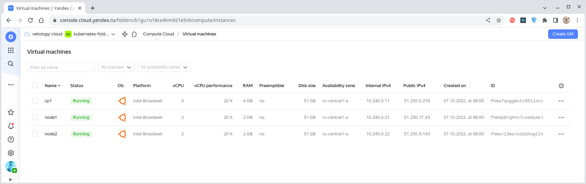

# Домашнее задание к занятию "13.5 поддержка нескольких окружений на примере Qbec"
Приложение обычно существует в нескольких окружениях. Для удобства работы следует использовать соответствующие инструменты, например, Qbec.

## Задание 1: подготовить приложение для работы через qbec
Приложение следует упаковать в qbec. Окружения должно быть 2: stage и production. 

Требования:
* stage окружение должно поднимать каждый компонент приложения в одном экземпляре;
* production окружение — каждый компонент в трёх экземплярах;
* для production окружения нужно добавить endpoint на внешний адрес.

---

### Решение

#### Развернем приложение в кластере Kubernetes

С помощью [конфигурации Terraform](./terraform/main.tf) подготовим виртуальную инфраструктуру:



Наполним нашу виртуальную инфраструктуру программным содержимым с помощью [конфигурации Ansible](./infrastructure/site.yaml).
Для разворачивания кластера Kubernetes [используем Kubespray](./infrastructure/playbooks/mount-cluster.ansible.yaml).

Веб-приложение состоит из
[фронтенд-](./infrastructure/playbooks/templates/back-and-front/deploy-frontend.yaml),
[бекенд-](./infrastructure/playbooks/templates/back-and-front/deploy-backend.yaml)компонента,
деплоймент каждого из которых описан в отдельном файле. Кроме того, используется база данных, разворачиваемая
[через StatefulSet](./infrastructure/playbooks/templates/deploy-pg.yaml).

Инициализируем Qbec-конфигурацию:
````bash
$ qbec init webnews-app --with-example
using server URL "https://51.250.0.216:6443" and default namespace "default" for the default environment
wrote webnews-app/params.libsonnet
wrote webnews-app/environments/base.libsonnet
wrote webnews-app/environments/default.libsonnet
wrote webnews-app/components/hello.jsonnet
wrote webnews-app/qbec.yaml
````

Параметры соединения с существующим кластером указаны в файле [`qbec.yaml`](./qbec/webnews-app/qbec.yaml). Кроме того,
в нём описаны особенности состава отдельных окружений, а именно:
Окружения `default` и `stage` не имеют Endpoint к внешнему API:
````yaml
spec:
  excludes:
    - ep
...
````

Но зато такой Endpoint присутствует у окружения `Prod`: 
````yaml
prod:
  includes:
    - ep
...
````


Папка [`/environments`](./qbec/webnews-app/environments) содержит описания переменных окружения, сгруппированные
по файлам. Имя файла соответствует имени окружения, а сам файл содержит определение переменных:
- [`default.libsonnet`](./qbec/webnews-app/environments/default.libsonnet)
- [`base.libsonnet`](./qbec/webnews-app/environments/base.libsonnet)

Значения для используемых в каждом окружении переменных содержатся в файле
[`params.libsonnet`](./qbec/webnews-app/params.libsonnet). Например, для окружения `prod` они составляют:
````bash
local prod = default {
  ns: 'default',
  backend: {
    replicas: 3,
  },
  frontend: {
    replicas: 3,
  },
}
````


Папка [`/components`](./qbec/webnews-app/components) содержит манифесты компонентов кластера в json-формате:
- бекенд: [deploy-backend.jsonnet](./qbec/webnews-app/components/deploy-backend.jsonnet)
- фронтенд: [deploy-frontend.jsonnet](./qbec/webnews-app/components/deploy-frontend.jsonnet)
- PersistentVolume: [pv-rwo-1gi.jsonnet](./qbec/webnews-app/components/pv-rwo-1gi.jsonnet)
- база данных: [sts-pg.jsonnet](./qbec/webnews-app/components/sts-pg.jsonnet)
- точка доступа к внешнему API: [ep.jsonnet](./qbec/webnews-app/components/ep.jsonnet)

> Для удобства редактирования в IDE файлы имеют расширение `jsonnet`, потому что используется функционал одноименной утилиты.

В результате получаем следующий набор окружений:
````bash
$ qbec env list                                                                                                                
default
prod
stage
````

Выведем список компонентов каждого из окружений и убедимся, что Endpoint присутствует только у окружения `prod`:
````bash
$ qbec component list default
COMPONENT                      FILES
deploy-backend                 components/deploy-backend.jsonnet
deploy-frontend                components/deploy-frontend.jsonnet
pv-rwo-1gi                     components/pv-rwo-1gi.jsonnet
sts-pg                         components/sts-pg.jsonnet

$ qbec component list stage  
COMPONENT                      FILES
deploy-backend                 components/deploy-backend.jsonnet
deploy-frontend                components/deploy-frontend.jsonnet
pv-rwo-1gi                     components/pv-rwo-1gi.jsonnet
sts-pg                         components/sts-pg.jsonnet

$ qbec component list prod 
COMPONENT                      FILES
deploy-backend                 components/deploy-backend.jsonnet
deploy-frontend                components/deploy-frontend.jsonnet
ep                             components/ep.jsonnet
pv-rwo-1gi                     components/pv-rwo-1gi.jsonnet
sts-pg                         components/sts-pg.jsonnet
````

Применим окружение `stage` и убедимся, что компоненты присутствуют в единственном экземпляре, а Endpoint отсутствует:
````bash
$ qbec apply stage  
setting cluster to cluster.local
setting context to kubernetes-admin@cluster.local
cluster metadata load took 316ms
4 components evaluated in 14ms

will synchronize 7 object(s)

Do you want to continue [y/n]: y
4 components evaluated in 6ms
update persistentvolumes persistent-volume-1gb (source pv-rwo-1gi)
update deployments backend -n default (source deploy-backend)
update deployments frontend -n default (source deploy-frontend)
update statefulsets postgres-sts -n default (source sts-pg)
W1011 18:02:20.240998  361758 warnings.go:70] policy/v1beta1 PodSecurityPolicy is deprecated in v1.21+, unavailable in v1.25+
update services backend-nodeport-svc -n default (source deploy-backend)
update services frontend-nodeport-svc -n default (source deploy-frontend)
update services db -n default (source sts-pg)
server objects load took 1.469s
---
stats:
  updated:
  - persistentvolumes persistent-volume-1gb (source pv-rwo-1gi)
  - deployments backend -n default (source deploy-backend)
  - deployments frontend -n default (source deploy-frontend)
  - statefulsets postgres-sts -n default (source sts-pg)
  - services backend-nodeport-svc -n default (source deploy-backend)
  - services frontend-nodeport-svc -n default (source deploy-frontend)
  - services db -n default (source sts-pg)

waiting for readiness of 3 objects
  - deployments backend -n default
  - deployments frontend -n default
  - statefulsets postgres-sts -n default

✓ 0s    : deployments backend -n default :: successfully rolled out (2 remaining)
✓ 0s    : deployments frontend -n default :: successfully rolled out (1 remaining)
✓ 0s    : statefulsets postgres-sts -n default :: 1 new pods updated (0 remaining)

✓ 0s: rollout complete
command took 4.21s
````

<details>
  <summary>Узреть содержимое окружения `stage`.</summary>

````bash
$ kubectl get all,pvc,pv,ep,sc,netpol,ingress -A --field-selector metadata.namespace!=kube-system -o wide --show-labels

NAMESPACE              NAME                                            READY   STATUS    RESTARTS         AGE     IP               NODE    NOMINATED NODE   READINESS GATES   LABELS
default                pod/backend-76b5c84476-7dzcw                    1/1     Running   0                3m3s    10.200.166.184   node1   <none>           <none>            app=web-news,component=backend,pod-template-hash=76b5c84476
default                pod/frontend-7dfb8d7cd4-f7dsb                   1/1     Running   0                3m3s    10.200.104.22    node2   <none>           <none>            app=web-news,component=frontend,pod-template-hash=7dfb8d7cd4
default                pod/postgres-sts-0                              1/1     Running   0                3m3s    10.200.104.31    node2   <none>           <none>            app=web-news,component=dbase,controller-revision-hash=postgres-sts-648d94455f,statefulset.kubernetes.io/pod-name=postgres-sts-0
kubernetes-dashboard   pod/dashboard-metrics-scraper-8c47d4b5d-crj7f   1/1     Running   8 (4h26m ago)    4d11h   10.200.166.131   node1   <none>           <none>            k8s-app=dashboard-metrics-scraper,pod-template-hash=8c47d4b5d
kubernetes-dashboard   pod/kubernetes-dashboard-6c75475678-mstsw       1/1     Running   11 (4h26m ago)   4d11h   10.200.104.45    node2   <none>           <none>            k8s-app=kubernetes-dashboard,pod-template-hash=6c75475678

NAMESPACE              NAME                                TYPE        CLUSTER-IP      EXTERNAL-IP   PORT(S)          AGE     SELECTOR                            LABELS
default                service/backend-nodeport-svc        NodePort    10.32.41.187    <none>        9000:30001/TCP   3m1s    app=web-news,component=backend      app=web-news,component=backend,qbec.io/application=test-app,qbec.io/environment=stage
default                service/db                          NodePort    10.32.26.221    <none>        5432:30002/TCP   3m      app=web-news,component=dbase        app=web-news,component=dbase,qbec.io/application=test-app,qbec.io/environment=stage
default                service/frontend-nodeport-svc       NodePort    10.32.207.247   <none>        80:30000/TCP     3m1s    app=web-news,component=frontend     app=web-news,component=frontend,qbec.io/application=test-app,qbec.io/environment=stage
default                service/kubernetes                  ClusterIP   10.32.0.1       <none>        443/TCP          4d11h   <none>                              component=apiserver,provider=kubernetes
default                service/my-external-ip              ClusterIP   None            <none>        8111/TCP         3m1s    <none>                              app=ep-example,qbec.io/application=test-app,qbec.io/environment=prod
kubernetes-dashboard   service/dashboard-metrics-scraper   ClusterIP   10.32.135.14    <none>        8000/TCP         4d11h   k8s-app=dashboard-metrics-scraper   k8s-app=dashboard-metrics-scraper
kubernetes-dashboard   service/kubernetes-dashboard        ClusterIP   10.32.70.24     <none>        443/TCP          4d11h   k8s-app=kubernetes-dashboard        k8s-app=kubernetes-dashboard

NAMESPACE              NAME                                        READY   UP-TO-DATE   AVAILABLE   AGE     CONTAINERS                  IMAGES                                SELECTOR                            LABELS
default                deployment.apps/backend                     1/1     1            1           3m3s    backend                     olezhuravlev/backend:1.0.0            app=web-news,component=backend      app=web-news,component=backend,qbec.io/application=test-app,qbec.io/environment=stage
default                deployment.apps/frontend                    1/1     1            1           3m3s    frontend                    olezhuravlev/frontend:1.1.2           app=web-news,component=frontend     app=web-news,component=frontend,qbec.io/application=test-app,qbec.io/environment=stage
kubernetes-dashboard   deployment.apps/dashboard-metrics-scraper   1/1     1            1           4d11h   dashboard-metrics-scraper   kubernetesui/metrics-scraper:v1.0.8   k8s-app=dashboard-metrics-scraper   k8s-app=dashboard-metrics-scraper
kubernetes-dashboard   deployment.apps/kubernetes-dashboard        1/1     1            1           4d11h   kubernetes-dashboard        kubernetesui/dashboard:v2.6.1         k8s-app=kubernetes-dashboard        k8s-app=kubernetes-dashboard

NAMESPACE              NAME                                                  DESIRED   CURRENT   READY   AGE     CONTAINERS                  IMAGES                                SELECTOR                                                        LABELS
default                replicaset.apps/backend-76b5c84476                    1         1         1       3m3s    backend                     olezhuravlev/backend:1.0.0            app=web-news,component=backend,pod-template-hash=76b5c84476     app=web-news,component=backend,pod-template-hash=76b5c84476
default                replicaset.apps/frontend-7dfb8d7cd4                   1         1         1       3m3s    frontend                    olezhuravlev/frontend:1.1.2           app=web-news,component=frontend,pod-template-hash=7dfb8d7cd4    app=web-news,component=frontend,pod-template-hash=7dfb8d7cd4
kubernetes-dashboard   replicaset.apps/dashboard-metrics-scraper-8c47d4b5d   1         1         1       4d11h   dashboard-metrics-scraper   kubernetesui/metrics-scraper:v1.0.8   k8s-app=dashboard-metrics-scraper,pod-template-hash=8c47d4b5d   k8s-app=dashboard-metrics-scraper,pod-template-hash=8c47d4b5d
kubernetes-dashboard   replicaset.apps/kubernetes-dashboard-6c75475678       1         1         1       4d11h   kubernetes-dashboard        kubernetesui/dashboard:v2.6.1         k8s-app=kubernetes-dashboard,pod-template-hash=6c75475678       k8s-app=kubernetes-dashboard,pod-template-hash=6c75475678

NAMESPACE   NAME                            READY   AGE    CONTAINERS   IMAGES               LABELS
default     statefulset.apps/postgres-sts   1/1     3m3s   postgres     postgres:13-alpine   app=web-news,component=dbase,qbec.io/application=test-app,qbec.io/environment=stage

NAMESPACE   NAME                                                   STATUS   VOLUME                  CAPACITY   ACCESS MODES   STORAGECLASS   AGE    VOLUMEMODE   LABELS
default     persistentvolumeclaim/postgres-volume-postgres-sts-0   Bound    persistent-volume-1gb   1Gi        RWO                           3m4s   Filesystem   app=web-news,component=dbase

NAMESPACE   NAME                                     CAPACITY   ACCESS MODES   RECLAIM POLICY   STATUS   CLAIM                                    STORAGECLASS   REASON   AGE    VOLUMEMODE   LABELS
            persistentvolume/persistent-volume-1gb   1Gi        RWO            Retain           Bound    default/postgres-volume-postgres-sts-0                           3m4s   Filesystem   app=web-news,component=dbase,qbec.io/application=test-app,qbec.io/environment=stage

NAMESPACE              NAME                                                        ENDPOINTS             AGE     LABELS
default                endpoints/backend-nodeport-svc                              10.200.166.184:9000   3m2s    app=web-news,component=backend,qbec.io/application=test-app,qbec.io/environment=stage
default                endpoints/cluster.local-nfs-server-nfs-server-provisioner   <none>                34h     <none>
default                endpoints/db                                                10.200.104.31:5432    3m1s    app=web-news,component=dbase,qbec.io/application=test-app,qbec.io/environment=stage
default                endpoints/frontend-nodeport-svc                             10.200.104.22:80      3m2s    app=web-news,component=frontend,qbec.io/application=test-app,qbec.io/environment=stage
default                endpoints/kubernetes                                        10.240.0.11:6443      4d11h   endpointslice.kubernetes.io/skip-mirror=true
default                endpoints/my-external-ip                                    45.35.72.106          3m4s    app=ep-example,qbec.io/application=test-app,qbec.io/environment=prod
kubernetes-dashboard   endpoints/dashboard-metrics-scraper                         10.200.166.131:8000   4d11h   k8s-app=dashboard-metrics-scraper
kubernetes-dashboard   endpoints/kubernetes-dashboard                              10.200.104.45:8443    4d11h   k8s-app=kubernetes-dashboard
````
</details>

Теперь вместо `stage` создадим окружение `prod`:
````bash
$ qbec apply prod                     
setting cluster to cluster.local
setting context to kubernetes-admin@cluster.local
cluster metadata load took 317ms
5 components evaluated in 4ms

will synchronize 9 object(s)

Do you want to continue [y/n]: y
5 components evaluated in 7ms
create persistentvolumes persistent-volume-1gb (source pv-rwo-1gi)
create endpoints my-external-ip -n default (source ep)
create deployments backend -n default (source deploy-backend)
create deployments frontend -n default (source deploy-frontend)
create statefulsets postgres-sts -n default (source sts-pg)
W1011 17:59:43.181415  360762 warnings.go:70] policy/v1beta1 PodSecurityPolicy is deprecated in v1.21+, unavailable in v1.25+
create services backend-nodeport-svc -n default (source deploy-backend)
create services frontend-nodeport-svc -n default (source deploy-frontend)
create services my-external-ip -n default (source ep)
create services db -n default (source sts-pg)
server objects load took 1.853s
---
stats:
  created:
  - persistentvolumes persistent-volume-1gb (source pv-rwo-1gi)
  - endpoints my-external-ip -n default (source ep)
  - deployments backend -n default (source deploy-backend)
  - deployments frontend -n default (source deploy-frontend)
  - statefulsets postgres-sts -n default (source sts-pg)
  - services backend-nodeport-svc -n default (source deploy-backend)
  - services frontend-nodeport-svc -n default (source deploy-frontend)
  - services my-external-ip -n default (source ep)
  - services db -n default (source sts-pg)

waiting for readiness of 3 objects
  - deployments backend -n default
  - deployments frontend -n default
  - statefulsets postgres-sts -n default

✓ 0s    : deployments frontend -n default :: successfully rolled out (2 remaining)
✓ 0s    : deployments backend -n default :: successfully rolled out (1 remaining)
✓ 0s    : statefulsets postgres-sts -n default :: 1 new pods updated (0 remaining)

✓ 0s: rollout complete
command took 5.05s
````

<details>
  <summary>Убедится, что в окружении `prod` присутствует по 3 экземпляра компонента и присутствует Endpoint "my-external-ip".</summary>

````bash
$ kubectl get all,pvc,pv,ep,sc,netpol,ingress -A --field-selector metadata.namespace!=kube-system -o wide --show-labels

NAMESPACE              NAME                                            READY   STATUS    RESTARTS         AGE     IP               NODE    NOMINATED NODE   READINESS GATES   LABELS
default                pod/backend-76b5c84476-7dzcw                    1/1     Running   0                65s     10.200.166.184   node1   <none>           <none>            app=web-news,component=backend,pod-template-hash=76b5c84476
default                pod/backend-76b5c84476-dj6wr                    1/1     Running   0                65s     10.200.104.18    node2   <none>           <none>            app=web-news,component=backend,pod-template-hash=76b5c84476
default                pod/backend-76b5c84476-mjtbs                    1/1     Running   0                65s     10.200.104.25    node2   <none>           <none>            app=web-news,component=backend,pod-template-hash=76b5c84476
default                pod/frontend-7dfb8d7cd4-f7dsb                   1/1     Running   0                65s     10.200.104.22    node2   <none>           <none>            app=web-news,component=frontend,pod-template-hash=7dfb8d7cd4
default                pod/frontend-7dfb8d7cd4-m6nqq                   1/1     Running   0                65s     10.200.166.162   node1   <none>           <none>            app=web-news,component=frontend,pod-template-hash=7dfb8d7cd4
default                pod/frontend-7dfb8d7cd4-t4kvn                   1/1     Running   0                65s     10.200.166.187   node1   <none>           <none>            app=web-news,component=frontend,pod-template-hash=7dfb8d7cd4
default                pod/postgres-sts-0                              1/1     Running   0                65s     10.200.104.31    node2   <none>           <none>            app=web-news,component=dbase,controller-revision-hash=postgres-sts-648d94455f,statefulset.kubernetes.io/pod-name=postgres-sts-0
kubernetes-dashboard   pod/dashboard-metrics-scraper-8c47d4b5d-crj7f   1/1     Running   8 (4h24m ago)    4d11h   10.200.166.131   node1   <none>           <none>            k8s-app=dashboard-metrics-scraper,pod-template-hash=8c47d4b5d
kubernetes-dashboard   pod/kubernetes-dashboard-6c75475678-mstsw       1/1     Running   11 (4h25m ago)   4d11h   10.200.104.45    node2   <none>           <none>            k8s-app=kubernetes-dashboard,pod-template-hash=6c75475678

NAMESPACE              NAME                                TYPE        CLUSTER-IP      EXTERNAL-IP   PORT(S)          AGE     SELECTOR                            LABELS
default                service/backend-nodeport-svc        NodePort    10.32.41.187    <none>        9000:30001/TCP   63s     app=web-news,component=backend      app=web-news,component=backend,qbec.io/application=test-app,qbec.io/environment=prod
default                service/db                          NodePort    10.32.26.221    <none>        5432:30002/TCP   62s     app=web-news,component=dbase        app=web-news,component=dbase,qbec.io/application=test-app,qbec.io/environment=prod
default                service/frontend-nodeport-svc       NodePort    10.32.207.247   <none>        80:30000/TCP     63s     app=web-news,component=frontend     app=web-news,component=frontend,qbec.io/application=test-app,qbec.io/environment=prod
default                service/kubernetes                  ClusterIP   10.32.0.1       <none>        443/TCP          4d11h   <none>                              component=apiserver,provider=kubernetes
default                service/my-external-ip              ClusterIP   None            <none>        8111/TCP         63s     <none>                              app=ep-example,qbec.io/application=test-app,qbec.io/environment=prod
kubernetes-dashboard   service/dashboard-metrics-scraper   ClusterIP   10.32.135.14    <none>        8000/TCP         4d11h   k8s-app=dashboard-metrics-scraper   k8s-app=dashboard-metrics-scraper
kubernetes-dashboard   service/kubernetes-dashboard        ClusterIP   10.32.70.24     <none>        443/TCP          4d11h   k8s-app=kubernetes-dashboard        k8s-app=kubernetes-dashboard

NAMESPACE              NAME                                        READY   UP-TO-DATE   AVAILABLE   AGE     CONTAINERS                  IMAGES                                SELECTOR                            LABELS
default                deployment.apps/backend                     3/3     3            3           65s     backend                     olezhuravlev/backend:1.0.0            app=web-news,component=backend      app=web-news,component=backend,qbec.io/application=test-app,qbec.io/environment=prod
default                deployment.apps/frontend                    3/3     3            3           65s     frontend                    olezhuravlev/frontend:1.1.2           app=web-news,component=frontend     app=web-news,component=frontend,qbec.io/application=test-app,qbec.io/environment=prod
kubernetes-dashboard   deployment.apps/dashboard-metrics-scraper   1/1     1            1           4d11h   dashboard-metrics-scraper   kubernetesui/metrics-scraper:v1.0.8   k8s-app=dashboard-metrics-scraper   k8s-app=dashboard-metrics-scraper
kubernetes-dashboard   deployment.apps/kubernetes-dashboard        1/1     1            1           4d11h   kubernetes-dashboard        kubernetesui/dashboard:v2.6.1         k8s-app=kubernetes-dashboard        k8s-app=kubernetes-dashboard

NAMESPACE              NAME                                                  DESIRED   CURRENT   READY   AGE     CONTAINERS                  IMAGES                                SELECTOR                                                        LABELS
default                replicaset.apps/backend-76b5c84476                    3         3         3       66s     backend                     olezhuravlev/backend:1.0.0            app=web-news,component=backend,pod-template-hash=76b5c84476     app=web-news,component=backend,pod-template-hash=76b5c84476
default                replicaset.apps/frontend-7dfb8d7cd4                   3         3         3       66s     frontend                    olezhuravlev/frontend:1.1.2           app=web-news,component=frontend,pod-template-hash=7dfb8d7cd4    app=web-news,component=frontend,pod-template-hash=7dfb8d7cd4
kubernetes-dashboard   replicaset.apps/dashboard-metrics-scraper-8c47d4b5d   1         1         1       4d11h   dashboard-metrics-scraper   kubernetesui/metrics-scraper:v1.0.8   k8s-app=dashboard-metrics-scraper,pod-template-hash=8c47d4b5d   k8s-app=dashboard-metrics-scraper,pod-template-hash=8c47d4b5d
kubernetes-dashboard   replicaset.apps/kubernetes-dashboard-6c75475678       1         1         1       4d11h   kubernetes-dashboard        kubernetesui/dashboard:v2.6.1         k8s-app=kubernetes-dashboard,pod-template-hash=6c75475678       k8s-app=kubernetes-dashboard,pod-template-hash=6c75475678

NAMESPACE   NAME                            READY   AGE   CONTAINERS   IMAGES               LABELS
default     statefulset.apps/postgres-sts   1/1     66s   postgres     postgres:13-alpine   app=web-news,component=dbase,qbec.io/application=test-app,qbec.io/environment=prod

NAMESPACE   NAME                                                   STATUS   VOLUME                  CAPACITY   ACCESS MODES   STORAGECLASS   AGE   VOLUMEMODE   LABELS
default     persistentvolumeclaim/postgres-volume-postgres-sts-0   Bound    persistent-volume-1gb   1Gi        RWO                           66s   Filesystem   app=web-news,component=dbase

NAMESPACE   NAME                                     CAPACITY   ACCESS MODES   RECLAIM POLICY   STATUS   CLAIM                                    STORAGECLASS   REASON   AGE   VOLUMEMODE   LABELS
            persistentvolume/persistent-volume-1gb   1Gi        RWO            Retain           Bound    default/postgres-volume-postgres-sts-0                           66s   Filesystem   app=web-news,component=dbase,qbec.io/application=test-app,qbec.io/environment=prod

NAMESPACE              NAME                                                        ENDPOINTS                                                   AGE     LABELS
default                endpoints/backend-nodeport-svc                              10.200.104.18:9000,10.200.104.25:9000,10.200.166.184:9000   64s     app=web-news,component=backend,qbec.io/application=test-app,qbec.io/environment=prod
default                endpoints/cluster.local-nfs-server-nfs-server-provisioner   <none>                                                      34h     <none>
default                endpoints/db                                                10.200.104.31:5432                                          63s     app=web-news,component=dbase,qbec.io/application=test-app,qbec.io/environment=prod
default                endpoints/frontend-nodeport-svc                             10.200.104.22:80,10.200.166.162:80,10.200.166.187:80        64s     app=web-news,component=frontend,qbec.io/application=test-app,qbec.io/environment=prod
default                endpoints/kubernetes                                        10.240.0.11:6443                                            4d11h   endpointslice.kubernetes.io/skip-mirror=true
default                endpoints/my-external-ip                                    45.35.72.106                                                66s     app=ep-example,qbec.io/application=test-app,qbec.io/environment=prod
kubernetes-dashboard   endpoints/dashboard-metrics-scraper                         10.200.166.131:8000                                         4d11h   k8s-app=dashboard-metrics-scraper
kubernetes-dashboard   endpoints/kubernetes-dashboard                              10.200.104.45:8443                                          4d11h   k8s-app=kubernetes-dashboard
````

</details>

Т.о. мы создали два окружения - `stage` и `prod`, причем в `stage` присутствует по одному экземпляру каждого компонента,
а в `prod` - по три. Кроме того, в окружении `prod` присутствует Endpoint на адрес внешнего API.

---

<details>

  <summary>Приложение 1 - Лекция</summary>

### [JSONNET](./lecture/libsonnet)

Создание и перегрузка объектов:
````json lines
$ jsonnet 10-example.jsonnet                                                                                                                  
{
   "person1": {
      "name": "Alice",
      "welcome": "Hello Alice!"
   },
   "person2": {
      "age": 21,
      "name": "Bob",
      "welcome": "Hello Bob!"
   }
}
````

Использование функции для создания объектов:
````json lines
$ jsonnet 20-example.jsonnet
{
   "person1": {
      "name": "Alice",
      "welcome": "Hello Alice!"
   },
   "person2": {
      "name": "Bob",
      "welcome": "Hello Bob!"
   }
}
````

Вывод в формате JSON:
````json lines
$ jsonnet 30-yaml.jsonnet   
[
   {
      "appPort": 80,
      "image": {
         "repository": "nginx",
         "tag": ""
      },
      "resources": {
         "limits": {
            "cpu": "200m",
            "memory": "512Mb"
         },
         "requests": {
            "cpu": "100m",
            "memory": "256Mb"
         }
      }
   }
]
````

Вывод в формате YAML:
````json lines
$ jsonnet -y 30-yaml.jsonnet
---
{
   "appPort": 80,
   "image": {
      "repository": "nginx",
      "tag": ""
   },
   "resources": {
      "limits": {
         "cpu": "200m",
         "memory": "512Mb"
      },
      "requests": {
         "cpu": "100m",
         "memory": "256Mb"
      }
   }
}
...
````

Генерация файлов в указанной папке:
````bash
$ mkdir multiple-output              

$ jsonnet -m multiple-output 40-multiple-output.jsonnet
multiple-output/cassandra.conf
multiple-output/init.sh
multiple-output/uwsgi.ini
````

> Оператор `|||` означает начало и конец многострочного текста.

Передача произвольного параметра и использование сторонней функции (`/libsonnet`):
````json lines
$ jsonnet 50-imports.jsonnet --ext-str env=prod        
[
   {
      "appPort": 8080,
      "env": "prod",
      "image": {
         "repository": "nginx",
         "tag": "1.16.1"
      },
      "namespace": "jsonnet-prod",
      "replicaCount": 3,
      "resources": {
         "limits": {
            "cpu": "400m",
            "memory": "1024Mb"
         },
         "requests": {
            "cpu": "200m",
            "memory": "512Mb"
         }
      }
   }
]
````

В YAML-файл:
````json lines
$ jsonnet -y 50-imports.jsonnet --ext-str env=test
---
{
   "appPort": 8080,
   "env": "test",
   "image": {
      "repository": "nginx",
      "tag": "1.16.1"
   },
   "namespace": "jsonnet-test",
   "replicaCount": 3,
   "resources": {
      "limits": {
         "cpu": "200m",
         "memory": "512Mb"
      },
      "requests": {
         "cpu": "100m",
         "memory": "256Mb"
      }
   }
}
...
````
### [QBEC](./lecture/qbec)

Установка:
````bash
https://qbec.io/getting-started/

$ qbec version  
qbec version: 0.15.2
jsonnet version: v0.18.0
client-go version: kubernetes-1.23.1
go version: 1.17.7
commit: 9f26fb9d14300b3aefd87b89f8d346c3dce48092
````

`qbec.yaml` - манифест, содержит описания кластеров и пространств имен.

`params.libsonnet` - сопоставление среды и переменных окружения с кластерами, указанными в qbec.yaml.

Папка `/environments`:
- `base.libsonnet`: в поле `components` указываются все компоненты, которые мы хотим использовать.
Эти компоненты д. располагаться в папке `/components`.
- `default.libsonnet`: производится расширение компонентов (символ `+`).

Папка `/components`:
- `hello.libsonnet`: объект 
- `postgres.libsonnet`
- `rabbitmq.libsonnet`
- и т.д.
...

Выполнялось в папке `./lecture/qbec/20-next`:

````yaml
# - выводит сгенерированный yaml;
# - показывает, что будет применено в кластер;
# - помогает отлаживать настройки и переменные.
$ qbec show default
3 components evaluated in 4ms
---
apiVersion: v1
data:
  index.html: |
    hello default
kind: ConfigMap
metadata:
  annotations:
    qbec.io/component: hello
  labels:
    qbec.io/application: 20-next
    qbec.io/environment: default
  name: demo-config

---
apiVersion: apps/v1
kind: Deployment
metadata:
  annotations:
    qbec.io/component: hello
  labels:
    app: demo-deploy
    qbec.io/application: 20-next
    qbec.io/environment: default
  name: demo-deploy
spec:
  replicas: 2
  selector:
    matchLabels:
      app: demo-deploy
  template:
    metadata:
      labels:
        app: demo-deploy
    spec:
      containers:
      - image: nginx:stable
        imagePullPolicy: Always
        name: main
        volumeMounts:
        - mountPath: /usr/share/nginx/html
          name: web
      volumes:
      - configMap:
          name: demo-config
        name: web

---
apiVersion: apps/v1
kind: Deployment
metadata:
  annotations:
    qbec.io/component: postgres
  labels:
    qbec.io/application: 20-next
    qbec.io/environment: default
  name: psql
spec:
  selector:
    matchLabels:
      component: psql
  template:
    metadata:
      labels:
        component: psql
    spec:
      containers:
      - args:
        - -c
        - wal_level=logical
        image: postgres:11.5
        name: postgres

---
apiVersion: v1
kind: Service
metadata:
  annotations:
    qbec.io/component: postgres
  labels:
    qbec.io/application: 20-next
    qbec.io/environment: default
  name: psql
spec:
  ports:
  - name: psql
    port: 5432
    targetPort: 5432
  selector:
    component: psql

---
apiVersion: apps/v1
kind: Deployment
metadata:
  annotations:
    qbec.io/component: rabbitmq
  labels:
    qbec.io/application: 20-next
    qbec.io/environment: default
  name: rabbitmq
spec:
  selector:
    matchLabels:
      component: rabbitmq
  strategy:
    type: Recreate
  template:
    metadata:
      labels:
        component: rabbitmq
    spec:
      containers:
      - image: rabbitmq:3
        name: rabbitmq

---
apiVersion: v1
kind: Service
metadata:
  annotations:
    qbec.io/component: rabbitmq
  labels:
    qbec.io/application: 20-next
    qbec.io/environment: default
  name: rabbitmq
spec:
  ports:
  - port: 5672
  selector:
    component: rabbitmq
````

> Подчеркиванием (`_`, baseline) выделяется окружение, предназначенное не для развёртывания, а для команд,
> выполняемых локально, без развёртывания.

Выводятся объекты с подчеркиванием `_` (baseline):
````yaml
$ qbec show _      
3 components evaluated in 4ms
---
apiVersion: v1
data:
  index.html: |
    hello baseline
kind: ConfigMap
metadata:
  annotations:
    qbec.io/component: hello
  labels:
    qbec.io/application: 20-next
    qbec.io/environment: _
  name: demo-config

---
apiVersion: apps/v1
kind: Deployment
metadata:
  annotations:
    qbec.io/component: hello
  labels:
    app: demo-deploy
    qbec.io/application: 20-next
    qbec.io/environment: _
  name: demo-deploy
spec:
  replicas: 1
  selector:
    matchLabels:
      app: demo-deploy
  template:
    metadata:
      labels:
        app: demo-deploy
    spec:
      containers:
      - image: nginx:stable
        imagePullPolicy: Always
        name: main
        volumeMounts:
        - mountPath: /usr/share/nginx/html
          name: web
      volumes:
      - configMap:
          name: demo-config
        name: web

---
apiVersion: apps/v1
kind: Deployment
metadata:
  annotations:
    qbec.io/component: postgres
  labels:
    qbec.io/application: 20-next
    qbec.io/environment: _
  name: psql
spec:
  selector:
    matchLabels:
      component: psql
  template:
    metadata:
      labels:
        component: psql
    spec:
      containers:
      - args:
        - -c
        - wal_level=logical
        image: postgres:11.5
        name: postgres

---
apiVersion: v1
kind: Service
metadata:
  annotations:
    qbec.io/component: postgres
  labels:
    qbec.io/application: 20-next
    qbec.io/environment: _
  name: psql
spec:
  ports:
  - name: psql
    port: 5432
    targetPort: 5432
  selector:
    component: psql

---
apiVersion: apps/v1
kind: Deployment
metadata:
  annotations:
    qbec.io/component: rabbitmq
  labels:
    qbec.io/application: 20-next
    qbec.io/environment: _
  name: rabbitmq
spec:
  selector:
    matchLabels:
      component: rabbitmq
  strategy:
    type: Recreate
  template:
    metadata:
      labels:
        component: rabbitmq
    spec:
      containers:
      - image: rabbitmq:3
        name: rabbitmq

---
apiVersion: v1
kind: Service
metadata:
  annotations:
    qbec.io/component: rabbitmq
  labels:
    qbec.io/application: 20-next
    qbec.io/environment: _
  name: rabbitmq
spec:
  ports:
  - port: 5672
  selector:
    component: rabbitmq
````

````bash
$ qbec component diff default
````

Список компонентов в окружении:
````bash
$ qbec component list default
COMPONENT                      FILES
hello                          components/hello.jsonnet
postgres                       components/postgres.jsonnet
rabbitmq                       components/rabbitmq.jsonnet
````

Список компонентов в окружении в разных форматах:
````yaml
$ qbec component list default -o yaml
---
- Files:
  - components/hello.jsonnet
  Name: hello
  TopLevelVars: null
- Files:
  - components/postgres.jsonnet
  Name: postgres
  TopLevelVars: null
- Files:
  - components/rabbitmq.jsonnet
  Name: rabbitmq
  TopLevelVars: null
````

````json lines
$ qbec component list default -o json
[
  {
    "Name": "hello",
    "Files": [
      "components/hello.jsonnet"
    ],
    "TopLevelVars": null
  },
  {
    "Name": "postgres",
    "Files": [
      "components/postgres.jsonnet"
    ],
    "TopLevelVars": null
  },
  {
    "Name": "rabbitmq",
    "Files": [
      "components/rabbitmq.jsonnet"
    ],
    "TopLevelVars": null
  }
]
````

Вывод объектов каждого компонента:
````bash
$ qbec component list default -O 
3 components evaluated in 3ms
COMPONENT                      KIND                           NAME                                     NAMESPACE
hello                          ConfigMap                      demo-config                              
hello                          Deployment                     demo-deploy                              
postgres                       Deployment                     psql                                     
postgres                       Service                        psql                                     
rabbitmq                       Deployment                     rabbitmq                                 
rabbitmq                       Service                        rabbitmq                   
````

Проверяет конфигурацию на корректность, показывает ошибки в переменных и т.д.:
````bash
# В `./lecture/qbec/20-next/qbec.yaml` https://51.250.0.216:6443 - это адрес работающего кластера.
$ qbec validate default
setting cluster to cluster.local
setting context to kubernetes-admin@cluster.local
cluster metadata load took 318ms
3 components evaluated in 11ms
✔ configmaps demo-config -n default (source hello) is valid
✔ services rabbitmq -n default (source rabbitmq) is valid
✔ deployments demo-deploy -n default (source hello) is valid
✔ deployments psql -n default (source postgres) is valid
✔ services psql -n default (source postgres) is valid
✔ deployments rabbitmq -n default (source rabbitmq) is valid
---
stats:
  valid: 6

command took 1.61s
````
Команда является хорошим кандидатом на включение в CI, т.к. позволяет проверить работоспособность кластеров.

Ппоказывает использование переменных в компонентах, выводит значения по умолчанию:
````bash
$ qbec param list default
COMPONENT                      NAME                           VALUE
hello                          indexData                      "hello default\n"
hello                          replicas                       2
````

Разница между baseline и базовым окружением:
````bash
$ qbec param diff default
--- baseline
+++ environment: default
@@ -2,2 +2,2 @@
-hello                          indexData                      "hello baseline\n"
-hello                          replicas                       1
+hello                          indexData                      "hello default\n"
+hello                          replicas                       2
````

Вывод объекта только для одного компонента:
````yaml
$ qbec show default -c postgres
1 components evaluated in 1ms
---
apiVersion: apps/v1
kind: Deployment
metadata:
  annotations:
    qbec.io/component: postgres
  labels:
    qbec.io/application: 20-next
    qbec.io/environment: default
  name: psql
spec:
  selector:
    matchLabels:
      component: psql
  template:
    metadata:
      labels:
        component: psql
    spec:
      containers:
      - args:
        - -c
        - wal_level=logical
        image: postgres:11.5
        name: postgres

---
apiVersion: v1
kind: Service
metadata:
  annotations:
    qbec.io/component: postgres
  labels:
    qbec.io/application: 20-next
    qbec.io/environment: default
  name: psql
spec:
  ports:
  - name: psql
    port: 5432
    targetPort: 5432
  selector:
    component: psql
````

Вывод всех компонентов КРОМЕ postgres:
````yaml
$ qbec show default -C postgres
2 components evaluated in 3ms
---
apiVersion: v1
data:
  index.html: |
    hello default
kind: ConfigMap
metadata:
  annotations:
    qbec.io/component: hello
  labels:
    qbec.io/application: 20-next
    qbec.io/environment: default
  name: demo-config

---
apiVersion: apps/v1
kind: Deployment
metadata:
  annotations:
    qbec.io/component: hello
  labels:
    app: demo-deploy
    qbec.io/application: 20-next
    qbec.io/environment: default
  name: demo-deploy
spec:
  replicas: 2
  selector:
    matchLabels:
      app: demo-deploy
  template:
    metadata:
      labels:
        app: demo-deploy
    spec:
      containers:
      - image: nginx:stable
        imagePullPolicy: Always
        name: main
        volumeMounts:
        - mountPath: /usr/share/nginx/html
          name: web
      volumes:
      - configMap:
          name: demo-config
        name: web

---
apiVersion: apps/v1
kind: Deployment
metadata:
  annotations:
    qbec.io/component: rabbitmq
  labels:
    qbec.io/application: 20-next
    qbec.io/environment: default
  name: rabbitmq
spec:
  selector:
    matchLabels:
      component: rabbitmq
  strategy:
    type: Recreate
  template:
    metadata:
      labels:
        component: rabbitmq
    spec:
      containers:
      - image: rabbitmq:3
        name: rabbitmq

---
apiVersion: v1
kind: Service
metadata:
  annotations:
    qbec.io/component: rabbitmq
  labels:
    qbec.io/application: 20-next
    qbec.io/environment: default
  name: rabbitmq
spec:
  ports:
  - port: 5672
  selector:
    component: rabbitmq
````

Вывод типа (kind) Deployment:
````yaml
$ qbec show default -k deployment
3 components evaluated in 3ms
---
apiVersion: apps/v1
kind: Deployment
metadata:
  annotations:
    qbec.io/component: hello
  labels:
    app: demo-deploy
    qbec.io/application: 20-next
    qbec.io/environment: default
  name: demo-deploy
spec:
  replicas: 2
  selector:
    matchLabels:
      app: demo-deploy
  template:
    metadata:
      labels:
        app: demo-deploy
    spec:
      containers:
      - image: nginx:stable
        imagePullPolicy: Always
        name: main
        volumeMounts:
        - mountPath: /usr/share/nginx/html
          name: web
      volumes:
      - configMap:
          name: demo-config
        name: web

---
apiVersion: apps/v1
kind: Deployment
metadata:
  annotations:
    qbec.io/component: postgres
  labels:
    qbec.io/application: 20-next
    qbec.io/environment: default
  name: psql
spec:
  selector:
    matchLabels:
      component: psql
  template:
    metadata:
      labels:
        component: psql
    spec:
      containers:
      - args:
        - -c
        - wal_level=logical
        image: postgres:11.5
        name: postgres

---
apiVersion: apps/v1
kind: Deployment
metadata:
  annotations:
    qbec.io/component: rabbitmq
  labels:
    qbec.io/application: 20-next
    qbec.io/environment: default
  name: rabbitmq
spec:
  selector:
    matchLabels:
      component: rabbitmq
  strategy:
    type: Recreate
  template:
    metadata:
      labels:
        component: rabbitmq
    spec:
      containers:
      - image: rabbitmq:3
        name: rabbitmq
````

Вывод всех типов (kind) КРОМЕ Deployment:
````yaml
$ qbec show default -K deployment
3 components evaluated in 3ms
---
apiVersion: v1
data:
  index.html: |
    hello default
kind: ConfigMap
metadata:
  annotations:
    qbec.io/component: hello
  labels:
    qbec.io/application: 20-next
    qbec.io/environment: default
  name: demo-config

---
apiVersion: v1
kind: Service
metadata:
  annotations:
    qbec.io/component: postgres
  labels:
    qbec.io/application: 20-next
    qbec.io/environment: default
  name: psql
spec:
  ports:
  - name: psql
    port: 5432
    targetPort: 5432
  selector:
    component: psql

---
apiVersion: v1
kind: Service
metadata:
  annotations:
    qbec.io/component: rabbitmq
  labels:
    qbec.io/application: 20-next
    qbec.io/environment: default
  name: rabbitmq
spec:
  ports:
  - port: 5672
  selector:
    component: rabbitmq
````

Генерация completion-файла (не работает - ошибка `/etc/bash_completion.d/qbec:type:3247: bad option: -t`):
````bash
$ qbec completion | sudo tee /etc/bash_completion.d/qbec
````

Инициализация qbec-приложения (будет использован `~/.kube/config`):
````bash
$ qbec init 30-demo             
using server URL "https://51.250.0.216:6443" and default namespace "app2" for the default environment
wrote 30-demo/params.libsonnet
wrote 30-demo/environments/base.libsonnet
wrote 30-demo/environments/default.libsonnet
wrote 30-demo/qbec.yaml
````

Инициализация qbec-приложения с примерами:
````bash
$ qbec init 30-demo-with-example --with-example
using server URL "https://51.250.0.216:6443" and default namespace "app2" for the default environment
wrote 30-demo-with-example/params.libsonnet
wrote 30-demo-with-example/environments/base.libsonnet
wrote 30-demo-with-example/environments/default.libsonnet
wrote 30-demo-with-example/components/hello.jsonnet
wrote 30-demo-with-example/qbec.yaml
````

Деплоймент приложения (будут сгенерированы манифесты и применены к кластеру):
````bash
$ qbec apply default
setting cluster to cluster.local
setting context to kubernetes-admin@cluster.local
cluster metadata load took 321ms
3 components evaluated in 10ms

will synchronize 6 object(s)

Do you want to continue [y/n]: y
3 components evaluated in 4ms
create configmaps demo-config -n default (source hello)
create deployments demo-deploy -n default (source hello)
create deployments psql -n default (source postgres)
create deployments rabbitmq -n default (source rabbitmq)
create services psql -n default (source postgres)
create services rabbitmq -n default (source rabbitmq)
server objects load took 654ms
---
stats:
  created:
  - configmaps demo-config -n default (source hello)
  - deployments demo-deploy -n default (source hello)
  - deployments psql -n default (source postgres)
  - deployments rabbitmq -n default (source rabbitmq)
  - services psql -n default (source postgres)
  - services rabbitmq -n default (source rabbitmq)

waiting for readiness of 3 objects
  - deployments demo-deploy -n default
  - deployments psql -n default
  - deployments rabbitmq -n default

  0s    : deployments psql -n default :: 0 of 1 updated replicas are available
  0s    : deployments demo-deploy -n default :: 0 of 2 updated replicas are available
  0s    : deployments rabbitmq -n default :: 0 of 1 updated replicas are available
  9s    : deployments demo-deploy -n default :: 1 of 2 updated replicas are available
✓ 10s   : deployments demo-deploy -n default :: successfully rolled out (2 remaining)
✓ 23s   : deployments rabbitmq -n default :: successfully rolled out (1 remaining)
✓ 23s   : deployments psql -n default :: successfully rolled out (0 remaining)

✓ 23s: rollout complete
command took 49.04s
````

Разворачивать, дожидаясь создания объектов:
````bash
$ qbec apply default --wait-all --yes
setting cluster to cluster.local
setting context to kubernetes-admin@cluster.local
cluster metadata load took 322ms
3 components evaluated in 11ms

will synchronize 6 object(s)

3 components evaluated in 6ms
server objects load took 453ms
---
stats:
  same: 6

waiting for readiness of 3 objects
  - deployments demo-deploy -n default
  - deployments psql -n default
  - deployments rabbitmq -n default

✓ 0s    : deployments rabbitmq -n default :: successfully rolled out (2 remaining)
✓ 0s    : deployments psql -n default :: successfully rolled out (1 remaining)
✓ 0s    : deployments demo-deploy -n default :: successfully rolled out (0 remaining)

✓ 0s: rollout complete
command took 1.31s
````

Деплоймент с детализированным выводом:
````bash
$ qbec apply default --show-details  
setting cluster to cluster.local
setting context to kubernetes-admin@cluster.local
cluster metadata load took 332ms
3 components evaluated in 10ms

will synchronize 6 object(s)

Do you want to continue [y/n]: y
3 components evaluated in 7ms
server objects load took 454ms
---
stats:
  same: 6

waiting for readiness of 3 objects
  - deployments demo-deploy -n default
  - deployments psql -n default
  - deployments rabbitmq -n default

✓ 0s    : deployments rabbitmq -n default :: successfully rolled out (2 remaining)
✓ 0s    : deployments demo-deploy -n default :: successfully rolled out (1 remaining)
✓ 0s    : deployments psql -n default :: successfully rolled out (0 remaining)

✓ 0s: rollout complete
command took 4.01s
````

Удаление из кластера:
````bash
$ qbec delete default              
setting cluster to cluster.local
setting context to kubernetes-admin@cluster.local
cluster metadata load took 322ms
3 components evaluated in 10ms
waiting for deletion list to be returned
server objects load took 321ms

will delete 6 object(s)

Do you want to continue [y/n]: y
delete services rabbitmq -n default
delete services psql -n default
delete deployments rabbitmq -n default
delete deployments psql -n default
delete deployments demo-deploy -n default
delete configmaps demo-config -n default
---
stats:
  deleted:
  - services rabbitmq -n default
  - services psql -n default
  - deployments rabbitmq -n default
  - deployments psql -n default
  - deployments demo-deploy -n default
  - configmaps demo-config -n default

command took 7.51s
````

Удаление компонента:
````bash
$ qbec delete default -c rabbitmq
setting cluster to cluster.local
setting context to kubernetes-admin@cluster.local
cluster metadata load took 332ms
3 components evaluated in 12ms
waiting for deletion list to be returned
server objects load took 322ms
---
stats: {}

command took 670ms
````

Namespace, указанный в qbec.yaml, к моменту деплоймента должен уже обязательно существовать!
````bash
$ qbec apply prod                  
setting cluster to cluster.local
setting context to kubernetes-admin@cluster.local
cluster metadata load took 320ms
1 components evaluated in 5ms

will synchronize 2 object(s)

Do you want to continue [y/n]: y
1 components evaluated in 6ms
✘ sync configmaps demo-config -n qbec-prod (source hello) failed
✘ sync configmaps demo-config -n qbec-prod (source hello): create object: namespaces "qbec-prod" not found
command took 2.29s
````

Поэтому сначала создаем Namespace и только потом разворачиваем приложение:
````bash
$ kubectl create ns qbec-prod                   
namespace/qbec-prod created

$ kubectl get ns                              
NAME                   STATUS   AGE
app1                   Active   22h
app2                   Active   22h
default                Active   4d
kube-node-lease        Active   4d
kube-public            Active   4d
kube-system            Active   4d
kubernetes-dashboard   Active   4d
qbec-prod              Active   6s

$ qbec apply prod
setting cluster to cluster.local
setting context to kubernetes-admin@cluster.local
cluster metadata load took 318ms
1 components evaluated in 5ms

will synchronize 2 object(s)

Do you want to continue [y/n]: y
1 components evaluated in 5ms
create configmaps demo-config -n qbec-prod (source hello)
create deployments demo-deploy -n qbec-prod (source hello)
waiting for deletion list to be returned
server objects load took 654ms
---
stats:
  created:
  - configmaps demo-config -n qbec-prod (source hello)
  - deployments demo-deploy -n qbec-prod (source hello)

waiting for readiness of 1 objects
  - deployments demo-deploy -n qbec-prod

  0s    : deployments demo-deploy -n qbec-prod :: 0 of 2 updated replicas are available
  3s    : deployments demo-deploy -n qbec-prod :: 1 of 2 updated replicas are available
✓ 3s    : deployments demo-deploy -n qbec-prod :: successfully rolled out (0 remaining)

✓ 3s: rollout complete
command took 5.9s
````

Альтернативы qbec:
- [ksonnet](https://github.com/ksonnet/ksonnet): разработка остановилась в 2019г., по сути, проект закрыт;
- [kubecfg](https://github.com/bitnami/kubecfg): мало материалов по сравнению с Qbec.

Конвертеры:
- [Конвертер из yaml в json](https://onlineyamltools.com/convert-yaml-to-json)
- Еще один [конвертер из yaml в json](https://www.convertjson.com/yaml-to-json.htm)

# Выводы
Qbec позволяет:
- гибко настраивать конфигурации ваших приложений;
- валидировать конфигурацию;
- сравнивать переменные для различных окружений;
- сравнивать полученные шаблоны для различных окружений;
- развертывать приложение в разные кластеры и убедится в результате развертывания.

Недостатки:
- маленькое community;
- мало материалов по использованию;
- риск закрытия проекта;

Как альтернативу имеет смысл рассматривать подход с разворачиванием не снаружи, а изнутри кластера
([подход GitOps](https://habr.com/ru/company/flant/blog/526102/)) и инструменты, которые представлены на этом рынке:
- [werf](https://ru.werf.io/): удобный, зрелый инструмент, построенный поверх Helm;
- [ArgoCD](https://argo-cd.readthedocs.io/en/stable/): демон из кластера следит за изменениями ветки репозитория и устанавливает их; имеет развитый GUI;
- [Flux](https://fluxcd.io/).

</details>

---
